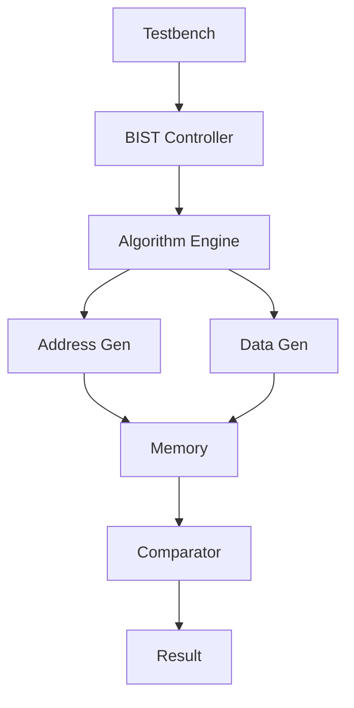
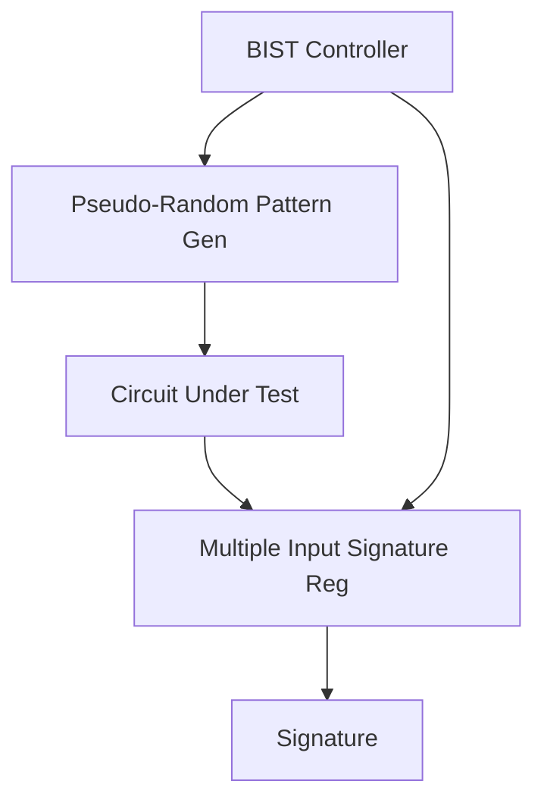
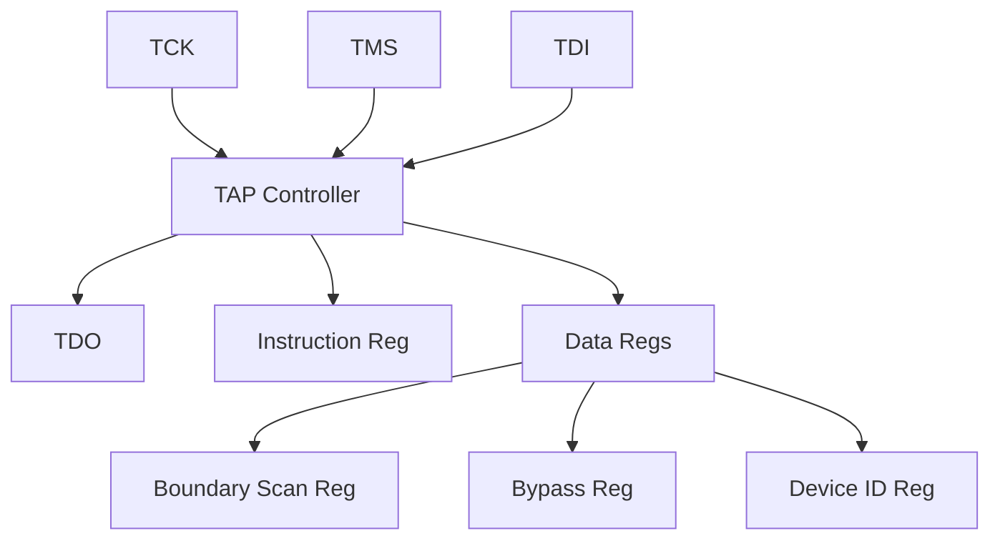
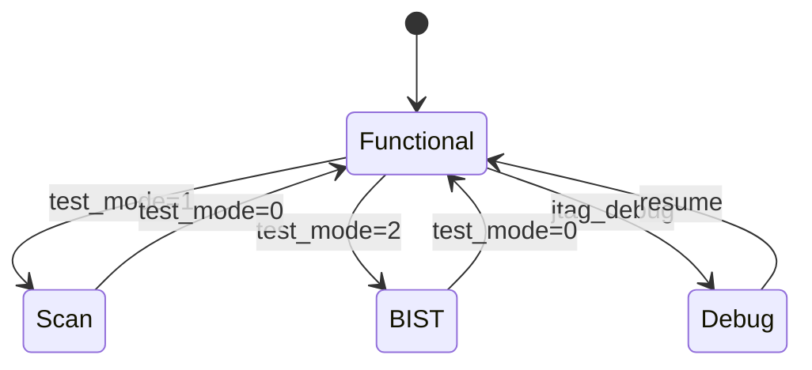

# DFT 可测试性设计知识库

芯片可测试性设计的关键决策点和最佳实践。

---

## DFT 策略概述

### DFT 目标

| 目标 | 说明 |
|------|------|
| 制造缺陷检测 | 检测生产过程中的缺陷 |
| 故障覆盖率 | Scan ≥ 95%, Memory ≥ 100% |
| 测试时间优化 | 减少测试向量数和测试时间 |
| 成本优化 | 减少测试设备要求 |

### DFT 方法概览

| 方法 | 覆盖目标 | 适用对象 |
|------|----------|----------|
| Scan Insertion | 随机逻辑 | 所有可扫描单元 |
| Memory BIST | 存储器 | SRAM, ROM, Flash |
| Logic BIST | 随机逻辑 | 大模块可选 |
| Boundary Scan | IO | IO pad ring |
| JTAG Debug | 功能调试 | CPU, Bus |

---

## Scan 设计

### Scan 架构参数

| 参数 | 选择依据 |
|------|----------|
| Scan Chain 数量 | ATE 通道数、测试时间 |
| Chain 长度 | 最大时钟周期约束 |
| Scan Clock | 专用测试时钟或复用 |
| Scan Enable | 专用信号 |

### Scan Chain 划分策略

| 策略 | 说明 |
|------|------|
| 按 Clock Domain | 每域独立链，便于时序收敛 |
| 按 Power Domain | 每域独立链，便于功耗控制 |
| 按 Area | 长度均匀分配 |
| 按 ATE 通道 | 匹配测试机通道数 |

### Scan Cell 类型

| Cell | 用途 | 特点 |
|------|------|------|
| Mux-D Flop | 标准 scan cell | 工艺库提供 |
| Scan-only Flop | 专用测试 | 较少使用 |
| Shadow Flop | 安全关键 | 增加冗余 |

### Scan 插入时机

| 时机 | 说明 |
|------|------|
| RTL 阶段 | DFT RTL 插入，综合前 |
| 综合阶段 | DFT Compiler 自动插入 |
| 后端阶段 | 物理级 scan chain reorder |

### Scan Coverage 目标

| 目标 | 典型值 |
|------|--------|
| Stuck-at Coverage | ≥ 95% |
| Transition Coverage | ≥ 90% |
| Path Delay Coverage | ≥ 80% (关键路径) |

---

## Memory BIST

### Memory BIST 类型

| Type | 适用 | Algorithm |
|------|------|-----------|
| SRAM BIST | SRAM | March C-, March B |
| ROM BIST | ROM | CRC, Signature Analysis |
| Flash BIST | Flash | Program/Erase Verify |
| OTP BIST | OTP | Read Verify |

### March 算法选择

| Algorithm | Coverage | Complexity |
|-----------|----------|------------|
| March C- | Standard | 中等 |
| March B | Higher | 较高 |
| March LR | 低功耗 | 较低 |

### Memory BIST 控制器架构

### Memory BIST 集成方式

| 方式 | 说明 |
|------|------|
| 中心化 | 一个 BIST 控制器服务所有 Memory |
| 分布式 | 每个 Memory 独立 BIST |
| 混合 | 大 Memory 分布式，小 Memory 中心化 |

---

## Logic BIST (LBIST)

### LBIST 适用场景

| 场景 | 说明 |
|------|------|
| 大模块 | CPU, DMA 等 |
| 自测试需求 | Field self-test |
| ATE 时间优化 | 减少 ATE 向量 |

### LBIST 架构

### LBIST 覆盖率提升

| 技术 | 说明 |
|------|------|
| Weighted PRPG | 增加特定 pattern 概率 |
| Test Point Insertion | 增加可控/可观点 |
| Hybrid LBIST | 结合 ATPG 向量 |

---

## Boundary Scan (JTAG)

### JTAG 标准

| 标准 | 内容 |
|------|------|
| IEEE 1149.1 | 标准 JTAG |
| IEEE 1149.6 | 高速差分信号 |
| IEEE 1149.7 | 减少引脚 JTAG |

### JTAG 架构

### JTAG 指令集

| 指令 | 用途 |
|------|------|
| EXTEST | 外部测试（IO 测试） |
| INTEST | 内部测试 |
| BYPASS | 旁路 |
| IDCODE | 读器件 ID |
| USERCODE | 用户自定义 |

### JTAG TAP Controller 状态机

| 状态 | 描述 |
|------|------|
| Test-Logic-Reset | 复位状态 |
| Run-Test/Idle | 空闲 |
| Select-DR/IR | 选择数据/指令寄存器 |
| Capture-DR/IR | 捕获数据 |
| Shift-DR/IR | 移位数据 |
| Exit1-DR/IR | 退出移位 |
| Pause-DR/IR | 暂停 |
| Exit2-DR/IR | 退出暂停 |
| Update-DR/IR | 更新寄存器 |

---

## 测试模式设计

### 测试模式定义

| 模式 | 描述 | 入口方式 |
|------|------|----------|
| Functional | 正常功能 | 默认 |
| Scan Mode | Scan 测试 | TEST_MODE pin 或 JTAG |
| BIST Mode | Memory/Logic BIST | TEST_MODE pin 或 JTAG |
| Boundary Scan | IO 测试 | JTAG EXTEST |
| Debug Mode | 功能调试 | JTAG 或专用 pin |

### 测试模式切换

### 测试 Pin 定义

| Pin | 用途 |
|------|------|
| TEST_MODE | 测试模式选择 |
| TEST_SE | Scan Enable |
| TEST_SI | Scan Input |
| TEST_SO | Scan Output |
| TEST_CLK | 测试时钟（可选） |
| JTAG_TCK/TMS/TDI/TDO/TRST | JTAG 接口 |

---

## ATPG 要求

### ATPG 工具

| Tool | 用途 |
|------|------|
| Synopsys DFT Compiler | Scan insertion, ATPG |
| Cadence Modus | ATPG generation |
| Mentor Tessent | DFT 全流程 |

### ATPG 故障模型

| Model | 覆盖目标 |
|--------|----------|
| Stuck-at 0/1 | 固定故障 |
| Transition | 延迟故障 |
| Path Delay | 关键路径延迟 |
| Bridging | 短路故障 |
| Small Delay Defect | 小延迟缺陷 |

### ATPG 向量优化

| 优化方法 | 说明 |
|----------|------|
| Test Point Insertion | 增加可控可观点 |
| Compression | 测试向量压缩 |
| Sequential ATPG | 多周期 pattern |

---

## 测试覆盖率目标

### 典型覆盖率要求

| 类型 | 目标 | 说明 |
|------|------|------|
| Stuck-at | ≥ 95% | 制造缺陷检测 |
| Transition | ≥ 90% | 延迟缺陷 |
| Path Delay | ≥ 80% | 关键路径 |
| Memory BIST | 100% | 所有 Memory |
| IO Boundary | 100% | 所有 IO |

### Coverage 报告格式

| Report | 内容 |
|--------|------|
| Fault Coverage | 故障覆盖率百分比 |
| Test Coverage | 测试向量覆盖率 |
| Untestable Faults | 不可测故障列表 |
| ATPG Efficiency | ATPG 效率 |

---

## DFT 验证

### DFT 验证层次

| 层次 | 内容 |
|------|------|
| RTL | DFT 结构正确性 |
| Gate | Scan 连接正确性 |
| Timing | 测试时序满足 |
| Silicon | 实测覆盖率验证 |

### DFT 验证场景

| 场景 | 验证内容 |
|------|----------|
| Scan Chain 连接 | Chain integrity |
| Scan Shift | 数据正确移位 |
| Scan Capture | 正确捕获 |
| Memory BIST | 算法正确执行 |
| Boundary Scan | IO 正确控制 |

---

## 参考设计案例

### OpenTitan DFT 特性

| 特性 | 实现 |
|------|------|
| Scan | 全扫描插入 |
| JTAG | RISC-V debug module |
| Memory BIST | 各 Memory 独立 BIST |

### 典型 DFT 面积开销

| 组件 | 面积开销 |
|------|----------|
| Scan Logic | 5-15% |
| Memory BIST | 1-3% |
| Boundary Scan | 2-5% |
| JTAG TAP | < 1% |

---

## 常见错误与陷阱

| 陷阱 | 说明 | 正确做法 |
|------|------|----------|
| Scan Chain 过长 | 测试时间过长 | 合理划分 chain |
| Clock Domain 未隔离 | Scan 跨域问题 | 每域独立 chain |
| Memory BIST 冲突 | 多 Memory 同时测 | 顺序或分组测试 |
| 测试 Pin 缺失 | 无法进入测试模式 | 必要测试 pin |
| Coverage 目标过低 | 缺陷漏检 | ≥95% stuck-at |

---

## 设计验证要点

| 验证项 | 方法 | Tool |
|--------|------|------|
| Scan Chain Integrity | Simulation | DFT Compiler |
| BIST Algorithm | Simulation | Memory model |
| JTAG Protocol | Simulation | TAP model |
| Coverage | ATPG run | Modus/Tessent |
| Timing | Static timing | PrimeTime |