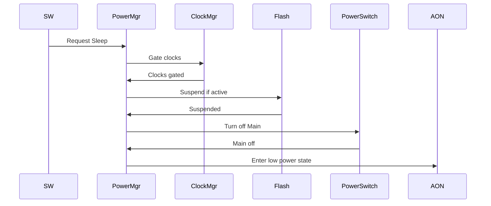
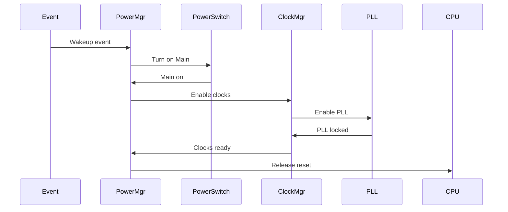

# 电源架构设计知识库

芯片电源架构设计的关键决策点和最佳实践。

---

## 电源域划分

### 常见电源域结构

```
典型 SoC 电源域划分：
├── PD_AON (Always-on)    → Power Mgr, Clock Mgr, Reset Mgr, AON Timer
├── PD_MAIN (Main)        → CPU, Memory, Crypto, Main Bus
├── PD_PERI (Peripheral)  → UART, SPI, I2C, GPIO (可选与 MAIN 合并)
├── PD_IO (IO)            → Pad Ring, IO Buffers
├── PD_ANALOG (可选)      → PLL, ADC, DAC
├── PD_MEMORY (可选)      → Large SRAM/Flash 单独供电
```

### 电源域划分原则

| 原则 | 说明 |
|------|------|
| 功能聚合 | 可独立关闭的功能放单独域 |
| 功耗优化 | 高功耗模块单独域便于精细控制 |
| 电压差异 | 不同电压需求的模块分域 |
| 成本权衡 | 域越多，电源网络越复杂 |

### 电源域边界考虑

| 考虑项 | 说明 |
|--------|------|
| Isolation Cell | 跨域信号需要隔离单元 |
| Level Shifter | 不同电压域需要电平转换 |
| Power Switch | Header/Footer switch 选择 |
| Retention | 跨域存储需要保持策略 |

---

## 电压定义

### 常见电压轨

| Voltage Rail | 典型值 | 用途 |
|--------------|--------|------|
| VDD_CORE | 0.9V - 1.2V | Core logic |
| VDD_IO | 1.8V - 3.3V | IO buffers |
| VDD_AON | 1.0V - 1.2V | Always-on logic |
| VDD_MEM | 1.0V - 1.2V | Memory (可独立) |
| VDD_ANALOG | 2.5V - 3.3V | PLL, ADC |
| VDD_PLL | 1.2V - 1.8V | PLL analog |

### 电压选择依据

| 因素 | 影响 |
|------|------|
| 工艺节点 | 28nm: 0.9V, 40nm: 1.1V, 65nm: 1.2V |
| 性能需求 | 高性能 → 高电压 (有上限) |
| 功耗目标 | 低功耗 → 低电压 |
| IO 标准 | UART/SPI: 3.3V 或 1.8V |

---

## 功耗估算

### 功耗组成

| 类型 | 公式 | 说明 |
|------|------|------|
| 动态功耗 | P_dyn = α × C × V² × f | 开关功耗 |
| 静态功耗 | P_static = I_leak × V | 漏电功耗 |
| 短路功耗 | P_short = I_short × V × t_short | 有限 |

### 典型功耗估算方法

```
功耗估算步骤：
1. 活动因子估算 (α = 0.1 - 0.3 typical)
2. 电容估算 (C = gate_count × C_per_gate)
3. 电压确定 (V = supply voltage)
4. 频率确定 (f = clock frequency)
5. 计算 P_dyn = α × C × V² × f
6. 漏电估算 (工艺库数据)
7. 总功耗 = P_dyn + P_static
```

### 各模块功耗比例参考

| 模块 | 动态功耗占比 | 静态功耗占比 |
|------|--------------|--------------|
| CPU | 30-50% | 10-20% |
| Memory | 20-40% | 30-50% |
| Clock Tree | 10-20% | 5-10% |
| IO | 5-15% | 5-10% |
| Other | 10-20% | 10-20% |

---

## 低功耗策略

### Clock Gating

| 策略 | 实现 | 功耗节省 |
|------|------|----------|
| 模块级 CG | 软件/硬件控制 CG cell | 20-40% |
| 细粒度 CG | 寄存器级自门控 | 10-30% |
| 自动 CG | Idle 检测自动关闭 | 10-20% |

### Power Gating

| 参数 | 选择依据 |
|------|----------|
| Switch 类型 | Header (VDD) / Footer (VSS) |
| Switch 大小 | 峰值电流能力 |
| 控制方式 | 软件/硬件自动 |
| 状态保持 | Retention flop 或 Shadow register |

### 功控模式定义

| 模式 | 描述 | 活动域 | 典型功耗 |
|------|------|--------|----------|
| Active | 全功能运行 | All | 100% |
| Sleep | CPU 停止 | AON + PERI | 10-30% |
| Deep Sleep | Main 关闭 | AON only | 1-5% |
| Hibernate | 极低功耗 | AON minimal | 0.1-1% |

### DVFS (Dynamic Voltage Frequency Scaling)

| 场景 | 策略 |
|------|------|
| 高性能需求 | 高电压、高频率 |
| 中等负载 | 中电压、中频率 |
| 低负载 | 低电压、低频率 |
| 待机 | 最低电压 |

---

## 电源管理模块设计

### Power Manager 功能

| 功能 | 描述 |
|------|------|
| 电源域控制 | 开关各域电源 |
| 时钟控制 | 开关各域时钟 |
| 复位控制 | 控制复位序列 |
| 低功耗入口 | 执行 Sleep/Deep Sleep 流程 |
|唤醒处理 | 处理唤醒事件 |
| 状态监控 | 监控各域状态 |

### 低功耗入口流程



###唤醒流程



---

## 电源网络设计

### 电源网络层次

```
电源网络结构：
External Supply
    │
    ├── Power Pad (VCC, VSS)
    │       │
    │       ├── Power Ring (包围芯片)
    │       │       │
    │       │       ├── Power Grid (内部网格)
    │       │       │       │
    │       │       │       └── Power Switch
    │       │       │               │
    │       │       │               └── Power Domain
```

### 电源网络设计要点

| 要点 | 说明 |
|------|------|
| IR Drop | < 5% (通常 < 3%) |
| EM (电迁移) | 符合工艺寿命要求 |
| Power Pad 数量 | 满足峰值电流 |
| Grid 密度 | 平衡 IR Drop 和面积 |

### Decap (去耦电容) 策略

| 类型 | 位置 | 用途 |
|------|------|------|
| On-chip Decap | 空白区域填充 | 高频去耦 |
| Package Decap | 封装内 | 中频去耦 |
| Board Decap | PCB | 低频去耦 |

---

## 跨电源域信号处理

### Isolation Cell

| 类型 | 用途 | 特点 |
|------|------|------|
| AND type | 输出到关闭域 | 关断输出为 0 |
| OR type | 输出到关闭域 | 关断输出为 1 |
| Pass-through | 输入到关闭域 | 需要电平转换配合 |

### Level Shifter

| 类型 | 用途 |
|------|------|
| Up-shifter | 低电压 → 高电压 |
| Down-shifter | 高电压 → 低电压 |
| Bidirectional | 双向转换 |

### Power Sequence

| 顺序 | 说明 |
|------|------|
| 上电 | AON → Main → Peri |
| 下电 | Peri → Main → AON (AON 保持) |

---

## 功耗分析与优化流程

### 功耗分析工具

| Tool | 用途 |
|------|------|
| PrimePower | 动态功耗分析 |
| Voltus | 功耗分析、IR Drop |
| Power Artist | RTL 级功耗估算 |

### 功耗优化流程

```
功耗优化步骤：
1. RTL 级估算 → 识别高功耗模块
2. 时钟门控优化 → 增加覆盖率
3. 数据通路优化 → 减少冗余逻辑
4. 存储优化 → 选择合适类型和大小
5. 电源门控 → 定义可关闭域
6. 后端优化 → 减少漏电、优化网络
```

---

## 参考设计案例

### OpenTitan Earl Grey

| 域 | 描述 |
|----|------|
| Always-on | Power/Clock/Reset Manager, AON Timer, AON SRAM |
| Main | CPU, Memory, Crypto, Peripherals |

### 低功耗芯片典型功耗

| 模式 | 功耗范围 |
|------|----------|
| Active | 50-200 mW |
| Sleep | 5-20 mW |
| Deep Sleep | 100-500 µW |
| Hibernate | 10-50 µW |

---

## 常见错误与陷阱

| 陷阱 | 说明 | 正确做法 |
|------|------|----------|
| IR Drop 过大 | 电源网络设计不足 | 增加网格密度 |
| Isolation 缺失 | 跨域信号无隔离 | 加 Isolation Cell |
| 电源顺序错误 | 上电顺序不当 | 遵循设计顺序 |
| 功耗估算过低 | 实际功耗超标 | 多场景估算 |
| Retention 失效 | 状态保持失败 | 验证保持功能 |

---

## 设计验证要点

| 验证项 | 方法 | Tool |
|--------|------|------|
| IR Drop | Static analysis | Voltus |
| 功耗估算 | Simulation | PrimePower |
| 电源序列 | RTL simulation | Waveform |
| Low Power 功能 | Formal + Simulation | Jasper + UVM |
| EM 分析 | Static analysis | Voltus |