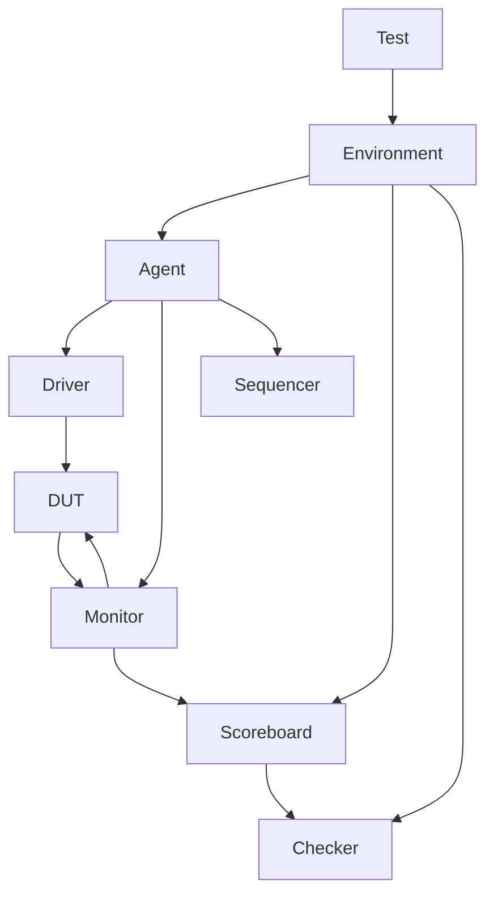

# 验证策略知识库

芯片验证策略的关键决策点和最佳实践。

---

## 验证层次

### 验证金字塔

```
验证层次金字塔：
          Silicon Test (实测)
              ↑
          Emulation / FPGA
              ↑
          System Level
              ↑
          Integration Level
              ↑
          Unit / Module Level
              ↑
          Block Level
```

### 各层次职责

| 层次 | 覆盖范围 | 工具 |
|------|----------|------|
| Unit | 单模块功能 | UVM, Formal |
| Integration | 模块间交互 | UVM |
| System | 全系统场景 | UVM, Emulation |
| Silicon | 实测验证 | ATE, Lab |

---

## 验证方法

### Simulation 验证

| 类型 | 适用场景 | 特点 |
|------|----------|------|
| Directed Test | 基本功能 | 人工编写 |
| Random Test | 复杂场景 | 随机生成 |
| Constrained Random | 目标覆盖 | 随机+约束 |
| Formal Verification | 关键属性 | 数学证明 |

### Formal Verification

| 类型 | 用途 |
|------|------|
| Equivalence Check | RTL vs Gate 等价性 |
| Property Check | 属性验证（CDC、死锁等） |
| Model Check | 状态机可达性 |
| Assertion Check | SVA 断言验证 |

### Emulation / FPGA

| 类型 | 用途 | 特点 |
|------|------|------|
| Emulation | 系统级验证 | 高速，硬件加速器 |
| FPGA Prototype | 软硬件协同验证 | 实际硬件环境 |

---

## 覆盖率定义

### 覆盖率类型

| 类型 | 定义 | 目标 |
|------|------|------|
| Code Coverage | 代码执行率 | ≥ 100% |
| Functional Coverage | 功能点覆盖 | ≥ 95% |
| Assertion Coverage | 断言触发率 | ≥ 100% |
| Toggle Coverage | 信号翻转 | ≥ 100% |
| FSM Coverage | 状态机覆盖 | ≥ 100% |

### Code Coverage 子项

| 子项 | 说明 |
|------|------|
| Line Coverage | 代码行执行 |
| Branch Coverage | 分支执行 |
| Condition Coverage | 条件组合 |
| Path Coverage | 路径执行 |

### Functional Coverage 定义

```
Covergroup 示例：
covergroup transaction_cg
  coverpoint addr {
    bins low = {[0:127]};
    bins mid = {[128:255]};
    bins high = {[256:511]};
  }
  coverpoint data {
    bins zero = {0};
    bins max = {32'hFFFFFFFF};
    bins others = default;
  }
  cross addr, data; // 交叉覆盖
endcovergroup
```

---

## Testbench 架构

### UVM Testbench 结构



### Testbench 组件职责

| 组件 | 职责 |
|------|------|
| Driver | 发送激励 |
| Monitor | 收集响应 |
| Sequencer | 生成序列 |
| Scoreboard | 结果比对 |
| Checker | 断言检查 |

---

## Test Plan 结构

### Test Plan 模板

| ID | Feature | Priority | Test Type | Coverage Goal | Status |
|----|---------|----------|-----------|---------------|--------|
| TP01 | {{功能}} | High | Directed | 100% | Pending |
| TP02 | {{功能}} | High | Random | 95% | Pending |
| TP03 | {{边界}} | Medium | Corner | 100% | Pending |

### 测试优先级定义

| Priority | 说明 |
|----------|------|
| P1 (Critical) | 必须通过，阻塞交付 |
| P2 (High) | 重要功能，强烈建议通过 |
| P3 (Medium) | 边界情况，推荐通过 |
| P4 (Low) | 罕见场景，可选 |

---

## 关键验证场景

### 功能验证

| 场景 | 内容 |
|------|------|
| 正常流程 | 基本功能路径 |
| 异常处理 | 错误检测和恢复 |
| 边界条件 | 最大/最小/极限值 |
| 配置组合 | 所有配置组合 |

### 时序验证

| 场景 | 内容 |
|------|------|
| 时钟边界 | CDC 时序 |
| 复位时序 | 复位序列 |
| 功控时序 | 电源开关序列 |
| 关键路径 | 时序收敛 |

### 低功耗验证

| 场景 | 内容 |
|------|------|
| Sleep 入口 | 各低功耗模式入口 |
|唤醒流程 | 各唤醒事件处理 |
| 状态保持 | Retention 正确性 |
| 隔离功能 | Isolation 正确性 |

### 安全验证

| 场景 | 内容 |
|------|------|
| Secure Boot | 启动验证流程 |
| Crypto 正确性 | 加解密正确性 |
| Access Control | 权限控制正确性 |
| Lifecycle | 状态切换正确性 |

---

## Regression 策略

### Regression 类型

| 类型 | 频率 | 内容 |
|------|------|------|
| Nightly | 每晚 | 全量测试 |
| Weekly | 每周 | 重点+长时间 |
| Gate | 交付前 | 全量+覆盖检查 |
| CI | 每次 commit | 快速 subset |

### Regression 流程

```
Regression 流程：
1. 代码提交触发 CI
2. CI 快速测试通过后合并
3. Nightly 全量测试运行
4. 收集覆盖率报告
5. 未覆盖项分析补充
6. Gate 前全覆盖检查
```

---

## 调试策略

### 调试方法

| 方法 | 适用场景 |
|------|----------|
| Waveform 分析 | 复杂时序问题 |
| Log 分析 | 快速定位 |
| Assertion 失败 | 属性违反 |
| Coverage Gap | 未覆盖场景 |

### 调试工具

| Tool | 用途 |
|------|------|
| Questa/Verdi | Waveform 分析 |
| UVM Report | Log 分析 |
| SVA Assertion | 断言调试 |
| Coverage Tool | 覆盖分析 |

---

## 验证工具

### Simulation 工具

| Tool | 特点 |
|------|------|
| Questa Sim | 高性能，UVM 支持 |
| VCS | Synopsys，广泛使用 |
| Xcelium | Cadence，低功耗支持 |

### Formal 工具

| Tool | 用途 |
|------|------|
| JasperGold | 属性验证 |
| OneSpin | 状态机验证 |
| SpyGlass CDC | CDC 检查 |

### Emulation 工具

| Tool | 特点 |
|------|------|
| Palladium | Cadence，高性能 |
| ZeBu | Synopsys，快速 |
| HES | 混合仿真 |

---

## 验证交付标准

### 交付检查清单

| 检查项 | 标准 |
|--------|------|
| Code Coverage | ≥ 100% |
| Functional Coverage | ≥ 95% |
| 所有 P1 测试 | Pass |
| 所有 P2 测试 | Pass |
| Regression | 无新失败 |
| Formal Check | 无违反 |
| DFT Coverage | ≥ 95% |

### 验证报告结构

| 章节 | 内容 |
|------|------|
| Executive Summary | 整体状态 |
| Coverage Summary | 覆盖率汇总 |
| Test Results | 测试结果明细 |
| Issues | 待解决问题 |
| Risk Assessment | 风险评估 |
| Recommendations | 建议 |

---

## 参考设计案例

### OpenTitan 验证

| 层次 | 方法 |
|------|------|
| Block | UVM + Formal |
| Top | UVM + FPGA |
| Security | Formal + Penetration |

### 验证人力投入

| 阶段 | 验证/设计人力比 |
|------|----------------|
| Block | 1:1 |
| System | 2:1 |
| Total | 2-3:1 |

---

## 常见错误与陷阱

| 陷阱 | 说明 | 正确做法 |
|------|------|----------|
| Coverage 虚高 | 覆盖率数值但实际不足 | 深度覆盖检查 |
| 测试不够随机 | 场景覆盖不全 | 增强约束随机 |
| 断言不足 | 关键属性未断言 | 增加断言 |
| Regression 不稳定 | 假失败频繁 | 稳定化测试 |
| Formal 未用 | 关键属性未证明 | 必做 Formal |

---

## 设计验证要点

| 验证项 | 方法 | Tool |
|--------|------|------|
| 功能正确性 | Simulation | Questa/VCS |
| 属性正确性 | Formal | Jasper |
| CDC | Formal | SpyGlass |
| 覆盖率 | Collection | Coverage tool |
| 性能 | Benchmark | Simulation |