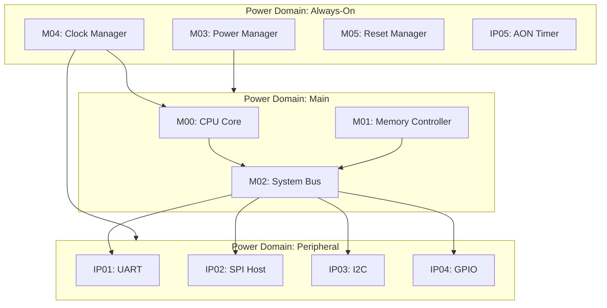
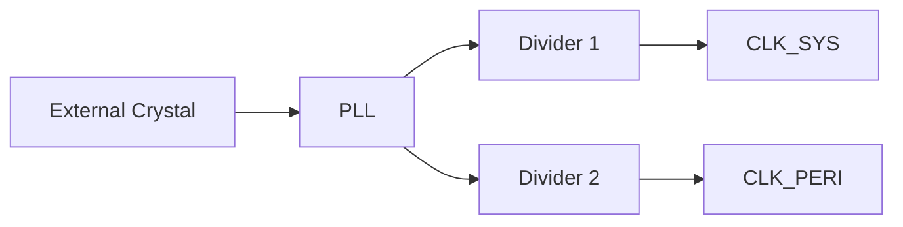
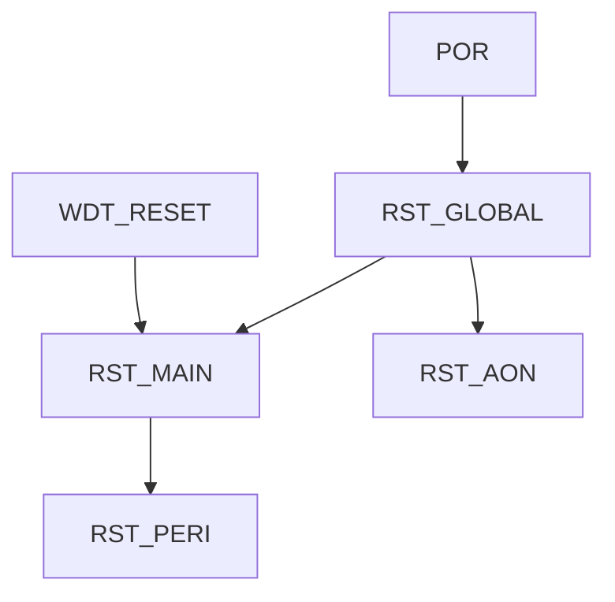
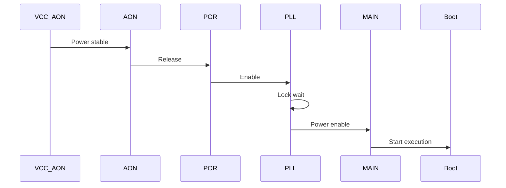
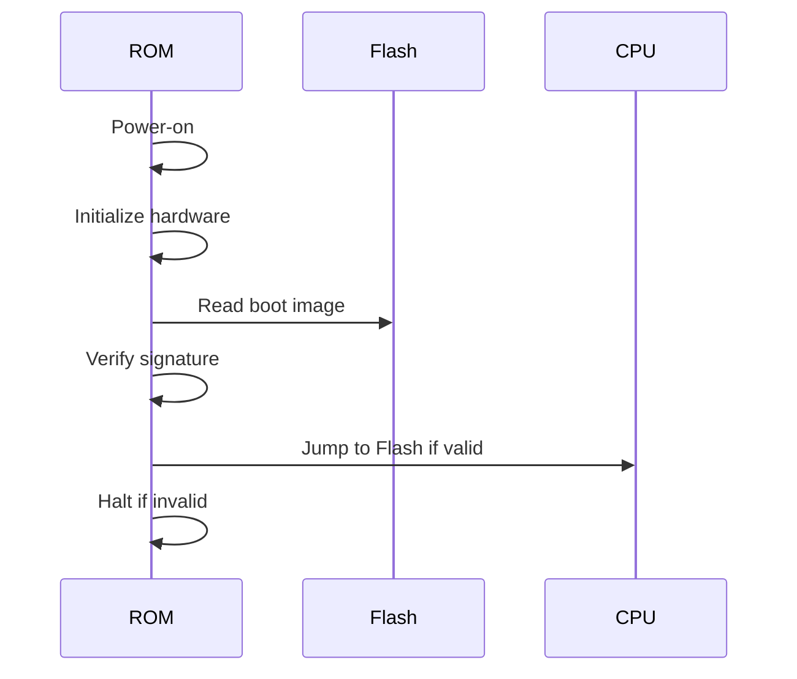

# 芯片级架构文档模板

本文档定义芯片整体架构设计的标准输出格式。

---

## chip_overview.md 结构

```markdown
# {{芯片名称}} Overview

## Executive Summary

[一句话描述芯片定位和目标应用]

## Key Features

| Feature | Specification | Notes |
|---------|---------------|-------|
| CPU Core | {{型号}} @ {{频率}} | {{特性}} |
| Memory | {{类型}} {{容量}} | {{特性}} |
| Security | {{等级}} | {{特性}} |
| Interfaces | {{列表}} | {{特性}} |
| Technology | {{节点}} | {{特性}} |
| Package | {{封装}} | {{特性}} |

## Target Applications

1. {{应用场景1}}
2. {{应用场景2}}
3. ...

## Design Philosophy

[设计理念概述：性能优先/功耗优先/安全优先/成本优先]
```

---

## block_diagram.md 结构

```markdown
# {{芯片名称}} Block Diagram

## System Overview



## Module Index

| Module ID | Name | Description | Clock Domain | Power Domain |
|-----------|------|-------------|--------------|--------------|
| M00 | CPU Core | {{描述}} | CLK_MAIN | PD_MAIN |
| M01 | Memory Controller | {{描述}} | CLK_MAIN | PD_MAIN |
| ... | ... | ... | ... | ... |

## Interconnect Topology

[总线拓扑描述：层级、带宽、仲裁策略]
```

---

## clock_reset_spec.md 结构

```markdown
# Clock & Reset Architecture

## Clock Sources

| Source | Frequency | Jitter | Purpose |
|--------|-----------|--------|---------|
| EXT_CLK | {{MHz}} | {{ppm}} | External crystal input |
| PLL_MAIN | {{MHz}} | {{ppm}} | Main system clock |
| PLL_PERI | {{MHz}} | {{ppm}} | Peripheral clock |
| CLK_AON | {{kHz}} | - | Always-on low-speed |

## Clock Domains

| Domain | Frequency | Source | Modules |
|--------|-----------|--------|---------|
| CLK_SYS | {{MHz}} | PLL_MAIN | CPU, Memory, Crypto |
| CLK_PERI | {{MHz}} | PLL_PERI | UART, SPI, I2C |
| CLK_AON | {{kHz}} | CLK_AON | Power Mgr, Timer |
| CLK_USB | {{MHz}} | PLL_USB | USB Device |

## Clock Distribution



## Clock Gating Strategy

| Domain | Gating Type | Control |
|--------|-------------|---------|
| CLK_SYS | Software | Power Manager register |
| CLK_PERI | Auto | Peripheral idle detection |

## CDC Strategy

| From Domain | To Domain | Method | Verification |
|-------------|-----------|--------|--------------|
| CLK_SYS | CLK_PERI | 2-stage synchronizer | Formal |
| CLK_PERI | CLK_AON | Handshake | Simulation |

## Reset Sources

| Source | Type | Active Level | Scope |
|--------|------|--------------|-------|
| POR | Asynchronous | Low | Global |
| WDT_RESET | Synchronous | High | Main domain |
| SW_RESET | Synchronous | High | Peripheral domain |
| LOW_POWER_EXIT | Asynchronous | Low | Main domain |

## Reset Tree



## Reset Sequence

1. Power-on: POR triggers global reset
2. PLL stabilization wait
3. Release AON domain first
4. Release Main domain after PLL lock
5. Release Peripheral domain
```

---

## memory_map.md 结构

```markdown
# Memory Architecture

## Memory Types

| Type | Size | Technology | Purpose |
|------|------|------------|---------|
| ROM | {{KB}} | Hardcoded | Boot code |
| Flash | {{KB}} | eFlash | Application storage |
| SRAM | {{KB}} | SRAM | Data/stack |
| OTP | {{bits}} | eFuse | Key/config storage |

## Memory Map

| Base Address | Size | Type | Module | Access |
|--------------|------|------|--------|--------|
| 0x0000_0000 | {{KB}} | ROM | Boot ROM | R |
| 0x0010_0000 | {{KB}} | Flash | Flash Ctrl | RW |
| 0x1000_0000 | {{KB}} | SRAM | Main SRAM | RW |
| 0x4000_0000 | - | Register | Peripheral | RW |
| ... | ... | ... | ... | ... |

## Memory Controllers

### Flash Controller

- Page size: {{bytes}}
- Erase time: {{ms}}
- Program time: {{µs}}
- Security: {{access control}}

### SRAM Controller

- Arbitration: {{priority scheme}}
- ECC: {{type}}
- Scrambling: {{method}}

## Bus Interconnect

[TileLink/AXI/APB description]
```

---

## power_spec.md 结构

```markdown
# Power Architecture

## Power Domains

| Domain | Voltage | Source | Modules | Gating |
|--------|---------|--------|---------|--------|
| PD_AON | {{V}} | VCC_AON | Clock/Power Mgr | Never |
| PD_MAIN | {{V}} | VCC_MAIN | CPU, Memory, Crypto | Software |
| PD_PERI | {{V}} | VCC_MAIN | UART, SPI, I2C | Auto+SW |
| PD_IO | {{V}} | VCC_IO | Pad ring | Never |

## Power Consumption Estimate

| Domain | Dynamic Power | Static Power | Total | Notes |
|--------|---------------|--------------|-------|-------|
| PD_MAIN | {{mW}} | {{mW}} | {{mW}} | Max frequency |
| PD_PERI | {{mW}} | {{mW}} | {{mW}} | All active |
| PD_AON | {{µW}} | {{µW}} | {{µW}} | Always on |

## Power Modes

| Mode | Description | Active Domains | Entry Method |
|------|-------------|----------------|--------------|
| Active | Full operation | All | Default |
| Sleep | CPU halted | AON, PERI | Software request |
| Deep Sleep | Main power off | AON only | Software request |
| Hibernate | Minimal power | AON only | External trigger |

## Low Power Techniques

| Technique | Scope | Implementation |
|-----------|-------|----------------|
| Clock Gating | All domains | CG cell per module |
| Power Gating | PD_MAIN, PD_PERI | Header switch |
| Voltage Scaling | PD_MAIN | DVFS controller |
| Retention | SRAM | Retention mode |

## Power-on Sequence


```

---

## io_pinout.md 结构

```markdown
# IO & Pinout

## Pin Categories

| Category | Count | Type | Description |
|----------|-------|------|-------------|
| Power | {{N}} | VCC/VSS | Supply pins |
| Fixed IO | {{N}} | Dedicated | SPI, USB, JTAG |
| Muxed IO | {{N}} | GPIO | Software configurable |
| Analog | {{N}} | ADC/Comparator | Sensor inputs |

## Pin List

| Pin ID | Name | Bank | Type | Default Function | Mux Options |
|--------|------|------|------|------------------|-------------|
| 0 | POR_N | VCC | Input | System reset | - |
| 1 | USB_P | VCC | USB | USB D+ | - |
| 2 | USB_N | VCC | USB | USB D- | - |
| 9 | SPI_HOST_D0 | VIOA | Bidir | SPI data | - |
| ... | ... | ... | ... | ... | ... |

## Pin Attributes

| Attribute | Supported Pins | Configuration |
|-----------|----------------|---------------|
| Pull-up | All Muxed IO | Register control |
| Pull-down | All Muxed IO | Register control |
| Drive strength | All Bidir | 2mA/4mA/8mA |
| Open drain | BidirStd | Virtual OD |
| Slew rate | All Output | Fast/Slow |

## Peripheral IO Mapping

### SPI Host

| Signal | Pin |
|--------|-----|
| CLK | SPI_HOST_CLK |
| CS_L | SPI_HOST_CS_L |
| D0 | SPI_HOST_D0 |
| D1 | SPI_HOST_D1 |
| D2 | SPI_HOST_D2 |
| D3 | SPI_HOST_D3 |

### UART (via Muxed IO)

| Signal | Pin Option 1 | Pin Option 2 |
|--------|--------------|--------------|
| TX | IOA0 | IOB0 |
| RX | IOA1 | IOB1 |
```

---

## dft_spec.md 结构

```markdown
# Design for Testability

## DFT Strategy Overview

| Method | Coverage Target | Implementation |
|--------|-----------------|----------------|
| Scan | 95% | Full scan insertion |
| Memory BIST | 100% | MBIST controller |
| JTAG | Debug access | IEEE 1149.1 |
| Boundary Scan | IO test | IEEE 1149.1 |

## Scan Architecture

| Parameter | Value |
|-----------|-------|
| Scan Chains | {{N}} chains |
| Chain Length | {{max_cells}} |
| Scan Clock | CLK_TEST |
| Scan Enable | TEST_SE |

## Memory BIST

| Memory | BIST Type | Algorithm |
|--------|-----------|-----------|
| Main SRAM | March C- | Address march |
| Flash | Program/Erase verify | Dedicated |
| OTP | Read verify | Simple read |

## JTAG Interface

| Signal | Pin | Function |
|--------|-----|----------|
| TCK | JTAG_TCK | Test clock |
| TMS | JTAG_TMS | Test mode select |
| TDI | JTAG_TDI | Test data in |
| TDO | JTAG_TDO | Test data out |
| TRST_N | JTAG_TRST | Test reset |

## Test Modes

| Mode | Description | Entry Method |
|------|-------------|--------------|
| Functional | Normal operation | Default |
| Scan | Scan test | TEST_MODE=1 |
| BIST | Memory BIST | TEST_MODE=2 |
| Boundary | IO boundary scan | JTAG instruction |
```

---

## security_spec.md 结构（可选）

```markdown
# Security Architecture

## Security Level

[定义目标安全等级：Basic/Enhanced/Root of Trust]

## Secure Boot Flow



## Crypto Modules

| Module | Algorithm | Key Size | Purpose |
|--------|-----------|----------|---------|
| AES | AES-128/256 | 128/256-bit | Encryption |
| SHA | SHA-256 | - | Hashing |
| HMAC | HMAC-SHA256 | 256-bit | Authentication |
| RNG | TRNG+CSRNG | - | Random number |
| Key Mgr | Key derivation | - | Key management |

## Lifecycle States

| State | Description | Capabilities |
|-------|-------------|--------------|
| TEST | Manufacturing test | All features, debug enabled |
| DEV | Development | Limited debug |
| PROD | Production | No debug, full security |

## Access Control

| Asset | Access Policy | Enforcement |
|-------|---------------|-------------|
| Flash | Region-based | Flash controller |
| OTP | Lifecycle-based | OTP controller |
| SRAM | Address-based | Memory protection |

## Physical Security

- [Glitch detection]
- [Tamper detection]
- [Clock glitch protection]
```