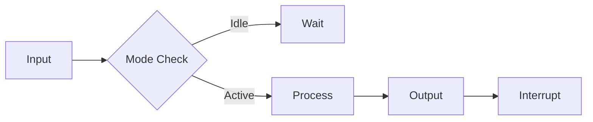
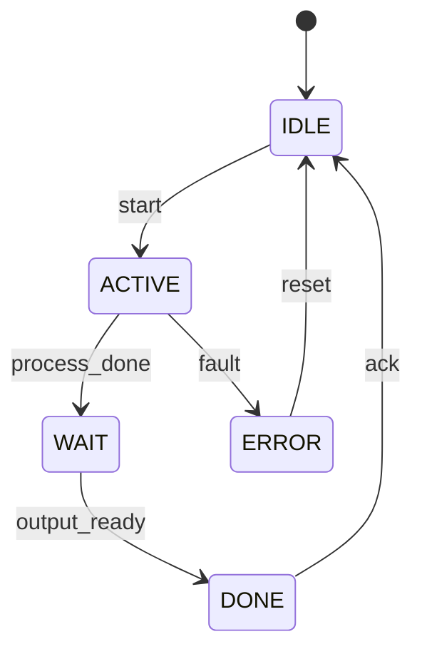

# IP 模块级架构文档模板

本文档定义单个 IP 模块架构设计的标准输出格式。

---

## block_overview.md 结构

```markdown
# {{模块名称}} Overview

## Module ID

`IP{{NN}}: {{模块名称}}`

## Summary

[一句话描述模块功能]

## Key Features

| Feature | Description |
|---------|-------------|
| {{特性1}} | {{描述}} |
| {{特性2}} | {{描述}} |
| ... | ... |

## Block Diagram

```mermaid
graph TB
    subgraph {{模块名称}}
        subgraph Datapath["Datapath"]
            INPUT[Input Register]
            CORE[Core Logic]
            OUTPUT[Output Register]
        end
        subgraph Control["Control Logic"]
            FSM[State Machine]
            REG[Control Registers]
        end
        INPUT --> CORE
        CORE --> OUTPUT
        FSM --> CORE
        REG --> FSM
    end
    
    BUS[System Bus] --> REG
    INPUT --> External[External Input]
    OUTPUT --> External
```

## Interface Overview

| Interface | Type | Width | Clock Domain |
|-----------|------|-------|--------------|
| TL-UL | Bus | 32-bit | CLK_SYS |
| Data In | Data | {{N}}-bit | CLK_SYS |
| Data Out | Data | {{N}}-bit | CLK_SYS |
| Interrupt | Signal | 1-bit | CLK_SYS |

## Resource Estimate

| Resource | Estimate | Notes |
|----------|----------|-------|
| Gate Count | {{kGE}} | {{条件}} |
| Memory | {{KB}} | {{类型}} |
| Latency | {{cycles}} | {{操作}} |
```

---

## theory_of_operation.md 结构

```markdown
# {{模块名称}} Theory of Operation

## Functional Overview

[模块整体工作原理描述]

## Operating Modes

| Mode | Description | Entry Condition |
|------|-------------|-----------------|
| Idle | Waiting for request | No active transaction |
| Active | Processing data | Transaction started |
| Done | Output ready | Operation complete |

## Data Flow



## Timing Characteristics

| Operation | Latency | Throughput |
|-----------|---------|------------|
| {{操作1}} | {{cycles}} | {{per cycle}} |
| {{操作2}} | {{cycles}} | {{per cycle}} |

## Key Timing Diagrams

```wavejson
{
  signal: [
    {name: 'clk', wave: 'p........'},
    {name: 'valid', wave: '01.0.....'},
    {name: 'data_in', wave: 'x.3.x....', data: ['D0']},
    {name: 'ready', wave: '0..1.0...'},
    {name: 'data_out', wave: 'x....3.x', data: ['R0']},
  ]
}
```

## Error Handling

| Error Type | Detection | Response |
|------------|-----------|----------|
| {{错误1}} | {{方法}} | {{响应}} |
| {{错误2}} | {{方法}} | {{响应}} |
```

---

## interface_spec.md 结构

```markdown
# {{模块名称}} Interface Specification

## Signal List

### Clock & Reset

| Signal | Direction | Width | Description |
|--------|-----------|-------|-------------|
| clk_i | Input | 1 | Clock input |
| rst_ni | Input | 1 | Async reset, active low |

### Bus Interface (TL-UL)

| Signal | Direction | Width | Description |
|--------|-----------|-------|-------------|
| tl_h2d_req | Input | 1 | Request valid |
| tl_h2d_addr | Input | 32 | Address |
| tl_h2d_data | Input | 32 | Write data |
| tl_h2d_write | Input | 1 | Write enable |
| tl_d2h_valid | Output | 1 | Response valid |
| tl_d2h_data | Output | 32 | Read data |
| tl_d2h_error | Output | 1 | Error flag |

### Data Interface

| Signal | Direction | Width | Description |
|--------|-----------|-------|-------------|
| data_in_i | Input | {{N}} | Input data |
| data_in_valid_i | Input | 1 | Input valid |
| data_out_o | Output | {{N}} | Output data |
| data_out_valid_o | Output | 1 | Output valid |

### Interrupts

| Signal | Direction | Width | Description |
|--------|-----------|-------|-------------|
| intr_done_o | Output | 1 | Operation complete |
| intr_error_o | Output | 1 | Error detected |

## Timing Requirements

### Input Timing

| Signal | Setup Time | Hold Time | Notes |
|--------|------------|-----------|-------|
| tl_h2d_addr | {{ns}} | {{ns}} | Relative to clk_i |
| data_in_i | {{ns}} | {{ns}} | Relative to clk_i |

### Output Timing

| Signal | Valid Delay | Notes |
|--------|-------------|-------|
| tl_d2h_data | {{ns}} | After clk_i rising |
| data_out_o | {{ns}} | After clk_i rising |

## Protocol Diagrams

### Read Transaction

```wavejson
{
  signal: [
    {name: 'clk', wave: 'p.....'},
    {name: 'req', wave: '01.0..'},
    {name: 'addr', wave: 'x.3x..', data: ['A0']},
    {name: 'write', wave: '0.....'},
    {name: 'valid', wave: '0..10.'},
    {name: 'rdata', wave: 'x...3x', data: ['D0']},
  ]
}
```

### Write Transaction

```wavejson
{
  signal: [
    {name: 'clk', wave: 'p.....'},
    {name: 'req', wave: '01.0..'},
    {name: 'addr', wave: 'x.3x..', data: ['A0']},
    {name: 'wdata', wave: 'x.3x..', data: ['D0']},
    {name: 'write', wave: '01.0..'},
    {name: 'valid', wave: '0..10.'},
  ]
}
```
```

---

## register_map.md 结构

```markdown
# {{模块名称}} Register Map

## Register Summary

| Address | Name | Description | Access |
|---------|------|-------------|--------|
| 0x0 | CTRL | Control register | RW |
| 0x4 | STATUS | Status register | R |
| 0x8 | DATA_IN | Input data | W |
| 0xC | DATA_OUT | Output data | R |
| 0x10 | INTR_ENABLE | Interrupt enable | RW |
| 0x14 | INTR_STATUS | Interrupt status | RW |

## Register Details

### CTRL (0x0)

| Bit | Field | Access | Reset | Description |
|-----|-------|--------|-------|-------------|
| 0 | ENABLE | RW | 0 | Module enable |
| 1 | START | RW | 0 | Start operation (auto-clear) |
| 2 | RESET | RW | 0 | Soft reset |
| [7:4] | MODE | RW | 0 | Operating mode |
| [31:8] | Reserved | - | 0 | Reserved |

### STATUS (0x4)

| Bit | Field | Access | Reset | Description |
|-----|-------|--------|-------|-------------|
| 0 | BUSY | R | 0 | Operation in progress |
| 1 | DONE | R | 0 | Operation complete |
| 2 | ERROR | R | 0 | Error flag |
| [31:3] | Reserved | - | 0 | Reserved |

### DATA_IN (0x8)

| Bit | Field | Access | Reset | Description |
|-----|-------|--------|-------|-------------|
| [31:0] | DATA | W | 0 | Input data value |

### DATA_OUT (0xC)

| Bit | Field | Access | Reset | Description |
|-----|-------|--------|-------|-------------|
| [31:0] | DATA | R | 0 | Output data value |
```

---

## design_details.md 结构

```markdown
# {{模块名称}} Design Details

## Datapath Architecture

[数据通路详细描述]

### Key Datapath Components

| Component | Function | Width |
|-----------|----------|-------|
| {{组件1}} | {{功能}} | {{位宽}} |
| {{组件2}} | {{功能}} | {{位宽}} |

## Control Logic

### State Machine Definition



### State Encoding

| State | Encoding | Description |
|-------|----------|-------------|
| IDLE | 0x00 | Waiting for request |
| ACTIVE | 0x01 | Processing |
| WAIT | 0x02 | Waiting for output |
| DONE | 0x03 | Output ready |
| ERROR | 0x04 | Error state |

## Critical Paths

| Path | Timing Constraint | Notes |
|------|-------------------|-------|
| {{路径1}} | {{ns}} | {{描述}} |
| {{路径2}} | {{ns}} | {{描述}} |

## Pipeline Stages

| Stage | Function | Registers |
|-------|----------|-----------|
| Stage 1 | Input capture | {{寄存器列表}} |
| Stage 2 | Processing | {{寄存器列表}} |
| Stage 3 | Output | {{寄存器列表}} |

## Clock Domain Crossings

| Crossing | Source | Target | Method |
|----------|--------|--------|--------|
| {{CDC1}} | {{域A}} | {{域B}} | {{同步器}} |
```

---

## programmer_guide.md 结构

```markdown
# {{模块名称}} Programmer's Guide

## Initialization Sequence

1. Reset module: `CTRL.RESET = 1`
2. Configure mode: `CTRL.MODE = desired_value`
3. Enable module: `CTRL.ENABLE = 1`
4. Enable interrupts: `INTR_ENABLE = 0x3`

## Basic Operation

### Read Operation

```c
// Wait for idle
while (STATUS.BUSY) {}

// Write input data
DATA_IN = input_value;

// Start operation
CTRL.START = 1;

// Wait for completion
while (!STATUS.DONE) {}

// Read output
output = DATA_OUT;
```

### Interrupt-driven Operation

```c
// Configure interrupts
INTR_ENABLE.DONE = 1;
INTR_ENABLE.ERROR = 1;

// Start operation
DATA_IN = input_value;
CTRL.START = 1;

// In ISR:
if (INTR_STATUS.DONE) {
    output = DATA_OUT;
    INTR_STATUS.DONE = 1; // Clear
}
if (INTR_STATUS.ERROR) {
    handle_error();
    INTR_STATUS.ERROR = 1; // Clear
}
```

## Error Handling

| Error Code | Cause | Recovery |
|------------|-------|----------|
| 0x01 | Timeout | Reset and retry |
| 0x02 | Invalid input | Check input range |
| 0x03 | Overflow | Clear and restart |

## Performance Considerations

- Maximum throughput: {{operations/sec}}
- Minimum latency: {{cycles}}
- Backpressure: supported via ready signal
```

---

## verification_checklist.md 结构

```markdown
# {{模块名称}} Verification Checklist

## Functionality

| Item | Priority | Status | Notes |
|------|----------|--------|-------|
| Basic operation | High | Pending | |
| All modes | High | Pending | |
| Error handling | High | Pending | |
| Interrupt generation | Medium | Pending | |
| Reset behavior | High | Pending | |

## Interface

| Item | Priority | Status | Notes |
|------|----------|--------|-------|
| Bus protocol compliance | High | Pending | TL-UL spec |
| Timing requirements | High | Pending | Setup/hold |
| CDC correctness | High | Pending | Formal check |

## Coverage Goals

| Type | Target | Current |
|------|--------|---------|
| Code coverage | 100% | - |
| Functional coverage | 95% | - |
| Assertion coverage | 100% | - |

## Test Cases

| ID | Description | Status |
|----|-------------|--------|
| TC01 | Basic read/write | Pending |
| TC02 | All operating modes | Pending |
| TC03 | Interrupt handling | Pending |
| TC04 | Error injection | Pending |
| TC05 | Reset sequences | Pending |

## Formal Verification

| Property | Status | Tool |
|----------|--------|------|
| CDC stability | Pending | Formal |
| FSM reachability | Pending | Formal |
| Deadlock absence | Pending | Formal |
```