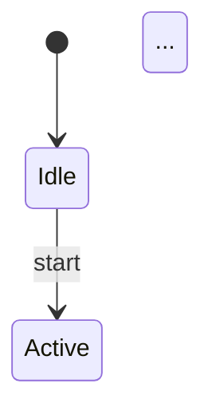
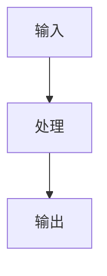

<DEFAULTS>
output_dir: ./spec_mas
language: zh-CN
finetune: false
auto_approve: false
project_dir: auto-detect
module_type: all
update: auto
</DEFAULTS>

## Self-Adaptive 初始化

初始化目录结构：`.skills_local/bb-mas/`，并收集项目上下文信息。

---

## HARD-GATE 定义

```
<HARD-GATE>
在任何 MAS 生成操作前，必须完成以下步骤：

1. Self-Adaptive 初始化 + 项目上下文收集 + 路径解析（MANDATORY）
   ```bash
   SCRIPT_DIR=~/.claude/scripts
   python3 "$SCRIPT_DIR/adaptive/adaptive_init.py" \
     --skill "bb-mas" \
     --project-dir "{{ PROJECT_DIR }}"
   ```

2. 加载配置文件（MANDATORY）
   ```python
   import json
   
   with open(".skills_local/bb-mas/project_context.json") as f:
       CONTEXT = json.load(f)
   
   PROJECT_DIR = CONTEXT["project"]["root"]
   INPUT_DIR = CONTEXT["resolved_paths"]["INPUT_DIR"]
   OUTPUT_DIR = CONTEXT["resolved_paths"]["OUTPUT_DIR"]
   MODULE_TYPE = CONTEXT["config"]["module_type"]
   ```

3. 创建执行日志目录
   ```bash
   mkdir -p "${LOG_DIR}"
   LOG_FILE="${LOG_DIR}/mas-$(date -u +%Y%m%dT%H%M%S).log"
   ```

禁止行为（在完成初始化前）：
- 加载 spec_arch 输入
- 启动模块树生成
- 输出 MAS 文档
</HARD-GATE>
```

---

## Pipeline Position

```
spec_arch/ ──→ [bb-mas] ──→ spec_mas/ ──→ bb-spec-review ──→ bb-rtl-coder
                  OUTPUT_DIR
```

---

## 铁律（违反即停止）

> 以下规则不受 auto_approve 影响，任何模式下均不得绕过。

1. **Spec 先行铁律**：`spec_arch/` 中有效文档少于 2 份 → 拒绝执行，返回 bb-arch 阶段
2. **叶子优先铁律**：子模块未完成 → 禁止开始父模块；违反此顺序父模块内容必然不准确
3. **五文件完整铁律**：每个模块��须有 MAS.md + FSM.md + datapath.md + verification.md + DFT.md，缺一不可；"简单模块不需要 FSM" 是借口
4. **Frontmatter 状态铁律**：`status: pending` 的文件不计入完成统计，不触发后续流程
5. **并行上限铁律**：同时运行子 agent ≤ 6 个；超出会导致上下文污染和路径混乱

---

## 模块类型分类

| 类型 | 典型模块 | MAS 重点章节 |
|------|---------|-------------|
| **compute** | ALU、CPU Core、MAC、DSP | 数据通路、FSM、流水线 |
| **storage** | Cache、SRAM、DRAM Controller | 访存协议、替换策略、一致性 |
| **interconnect** | NoC、Bus、Crossbar、Router | 路由算法、仲裁、带宽 |
| **io** | GPIO、PCIe、DDR、SerDes | 协议适配、CDC、时序 |

---

## Global Paths

```
PROJECT_DIR       = {{ project_dir 参数 或 auto-detect }}
INPUT_DIR         = {{ PROJECT_DIR }}/spec_arch
OUTPUT_DIR        = {{ PROJECT_DIR }}/spec_mas
TEMPLATE_DIR      = ~/.claude/skills/bb-mas/templates
PROGRESS_DIR      = {{ OUTPUT_DIR }}/.progress
CHECKPOINT_DIR    = {{ OUTPUT_DIR }}/.checkpoint
SCRIPT_DIR        = ~/.claude/scripts
SKILL_FILE        = ~/.claude/skills/bb-mas/SKILL.md
```

---

## 增量更新机制

每次成功完成后，将输入文件哈希写入 `<output_dir>/.archive/input_snapshot.json`。下次执行时在前置检查之前自动比对。

### 输入快照格式

```json
{
  "snapshot_time": "<ISO8601+08:00>",
  "skill": "bb-mas",
  "input_files": {
    "<relative-path>": "<sha256>"
  }
}
```

### Phase -1: 变更检测（前置检查前强制执行）

```
IF update=full  → 跳过检测，走 MAJOR 路径
IF update=patch → 跳过检测，走 MINOR 路径
ELSE (auto):
  IF input_snapshot.json 不存在
    → FULL RUN（首次执行，不归档）
  ELSE
    sha256sum arch_spec/ 下所有 .md 文件
    与 snapshot 对比
    IF 哈希全部一致 → 输出 "输入未变更，跳过生成" 并退出
    IF 哈希有差异   → 按下表分类
```

### 变更分类

| 条件（满足任意一条） | 分类 |
|---------------------|------|
| arch_spec/ 中文件数量变化（增删文件） | **MAJOR** |
| arch_doc.md 中模块数量变化 | **MAJOR** |
| 接口协议列表变更（增删/重命名） | **MAJOR** |
| 时钟域数量或名称变更 | **MAJOR** |
| arch_spec/ 总字符数变化 > 30% | **MAJOR** |
| 其他所有变更（模块描述更新、预算调整、时序约束细化等） | **MINOR** |

### MAJOR 路径：归档 + 全量重建

```bash
TIMESTAMP=$(date -u +%Y%m%dT%H%M%S)
ARCHIVE="{{ OUTPUT_DIR }}/.archive/$TIMESTAMP"
mkdir -p "$ARCHIVE"
for item in "{{ OUTPUT_DIR }}"/*.md "{{ OUTPUT_DIR }}"/*.json \
            "{{ OUTPUT_DIR }}"/fsm "{{ OUTPUT_DIR }}"/datapath; do
  [ -e "$item" ] && mv "$item" "$ARCHIVE/"
done
echo "{\"reason\":\"MAJOR\",\"timestamp\":\"$TIMESTAMP\"}" > "$ARCHIVE/CHANGE_REASON.json"
```

归档完成后执行 FULL RUN（从前置检查正常继续）。

### MINOR 路径：就地更新

仅重新生成哈希发生变化的模块文档，其余模块保持不变：

| 变更内容 | 处理 |
|---------|------|
| 某模块 MAS.md 对应的 arch_spec 段变更 | 重新生成该模块 MAS.md + FSM/Datapath |
| 全局计划（verif_plan_seed.md、dft_plan_seed.md）相关内容变更 | 重新生成全局计划文件 |
| 仅描述文字变更 | 仅更新受影响模块的描述段落 |

完成后更新 `{{ OUTPUT_DIR }}/.archive/input_snapshot.json`。

---

## 前置检查

1. **定位 spec_arch 目录**：
   - 若用户提供路径，验证存在
   - 否则自动检测最新子目录

2. **验证必需文档**（至少 2 份）：
   - `architecture_spec.md` — 芯片架构规范
   - `functional_spec.md` — 功能需求
   - `interface_spec.md` — 接口定义
   - `timing_spec.md` — 时序要求

3. **创建输出目录**：
   ```
   mkdir -p {{ OUTPUT_DIR }}
   mkdir -p {{ PROGRESS_DIR }}
   mkdir -p {{ CHECKPOINT_DIR }}
   ```

---

## 阶段 1：构建模块树

### 1.1 输入规模检测

```bash
ARCH_SIZE=$(wc -c < "${INPUT_DIR}/architecture_spec.md")
FUNC_SIZE=$(wc -c < "${INPUT_DIR}/functional_spec.md")
TOTAL_SIZE=$((ARCH_SIZE + FUNC_SIZE))

if [ "$TOTAL_SIZE" -lt 100000 ];  then READ_MODE="full"
elif [ "$TOTAL_SIZE" -lt 300000 ]; then READ_MODE="section"
else                                    READ_MODE="subagent"
fi
```

### 1.2 构建嵌套模块树

**拆分判据**：模块职责覆盖 3+ 独立子功能 → 拆分

**命名规则**：
- L1：`M01_模块名/`（如 `M01_ALU/`）
- L2：`M01a_子模块名/`（如 `M01a_IntegerALU/`）
- L3：`M01a1_原子模块/`（如 `M01a1_Adder/`）

**Chiplet 特定标注**：
- `@D2D` — Die-to-Die 接口模块
- `@CDC` — 跨时钟域模块
- `@PWR` — 电源管理相关

### 1.3 输出模块树文档

写入 `{{ OUTPUT_DIR }}/module_tree.md`

### 1.4 创建目录结构

为每个模块创建子目录和 5 个文件：

```
{{ OUTPUT_DIR }}/
├── module_tree.md
├── plan.md（占位）
├── .progress/
├── .checkpoint/
└── M01_*/
    ├── MAS.md         # 微架构文档
    ├── FSM.md         # 状态机设计
    ├── datapath.md    # 数据通路图
    ├── verification.md # 验证计划
    ├── DFT.md         # 可测性设计
    └── tasks.md       # 实现任务
```

---

## 阶段 2：填充叶子模块文档（并行）

### 子 agent 指令模板

```
## 任务：填充模块 MAS 文档

**路径规范**：
- 输出文件：{{ OUTPUT_DIR }}/{{ MODULE_PATH }}/MAS.md
- 模板文件：{{ TEMPLATE_DIR }}/MAS-template.md
- 上下文：{{ INPUT_DIR }}/architecture_spec.md, functional_spec.md

**要求**：
1. 读取模板文件
2. 按模板章节结构填充内容

**芯片特定质量要求**：
- §2.1 接口定义：信号名、位宽、方向、协议（AXI/APB/自定义）
- §2.2 时序规格：Cycle 延迟、吞吐、带宽
- §3 数据通路：流水线级数、关键路径、Mermaid/WaveDrom 图
- §4 状态机：FSM 定义、状态编码、转移条件
- §5 验证策略：功能覆盖点、断言、仿真场景
- §6 DFT 方案：扫描链、BIST、JTAG 接口

3. frontmatter 格式：
   ---
   module: {{ MODULE_ID }}
   type: MAS
   status: complete
   parent: {{ PARENT_ID }}
   module_type: compute|storage|interconnect|io
   generated: {{ NOW }}
   ---
```

---

## 阶段 3：填充 FSM/Datapath/Verification/DFT（并行）

每个叶子模块启动子 agent 依次填充 4 个文件。

### FSM.md 质量要求

```markdown
## FSM 定义

### 状态列表
| 状态 | 编码 | 描述 |
|------|------|------|

### 状态转移表
| 当前状态 | 转移条件 | 目标状态 | 输出 |
|----------|---------|----------|------|

### Mermaid 状态图

```

### Datapath.md 质量要求

```markdown
## 数据通路

### 模块框图（Mermaid）


### 流水线结构
| 级别 | 操作 | 延迟 |
|------|------|------|

### 关键路径分析
- 最大延迟路径
- 时钟约束
```

### Verification.md 质量要求

```markdown
## 验证计划

### 功能覆盖点
| 覆盖点 | 类型 | 描述 |
|--------|------|------|

### 断言列表
| 断言 | 条件 | 严重性 |
|------|------|------|

### 仿真场景
- 正常场景
- 边界场景
- 异常场景
```

### DFT.md 质量要求

```markdown
## 可测性设计

### 扫描链配置
- 链数
- 长度
- 接口

### BIST 方案
- 类型（MBIST/LBIST）
- 覆盖范围

### JTAG 接口
- TCK/TMS/TDI/TDO
- 支持指令
```

---

## 阶段 4：逐层上卷父模块

从最深的父模块开始，逐层向上填充。

**父模块特殊内容**：
- MAS.md：子模块编排表、数据流图、聚合接口
- FSM.md：顶层状态机协调
- datapath.md：模块间连接图
- verification.md：集成验证场景
- DFT.md：顶层测试访问

---

## 阶段 5：生成全局计划

汇总所有模块的 tasks，生成 `{{ OUTPUT_DIR }}/plan.md`：

- 模块依赖关系图（Mermaid）
- 实现阶段定义
- 并行实现矩阵
- 验证里程碑

---

## Chiplet 特定章节

当模块涉及 D2D 接口时，MAS.md 必须包含：

### D2D 接口规范

```markdown
## D2D 接口

### 协议类型
- UCIe / BoW / AIB / 自定义

### 信号定义
| 信号 | 方向 | 位宽 | 协议 |
|------|------|------|------|

### 时序参数
- 延迟：`xx cycles`
- 吞吐：`xx Gbps`

### CDC 方案
- 同步器类型
- MTBF 估算
```

### 电源域

```markdown
## 电源域

### 域划分
| 域 | 电压 | 模块 |
|------|------|------|

### 电源序列
1. 域 A 上电
2. 域 B 上电
...
```

---

## Frontmatter 格式规范

```yaml
---
module: M[0-9]{2}[a-z]?    # 如 M01, M01a, M01a1
type: MAS | FSM | datapath | verification | DFT | tasks
status: pending | complete
parent: [父模块编号]
module_type: compute | storage | interconnect | io
chiplet_features: [D2D, CDC, PWR]  # 可选
generated: [ISO 8601 时间戳]
---
```

---

## 输出模板

详见 `templates/` 目录：
- `MAS-template.md` — 微架构文档模板
- `FSM-template.md` — 状态机模板
- `datapath-template.md` — 数据通路模板
- `verification-template.md` — 验证计划模板
- `DFT-template.md` — DFT 模板
- `tasks-template.md` — 任务模板

---

## 辅助脚本

详见 `scripts/` 目录：
- `progress_check.sh` — 进度检查
- `checkpoint_manager.sh` — checkpoint 管理
- `analyze_spec.sh` — 文档质量分析

---

## 操作原则

- **路径绝对化**：所有路径使用绝对路径
- **格式统一**：frontmatter 仅使用 `status: complete`
- **进度可追踪**：每个文件完成后更新进度文件
- **支持恢复**：每个阶段完成时创建 checkpoint
- **底层优先**：叶子模块先完成，再逐层上卷
- **并行加速**：同层无依赖模块并行处理（最大 6 个）
- **阶段压缩**：每完成一个阶段执行 `/compact`

---

## 常见借口（均无效）

| Agent 的借口 | 为什么错 |
|-------------|---------|
| "���个模块很简单，FSM.md 可以留空" | 无 FSM 文档意味着 RTL 工程师在无规范情况下写状态机，必然引入缺陷，review 时也无法检查 |
| "DFT.md 是 DFT 工程师的事，MAS 阶段不需要" | DFT 需求影响模块端口（scan_en），MAS 阶段未定则 RTL 需要返工接口 |
| "父模块可以先写，子模块并行填充" | 父模块内容依赖子模块接口定义；子模块未完成则父模块内容必然不准确，后续级联错误 |
| "verification.md 场景太多，列几个代表性的就行" | 不完整的验证计划等于不完整的测试；漏掉的场景在 silicon 上暴露，成本以流片次数计 |
| "先标 status: complete，内容后续完善" | 错误的 complete 标记会让 bb-spec-review 跳过实际未完成模块，掩盖质量问题 |
| "输入文档不够清晰，猜测一下先继续" | 基于猜测的 MAS 文档等于技术债；在 RTL 实现阶段被发现时已无法低成本修复 |

---

## 降级策略

| 场景 | 降级方案 |
|------|---------|
| 子 agent 超时 | 重试一次；再次失败则记录至 `.progress/failed_modules.md` 并继续其他模块 |
| 模板文件缺失（`templates/`） | 使用各阶段"质量要求"小节中的内联最小化模板结构 |
| 输入规模超过单 agent 处理能力 | 切分为 300KB chunks，依次送入子 agent，结果合并 |
| bb-spec-review 不可用 | 使用阶段 5 `plan.md` 内联质量检查清单代替，结果写入 `.checkpoint/manual_check.md` |
| `spec_arch/` 缺少某类文档 | 从已有文档推断，标注 "⚠️ 基于推断，需人工确认：{缺失文档}" |

---

## 最终验证实证（完成标准）

> 以下条件全部满足才可声明 bb-mas 完成，并触发 bb-spec-review handoff。缺一不可。

- [ ] `module_tree.md` 存在且所有叶子模块已列出
- [ ] 每个叶子模块目录包含 5 个文件（MAS/FSM/datapath/verification/DFT）
- [ ] 所有文件 frontmatter 中 `status: complete`（无 `pending`）
- [ ] 每个 MAS.md 中接口信号表完整（无空行、无 TBD 信号名）
- [ ] 每个 FSM.md 包含状态列表 + 转移表 + Mermaid 状态图
- [ ] `plan.md` 存在，包含模块依赖图和并行实现矩阵
- [ ] bb-spec-review 未报告 CRITICAL 级别问题（或已修复并记录）

**禁止在上述条件未满足时触发 bb-rtl-coder handoff。**

---

## Evolution Trigger Point

When any Phase fails:

1. **Detect failure**: Read `{{ OUTPUT_DIR }}/execution.log`
2. **Invoke framework**:
   ```bash
   bash {{ EVOLUTION_FRAMEWORK }}/evolve.sh \
     --skill "{{ SKILL_FILE }}" \
     --output "{{ OUTPUT_DIR }}" \
     --failure-phase "{{ FAILED_PHASE }}"
   ```
3. **Framework handles**: Analyze, modify, validate, rollback
4. **Retry or escalate**