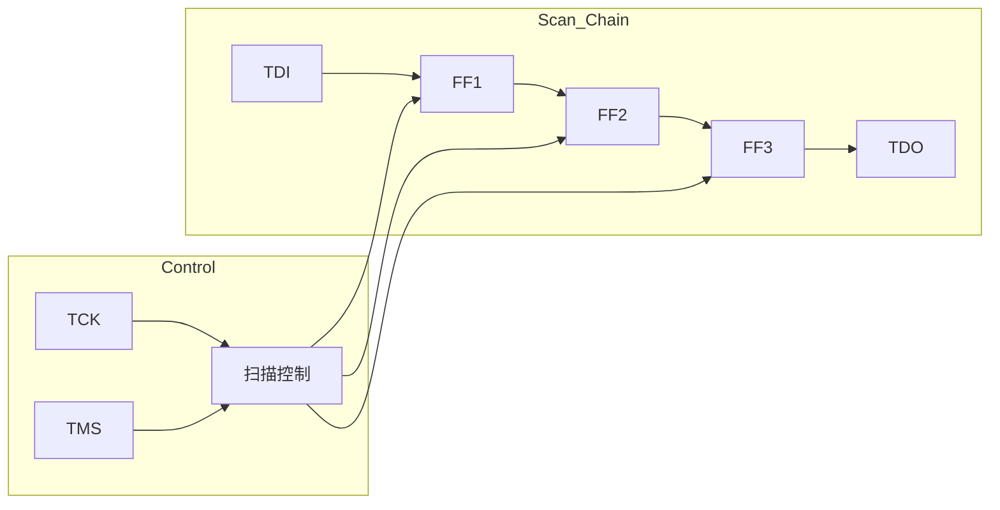
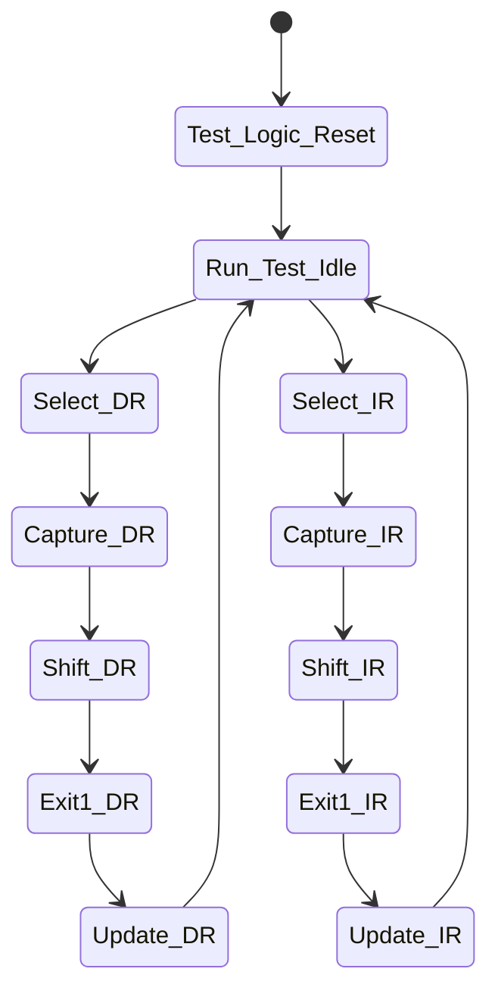
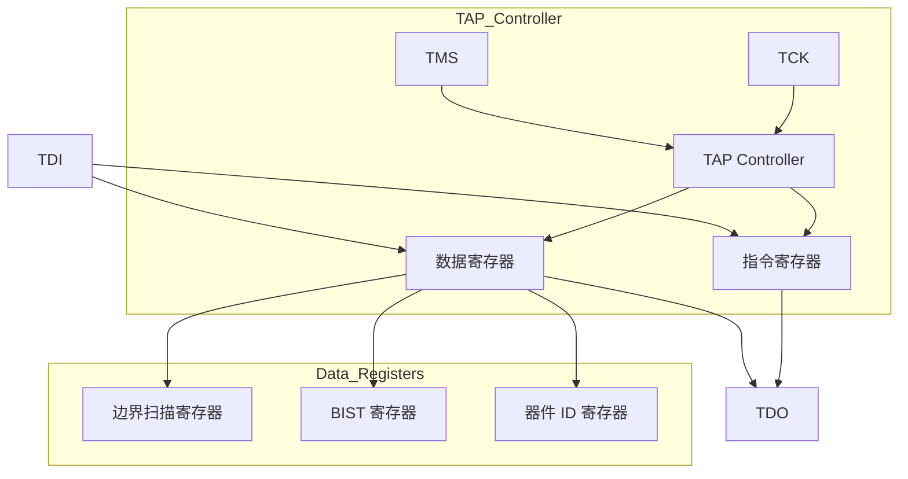
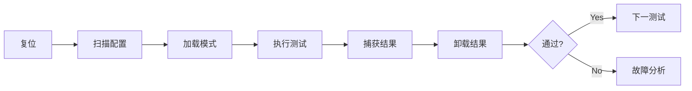

---
# DFT-template.md — 可测性设计模板
---

# {{ MODULE_NAME }} 可测性设计方案

## 1. DFT 概述

### 1.1 DFT 目标
- 测试覆盖率目标：`{{ TEST_COV }}%`
- 故障覆盖率目标：`{{ FAULT_COV }}%`
- 测试时间目标：`{{ TEST_TIME }} ms`

### 1.2 DFT 策略
- 结构测试：`{{ STRUCT_TEST }}`
- 功能测试：`{{ FUNC_TEST }}`
- 内建自测试：`{{ BIST }}`

---

## 2. 扫描链设计

### 2.1 扫描链配置

| 链 ID | 长度 | 触发器数 | 时钟域 | 用途 |
|--------|------|---------|--------|------|
| `SC-001` | {{ LENGTH }} | {{ FF_COUNT }} | {{ DOMAIN }} | {{ PURPOSE }} |
| `{{ SC_ID }}` | {{ LENGTH }} | {{ FF_COUNT }} | {{ DOMAIN }} | {{ PURPOSE }} |

### 2.2 扫描链架构

### 2.3 扫描寄存器映射

| 寄存器 | 扫描链位置 | 功能 | 测试访问 |
|--------|-----------|------|----------|
| `{{ REG }}` | {{ POS }} | {{ FUNC }} | {{ ACCESS }} |

---

## 3. 内建自测试 (BIST)

### 3.1 MBIST 配置

| BIST ID | 目标存储器 | 测试算法 | 覆盖率 |
|----------|-----------|----------|--------|
| `MBIST-001` | {{ MEM }} | March C- | {{ COV }}% |
| `{{ BIST_ID }}` | {{ MEM }} | {{ ALGO }} | {{ COV }}% |

### 3.2 MBIST 控制器

**控制信号**：
| 信号 | 方向 | 描述 |
|------|------|------|
| `bist_start` | input | 启动 BIST |
| `bist_done` | output | BIST 完成 |
| `bist_fail` | output | 检测故障 |

### 3.3 LBIST 配置

| 参数 | 值 | 描述 |
|------|---|------|
| PRPG 长度 | {{ LEN }} | 伪随机模式生成器 |
| MISR 长度 | {{ LEN }} | 多输入特征寄存器 |
| 测试模式数 | {{ PAT }} | 生成的测试模式 |

---

## 4. JTAG 接口

### 4.1 JTAG 端口

| 信号 | 方向 | 描述 | IEEE 1149.1 |
|------|------|------|-------------|
| `TCK` | input | 测试时钟 | Required |
| `TMS` | input | 测试模式选择 | Required |
| `TDI` | input | 测试数据输入 | Required |
| `TDO` | output | 测试数据输出 | Required |
| `TRST` | input | 测试复位 | Optional |

### 4.2 JTAG TAP 控制器

**状态机**：

### 4.3 JTAG 指令集

| 指令 | 操作码 | 描述 |
|------|--------|------|
| `EXTEST` | `0x00` | 外部测试 |
| `SAMPLE/PRELOAD` | `0x01` | 采样/预加载 |
| `INTEST` | `0x02` | 内部测试 |
| `{{ INSTR }}` | `{{ OPCODE }}` | {{ DESC }} |

---

## 5. 边界扫描

### 5.1 边界扫描寄存器

| 位位置 | 信号 | 类型 | 描述 |
|--------|------|------|------|
| `0` | `{{ SIGNAL }}` | {{ TYPE }} | {{ DESC }} |

### 5.2 边界扫描操作

| 操作 | 指令 | 描述 |
|------|------|------|
| 外部测试 | EXTEST | 测试板级互连 |
| 内部测试 | INTEST | 测试芯片内部逻辑 |
| 采样 | SAMPLE | 正常操作时采样 |

---

## 6. 测试访问端口 (TAP)

### 6.1 TAP 架构

### 6.2 器件 ID 寄存器

| 字段 | 位宽 | 值 | 描述 |
|------|------|---|------|
| 版本 | 4 | `{{ VER }}` | 版本号 |
| 部件号 | 16 | `{{ PART }}` | 部件编号 |
| 制造商 | 11 | `{{ MFR }}` | 制造商 ID |
| LSB | 1 | `1` | 固定为 1 |

---

## 7. 测试点插入

### 7.1 测试点列表

| 测试点 | 类型 | 位置 | 用途 |
|--------|------|------|------|
| `{{ TP }}` | {{ TYPE }} | {{ LOC }} | {{ PURPOSE }} |

### 7.2 控制点/观察点

| 类型 | 方法 | 插入点 |
|------|------|--------|
| 控制点 | 插入扫描触发器 | {{ LOC }} |
| 观察点 | 复用扫描触发器 | {{ LOC }} |

---

## 8. Power-Aware DFT

### 8.1 电源域测试

| 电源域 | 测试方法 | 注意事项 |
|--------|---------|----------|
| `{{ DOMAIN }}` | {{ METHOD }} | {{ NOTE }} |

### 8.2 低功耗测试模式

| 模式 | 描述 | 测试内容 |
|------|------|----------|
| `{{ MODE }}` | {{ DESC }} | {{ CONTENT }} |

---

## 9. 测试流程

### 9.1 测试序列

### 9.2 测试模式列表

| 模式 ID | 名称 | 测试内容 | 预期时间 |
|----------|------|----------|----------|
| `TM-001` | 功能测试 | 基础功能验证 | {{ TIME }} ms |
| `{{ TM_ID }}` | {{ NAME }} | {{ CONTENT }} | {{ TIME }} ms |

---

## 10. 故障模型

### 10.1 故障类型

| 故障类型 | 模型 | 检测方法 |
|----------|------|----------|
| Stuck-at | SAF | 扫描测试 |
| Transition | TDF | 扫描测试 |
| Path Delay | PDF | 路径测试 |
| Bridging | BF | 特殊模式 |

### 10.2 故障覆盖率目标

| 故障模型 | 目标覆盖率 | 当前覆盖率 |
|----------|-----------|-----------|
| Stuck-at | {{ TARGET }}% | {{ CURRENT }}% |
| Transition | {{ TARGET }}% | {{ CURRENT }}% |

---

## 11. 附录

### A. 扫描链详细配置
[所有扫描链的详细寄存器映射]

### B. BIST 算法参数
[BIST 测试算法的详细参数]

### C. 测试向量格式
[测试向量的文件格式说明]