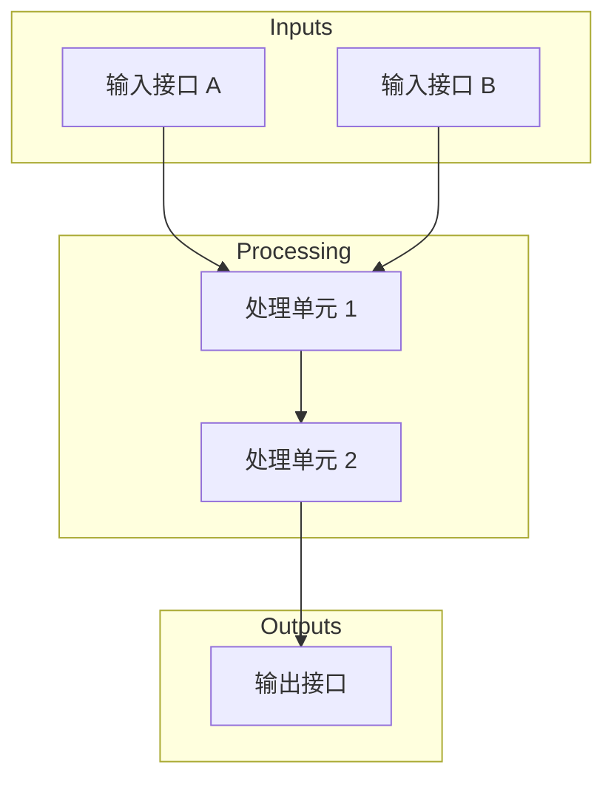

---
# MAS-template.md — 芯片模块微架构文档模板
---

# {{ MODULE_NAME }} 微架构规范

## 1. 模块概述

### 1.1 功能描述
[模块的主要功能和职责]

### 1.2 模块类型
- 类型：`{{ MODULE_TYPE }}` (compute/storage/interconnect/io)
- 层级：`{{ MODULE_LEVEL }}`

### 1.3 设计约束
- 面积预算：`[具体数值]`
- 功耗预算：`[具体数值]`
- 时钟频率：`[具体数值]`
- 关键路径延迟：`[具体数值]`

---

## 2. 接口定义

### 2.1 信号列表

| 信号名 | 方向 | 位宽 | 类型 | 描述 |
|--------|------|------|------|------|
| `clk` | input | 1 | 时钟 | 主时钟 |
| `rst_n` | input | 1 | 控制 | 异步复位，低有效 |
| `{{ SIGNAL_NAME }}` | {{ DIR }} | {{ WIDTH }} | {{ TYPE }} | {{ DESC }} |

### 2.2 接口协议

#### 2.2.1 {{ INTERFACE_NAME }} 接口
- 协议类型：`AXI4/APB4/自定义`
- 数据宽度：`{{ WIDTH }}`
- 地址宽度：`{{ ADDR_WIDTH }}`

**时序图 (WaveDrom)**：
```wavedrom
{signal: [
  {name: 'clk', wave: 'p.....'},
  {name: 'valid', wave: '0.1..0'},
  {name: 'data', wave: 'x.=.x'}
]}
```

### 2.3 Chiplet 特定接口（如有）

#### D2D 接口
- 协议：`UCIe/BoW/AIB/自定义`
- 带宽：`{{ BANDWIDTH }} Gbps`

---

## 3. 数据通路

### 3.1 模块框图



### 3.2 流水线结构

| 级别 | 操作 | 延迟 (cycles) | 寄存器 |
|------|------|---------------|--------|
| Stage 1 | {{ OP1 }} | {{ DELAY }} | {{ REGS }} |
| Stage 2 | {{ OP2 }} | {{ DELAY }} | {{ REGS }} |
| ... | ... | ... | ... |

### 3.3 关键路径分析
- 最大延迟路径：`{{ PATH_DESC }}`
- 延迟值：`{{ MAX_DELAY }} cycles`
- 优化建议：`{{ OPT_SUGGESTION }}`

---

## 4. 状态机设计

### 4.1 主要状态机

**FSM 名称**：`{{ FSM_NAME }}`

| 状态 | 编码 | 描述 |
|------|------|------|
| `IDLE` | `0x0` | 空闲状态 |
| `{{ STATE }}` | `{{ CODE }}` | {{ DESC }} |

**状态转移表**：
| 当前状态 | 条件 | 目标状态 | 输出变化 |
|----------|------|----------|----------|
| `IDLE` | `start == 1` | `ACTIVE` | `busy = 1` |
| `{{ CUR }}` | `{{ COND }}` | `{{ NEXT }}` | {{ OUTPUT }} |

详见 [FSM.md](./FSM.md) 完整状态机设计。

---

## 5. 时序规格

### 5.1 时钟域
- 主时钟域：`{{ CLOCK_DOMAIN }}`
- 时钟频率：`{{ FREQ }} MHz`

### 5.2 CDC（跨时钟域）处理

| 源域 | 目标域 | 同步方式 | 信号列表 |
|------|------|----------|----------|
| `{{ SRC }}` | `{{ DST }}` | `握手/异步FIFO` | `{{ SIGNALS }}` |

### 5.3 时序约束

| 参数 | 数值 | 单位 |
|------|------|------|
| 输入延迟 | {{ INPUT_LAT }} | cycles |
| 处理延迟 | {{ PROC_LAT }} | cycles |
| 输出延迟 | {{ OUTPUT_LAT }} | cycles |
| 总吞吐 | {{ THROUGHPUT }} | ops/cycle |

---

## 6. 存储资源

### 6.1 寄存器定义

| 寄存器 | 位宽 | 类型 | 复位值 | 描述 |
|--------|------|------|--------|------|
| `{{ REG_NAME }}` | {{ WIDTH }} | {{ TYPE }} | {{ RESET }} | {{ DESC }} |

### 6.2 存储器实例

| 名称 | 类型 | 深度 | 宽度 | 端口数 |
|------|------|------|------|--------|
| `{{ MEM_NAME }}` | SRAM/Register File | {{ DEPTH }} | {{ WIDTH }} | {{ PORTS }} |

---

## 7. 功耗管理

### 7.1 电源域
- 所属电源域：`{{ POWER_DOMAIN }}`
- 工作电压：`{{ VOLTAGE }} V`

### 7.2 低功耗策略
- Clock Gating：`{{ CG_DESC }}`
- Power Gating：`{{ PG_DESC }}`

---

## 8. 验证要点

### 8.1 关键验证场景
| 场景 | 类型 | 描述 |
|------|------|------|
| {{ SCENE }} | 功能/边界/异常 | {{ DESC }} |

详见 [verification.md](./verification.md) 完整验证计划。

---

## 9. DFT 方案

### 9.1 可测性设计要点
- 扫描链：`{{ SCAN_DESC }}`
- BIST：`{{ BIST_DESC }}`

详见 [DFT.md](./DFT.md) 完整 DFT 方案。

---

## 10. 实现任务

详见 [tasks.md](./tasks.md) 实现任务列表。

---

## 11. 参考文档

- [架构规范](../architecture_spec.md)
- [功能需求](../functional_spec.md)
- [接口定义](../interface_spec.md)

---

## 附录

### A. 信号详细定义
[扩展信号说明]

### B. 寄存器映射
[详细寄存器地址映射]

### C. 时序波形
[关键操作的完整时序图]