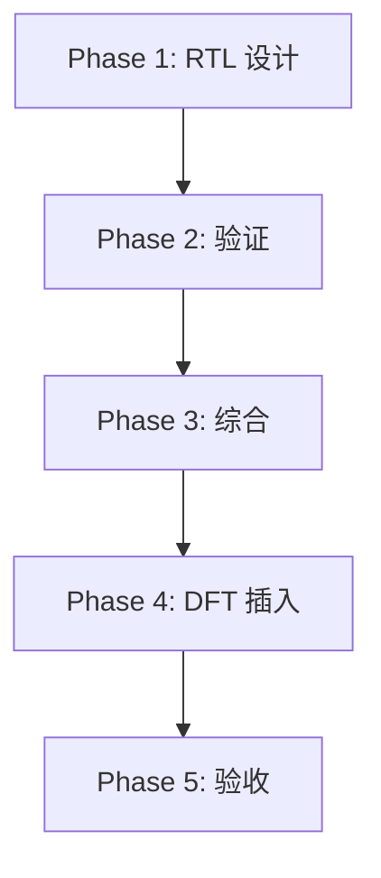

---
# tasks-template.md — 实现任务模板
---

# {{ MODULE_NAME }} 实现任务列表

## 1. 任务概述

### 1.1 实现阶段
- 总阶段数：`{{ PHASE_COUNT }}`
- 总任务数：`{{ TASK_COUNT }}`
- 预估工作量：`{{ EFFORT }} hours`

### 1.2 任务依赖关系

---

## Phase A: 准备阶段

### A.1 环境搭建
- [ ] 创建 RTL 目录结构
- [ ] 配置仿真工具
- [ ] 配置综合工具
- [ ] 设置版本控制

### A.2 规范确认
- [ ] 阅读 MAS.md
- [ ] 阅读 FSM.md
- [ ] 阅读 datapath.md
- [ ] 确认接口协议

---

## Phase 1: RTL 设计

### 1.1 接口设计
- [ ] 实现输入接口 `{{ INPUT_INTERFACE }}`
  - Token 预算：`{{ TOKEN_BUDGET }}`
  - Agent 风险：低
- [ ] 实现输出接口 `{{ OUTPUT_INTERFACE }}`
  - Token 预算：`{{ TOKEN_BUDGET }}`
  - Agent 风险：低

### 1.2 核心逻辑
- [ ] 实现状态机 `{{ FSM_NAME }}`
  - 参考：[FSM.md](./FSM.md)
  - Token 预算：`{{ TOKEN_BUDGET }}`
  - Agent 风险：中
  - 工具注意：三段式 FSM 结构

### 1.3 数据通路
- [ ] 实现流水线 Stage 1
  - 参考：[datapath.md](./datapath.md)
  - Token 预算：`{{ TOKEN_BUDGET }}`
- [ ] 实现流水线 Stage 2
- [ ] 实现关键路径优化

### 1.4 存储资源
- [ ] 实现寄存器阵列 `{{ REG_ARRAY }}`
- [ ] 实现存储器接口 `{{ MEM_INTERFACE }}`

---

## Phase 2: 功能验证

### 2.1 测试平台
- [ ] 创建 Driver
- [ ] 创建 Monitor
- [ ] 创建 Checker
- [ ] 创建 Scoreboard

### 2.2 断言插入
- [ ] 实现协议断言 `{{ ASSERTION }}`
  - 参考：[verification.md](./verification.md)
  - Token 预算：`{{ TOKEN_BUDGET }}`

### 2.3 功能覆盖
- [ ] 定义 covergroup `{{ COVERGROUP }}`
- [ ] 实现覆盖收集

### 2.4 测试用例
- [ ] 实现正常场景测试 `N-001`
- [ ] 实现边界场景测试 `B-001`
- [ ] 实现异常场景测试 `E-001`

---

## Phase 3: 综合

### 3.1 约束定义
- [ ] 定义时钟约束 `{{ CLOCK_CONSTRAINT }}`
- [ ] 定义输入延迟约束
- [ ] 定义输出延迟约束
- [ ] 定义多周期路径

### 3.2 综合执行
- [ ] 执行初步综合
- [ ] 分析时序报告
- [ ] 修复关键路径

### 3.3 面积优化
- [ ] 分析面积报告
- [ ] 执行面积优化
- [ ] 确认面积达标

---

## Phase 4: DFT 插入

### 4.1 扫描链插入
- [ ] 配置扫描链 `{{ SCAN_CHAIN }}`
  - 参考：[DFT.md](./DFT.md)
  - Token 预算：`{{ TOKEN_BUDGET }}`

### 4.2 BIST 集成
- [ ] 插入 MBIST 控制器
- [ ] 配置存储器 BIST

### 4.3 JTAG 集成
- [ ] 实现 JTAG TAP
- [ ] 配置边界扫描

---

## Phase 5: 最终验收

### 5.1 回归测试
- [ ] 执行完整回归
- [ ] 确认覆盖率达标
  - 功能覆盖：`{{ TARGET }}%`
  - 代码覆盖：`{{ TARGET }}%`
  - 断言覆盖：`{{ TARGET }}%`

### 5.2 时序验收
- [ ] 确认时序达标
  - Cycle 延迟满足预期
  - 流水线各级延迟满足

### 5.3 DFT 验收
- [ ] 确认故障覆盖率达标
- [ ] 确认测试时间满足

### 5.4 文档验收
- [ ] 确认 MAS 完整
- [ ] 确认 verification 完整
- [ ] 确认 DFT 完整

---

## 任务统计

| 阶段 | 任务数 | 已完成 | 进度 |
|------|--------|--------|------|
| Phase A | {{ COUNT }} | {{ DONE }} | {{ PROGRESS }}% |
| Phase 1 | {{ COUNT }} | {{ DONE }} | {{ PROGRESS }}% |
| Phase 2 | {{ COUNT }} | {{ DONE }} | {{ PROGRESS }}% |
| Phase 3 | {{ COUNT }} | {{ DONE }} | {{ PROGRESS }}% |
| Phase 4 | {{ COUNT }} | {{ DONE }} | {{ PROGRESS }}% |
| Phase 5 | {{ COUNT }} | {{ DONE }} | {{ PROGRESS }}% |

---

## 附录

### A. 任务详细说明
[每个任务的详细说明和注意事项]

### B. 工具配置
[仿真、综合、DFT 工具的具体配置]

### C. 脚本列表
[自动化脚本的说明和使用方法]