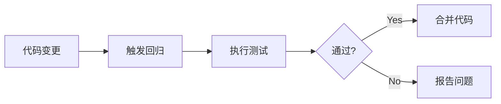

---
# verification-template.md — 验证计划模板
---

# {{ MODULE_NAME }} 验证计划

## 1. 验证概述

### 1.1 验证目标
- 功能覆盖率目标：`{{ COVERAGE_TARGET }}%`
- 代码覆盖率目标：`{{ CODE_COV_TARGET }}%`
- 断言覆盖率目标：`{{ ASSERT_COV_TARGET }}%`

### 1.2 验证方法
- 仿真验证：`{{ SIM_METHOD }}`
- 形式验证：`{{ FORMAL_METHOD }}`
- 等价性检查：`{{ EQ_CHECK }}`

---

## 2. 功能覆盖点

### 2.1 功能覆盖矩阵

| 覆盖点 ID | 功能 | 类型 | 优先级 | 覆盖方式 |
|-----------|------|------|--------|----------|
| `FC-001` | 基础操作 | 功能 | P1 | 仿真 |
| `{{ FC_ID }}` | {{ FUNC }} | {{ TYPE }} | {{ PRI }} | {{ METHOD }} |

### 2.2 功能覆盖详细定义

#### FC-001: {{ FEATURE_NAME }}

| 子覆盖点 | 条件 | 目标值 |
|----------|------|--------|
| `{{ SUB_CP }}` | {{ COND }} | {{ TARGET }} |

**覆盖代码示例**：
```systemverilog
coverpoint cp_{{ NAME }} {
    bins {{ BIN_NAME }} = {{ VALUES }};
}
```

---

## 3. 断言定义

### 3.1 断言列表

| 断言 ID | 类型 | 严重性 | 描述 |
|----------|------|--------|------|
| `A-001` | Immediate | Error | 基础协议检查 |
| `{{ A_ID }}` | {{ TYPE }} | {{ SEV }} | {{ DESC }} |

### 3.2 断言详细定义

#### A-001: {{ ASSERTION_NAME }}

**条件**：`{{ CONDITION }}`

**SystemVerilog 实现**：
```systemverilog
// Immediate Assertion
assert property (@(posedge clk) {{ CONDITION }})
else $error("{{ ASSERTION_NAME }} failed");

// Concurrent Assertion
{{ ASSERTION_NAME }}_check: assert property (
    @(posedge clk) {{ SEQUENCE }}
) else $error("{{ MSG }}");
```

---

## 4. 仿真场景

### 4.1 正常场景

| 场景 ID | 名称 | 描述 | 输入 | 预期输出 |
|----------|------|------|------|----------|
| `N-001` | 基础功能 | 正常操作流程 | {{ INPUT }} | {{ OUTPUT }} |
| `{{ N_ID }}` | {{ NAME }} | {{ DESC }} | {{ INPUT }} | {{ OUTPUT }} |

### 4.2 边界场景

| 场景 ID | 名称 | 边界条件 | 预期行为 |
|----------|------|----------|----------|
| `B-001` | 最大吞吐 | 最大数据速率 | 正常处理 |
| `{{ B_ID }}` | {{ NAME }} | {{ COND }} | {{ BEHAVIOR }} |

### 4.3 异常场景

| 场景 ID | 名称 | 异常类型 | 处理方式 |
|----------|------|----------|----------|
| `E-001` | 输入异常 | 非法输入 | 错误报告 |
| `{{ E_ID }}` | {{ NAME }} | {{ TYPE }} | {{ HANDLE }} |

---

## 5. 测试用例

### 5.1 测试用例列表

| 用例 ID | 类型 | 场景 | 覆盖点 | 状态 |
|----------|------|------|--------|------|
| `TC-001` | 功能 | N-001 | FC-001 | 待实现 |
| `{{ TC_ID }}` | {{ TYPE }} | {{ SCENE }} | {{ CP }} | {{ STATUS }} |

### 5.2 测试用例详细定义

#### TC-001: {{ TESTCASE_NAME }}

**目的**：`{{ PURPOSE }}`

**步骤**：
1. 初始化：{{ INIT }}
2. 操作：{{ OPERATION }}
3. 检查：{{ CHECK }}
4. 清理：{{ CLEANUP }}

**预期结果**：`{{ EXPECTED }}`

---

## 6. 测试平台架构

### 6.1 测试平台框图

```mermaid
graph TB
    subgraph TB
        DUT[DUT - {{ MODULE_NAME }}]
        DRV[Driver]
        MON[Monitor]
        CHK[Checker]
        SCB[Scoreboard]
        CVG[Coverage Collector]
    end
    
    DRV --> DUT
    DUT --> MON
    MON --> CHK
    MON --> SCB
    CHK --> CVG
```

### 6.2 测试组件

| 组件 | 功能 | 实现方式 |
|------|------|----------|
| Driver | 输入激励 | {{ DRV_IMPL }} |
| Monitor | 输出观察 | {{ MON_IMPL }} |
| Checker | 结果验证 | {{ CHK_IMPL }} |

---

## 7. 时序验证

### 7.1 Cycle 延迟检查点

| 检查点 | 预期延迟 | 允许偏差 | 方法 |
|--------|---------|---------|------|
| 输入→处理 | {{ INPUT_PROC }} cycles | ±{{ TOLERANCE }} cycles | 仿真计数 |
| 处理→输出 | {{ PROC_OUTPUT }} cycles | ±{{ TOLERANCE }} cycles | 仿真计数 |
| 总延迟 | {{ TOTAL_LAT }} cycles | ±{{ TOLERANCE }} cycles | 断言 |

### 7.2 Cycle 延迟断言

```systemverilog
// Cycle 延迟检查断言示例
assert property (@(posedge clk) 
    valid |-> ##[{{ MIN_CYCLES }}:{{ MAX_CYCLES }}] ready
);

// 精确延迟检查
assert property (@(posedge clk) 
    start |-> ##{{ EXACT_CYCLES }} done
);
```

---

## 8. Chiplet 特定验证

### 8.1 D2D 接口验证

| 验证项 | 内容 | 方法 |
|--------|------|------|
| `{{ ITEM }}` | {{ CONTENT }} | {{ METHOD }} |

### 8.2 CDC 验证

| CDC 路径 | 验证方法 | 工具 |
|----------|---------|------|
| `{{ PATH }}` | {{ METHOD }} | {{ TOOL }} |

---

## 9. 回归测试

### 9.1 回归测试集

| 集合 | 包含用例 | 执行频率 |
|------|---------|----------|
| `{{ SET }}` | {{ CASES }} | {{ FREQ }} |

### 9.2 回归执行流程



---

## 10. 验证进度追踪

### 10.1 进度表

| 验证项 | 目标 | 当前 | 状态 |
|--------|------|------|------|
| 功能覆盖 | {{ TARGET }}% | {{ CURRENT }}% | {{ STATUS }} |
| 代码覆盖 | {{ TARGET }}% | {{ CURRENT }}% | {{ STATUS }} |
| 断言覆盖 | {{ TARGET }}% | {{ CURRENT }}% | {{ STATUS }} |

---

## 11. 附录

### A. 完整断言代码
[所有断言的完整 SystemVerilog 实现]

### B. 覆盖组定义
[所有 covergroup 的完整定义]

### C. 测试脚本
[自动化测试执行脚本]