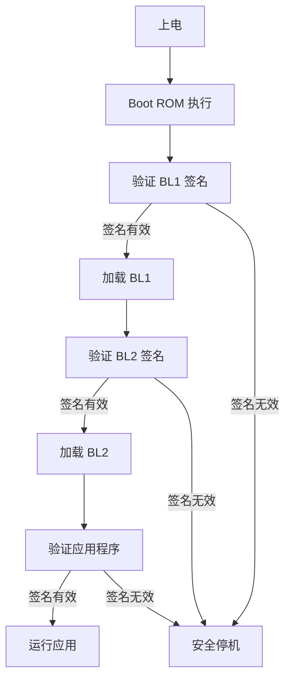

# 安全需求模板参考

## 安全架构要素

### Root of Trust 定义

| RoT 类型 | 描述 | 适用场景 |
|----------|------|----------|
| Hardware RoT | 硬件信任根 | 高安全等级 |
| Firmware RoT | 固件信任根 | 中等安全等级 |
| Software RoT | 软件信任根 | 低安全等级 |

### Secure Boot 流程



### 安全机制清单

| Mechanism | 描述 | 威胁覆盖 |
|-----------|------|----------|
| Secure Boot | 启动验证 | 固件篡改 |
| Hardware Key | 硬件密钥存储 | 密钥泄露 |
| Key Manager | 密钥生命周期管理 | 密钥滥用 |
| Crypto Engine | 加密引擎 | 数据泄露 |
| Secure Debug | 安全调试接口 | 调试攻击 |
| Lifecycle State | 生命周期管理 | 供应链攻击 |

## Side-channel 防护

### 攻击类型

| Attack Type | 描述 |
|-------------|------|
| DPA (Differential Power Analysis) | 差分功耗分析 |
| CPA (Correlation Power Analysis) | 相关功耗分析 |
| Timing Attack | 时序攻击 |
| EM Analysis | 电磁分析 |
| Cache Attack | 缓存攻击 |

### 防护等级

| Level | 描述 | 适用场景 |
|-------|------|----------|
| Basic | 基础防护 | 消费级 |
| Enhanced | 增强防护 | 商业级 |
| High | 高级防护 | 政府/金融 |
| Maximum | 最高防护 | 国防级 |

### 防护措施

| Measure | 覆盖攻击 | 实现方式 |
|---------|----------|----------|
| Randomization | DPA/CPA | 操作随机化 |
| Masking | DPA/CPA | 数据掩蔽 |
| Constant-time | Timing | 时间恒定操作 |
| Noise injection | EM | 噪声注入 |
| Cache partition | Cache | 缓存分区 |

## 供应链安全

### Threat Model

| Threat | 描述 | Mitigation |
|--------|------|------------|
| Counterfeit | 伪冒芯片 | 供应链认证 |
| Trojan | 硬件木马 | 设计审计 |
| IP theft | IP 窃取 | 加密存储 |
| Unauthorized fab | 未授权制造 | 授权管控 |

### Lifecycle States

| State | 描述 | 安全策略 |
|-------|------|----------|
| Test | 测试模式 | 完全调试访问 |
| Development | 开发模式 | 受限调试访问 |
| Production | 生产模式 | 无调试访问 |
| Field Return | 返厂模式 | 受限诊断 |
| End-of-Life | 生命周期结束 | 数据清除 |

## PRD 中安全章节模板

```markdown
## 12. Security

| REQ ID | Statement |
|---|---|
| REQ-SEC-001 | Root-of-Trust location: {{ management chiplet / boot die }} |
| REQ-SEC-002 | Secure boot: signed firmware with hardware key |
| REQ-SEC-003 | Side-channel resistance: {{ DPA / timing / EM level }} |
| REQ-SEC-004 | Supply-chain threat model documented → DOC-D7-01-SEC |
| REQ-SEC-005 | Crypto IP support: {{ AES-256, SHA-256, RNG }} |
| REQ-SEC-006 | Lifecycle management: {{ Test/Dev/Prod states }} |
```

## 安全认证参考

| Certification | 描述 | 适用领域 |
|---------------|------|----------|
| FIPS 140-2 | 加密模块标准 | 政府/金融 |
| Common Criteria | 安全评估标准 | 政府/国防 |
| ISO/SAE 21434 | 汽车网络安全 | 汽车 |
| NIST SP 800-193 | 平台固件安全 | 通用 |