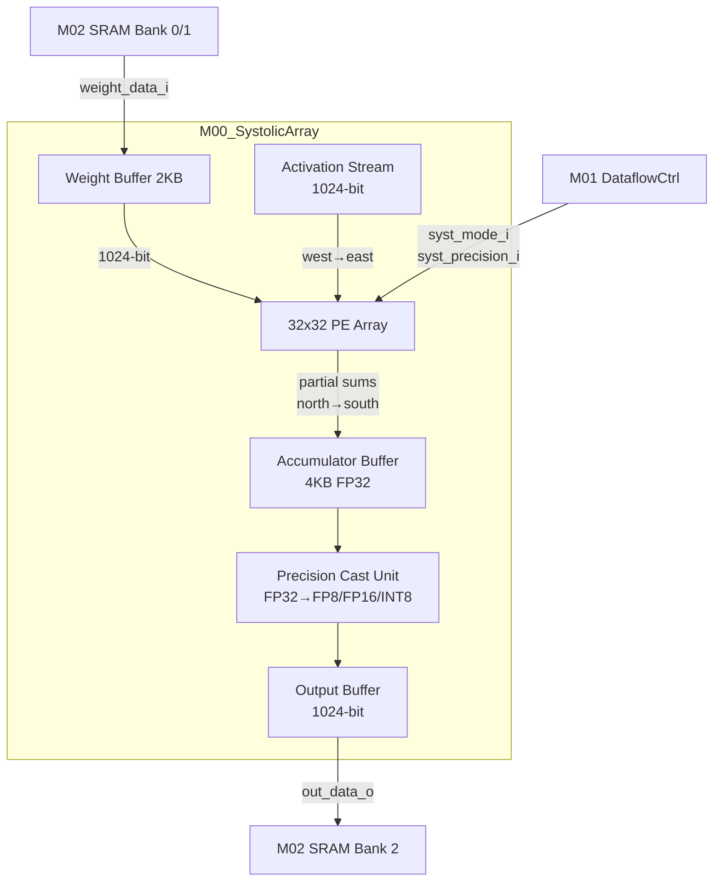

# M00_SystolicArray Datapath

## Block Diagram



## Pipeline Structure

| Stage | Operation | Latency | Description |
|-------|-----------|---------|-------------|
| S0 | Act Register | 1 cycle | Register activation input from west neighbor |
| S1 | Multiply | 1 cycle | act * weight (FP8/FP16/INT8 multiply) |
| S2 | Accumulate | 1 cycle | mul_result + partial_sum_north (FP32 accumulate) |
| S3 | Output Register | 1 cycle | Register output for south neighbor |

## PE Micro-architecture

```
Processing Element (PE[i][j]):
  ┌─────────────────────────────────────┐
  │  act_in (west) ──► [REG] ──┐        │
  │                             │        │
  │  weight (local) ────────────┼──► [MUL] ──► [ADD] ──► [REG] ──► sum_out (south)
  │                             │              ▲                    │
  │  sum_in (north) ────────────┘              │                    │
  │                                            │                    │
  │  act_out (east) = act_in (registered) ─────┘                    │
  └─────────────────────────────────────────────────────┘

  Precision modes:
    FP8 E4M3: 8-bit mul, 32-bit acc
    FP16:     16-bit mul, 32-bit acc
    INT8:     8-bit mul, 32-bit acc
```

## Critical Path

```
Worst-case path (FP16 mode):
  PE[0][0]: act_reg → MUL(FP16, 1.2ns) → ADD(FP32, 0.8ns) → out_reg → PE[1][0]
  Total: 2.0 ns (meets 500 MHz requirement)

FP8 path is faster (~1.0 ns); INT8 similar to FP8.
```

## Data Flow Timing

```
Weight Stationary Mode:
  Phase 1 (Weight Load): 32 cycles
    - 32 rows of weights loaded from SRAM (1024-bit/cycle)
    - Each row: 32 x 32-bit = 1024-bit

  Phase 2 (Pipeline Fill): 32 cycles
    - First activation enters PE[0][0]
    - Propagates east through 32 columns

  Phase 3 (Steady State): M cycles
    - One activation per cycle enters PE[0][0]
    - One partial sum per cycle exits PE[31][0..31]

  Phase 4 (Pipeline Drain): 32 cycles
    - Last activation propagates through array
    - Final partial sums accumulated

  Total for N x M matmul: 32 + 32 + max(N,M) + 32 cycles
  Example: 32x32 tile = 32 + 32 + 32 + 32 = 128 cycles
```