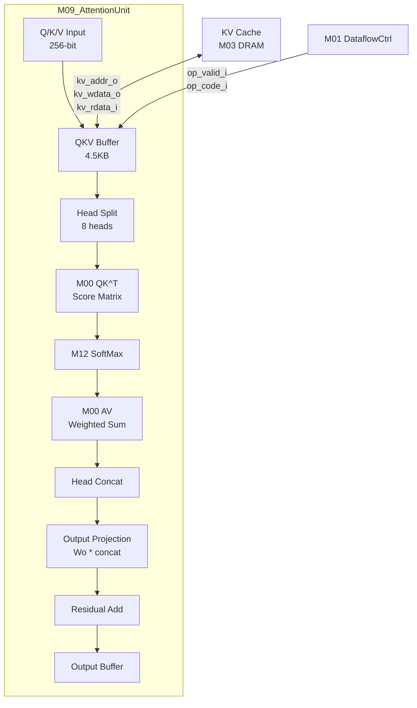

# M09_AttentionUnit Datapath

## Block Diagram



## Data Flow for Attention

```
Multi-Head Attention (8 heads, d_k = 72):

Input: Q, K, V each 576-dim (FP16)
  Step 1: Head Split
    Q → [Q0, Q1, ..., Q7]  each 72-dim
    K → [K0, K1, ..., K7]  each 72-dim
    V → [V0, V1, ..., V7]  each 72-dim

  Step 2: Score Computation (per head, via M00)
    Score_i = Q_i * K_i^T / sqrt(d_k)
    For decode: Q_i (1x72), K_i^T (72 x seq_len) → Score (1 x seq_len)

  Step 3: SoftMax (per head, via M12)
    Attention_i = softmax(Score_i)  (1 x seq_len)

  Step 4: Weighted Sum (per head, via M00)
    Output_i = Attention_i * V_i  (1 x 72)

  Step 5: Head Concat
    Output = concat([Output_0, ..., Output_7])  (1 x 576)

  Step 6: Output Projection (via M00)
    Final = Wo * Output  (1 x 576), Wo: 576x576

  Step 7: Residual Add
    Final = Final + Input (residual connection)
```

## KV Cache Access

```
KV Cache Write (after each decode step):
  K_new (1 x 576) → M03 DMA → DRAM KV cache region
  V_new (1 x 576) → M03 DMA → DRAM KV cache region

KV Cache Read (before attention):
  K_cache[0..seq_len-1] (seq_len x 576) ← M03 DMA ← DRAM → M02 SRAM Bank 3
  V_cache[0..seq_len-1] (seq_len x 576) ← M03 DMA ← DRAM → M02 SRAM Bank 3

Per-layer KV cache size: 2 x seq_len x 576 x 2 bytes (FP16)
  For seq_len=2048: ~4.5 MB per layer
  For 8 layers: ~36 MB total
```