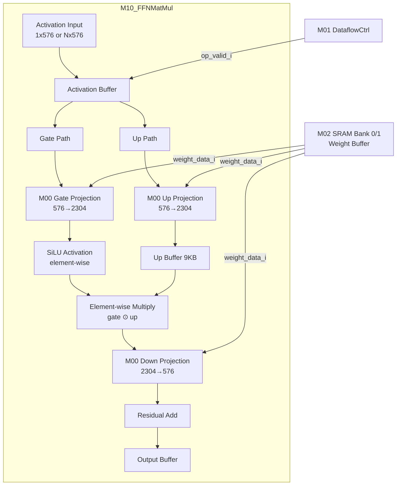

# M10_FFNMatMul Datapath

## Block Diagram



## FFN Data Flow

```
FFN(x) = Down(SiLU(Gate(x)) ⊙ Up(x)) + x

Step 1: Gate Projection (via M00)
  Input: x (1 x 576 or N x 576)
  Weight: W_gate (576 x 2304)
  Output: gate = x * W_gate (1 x 2304)
  Latency: ~1296 cycles (576*2304/1024)

Step 2: Up Projection (via M00, parallel with Gate)
  Input: x (1 x 576)
  Weight: W_up (576 x 2304)
  Output: up = x * W_up (1 x 2304)
  Latency: ~1296 cycles (parallel with gate)

Step 3: SiLU Activation (element-wise)
  SiLU(y) = y * sigmoid(y)
  For each of 2304 elements:
    sigmoid(y) ≈ LUT-based approximation (16-segment piecewise)
  Latency: 2304/8 = 288 cycles

Step 4: Element-wise Multiply
  gated = SiLU(gate) ⊙ up  (1 x 2304)
  Latency: 288 cycles

Step 5: Down Projection (via M00)
  Input: gated (1 x 2304)
  Weight: W_down (2304 x 576)
  Output: down = gated * W_down (1 x 576)
  Latency: ~1296 cycles

Step 6: Residual Add
  output = down + x (residual connection)
  Latency: 72 cycles (576/8 elements)

Total FFN latency (decode): 1296 + 288 + 288 + 1296 + 72 = 3240 cycles
  @ 500 MHz: 6.48 us
```

## SiLU Implementation

```
SiLU(x) = x * sigmoid(x) = x / (1 + exp(-x))

Hardware implementation: LUT-based piecewise approximation

  Range      | sigmoid(x) approx
  -----------|------------------
  x < -6.0   | 0.0
  -6.0..-2.0 | 16-segment LUT
  -2.0..2.0  | 0.5 + x/4 (linear approximation)
  2.0..6.0   | 16-segment LUT
  x > 6.0    | 1.0

  Pipeline: 2 stages
    Stage 0: Range detection + LUT address
    Stage 1: LUT read + multiply (x * sigmoid)
```