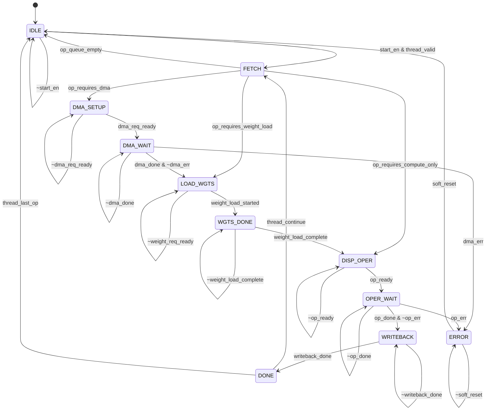

# M01_DataflowController FSM

## State List

| State | Encoding | Description |
|-------|----------|-------------|
| IDLE | 4'b0000 | Waiting for thread dispatch from M08 |
| FETCH | 4'b0001 | Fetching operation descriptor from command queue |
| DMA_SETUP | 4'b0010 | Configuring M03 DMA engine for data transfer |
| DMA_WAIT | 4'b0011 | Waiting for DMA completion |
| LOAD_WGTS | 4'b0100 | Initiating weight load from SRAM to M00 |
| WGTS_DONE | 4'b0101 | Weight load complete; ready for compute |
| DISP_OPER | 4'b0110 | Dispatching operator command to M09/M10/M11/M12 |
| OPER_WAIT | 4'b0111 | Waiting for operator completion |
| WRITEBACK | 4'b1000 | Writing results back to SRAM/DRAM |
| DONE | 4'b1001 | Layer operation complete; signal thread completion |
| ERROR | 4'b1111 | Error state; signal error to M08 |

## State Transition Table

| Current State | Transition Condition | Next State |
|--------------|---------------------|------------|
| IDLE | start_en & thread_valid | FETCH |
| IDLE | ~start_en | IDLE |
| FETCH | op_queue_empty | IDLE |
| FETCH | op_requires_dma | DMA_SETUP |
| FETCH | op_requires_weight_load | LOAD_WGTS |
| FETCH | op_requires_compute_only | DISP_OPER |
| DMA_SETUP | dma_req_ready | DMA_WAIT |
| DMA_SETUP | ~dma_req_ready | DMA_SETUP |
| DMA_WAIT | dma_done & ~dma_err | LOAD_WGTS |
| DMA_WAIT | dma_err | ERROR |
| DMA_WAIT | ~dma_done | DMA_WAIT |
| LOAD_WGTS | weight_load_started | WGTS_DONE |
| LOAD_WGTS | ~weight_req_ready | LOAD_WGTS |
| WGTS_DONE | weight_load_complete | DISP_OPER |
| WGTS_DONE | ~weight_load_complete | WGTS_DONE |
| DISP_OPER | op_ready | OPER_WAIT |
| DISP_OPER | ~op_ready | DISP_OPER |
| OPER_WAIT | op_done & ~op_err | WRITEBACK |
| OPER_WAIT | op_err | ERROR |
| OPER_WAIT | ~op_done | OPER_WAIT |
| WRITEBACK | writeback_done | DONE |
| WRITEBACK | ~writeback_done | WRITEBACK |
| DONE | thread_continue | FETCH |
| DONE | thread_last_op | IDLE |
| ERROR | soft_reset | IDLE |
| ERROR | ~soft_reset | ERROR |

## Mermaid State Diagram

## Outputs per State

| State | syst_mode_o | op_valid_o | mem_req_valid_o | sched_yield_o | irq_op_done_o |
|-------|------------|------------|-----------------|---------------|---------------|
| IDLE | IDLE | 0 | 0 | 0 | 0 |
| FETCH | IDLE | 0 | 0 | 0 | 0 |
| DMA_SETUP | IDLE | 0 | 1 | 0 | 0 |
| DMA_WAIT | IDLE | 0 | 0 | 0 | 0 |
| LOAD_WGTS | WEIGHT_LOAD | 0 | 0 | 0 | 0 |
| WGTS_DONE | IDLE | 0 | 0 | 0 | 0 |
| DISP_OPER | IDLE | 1 | 0 | 0 | 0 |
| OPER_WAIT | COMPUTE | 0 | 0 | 0 | 0 |
| WRITEBACK | IDLE | 0 | 1 | 0 | 0 |
| DONE | IDLE | 0 | 0 | 0 | 1 |
| ERROR | IDLE | 0 | 0 | 0 | 0 (irq_err=1) |