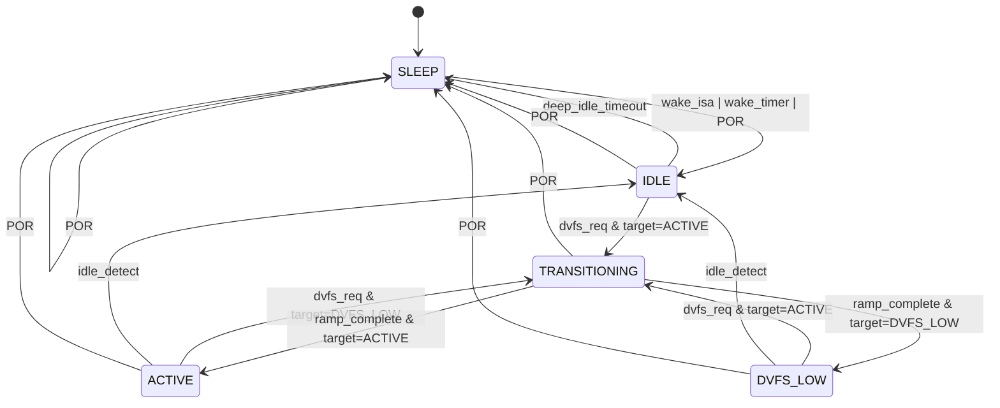

# M05_PowerManager FSM

## State List

| State | Encoding | Description | Power | clk_sys | VDD_MAIN |
|-------|----------|-------------|-------|---------|----------|
| SLEEP | 3'b000 | Deep sleep; only clk_aon active | <=5 mW | Off | Power-gated |
| IDLE | 3'b001 | Clock-gated; ready for fast wake | <=0.1 W | Gated | 0.7V |
| DVFS_LOW | 3'b010 | Low performance mode | ~0.8 W | 250 MHz | 0.7V |
| ACTIVE | 3'b011 | Full performance mode | <=1.8 W | 500 MHz | 0.9V |
| TRANSITIONING | 3'b100 | DVFS ramp in progress | Varies | Ramping | Ramping |

## State Transition Table

| Current State | Transition Condition | Next State |
|--------------|---------------------|------------|
| SLEEP | wake_isa \| wake_timer \| POR | IDLE |
| IDLE | dvfs_req & target=ACTIVE | TRANSITIONING |
| IDLE | deep_idle_timeout | SLEEP |
| DVFS_LOW | dvfs_req & target=ACTIVE | TRANSITIONING |
| DVFS_LOW | idle_detect (no threads >1ms) | IDLE |
| ACTIVE | dvfs_req & target=DVFS_LOW | TRANSITIONING |
| ACTIVE | idle_detect (no threads >1ms) | IDLE |
| TRANSITIONING | ramp_complete & target=ACTIVE | ACTIVE |
| TRANSITIONING | ramp_complete & target=DVFS_LOW | DVFS_LOW |
| Any state | POR | SLEEP |

## DVFS Transition Sequence

```
TRANSITIONING state internal sequence:
  1. Halt clock (clk_gating_en=1)
  2. Ramp VDD_MAIN voltage (dvfs_op=RAMP_UP/DOWN)
  3. Wait for voltage stable (external VRM signal)
  4. Reconfigure PLL frequency (dvfs_req → M06)
  5. Wait for PLL lock (dvfs_ack from M06)
  6. Release clock gating
  7. ramp_complete → exit TRANSITIONING
```

## Mermaid State Diagram



## Power Domain Control per State

| State | pg_main_en_o | pg_dram_en_o | pg_io_en_o | vdd_main_set |
|-------|-------------|-------------|-----------|-------------|
| SLEEP | 0 | 0 | 0 | 0.0V |
| IDLE | 1 | 1 (self-refresh) | 1 | 0.7V |
| DVFS_LOW | 1 | 1 | 1 | 0.7V |
| ACTIVE | 1 | 1 | 1 | 0.9V |
| TRANSITIONING | 1 | 1 | 1 | Ramping |