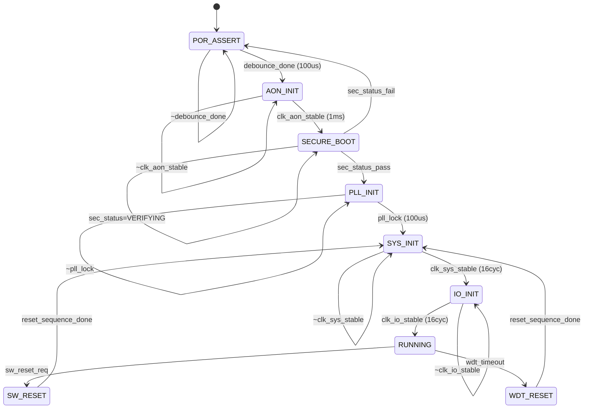

# M07_ResetManager FSM

## State List

| State | Encoding | Description | Duration |
|-------|----------|-------------|----------|
| POR_ASSERT | 4'b0000 | POR pin asserted; all resets held | 100 us |
| AON_INIT | 4'b0001 | Always-on domain initialization | 1 ms |
| SECURE_BOOT | 4'b0010 | Secure boot verification (M14) | Variable |
| PLL_INIT | 4'b0011 | PLL power-up and lock wait | 100 us |
| SYS_INIT | 4'b0100 | System domain reset assertion | 16 cycles |
| IO_INIT | 4'b0101 | I/O domain reset assertion | 16 cycles |
| RUNNING | 4'b0110 | Normal operation | — |
| WDT_RESET | 4'b1000 | Watchdog timeout reset | 16 cycles |
| SW_RESET | 4'b1001 | Software-triggered reset | 16 cycles |

## State Transition Table

| Current State | Transition Condition | Next State |
|--------------|---------------------|------------|
| POR_ASSERT | debounce_done (100us) | AON_INIT |
| AON_INIT | clk_aon_stable (1ms) | SECURE_BOOT |
| SECURE_BOOT | sec_status_pass | PLL_INIT |
| SECURE_BOOT | sec_status_fail | POR_ASSERT (lockdown) |
| PLL_INIT | pll_lock (100us) | SYS_INIT |
| SYS_INIT | clk_sys_stable (16 cycles) | IO_INIT |
| IO_INIT | clk_io_stable (16 cycles) | RUNNING |
| RUNNING | wdt_timeout | WDT_RESET |
| RUNNING | sw_reset_req | SW_RESET |
| WDT_RESET | reset_sequence_done | SYS_INIT |
| SW_RESET | reset_sequence_done | SYS_INIT |
| Any state | rst_por_n=0 | POR_ASSERT |

## Reset Output Signals per State

| State | rst_por_n | rst_aon_n_o | rst_sys_n_o | rst_io_n_o |
|-------|-----------|-------------|-------------|------------|
| POR_ASSERT | 0 | 0 | 0 | 0 |
| AON_INIT | 1 | 0 | 0 | 0 |
| SECURE_BOOT | 1 | 1 | 0 | 0 |
| PLL_INIT | 1 | 1 | 0 | 0 |
| SYS_INIT | 1 | 1 | 0 | 0 |
| IO_INIT | 1 | 1 | 1 | 0 |
| RUNNING | 1 | 1 | 1 | 1 |
| WDT_RESET | 1 | 1 | 0 | 0 |
| SW_RESET | 1 | 1 | 0 | 0 |

## Mermaid State Diagram

## Watchdog Timer

- **Timeout**: 256 ms (programmable via CSR)
- **Kick**: Write 0xACCE55 to M08 CSR offset 0x1C
- **Timeout Action**: Assert wdt_timeout, transition to WDT_RESET state
- **Status**: wdt_reset source captured in reset_source_o register