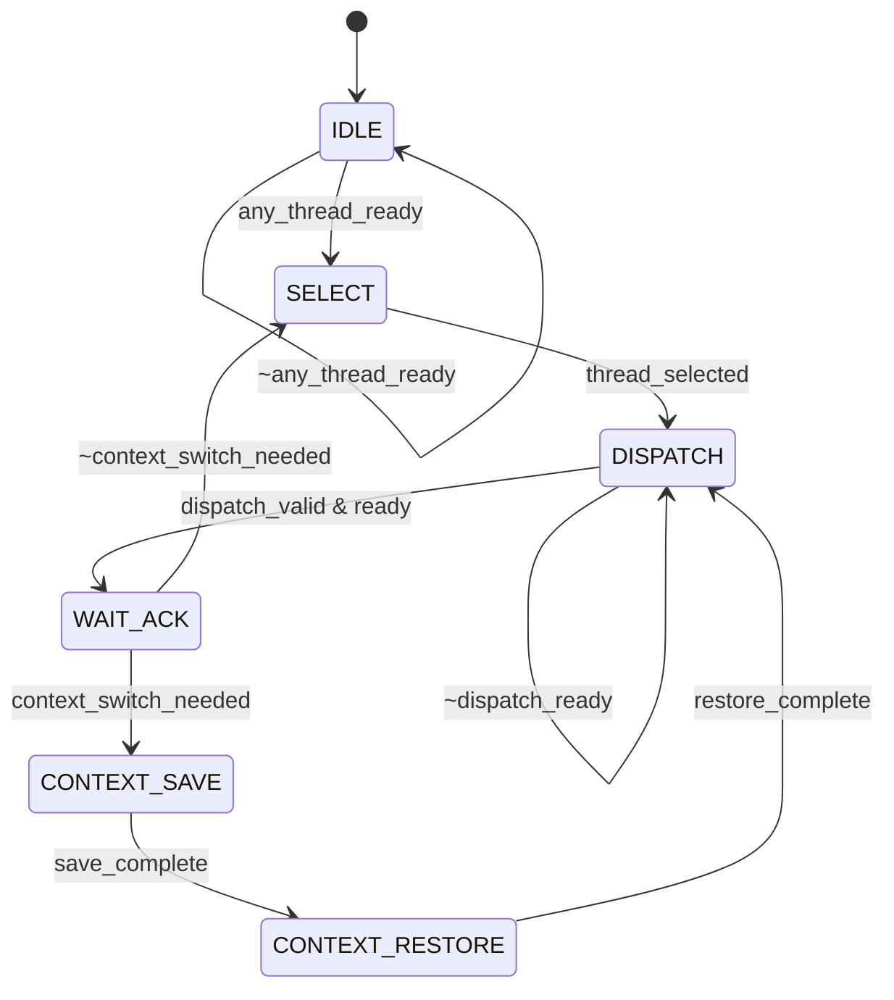

# M08_ThreadScheduler FSM

## Per-Thread State Machine

Each of the 4 threads has an independent FSM:

### Thread State List

| State | Encoding | Description |
|-------|----------|-------------|
| BLOCKED | 2'b00 | Waiting for resource (M00, SRAM bank, operator) |
| READY | 2'b01 | Ready to run; waiting for scheduler dispatch |
| RUNNING | 2'b10 | Actively executing on M01 DataflowController |
| DONE | 2'b11 | Thread complete; waiting for cleanup |

### Thread State Transition Table

| Current State | Transition Condition | Next State |
|--------------|---------------------|------------|
| BLOCKED | resource_available | READY |
| BLOCKED | thread_kill | DONE |
| READY | scheduler_selects | RUNNING |
| READY | thread_kill | DONE |
| RUNNING | m01_yield | BLOCKED |
| RUNNING | op_done & more_ops | READY |
| RUNNING | op_done & last_op | DONE |
| RUNNING | error | BLOCKED (error logged) |
| DONE | thread_cleanup | BLOCKED (recycled) |

## Scheduler State Machine

### Scheduler State List

| State | Encoding | Description |
|-------|----------|-------------|
| IDLE | 3'b000 | No active threads |
| SELECT | 3'b001 | Selecting next thread to dispatch |
| DISPATCH | 3'b010 | Issuing dispatch command to M01 |
| WAIT_ACK | 3'b011 | Waiting for M01 dispatch_ready |
| CONTEXT_SAVE | 3'b100 | Saving current thread context |
| CONTEXT_RESTORE | 3'b101 | Restoring next thread context |

### Scheduler State Transition Table

| Current State | Transition Condition | Next State |
|--------------|---------------------|------------|
| IDLE | any_thread_ready | SELECT |
| IDLE | ~any_thread_ready | IDLE |
| SELECT | thread_selected | DISPATCH |
| DISPATCH | dispatch_valid & dispatch_ready | WAIT_ACK |
| DISPATCH | ~dispatch_ready | DISPATCH |
| WAIT_ACK | context_switch_needed | CONTEXT_SAVE |
| WAIT_ACK | ~context_switch_needed | SELECT |
| CONTEXT_SAVE | save_complete | CONTEXT_RESTORE |
| CONTEXT_RESTORE | restore_complete | DISPATCH |

## Mermaid State Diagram (Scheduler)



## Scheduling Algorithm

```
Priority-based round-robin with aging:

1. For each scheduling tick (every 4 cycles):
   a. Scan all threads in READY state
   b. Select highest priority among READY threads
   c. If multiple at same priority, use round-robin pointer
   d. Age counter: increment every 1024 cycles
   e. If age >= 4096, promote to next priority level

2. Resource arbitration:
   - M00 SystolicArray: exclusive lock (one thread at a time)
   - M02 SRAM banks: bank-level locking
   - M03 DRAM: shared, priority-based
   - M09/M10/M11/M12: exclusive lock per operator

3. Context switch:
   - Save: 16 registers x 32-bit = 64 bytes
   - Restore: 16 registers x 32-bit = 64 bytes
   - Latency: 16 cycles save + 16 cycles restore = 32 cycles
   - Context stored in M02 SRAM Bank 3 (upper 64 KB)
```