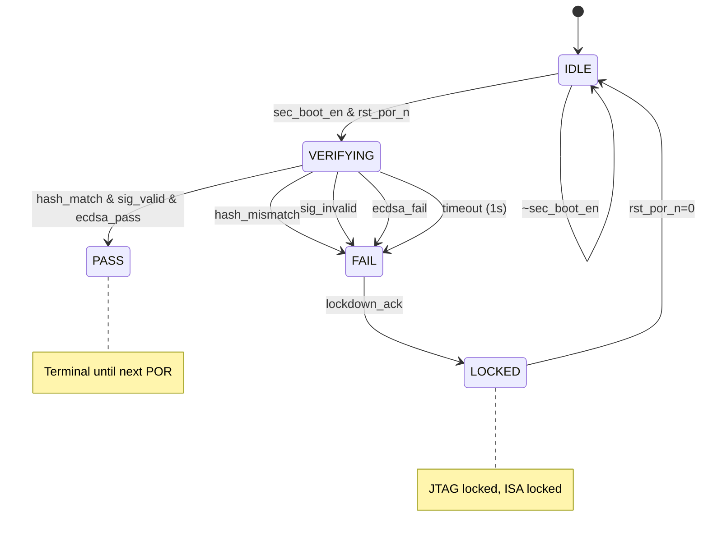

# M14_SecureBoot FSM

## State List

| State | Encoding | Description |
|-------|----------|-------------|
| IDLE | 3'b000 | Waiting for boot trigger |
| VERIFYING | 3'b001 | SHA-256 hash + ECDSA signature verification in progress |
| PASS | 3'b010 | Verification successful; release boot |
| FAIL | 3'b011 | Verification failed; enter lockdown |
| LOCKED | 3'b100 | Lockdown mode; JTAG and ISA blocked |

## State Transition Table

| Current State | Transition Condition | Next State |
|--------------|---------------------|------------|
| IDLE | sec_boot_en & rst_por_n | VERIFYING |
| IDLE | ~sec_boot_en | IDLE (bypass) |
| VERIFYING | hash_match & sig_valid & ecdsa_pass | PASS |
| VERIFYING | hash_mismatch | FAIL |
| VERIFYING | sig_invalid | FAIL |
| VERIFYING | ecdsa_fail | FAIL |
| VERIFYING | timeout (1s) | FAIL |
| PASS | — | (terminal until next POR) |
| FAIL | — | LOCKED |
| LOCKED | rst_por_n=0 | IDLE |

## Mermaid State Diagram



## Verification Sequence

```
VERIFYING state internal sequence:

  Step 1: Read firmware header from DRAM (0x0000_0000)
    - fw_addr = 0x0000_0000
    - fw_size from header
    - Verify magic number (0xBABE1F1C)

  Step 2: Compute SHA-256 hash of firmware image
    - Read fw_size bytes from DRAM
    - SHA-256 streaming hash (64-byte blocks)
    - Result: 256-bit hash

  Step 3: Read OTP public key
    - otp_read_req = 1
    - Wait for otp_key_valid
    - 256-bit ECDSA P-256 public key

  Step 4: ECDSA P-256 signature verification
    - Input: hash (256-bit), signature (r, s), public key
    - Compute: u1 = hash * s^-1 mod n
    - Compute: u2 = r * s^-1 mod n
    - Compute: u1*G + u2*Q = (x, y)
    - Verify: x mod n == r

  Step 5: Set sec_status
    - PASS → sec_status = 2
    - FAIL → sec_status = 3
```

## Outputs per State

| State | sec_status_o | fw_data_req_o | otp_read_req_o | jtag_locked | isa_locked |
|-------|-------------|---------------|----------------|-------------|------------|
| IDLE | 0 (IDLE) | 0 | 0 | 0 | 0 |
| VERIFYING | 1 (VERIFYING) | 1 | 1 | 0 | 0 |
| PASS | 2 (PASS) | 0 | 0 | 0 | 0 |
| FAIL | 3 (FAIL) | 0 | 0 | 0 | 0 |
| LOCKED | 4 (LOCKED) | 0 | 0 | 1 | 1 |