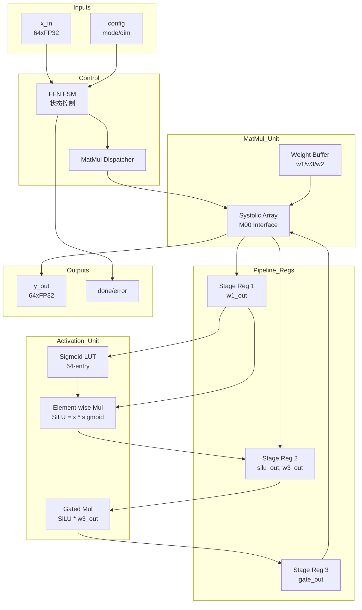

# M10 FFN/MatMul Unit 微架构规范

## 1. 模块概述

### 1.1 功能描述

M10 FFN/MatMul Unit 负责 Transformer FFN 层计算和通用矩阵乘法操作：
- **FFN Pipeline**: Feed-Forward Network 完整流水线（SwiGLU 激活函数）
- **MatMul Dispatch**: 矩阵乘法指令分发到 Systolic Array (M00)
- **Activation Functions**: ReLU/GELU/SwiGLU 激活函数硬件实现

### 1.2 模块类型
- 类型: `compute` (运算单元)
- 层级: `L2` (算子层模块)
- 子系统: Transformer Operators (M09-M12)

### 1.3 设计约束
- 面积预算: `<= 0.5 mm²` (不含 Systolic Array)
- 功耗预算: `<= 50 mW` (不含 Systolic Array)
- 时钟频率: `250-500 MHz` (CLK_SYS)
- 关键路径延迟: `<= 2 ns` (activation 函数)

---

## 2. 接口定义

### 2.1 信号列表

| 信号名 | 方向 | 位宽 | 类型 | 描述 |
|--------|------|------|------|------|
| `clk` | input | 1 | 时钟 | CLK_SYS 主时钟 |
| `rst_n` | input | 1 | 控制 | 异步复位，低有效 |
| `enable` | input | 1 | 控制 | 模块使能 |
| `mode` | input | 2 | 控制 | 操作模式选择 |
| `start` | input | 1 | 控制 | 操作启动信号 |
| `busy` | output | 1 | 状态 | 操作进行中标志 |
| `done` | output | 1 | 状态 | 操作完成信号 |
| `error` | output | 1 | 状态 | 错误标志 |

#### 数据接口

| 信号名 | 方向 | 位宽 | 类型 | 描述 |
|--------|------|------|------|------|
| `x_in` | input | 256 | 数据 | 输入向量 (64 x FP32) |
| `x_valid` | input | 1 | 控制 | 输入数据有效 |
| `x_ready` | output | 1 | 控制 | 输入就绪 |
| `y_out` | output | 256 | 数据 | 输出向量 (64 x FP32) |
| `y_valid` | output | 1 | 控制 | 输出数据有效 |
| `y_ready` | input | 1 | 控制 | 输出就绪 |

#### Systolic Array 接口 (M00)

| 信号名 | 方向 | 位宽 | 类型 | 描述 |
|--------|------|------|------|------|
| `sa_cmd` | output | 4 | 控制 | Systolic Array 命令 |
| `sa_dim` | output | 16 | 配置 | MatMul 维度参数 |
| `sa_w_base` | output | 32 | 地址 | 权重矩阵基地址 |
| `sa_w_row` | output | 8 | 地址 | 权重行索引 |
| `sa_result` | input | 256 | 数据 | MatMul 结果向量 |
| `sa_done` | input | 1 | 控制 | Systolic Array 完成 |

#### 系统总线接口 (M04)

| 信号名 | 方向 | 位宽 | 类型 | 描述 |
|--------|------|------|------|------|
| `bus_addr` | output | 32 | 地址 | 读写地址 |
| `bus_wdata` | output | 256 | 数据 | 写数据 |
| `bus_rdata` | input | 256 | 数据 | 读数据 |
| `bus_valid` | output | 1 | 控制 | 总线请求有效 |
| `bus_ready` | input | 1 | 控制 | 总线就绪 |

### 2.2 接口协议

#### 2.2.1 Systolic Array 接口

- 协议类型: `握手协议`
- 数据宽度: `256-bit` (64 x FP32)
- 命令类型:
  - `CMD_MMUL` (0x1): 矩阵向量乘
  - `CMD_MLOAD` (0x2): 预加载权重行
  - `CMD_MSET` (0x3): 设置维度

**时序图 (WaveDrom)**:
```wavedrom
{signal: [
  {name: 'clk', wave: 'p...........'},
  {name: 'start', wave: '0.1..0......'},
  {name: 'sa_cmd', wave: 'x.=.x.......'},
  {name: 'sa_dim', wave: 'x.=.x.......'},
  {name: 'sa_w_base', wave: 'x.=.x.......'},
  {name: 'sa_done', wave: '0.....1.0...'},
  {name: 'sa_result', wave: 'x.....=.x..'},
  {name: 'done', wave: '0......1.0..'}
]}
```

#### 2.2.2 激活函数接口

- 内部流水线接口
- 输入: 256-bit (64 x FP32 或 1024-bit 256 x FP32)
- 输出: 同位宽
- 延迟: 4 cycles (sigmoid/GELU)

### 2.3 操作模式定义

| mode | 描述 |
|------|------|
| `0x0` | MatMul Only - 仅矩阵乘法 |
| `0x1` | FFN Complete - 完整 FFN 流水线 (w1, w3, SwiGLU, w2) |
| `0x2` | Activation Only - 仅激活函数 |
| `0x3` | Reserved |

---

## 3. 数据通路

### 3.1 模块框图



### 3.2 流水线结构

FFN Complete 模式流水线:

| 级别 | 操作 | 延迟 (cycles) | 寄存器 |
|------|------|---------------|--------|
| Stage 1 | MatMul(w1) + MatMul(w3) 并行 | 256 (hidden_dim) | `w1_out[256]`, `w3_out[256]` |
| Stage 2 | Sigmoid(w1_out) lookup | 4 | `sigmoid_out[256]` |
| Stage 3 | SiLU = w1_out * sigmoid_out | 2 | `silu_out[256]` |
| Stage 4 | Gate = silu_out * w3_out | 2 | `gate_out[256]` |
| Stage 5 | MatMul(w2, gate_out) | 64 (dim) | `y_out[64]` |

**总延迟**: `256 + 4 + 2 + 2 + 64 = 328 cycles` (FFN Complete 模式)

### 3.3 MatMul 调度策略

FFN 中三个 MatMul 调用:

```
w1 (dim x hidden):   64 x 256 = 16,384 FLOPs
w3 (dim x hidden):   64 x 256 = 16,384 FLOPs  (并行于 w1)
w2 (hidden x dim):   256 x 64 = 16,384 FLOPs
```

调度顺序:
1. **并行阶段**: w1 和 w3 同时发送到 Systolic Array
2. **激活阶段**: 等待 w1, w3 完成，计算 SwiGLU
3. **下行阶段**: w2 MatMul

### 3.4 关键路径分析
- 最大延迟路径: `MatMul(w1/w3) → Sigmoid → SiLU → Gate → MatMul(w2)`
- 延迟值: `328 cycles` (FFN Complete 模式)
- 优化建议:
  - w1/w3 并行计算 (已实现)
  - Sigmoid LUT pipelined (4 cycles)
  - SiLU 和 Gate 合并为 1 cycle (future)

---

## 4. 状态机设计

### 4.1 主要状态机

**FSM 名称**: `FFN_FSM`

| 状态 | 编码 | 描述 |
|------|------|------|
| `IDLE` | `0x0` | 空闲状态，等待 start |
| `MATMUL_W1W3` | `0x1` | 执行 w1/w3 MatMul (并行) |
| `WAIT_SA1` | `0x2` | 等待 Systolic Array 完成 w1/w3 |
| `ACTIVATION` | `0x3` | 计算 SwiGLU (sigmoid, SiLU, gate) |
| `MATMUL_W2` | `0x4` | 执行 w2 MatMul |
| `WAIT_SA2` | `0x5` | 等待 Systolic Array 完成 w2 |
| `OUTPUT` | `0x6` | 输出结果 |
| `ERROR` | `0x7` | 错误状态 |

**状态转移表**:

| 当前状态 | 条件 | 目标状态 | 输出变化 |
|----------|------|----------|----------|
| `IDLE` | `start == 1 && mode == 0x1` | `MATMUL_W1W3` | `busy = 1`, `sa_cmd = CMD_MMUL` |
| `IDLE` | `start == 1 && mode == 0x0` | `MATMUL_W1W3` | `busy = 1` (仅 MatMul) |
| `IDLE` | `start == 1 && mode == 0x2` | `ACTIVATION` | `busy = 1` (仅激活) |
| `MATMUL_W1W3` | `sa_done == 1` | `WAIT_SA1` | - |
| `WAIT_SA1` | `sa_done == 1 && mode == 0x1` | `ACTIVATION` | - |
| `WAIT_SA1` | `sa_done == 1 && mode == 0x0` | `OUTPUT` | - |
| `ACTIVATION` | `activation_done == 1` | `MATMUL_W2` | `sa_cmd = CMD_MMUL` |
| `MATMUL_W2` | `cmd_sent == 1` | `WAIT_SA2` | - |
| `WAIT_SA2` | `sa_done == 1` | `OUTPUT` | - |
| `OUTPUT` | `y_ready == 1` | `IDLE` | `busy = 0`, `done = 1` |
| `any` | `error_cond == 1` | `ERROR` | `error = 1` |

详见 [FSM.md](./FSM.md) 完整状态机设计。

---

## 5. 时序规格

### 5.1 时钟域
- 主时钟域: `CLK_SYS`
- 时钟频率: `250-500 MHz` (DVFS 支持)
- 时钟门控: 支持空闲时 clock gating

### 5.2 CDC（跨时钟域）处理

| 源域 | 目标域 | 同步方式 | 信号列表 |
|------|------|----------|----------|
| `CLK_SYS` | `CLK_SYS` | 无需同步 | 所有内部信号 |
| `CLK_SYS` | `CLK_IO` | 2-stage synchronizer | `done`, `error` (输出到外部) |

### 5.3 时序约束

| 参数 | 数值 | 单位 |
|------|------|------|
| MatMul 启动延迟 | 1 | cycle |
| MatMul 执行延迟 | `s_dim` | cycles |
| Activation 延迟 | 8 | cycles |
| FFN Complete 延迟 | 328 | cycles |
| MatMul Only 延迟 | `s_dim + 2` | cycles |
| 总吞吐 | 1 FFN/328 cycles | ops/cycle |

### 5.4 指令延迟映射

| ISA 指令 | 硬件延迟 | 说明 |
|----------|----------|------|
| `MMUL` | `s_dim` cycles | MatMul 核心指令 |
| `VSIGMOID` | 4 cycles | Sigmoid 查表 |
| `VMUL` | 2 cycles | 逐元素乘法 |

---

## 6. 存储资源

### 6.1 寄存器定义

| 寄存器 | 位宽 | 类型 | 复位值 | 描述 |
|--------|------|------|--------|------|
| `mode_reg` | 2 | 配置 | `0x0` | 操作模式 |
| `dim_reg` | 16 | 配置 | `0` | MatMul 维度 |
| `w_base_reg` | 32 | 地址 | `0` | 权重基地址 |
| `w1_out` | 1024 | 数据 | `0` | w1 输出缓冲 (256 x FP32) |
| `w3_out` | 1024 | 数据 | `0` | w3 输出缓冲 (256 x FP32) |
| `sigmoid_out` | 1024 | 数据 | `0` | sigmoid 输出 |
| `silu_out` | 1024 | 数据 | `0` | SiLU 输出 |
| `gate_out` | 1024 | 数据 | `0` | Gate 输出 |

### 6.2 存储器实例

| 名称 | 类型 | 深度 | 宽度 | 端口数 | 功能 |
|------|------|------|------|--------|------|
| `sigmoid_lut` | ROM | 256 | 32 | 1-read | Sigmoid 查找表 |
| `w1_buf` | SRAM | 256 | 32 | 1-read | w1 输出缓冲 |
| `w3_buf` | SRAM | 256 | 32 | 1-read | w3 输出缓冲 |
| `gate_buf` | SRAM | 256 | 32 | 1-read | gate 输出缓冲 |

### 6.3 Sigmoid LUT 规格

- 精度: FP32 (或 FP16)
- 覆盖范围: [-8, 8] (sigmoid 近似线性区间外)
- 地址映射: `addr = (input + 8) * 16` (量化后)
- 内容: `sigmoid(x) = 1 / (1 + exp(-x))`

---

## 7. 功耗管理

### 7.1 电源域
- 所属电源域: `PD_MAIN`
- 工作电压: `0.9 V` (TT corner)
- 待机电压: `0.7 V` (DVFS low-power)

### 7.2 低功耗策略
- **Clock Gating**: 空闲时关闭内部逻辑时钟
- **Data Gating**: 激活函数单元仅在需要时启用
- **Buffer Power Down**: MatMul Only 模式关闭激活相关缓冲

### 7.3 功耗估算

| 模式 | 功耗 | 说明 |
|------|------|------|
| FFN Complete | ~40 mW | 含 MatMul + Activation |
| MatMul Only | ~30 mW | 仅 MatMul 调度逻辑 |
| Activation Only | ~10 mW | 仅激活函数单元 |
| Idle | < 1 mW | Clock gating |

---

## 8. 验证要点

### 8.1 关键验证场景

| 场景 | 类型 | 描述 |
|------|------|------|
| FFN Complete correctness | 功能 | SwiGLU 计算精度验证 |
| MatMul dispatch | 功能 | 正确调用 M00 |
| Sigmoid LUT accuracy | 精度 | LUT 与软件实现误差 < 0.1% |
| w1/w3 parallelism | 性能 | 并行 MatMul 时序正确 |
| mode switching | 边界 | 模式切换无死锁 |
| SA timeout | 异常 | Systolic Array 超时处理 |
| Backpressure | 异常 | 输出阻塞时的 FIFO 行为 |

### 8.2 覆盖率要求

| 类型 | 目标 |
|------|------|
| 功能覆盖率 | >= 95% |
| 代码覆盖率 | >= 80% |
| FSM 覆盖率 | 100% (所有状态和转换) |

详见 [verification.md](./verification.md) 完整验证计划。

---

## 9. DFT 方案

### 9.1 可测性设计要点
- **扫描链**: 所有寄存器接入扫描链
- **LUT BIST**: Sigmoid LUT 内置自测试
- **FSM 观察**: 状态编码输出到测试端口

### 9.2 测试模式

| 测试项 | 方法 | 说明 |
|--------|------|------|
| LUT 验证 | BIST | 全 256 项遍历 |
| 寄存器测试 | 扫描 | 全寄存器读写 |
| FSM 测试 | 状态遍历 | 穿越所有状态 |

详见 [DFT.md](./DFT.md) 完整 DFT 方案。

---

## 10. 实现任务

| Task ID | 描述 | 依赖 | 优先级 |
|---------|------|------|--------|
| T-M10-01 | FSM 设计实现 | - | P0 |
| T-M10-02 | Sigmoid LUT ROM | - | P0 |
| T-M10-03 | MatMul Dispatcher | M00 | P0 |
| T-M10-04 | Activation Pipeline | T-M10-02 | P1 |
| T-M10-05 | 寄存器阵列 | - | P1 |
| T-M10-06 | Clock Gating Logic | T-M10-01 | P2 |
| T-M10-07 | 错误处理逻辑 | T-M10-01 | P2 |

---

## 11. 参考文档

- [架构规范](../../spec/ARCH/block_diagram.md)
- [MatMul 算子文档](../../doc/operators/matmul.md)
- [SwiGLU 算子文档](../../doc/operators/swiglu.md)
- [ISA 指令规范](../../doc/isa/instructions.md)
- [PRD](../../spec/PRD/PRD.md) REQ-COMPUTE-008

---

## 附录

### A. SwiGLU 计算公式

$$\text{SwiGLU}(x) = \text{SiLU}(xW_1) \odot (xW_3) \cdot W_2$$

其中:
- $W_1$: 上行投影 (dim x hidden)
- $W_3$: 门控投影 (dim x hidden)
- $W_2$: 下行投影 (hidden x dim)
- $\text{SiLU}(x) = x \cdot \text{sigmoid}(x)$

### B. stories260K 参数

| 参数 | 值 |
|------|-----|
| dim | 64 |
| hidden_dim | 256 |
| FFN 调用频率 | 5 次/forward |

### C. MatMul 调用统计 (stories260K)

| 权重 | 形状 | FLOPs | 调用频率 |
|------|------|-------|----------|
| w1 | (256, 64) | 16,384 | 每层 x 1 |
| w3 | (256, 64) | 16,384 | 每层 x 1 |
| w2 | (64, 256) | 16,384 | 每层 x 1 |

每层 FFN 总计: 3 次 MatMul, ~50K FLOPs
5 层总计: 15 次 MatMul (FFN)

### D. 与其他模块交互

| 模块 | 交互类型 | 说明 |
|------|----------|------|
| M00 | Systolic Array | MatMul 计算引擎 |
| M01 | Dataflow Controller | 算子流水线调度 |
| M02 | SRAM | 权重/激活缓冲 |
| M04 | System Bus | 权重加载 |
| M09 | Attention Unit | 前级算子 |
| M11 | RMSNorm/RoPE | 前级/后级归一化 |