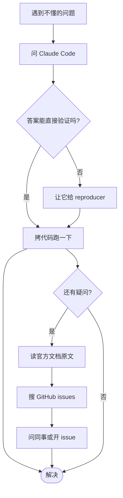

## Appendix B. 不明白的问题：直接问 Claude Code

> **核心心法**：你正在使用的 AI 编程助手，本身就是关于自己最权威的资料。不要去背速查卡——背了也会过时。**学会怎么问**比记住答案更值钱。

### B.1 为什么不发"速查表"

Claude Code 在以每月一个 minor 版本的速度演进：hook 事件每季度新增几个，skill 字段语义在 v1→v2 调整过两次，sub-agent 的 `effort`/`isolation`/`memory` 都是后来加的。任何打印贴墙的速查表上线即过期。

**唯一不会过期的速查表，是你正在用的 Claude Code 自己**。把"问 Claude Code"养成肌肉记忆。

### B.2 怎么问最有效——五种姿势

**姿势 1：直接读官方文档**

```
帮我读 https://docs.claude.com/en/docs/claude-code/hooks 的 PreToolUse 部分，
告诉我能拦截哪些 tool、stdin JSON 长什么样、怎么 deny。
```

LLM 会 WebFetch / 用 MCP 文档源把权威答案拉回来——比你 Google 强多了。

**姿势 2：让它读项目里的范例**

```
读 .claude/agents/bba-architect.md 和 .claude/settings.json，
告诉我这个项目的 sub-agent 是怎么和 hook 配合的。
```

代码就在身边，比抽象解释更直观。

**姿势 3：让它解释自己的行为**

```
你刚才为什么调用了 Bash 而不是 Edit？
解释一下你在这一轮选择 tool 的依据。
```

让 agent 自陈决策路径——这是 harness engineering 最强的调试技巧。

**姿势 4：让它写一个"最小复现"再分析**

```
给我写一个最小的 hook，能在 PreToolUse 上拦截 rm 命令。
要能拷到 .claude/hooks/ 直接跑通，10 行内。然后解释每行。
```

让模型先给可运行的最小例子，再让你"读懂"。比读文档高效。

**姿势 5：让它做苏格拉底式拷问**

```
我打算把综合用的 sub-agent 写成 maxTurns=200、permissionMode=bypassPermissions，
你来挑战一下我的方案，列出至少三种这样做会爆炸的场景。
```

把 LLM 当对抗评审员用——比你自己想风险全。

### B.3 回答的可信度怎么辨

LLM 也会幻觉。**校验三步法**：

1. **要 URL**：让它给出官方文档链接，并用 WebFetch 把那一段抓回来对照。
2. **要 commit hash / version**：问"这个字段在 Claude Code 哪个版本引入的"。能给具体版本号的回答可信度高很多。
3. **要 1 行 reproducer**：能让你 30 秒内自己跑出结果验证的，最可信。

> **黄金法则**：**Don't trust, verify.** 把每个"问 AI 拿到的答案"都当成"PR 评审"——查证后再用。

### B.4 培训之后的求助路径



记住：**第一步不是 Google，不是 Stack Overflow，不是同事——是你正在打字的这个对话框**。
┌──────────────────────────────────────────────────────────────┐
│  CLAUDE CODE HARNESS CHEATSHEET                              │
├──────────────────────────────────────────────────────────────┤
│ FILE TYPE  | LOCATION                            | TRIGGER   │
│ Skill      | .claude/skills/<n>/SKILL.md         | /n or auto│
│ Sub-agent  | .claude/agents/<n>.md               | Agent()/  │
│            |                                     | /n        │
│ Hook       | .claude/settings.json (hooks: {})   | 事件触发  │
│ Permission | .claude/settings.json (permissions) | 工具调用  │
│ Memory     | CLAUDE.md / ~/.claude/CLAUDE.md     | 自动加载  │
├──────────────────────────────────────────────────────────────┤
│ HOOK EVENTS (most useful)                                    │
│  SessionStart | UserPromptSubmit | PreToolUse                │
│  PostToolUse  | Stop | PreCompact | SessionEnd               │
├──────────────────────────────────────────────────────────────┤
│ HOOK I/O                                                     │
│  stdin: JSON（含 tool_name, tool_input, cwd, session_id）    │
│  stdout: JSON 决策（permissionDecision: allow|deny）         │
│  stderr: 自由日志（人看，不影响 LLM）                        │
│  exit: 0=允许（无 stdout），非 0=失败                        │
├──────────────────────────────────────────────────────────────┤
│ SKILL FRONTMATTER (only `description` recommended)           │
│  name / description / when_to_use                            │
│  disable-model-invocation / user-invocable                   │
├──────────────────────────────────────────────────────────────┤
│ AGENT FRONTMATTER (only `name` + `description` required)     │
│  name / description / tools / disallowedTools / model        │
│  permissionMode / maxTurns / skills / mcpServers / hooks     │
│  memory / background / effort / isolation / color            │
├──────────────────────────────────────────────────────────────┤
│ PROGRESSIVE DISCLOSURE                                       │
│  L1 metadata  : 总在 context (~100 tok/skill)                │
│  L2 body      : 触发时 (<5k tok)                             │
│  L3 references: LLM 按需读 (∞)                               │
├──────────────────────────────────────────────────────────────┤
│ CONTEXT BUDGET                                               │
│  关掉不用的 plugin → 减 L1                                    │
│  CLAUDE.md ≤ 200 行 → 余下进 skill references/                │
│  长任务 → sub-agent isolation                                 │
│  接近上限 → /compact + PreCompact hook 备份                  │
├──────────────────────────────────────────────────────────────┤
│ FIVE LAWS OF HARNESS ENGINEERING                             │
│  1. Context is the bottleneck.                               │
│  2. Mind the blast radius.                                   │
│  3. Layer your defenses.                                     │
│  4. Make it replayable.                                      │
│  5. Move, don't delete.                                      │
└──────────────────────────────────────────────────────────────┘
```
