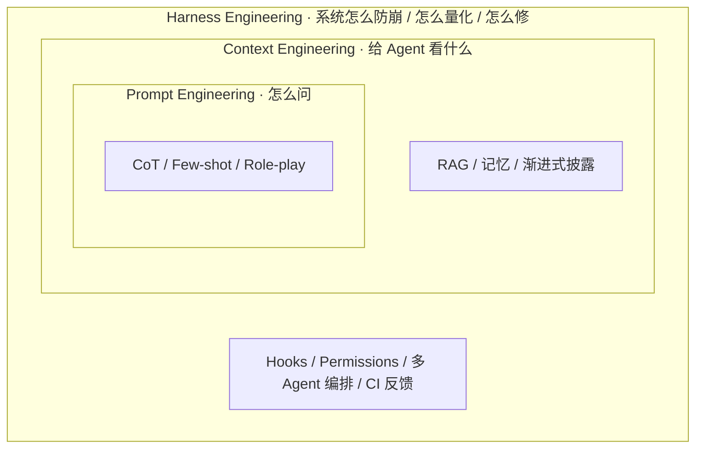
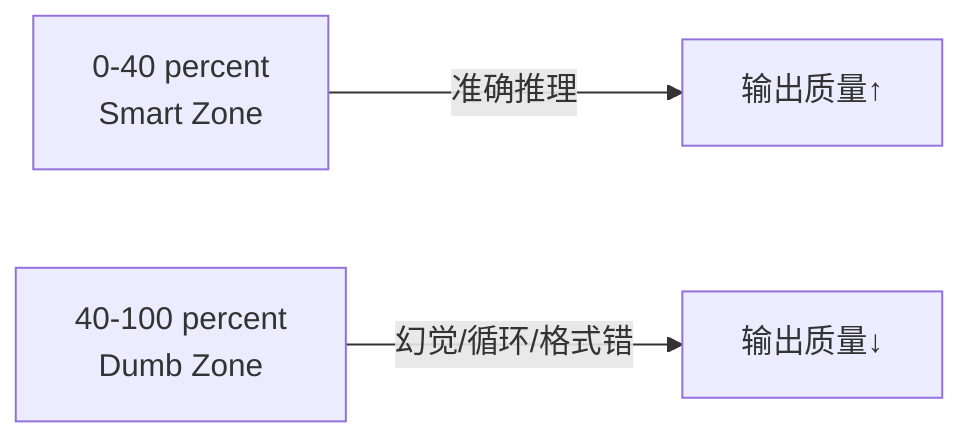
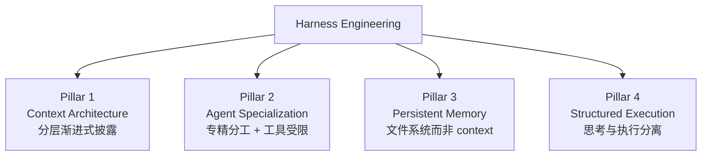

## 第 1 章 · 工程范式的三次演进：Prompt → Context → Harness

> 本章要回答一个问题：**当 IC 工程师听到"Harness Engineering"这个新词时，它和过去三年大家都在谈的 Prompt Engineering、Context Engineering 是什么关系？**

### 1.1 三层嵌套关系

Harness Engineering 不是凭空冒出来的术语，而是 Prompt Engineering 和 Context Engineering 的**自然延伸**。三者构成嵌套关系：

**Phil Schmid 的比喻**：模型是 CPU，Harness 是操作系统——CPU 再强，OS 拉胯也白搭。

**mtrajan 的更直白说法**：
- Context Engineering 管的是 **"给 Agent 看什么"**
- Harness Engineering 管的是 **"系统怎么防崩、怎么量化、怎么修"**

### 1.2 第一次演进：Prompt Engineering（2022-2023）

| 维度 | 说明 |
|------|------|
| 关注点 | 单次 prompt 的措辞、结构、示例 |
| 代表技术 | CoT（Chain-of-Thought）/ Few-shot / Role-playing / Instruction tuning |
| 衡量指标 | 单轮答题正确率 |
| 工具栈 | 写在文档里的 prompt 模板 |
| 局限 | LLM 没有持久记忆；超长任务会失忆；多步任务难协调 |

**典型场景**：用 ChatGPT 写一段代码、翻译一篇文章、生成一个 SQL。

### 1.3 第二次演进：Context Engineering（2024-2025）

随着 LLM 能调用 tool 和 RAG，问题从"prompt 怎么写"变成"**context 里塞什么、什么时候塞、什么时候撤**"。

| 维度 | 说明 |
|------|------|
| 关注点 | 整个 context window 的内容编排 |
| 代表技术 | RAG / Memory / Tool selection / 渐进式披露 / Compaction |
| 衡量指标 | 多轮任务完成率、token 利用效率 |
| 工具栈 | 向量库、memory framework、MCP server |
| 局限 | 还是单 agent 视角；缺约束机制；缺反馈循环 |

**Smart Zone vs Dumb Zone**（Dex Horthy 量化经验）：

> 对一个 168K token 的上下文窗口，**填到约 40% 就开始走下坡路**。

给 Agent 塞一堆 MCP 工具、冗长文档和累积对话历史，**不会让它更聪明——反而让它变笨**。这是 Context Engineering 时代最被低估的事实。

### 1.4 第三次演进：Harness Engineering（2026-）

2026 年 2 月，"Harness Engineering"突然在 AI 工程圈火了起来：

| 时间 | 事件 |
|------|------|
| 2025 年底 | 零星社区讨论 |
| **2026-02** | Mitchell Hashimoto（HashiCorp 创始人）博客**首次明确命名** |
| 2026-02 | OpenAI 发布"Harness engineering: leveraging Codex in an agent-first world"（百万行代码 5 月实验报告）|
| 2026-02 | Martin Fowler 发表深度分析，分类为 Context Engineering / Architecture Constraints / Garbage Collection |
| 2026-03 | Ethan Mollick 重组 AI 指南框架为 "Models, Apps, and Harnesses" 三层 |
| 2026-03 | 知乎 etc. 中文社区跟进 |

#### 关键论断：瓶颈不在智能，而在基础设施

| 实验 | 数据 |
|------|------|
| **Can.ac 实验** | 仅改变 Harness 的工具格式（编辑接口），16 个模型编码基准分数显著提升；**Grok Code Fast 1 从 6.7% 跃升至 68.3%**——零模型权重修改 |
| **LangChain 实验** | 仅 Harness 改进，Terminal Bench 2.0 从第 30 名升至**第 5 名**，同模型 +13.7 分 |
| OpenAI 团队结论 | "真正卡你的不是 Agent 写代码的能力，而是围绕它的结构、工具和反馈机制跟不上" |

> Alex Lavaee 总结："Five independent teams. Same conclusion: **the bottleneck is infrastructure, not intelligence.**"

#### Anthropic 总结的 4 大 Agent 失败模式

| 失败模式 | 表现 |
|---------|------|
| **One-shotting** | 试图一步到位，半途上下文耗尽，下一会话只见半成品 |
| **过早宣胜** | 项目后期看到部分进展就直接宣布"完成"，剩余功能视而不见 |
| **过早标完成** | 写完代码就标 done，没做端到端测试 |
| **环境启动困难** | 每次新会话都要重新搞清楚怎么跑、怎么调，token 全花在重建环境上 |

这 4 大失败模式，单靠 Prompt Engineering 或 Context Engineering 都解决不了——**需要 Harness 层面的干预**。

### 1.5 Harness Engineering 四大支柱

综合 OpenAI、Anthropic、Carlini、Huntley、Horthy 五个独立团队的实践，反复出现并形成收敛：

| 支柱 | 核心原则 | 具体做法 |
|------|---------|---------|
| **Pillar 1：Context Architecture** | Agent 应当恰好获得当前任务所需的上下文——不多不少 | AGENTS.md/CLAUDE.md 分层；T1 会话常驻 / T2 按需加载 / T3 知识库 |
| **Pillar 2：Agent Specialization** | 专精 + 受限工具 > 万能 + 全权 | Carlini C 编译器项目分核心/去重/性能/文档四类 Agent；Babel 5 个 bba-guru |
| **Pillar 3：Persistent Memory** | 进度持久化在文件系统，而非 context window | progress.txt + JSON feature list + git 提交；详见第 7 章 |
| **Pillar 4：Structured Execution** | 思考与执行分离 | Boris Tane："永远不要让 Agent 在你审查批准书面计划之前写代码" |

### 1.6 Harness 成熟度模型 H0-H4

不同于第 2 章的 Agent 自主性 L0-L5（讲**单 agent 能力等级**），本节讲**团队/项目的工程化成熟度**：

| 阶段 | 特征 | 工程师角色 | 典型团队 |
|------|------|-----------|---------|
| **H0：无 Harness** | 直接给 Agent prompt，无结构化约束 | 手写代码 + 偶用 AI | 大多数初次接触 AI 编码者 |
| **H1：基础约束** | AGENTS.md + 基础 Linter + 手动测试 | 主要写代码，AI 辅助 | 多数 2024-2025 的团队 |
| **H2：反馈回路** | CI/CD + 自动化测试 + 进度追踪 | 规划+审查为主，部分 AI 编码 | 多数 2026 早期团队 |
| **H3：专业化 Agent** | 多 Agent 角色分工 + 分层上下文 + 持久化记忆 | **环境设计 + 管理为主** | OpenAI / Anthropic / Stripe |
| **H4：自治循环** | 无人值守并行 + 自动熵管理 + 自修复 | **架构师 + 质量把关者** | Stripe Minions / Huntley Ralph Loop |

> ⚠️ **两套不要混淆（H0-H4 vs L0-L5）**：
> - 本章 H0-H4 = **Harness 成熟度**（团队工程化水平）
> - 第 2 章 L0-L5 = **Agent 自主性**（单 agent 能力等级）
> 两者维度正交：成熟 Harness（H4）跑的可能是受限 Agent（L2），反之亦然。

### 1.7 业界六大共识 + 三大空白

#### 六大共识

| # | 共识 | 共识强度 |
|---|------|---------|
| 1 | **基础设施 > 模型智能** | ★★★★★ 全面共识，6+ 来源支持 |
| 2 | **思考与执行必须分离** | ★★★★★ 所有团队独立发现 |
| 3 | **文档必须是活的反馈循环** | ★★★★☆ 强共识 |
| 4 | **上下文不是越多越好（~40% 上限）** | ★★★★☆ 有量化数据 |
| 5 | **约束必须机械化执行** | ★★★★☆ Linter / CI / 结构测试是标配 |
| 6 | **工程师角色：写代码 → 设计环境 + 管理工作** | ★★★★☆ 强共识 |

#### 三大空白（最有探索价值的方向）

| 空白 | 现状 |
|------|------|
| **棕地项目改造** | 所有公开成功案例都是绿地项目；十年遗留代码库怎么引入 Harness？零方法论 |
| **功能验证体系化** | 大家擅长"约束 Agent 不做错事"，但"验证 Agent 做对了事"远未解决 |
| **AI 代码长期可维护性** | LLM 生成代码的技术债积累方式与人类不同；"垃圾回收 Agent"是新兴做法但缺数据 |

### 1.8 IC 工程师的对应物

把上面的抽象概念落到 Babel 这种 IC 项目：

| 通用概念 | Babel 项目落地 |
|---------|---------------|
| AGENTS.md（活文档） | `CLAUDE.md`（项目根 + `.claude/`）+ 每次失败都更新 |
| 专精 Agent 分工 | 5 个 `bba-guru`（architect / rtl / verification / synthesis / pd）|
| 持久化记忆（文件系统） | `designs/<name>/.handoff/*.md` + sha256 + `MEMORY.md` 索引 |
| 思考-执行分离 | MAS 评审 → RTL → 验证 → 综合 → PD 五段流水线，每段有质量门 |
| 机械化约束 | `.claude/hooks/bb-hook-*` + `bb-gate-*-quality` skills |
| Garbage Collection | 待补：Babel 暂未做 AI 代码熵管理（这是 IC 项目改造空间） |

### 1.9 关键引用

主参考：[Harness Engineering 深度解析（知乎，2026-03-08）](https://zhuanlan.zhihu.com/p/2014014859164026634)

一手源：
- Mitchell Hashimoto（2026-02）— Harness Engineering 术语早期命名者
- OpenAI（2026-02）— *Harness engineering: leveraging Codex in an agent-first world*
- Anthropic Engineering — *Effective harnesses for long-running agents*
- Nicholas Carlini（Anthropic）— *Building a C Compiler with Claude*（16 个并行 Agent）
- Martin Fowler — *Harness Engineering* 深度分析
- Stripe — *Minions* 千 PR 无人值守系统
- Dex Horthy — *Advanced Context Engineering for Coding Agents*（Smart Zone 概念）

