## 第 2 章 · Agent 总体分类与架构（Google 2026 视角）

> 本章基于 Google 一手白皮书：
> - *Agents* (Wiesinger et al., 2024-09) — 三层架构经典模型
> - *Agents Companion* (Gulli et al., 2025-04) — 多智能体进阶
> - *Introduction to Agents* (Blount et al., 2025-11) — Agent 系统五级 taxonomy
> - *Developer's guide to multi-agent patterns in ADK* (Google Developers, 2025-12)
> - *Build Long-running AI agents with ADK* (Google Developers, 2026-05)

### 2.1 Agent 的定义（官方）

Google *Agents* 白皮书原文：

> *"An application that attempts to achieve a goal by observing the world and acting upon it using the tools that it has at its disposal."*

简译：**用工具感知世界、行动达成目标的程序**。

关键词三个：
- **goal**（目标）—— 不是单轮问答
- **observing**（感知）—— 有反馈回路
- **tools**（工具）—— 能改变外界

### 2.2 Agent vs LLM 模型

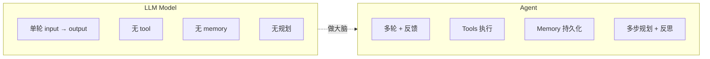

| 维度 | LLM Model | Agent |
|------|-----------|-------|
| 知识范围 | 训练数据 + 单 prompt | + 实时检索 + 持久记忆 |
| 工具 | 无原生支持 | 原生 Extensions/Functions/Data Stores |
| 推理层 | 用户在 prompt 里手写 CoT | 内建 cognitive architecture |
| 状态 | 无状态 | 跨 session 维护 |
| 自主性 | 一问一答 | 主动规划下一步 |

### 2.3 Agent 三层架构（Google 经典模型）

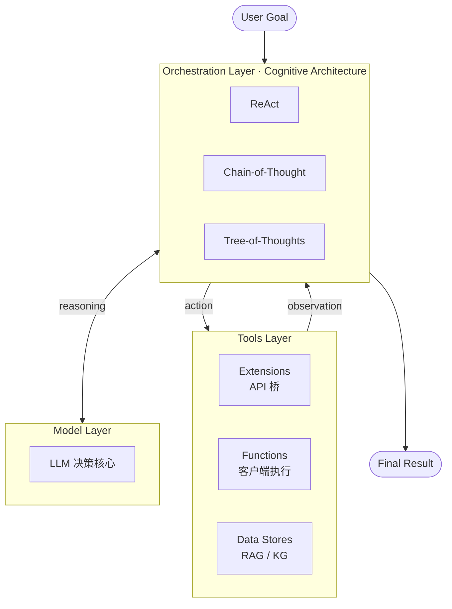

| 层 | 职责 | 关键技术 |
|----|------|---------|
| **Model Layer** | 决策核心 | LLM（Gemini / Claude / GPT / DeepSeek）；可多模型组合 |
| **Orchestration Layer** | 推理 + 规划 + 决策循环 | ReAct（Reason+Action）/ CoT / ToT / 自定义 cognitive arch |
| **Tools Layer** | 与外界交互 | **Extensions**：agent-side API；**Functions**：client-side 执行；**Data Stores**：RAG/KG/vector DB |

> **三个 Tools 子类型的差别**（IC 场景类比）：
> - Extensions = 综合服务器 API 调用（agent 直接调远程）
> - Functions = 本地 verilator 命令（agent 让 host 执行后回传）
> - Data Stores = wiki/protocols/ + cbb 库（向量化检索）

### 2.4 Agent 自主性六个层级 L0-L5

> ⚠️ **来源说明**：Google *Introduction to Agents* (2025-11) 给出 **L0-L4 五级 taxonomy**；本节加入业界普遍认知的 **L5 完全自主**凑成六级。**L5 部分非 Google 原文**，标注清楚以保学术诚实。

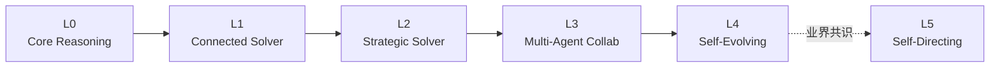

| 级 | 名称 | 一句话定义 | 关键能力 | 例子 | 来源 |
|----|------|-----------|---------|------|------|
| **L0** | Core Reasoning System | LLM 单轮推理，无 tool | 仅 reasoning | ChatGPT 早期、Translate | Google 官方 |
| **L1** | Connected Problem-Solver | LLM + tools 单轮工具调用 | + Tool use | GitHub Copilot autocomplete、ChatGPT with Browsing | Google 官方 |
| **L2** | Strategic Problem-Solver | 多步规划 + memory + 反思 | + 规划 + 记忆 + ReAct | **Claude Code default 模式**、Cursor agent | Google 官方 |
| **L3** | Collaborative Multi-Agent System | 多 agent 协作 + A2A 通信 | + 多 agent + 编排 | **Babel 5 个 bba-guru**、Stripe Minions | Google 官方 |
| **L4** | Self-Evolving System | 自我学习 + 自我改进 | + 持续学习 | Carlini C 编译器项目（16 agent）、Voyager | Google 官方 |
| **L5** | Self-Directing | Agent 自定目标，无人监督 | + 自定 goal | 暂无生产部署；CSA 明确说"L5 不适合企业"| 业界共识（CSA Trust Framework, 2026）|

#### 用户角色与 Agent 自主性的映射

借用 Knight Institute 框架（用户视角）：

| Level | 用户角色 | 控制粒度 |
|-------|---------|---------|
| L0-L1 | **Operator**（操作员）| 每个动作前批准 |
| L2 | **Collaborator**（协作者）| 共同规划，可随时接管 |
| L3 | **Consultant**（顾问）| 提供专业意见与偏好 |
| L4 | **Approver**（审批人）| 仅在风险/失败点介入 |
| L5 | **Observer**（观察者）| 紧急停止开关，平时只看 |

> **2026 年实战**：L2-L3 是大多数生产部署所在；L4 在 Carlini 编译器、Stripe Minions 等先驱团队出现；**L5 没有任何可信生产案例**（Cloud Security Alliance 2026-01 报告原话："not appropriate for enterprise deployment today"）。

#### Claude Code 在哪一级

| 模式 | 默认级别 |
|------|---------|
| Claude Code 普通对话 | **L2**（Strategic Problem-Solver）|
| 启用 sub-agent 后 | **L3**（Multi-Agent Collaboration）|
| Claude Code Auto Mode（2026-03 推出） | **L3-L4** 之间（Background full auto with sandbox）|
| Babel 五 guru 流水线 | **L3** |

### 2.5 单 Agent vs 多 Agent 系统

何时升级到多 Agent？Google ADK 团队的判断标准：

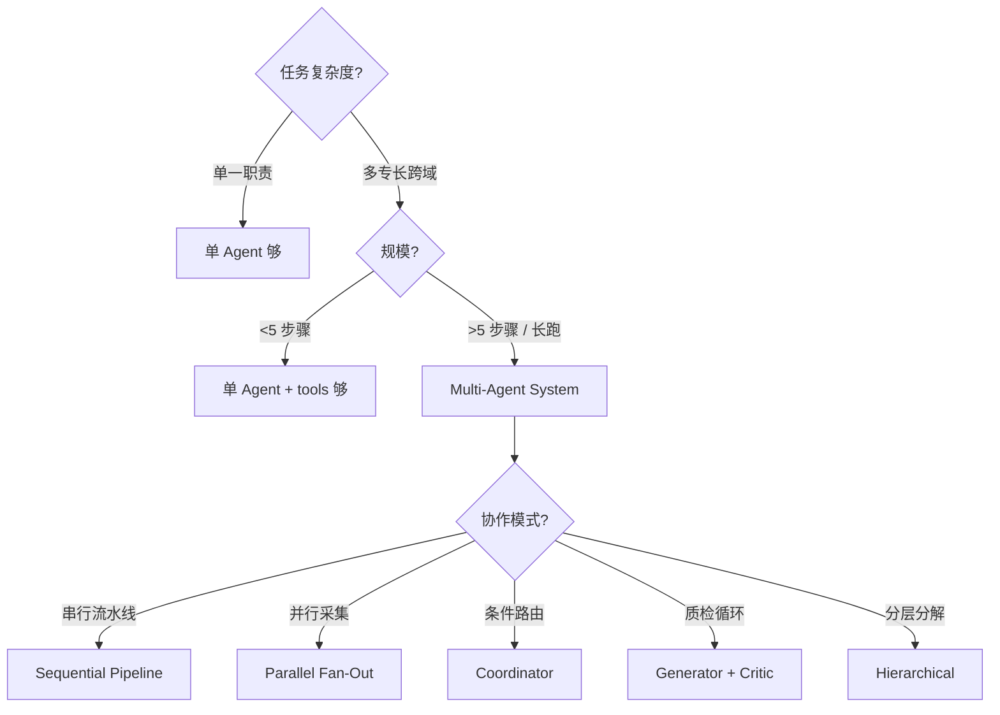

**多 Agent 比单 Agent 多付出的代价**：
- 协调成本（编排开销）
- 状态同步（race condition）
- 调试难度（分布式 trace）
- token 成本（每个 agent 都吃 context）

### 2.6 八大 Multi-Agent 设计模式（Google ADK, 2025-12）

直接来自 Google 官方 *Developer's guide to multi-agent patterns in ADK*：

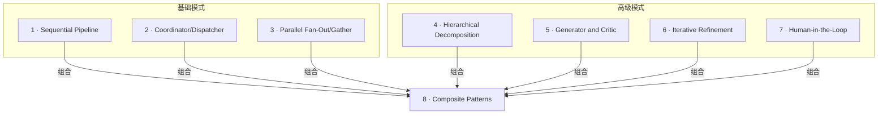

| # | 模式 | 别名 | 适用场景 | IC 例子 |
|---|------|------|---------|---------|
| 1 | **Sequential Pipeline** | 流水线 | 步骤固定的串行流程 | **Babel：architect → rtl → verify → synth → pd** |
| 2 | **Coordinator/Dispatcher** | concierge 接待员 | 按意图路由到专家 | 用户说"综合"→ 路由到 synth guru |
| 3 | **Parallel Fan-Out/Gather** | octopus 八爪鱼 | 同任务多视角并行 | 多 corner 并行 STA + 综合 + PD timing 三家同时跑 |
| 4 | **Hierarchical Decomposition** | russian doll 套娃 | 复杂任务递归分解 | top-level architect → 把 IO ring 分给 child agent |
| 5 | **Generator and Critic** | editor's desk 编辑桌 | 质检循环 | RTL coder 生成 → code reviewer 审查 → 修改 |
| 6 | **Iterative Refinement** | sculptor 雕刻 | 多轮逼近最优 | yosys 综合 → STA 报错 → 加约束再综合，循环至 WNS≥0 |
| 7 | **Human-in-the-loop** | 人类安全网 | 高风险决策需人审 | PD signoff 前必须用户批准（Babel USER_GATE）|
| 8 | **Composite** | 组合套用 | 真实大型系统 | Babel 整体 = Sequential + Hierarchical + HITL + Iterative 组合 |

#### 八大模式各自的 mermaid

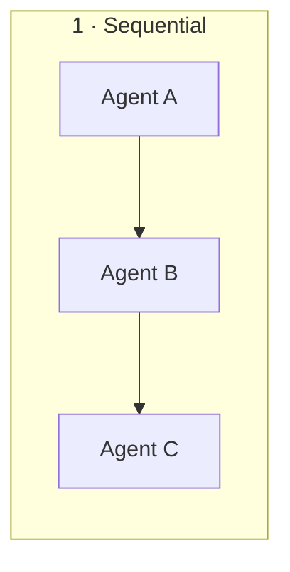

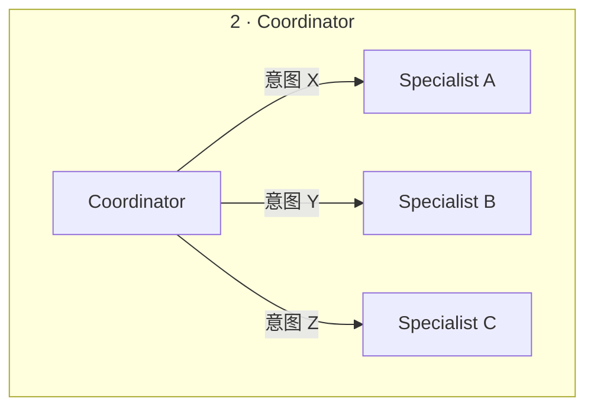

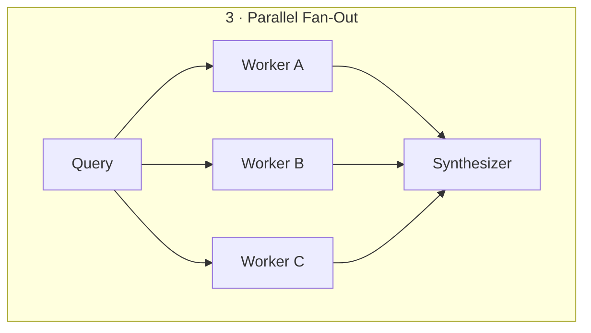

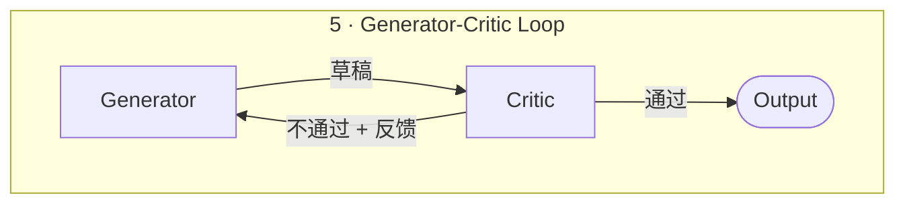

### 2.7 Agent 互通协议：MCP + A2A

两个互补的开放协议，2025 起在 Google / Anthropic / 业界协同推动：

| 协议 | 用途 | 主推方 | 时间 |
|------|------|--------|------|
| **MCP** (Model Context Protocol) | Agent ↔ 外部工具/数据 | Anthropic 2024-11 | 已成事实标准 |
| **A2A** (Agent2Agent Protocol) | Agent ↔ Agent | Google 2025 | 与 MCP 互补 |

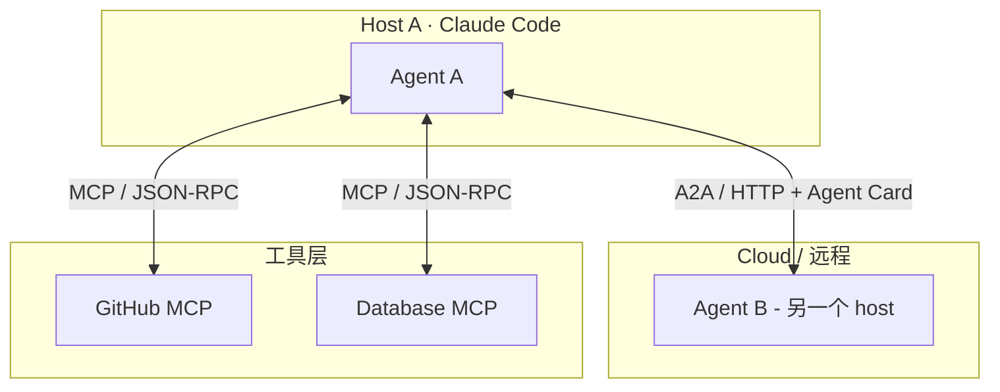

#### Agent Card — Agent 的"名片"

A2A 协议的核心概念：每个 agent 暴露一个 JSON 文件描述自己：

```json
{
  "name": "qor-watcher",
  "description": "QoR regression monitor",
  "url": "https://my-cluster.local/agents/qor-watcher",
  "capabilities": ["query_status", "open_issue"],
  "input_schema": { "design": "string" },
  "output_schema": { "regression": "boolean", "details": "object" }
}
```

调用方读到这张"名片"后，知道这个 agent 能做什么、怎么调。**类似服务发现 / OpenAPI**，但是面向 agent-to-agent 的。

#### Babel 项目目前用的是什么？

- ✅ **MCP**：通过 `mcp__plugin_*` 接入 Context7、Serena、Exa 等
- ❌ **A2A**：**未使用**。Babel 的 5 个 guru 通过**文件系统 handoff**（`.handoff/<label>.md` + sha256）通信，本质是"信箱模式"

A2A 适合**跨 host / 跨进程 / 跨语言**的多 agent 协作；Babel 单 host 内部用文件系统更轻量。**两种都是合法的多 agent 通信模式**——后者类似 message queue + content-addressable storage。

### 2.8 长任务 Agent 设计（2026 趋势）

Google Developers Blog (2026-05-12) *Build Long-running AI agents that pause, resume, and never lose context with ADK* 提出的关键能力：

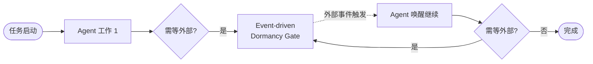

**用例**：员工入职 onboarding agent
1. 发欢迎邮件
2. **暂停几天**等员工签文件（不占资源）
3. 委托 IT provisioning sub-agent
4. **再暂停**等硬件到货
5. 发 day-1 personalized schedule

**关键设计点**：
- ❌ 不要"主动 polling"或"阻塞线程"
- ✅ 用 **event-driven dormancy gate** —— agent 进入睡眠，由外部事件唤醒
- ✅ 持久化所有状态到文件系统（详见第 7 章）

**对 IC 项目的启示**：综合一次几小时、PD 一次几天——agent 不应"占着 GPU 干等"，应该 dormant 直到 LSF 任务回调通知。Babel 项目目前是**同步阻塞**模式（轮询 yosys log），是改造点。

