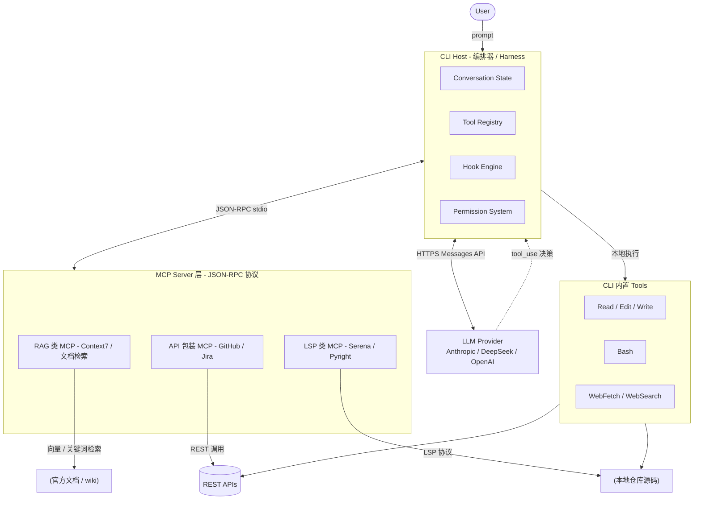
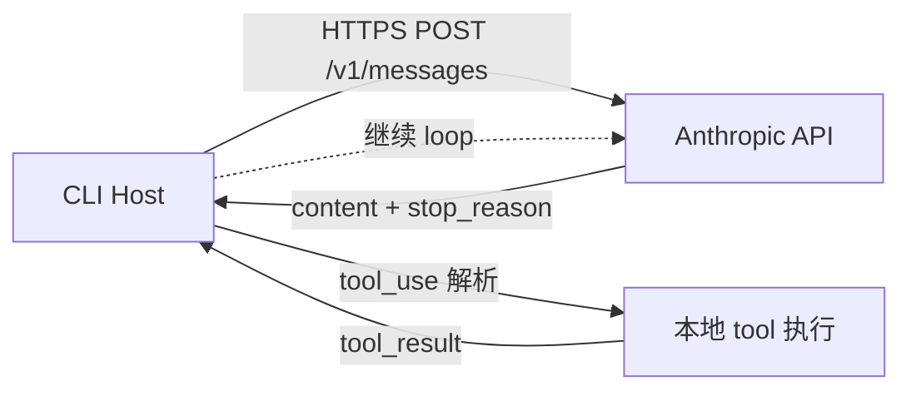
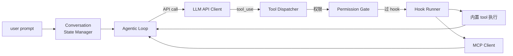
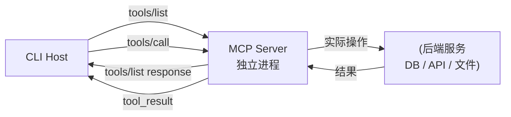
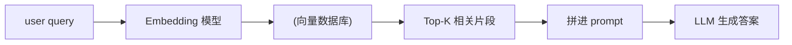
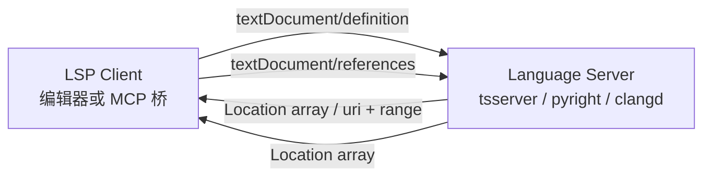
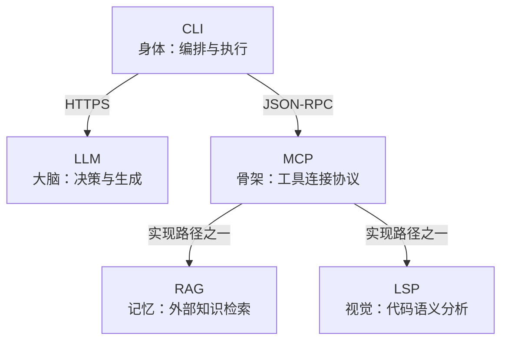

## 第 3 章 · 底层支撑技术：LLM / CLI / MCP / RAG / LSP

> 第 1 章讲了"为什么"，第 2 章讲了"分类"，本章讲"五脏六腑"。看完这章你能解释：一次 `Read .claude/agents/foo.md` 背后到底走了多少层协议。

### 3.1 关系全景图



**一句话**：CLI 是壳，LLM 是脑，MCP 是骨架，RAG 与 LSP 是两类典型的"外接器官"。

### 3.2 LLM — 大脑

**定义**：自回归 Transformer。给定 input tokens，逐 token 输出概率分布并采样。

**与 agent 相关的关键属性**：

| 属性 | 含义 | 工程后果 |
|------|------|---------|
| **无状态** | 每次 API 调用都需带完整对话历史 | 上下文是唯一"记忆"——所以才需要 CLI 维护 conversation state |
| **Tool use 微调** | 模型被 fine-tune 学会"什么时候输出 tool_use 而非 text" | tool description 直接影响调用决策；写不清就不会被调 |
| **Token 经济** | 输入 + 输出都按 token 计费 | "省 token" = 省钱 + 提升质量 |
| **Thinking budget** | 高级模型支持"扩展思考"tokens | 复杂决策给更大 budget，简单任务关掉 |
| **Knowledge cutoff** | 训练数据有截止日期 | 新文档/新 API 必须靠 RAG / WebFetch 现拉 |

**调用链路**：



请求 body：`{ model, system, messages[], tools[], thinking? }`
返回：`{ content: [text|tool_use], stop_reason }`

> **国产模型接入**：通过 LiteLLM/OneAPI 网关把 DeepSeek-V4 的 OpenAI 协议转成 Anthropic Messages 协议。Claude Code 不关心后端是谁，只认协议。

### 3.3 CLI — 编排器（Host / Harness）

**定义**：跑在工程师机器上的命令行客户端。Claude Code、Cursor、Aider、Codex 都是同一品类。

**核心职责**（详见第 1 章 Harness 框架的 OS 类比）：



**为什么叫 "Harness"**（参见第 1 章详述）：harness 是"挽具"，套在 LLM 这匹"野马"外把不确定性约束在工程边界里。

**CLI 形态 vs IDE 插件（Cursor 等）**：CLI 把 agent 编排和编辑器渲染解耦——可无 GUI 跑（CI 里跑 review agent）、可远程跑（ssh 进生产机）、可批跑（夜间 30 个 issue 并行）。

### 3.4 MCP — 工具连接协议

**定义**：Model Context Protocol，Anthropic 2024-11 开源。被誉为"AI 时代的 USB-C"。

**为什么需要**：

- 没 MCP：每个 agent host（Cursor / Claude Desktop / ...）自定义工具集成方式；工具方写 N 份适配
- 有 MCP：工具方实现一次 MCP server，所有 host 都能直接接入

**协议三要素**：

| 原语 | 类型 | 作用 |
|------|------|------|
| `tools` | 函数调用 | 模型可触发的"动作" |
| `resources` | 数据读取 | 模型可读的"文件" |
| `prompts` | 提示模板 | 用户/agent 可调用的预置 prompt |

**通信方式**：



实际 transport 三种：
- **stdio**（最常用）：MCP server 是子进程，stdin/stdout 双向 JSON
- **HTTP / SSE**：远程 MCP server（团队共享）
- **WebSocket**：长连接

**Claude Code 中的 MCP 例子**：

| MCP server | 提供能力 | 类别 |
|-----------|---------|------|
| `context7` | 主流库官方文档检索 | RAG 类 |
| `serena` | 多语言 LSP 桥（find_symbol/references） | LSP 类 |
| `playwright` | 浏览器自动化 | 工具类 |
| `github` | GitHub API 完整封装 | API 类 |
| `memory` | 跨 session KV 记忆 | 状态类 |

注册到 settings.json：

```json
{
  "mcpServers": {
    "context7": {
      "command": "npx",
      "args": ["-y", "@upstash/context7-mcp@latest"]
    }
  }
}
```

工具命名空间：`mcp__<server>__<tool>`。

#### 与 A2A 的关系（参见第 2 章 2.7 节）

- **MCP**：agent ↔ tools / data
- **A2A**：agent ↔ agent
- 两者互补，不替代

### 3.5 RAG — 检索增强生成

**定义**：Retrieval-Augmented Generation。先**检索**与 query 相关的知识片段，再把片段塞进 prompt 让 LLM 基于片段**生成**答案。

**为什么需要**：

- LLM 训练数据有 cutoff，新文档没见过
- 参数知识压缩损失大、易幻觉
- 私有/内部知识不在公开训练集
- 一次塞整本手册超 context 窗口

**三种 RAG 风味**：

| 类别 | 检索方式 | 适用 | 例子 |
|------|---------|------|------|
| **向量 RAG** | embedding 余弦相似度 | 语义模糊查询、跨语言、概念匹配 | Context7、ChromaDB、Pinecone |
| **关键词 RAG** | BM25 / 倒排索引 / grep | 精确符号、错误码、固定术语 | ripgrep、ElasticSearch |
| **Agentic Search** | LLM 自己决定下一步查什么（多轮） | 复杂、需多次细化 | Claude Code 的 Explore agent |

**典型工作流**（向量 RAG）：



**Claude Code 中的 RAG 体现**：

| 场景 | 实现 |
|------|------|
| 查 React/PostgreSQL 等开源库文档 | `context7` MCP（向量 + 全文） |
| 查 Babel 协议 wiki | `bb-search-protocol` skill |
| 查 Babel CBB 复用库 | `bb-search-cbb` skill |
| 搜代码语义 | Explore agent（agentic） |

**IC 工程师的 RAG 应用场景**：

- **协议库 RAG**：UART/AXI/UCIe 文档建索引，agent 写 RTL 前先检索 protocol handshake
- **CBB 复用 RAG**：sync-fifo / 2ff-sync / clock-gate 等实现 + 接口 + 验证报告打包向量库
- **错误码 RAG**：yosys / OpenSTA 错误码 + 历史 fix，综合失败时自动检索类似 case
- **PDK doc RAG**：ASAP7 lib 文档（drive strength 选择、metal stack）建库

### 3.6 LSP — 语义透镜

**定义**：Language Server Protocol。Microsoft 2016 提出的 IDE 与语言分析工具标准化协议。VSCode/Vim/Emacs/IntelliJ 都靠它支持几十种语言。

**核心思想**：IDE 端通用 UI ↔ 语言端通用分析——把 N×M 的实现量降到 N+M。

**协议**：JSON-RPC（与 MCP 同源思想）。常用 transport 是 stdio 或 socket。

**LSP 提供的能力**（agent 视角）：

| 请求 | 作用 | grep / Read 替代成本 |
|------|------|---------------------|
| `textDocument/definition` | 跳到定义 | grep 找定义靠运气 |
| `textDocument/references` | 找所有引用 | grep 漏 alias、宏、跨语言 |
| `textDocument/hover` | 悬停信息（签名+doc） | Read 整个文件再人脑解析 |
| `textDocument/documentSymbol` | 文件内符号大纲 | grep 头尾不全 |
| `workspace/symbol` | 全工程符号搜索 | grep 全仓库 |
| `textDocument/rename` | 跨文件安全重命名 | sed 危险 |
| `textDocument/diagnostics` | 实时错误/警告 | 得跑编译 |

**典型 LSP 调用**：



**为什么 agent 时代 LSP 极其重要**：

- agent 的"原始 IO"是 grep + Read。grep 找不到语义；Read 一次只能看一个文件
- LSP 让 agent 像编译器一样"看见"代码：函数和类不是字符串，是有定义、引用、类型的实体
- token 经济：LSP 返回的是结构化短结果（路径+行号+签名），不是文件全文

**Claude Code 中的 LSP 体现**：

| MCP / 工具 | 桥接的 LSP |
|------------|-----------|
| `serena` MCP | 多语言（Pyright / TS Server / clangd / gopls / ...） |
| `pyright-lsp` 插件 | 仅 Python |
| 用户自有 `thanosLSP` | SystemVerilog（IC 工程师专用） |

**IC 场景**：

- **SystemVerilog LSP**（thanosLSP / svlangserver / verible）：跳到 module 定义、查找所有实例化、解析端口连接
- **TCL LSP**（SDC / 综合脚本）：跳到 procedure 定义、查找 set_clock_groups 用法
- **Python LSP**（pyright）：写 testbench / cocotb / 自动化脚本

```
agent 接到 ready-for-rtl handoff
    ↓
用 thanosLSP MCP 的 documentSymbol 列出 mas 所述 modules
    ↓
对每个 module 用 references 找引用关系
    ↓
跨域信号检查：用 LSP 找到所有 always 块的 sensitivity list
```

用 grep 做这些，要么漏要么多——LSP 是精确语法分析。

### 3.7 RAG vs LSP — 一表辨析

| 维度 | RAG | LSP |
|------|-----|-----|
| **输入** | 自然语言 query | 符号位置（uri + line + col） |
| **输出** | 相关文本片段（带相似度） | 精确结构化结果（location / symbol） |
| **模糊度** | 高（语义相似就行） | 零（语法精确） |
| **协议** | 私有 / 各家不同 | 标准 JSON-RPC |
| **适合** | 文档、wiki、跨项目知识 | 单仓库内代码导航 |
| **token 成本** | 中（top-k 片段 ≈ 1-3k） | 低（仅必要片段 ≈ 100-500） |
| **新鲜度** | 取决于索引更新频率 | 实时（基于当前文件） |
| **Claude Code 入口** | `mcp__context7__*` / 自研 search skill | `mcp__serena__*` / `thanosLSP` |

**协同范式**：

```
阶段 1：RAG 找候选
    "我要 32-bit FIFO" → context7 → wiki + 3 个候选实现

阶段 2：LSP 验证候选
    serena.find_symbol("sync_fifo_v2") → 看签名、参数、引用

阶段 3：Read 加载完整代码
    把锁定的目标文件读进 context

阶段 4：LLM 生成 + Edit
    基于 RAG 的"为什么"+ LSP 的"在哪里" + Read 的"长什么样"
```

### 3.8 五件套关系总结



**口诀**：

> CLI 是身体，LLM 是脑，MCP 是脊柱，RAG 是记忆，LSP 是眼睛。
> 没有 CLI，LLM 不能动手；没有 MCP，扩展只能写死；没有 RAG，新知识进不来；没有 LSP，代码看得见名字看不见结构。

### 3.9 IC 工程师的"先做哪个"建议路径

刚开始建 harness 的优先级（每天都有可见产出，不陷入"先架构后产出"的泥潭）：

| 顺序 | 工作 | 时间投入 |
|------|------|---------|
| 1 | **CLI（Claude Code）装好** | 1 天 |
| 2 | **写 1 个简单 hook** — 阻断 destructive bash | 半天 |
| 3 | **接入 1 个 RAG MCP** — `context7` 或自建协议 wiki 索引 | 半天 |
| 4 | **写 1 个 wrapper skill** — 把 yosys 包装一下 | 1 天 |
| 5 | **接入 1 个 LSP MCP** — `serena` 或 SystemVerilog LSP | 1 天 |
| 6 | **写 1 个 sub-agent** — Lab 3 的 QoR Watcher | 1 天 |

