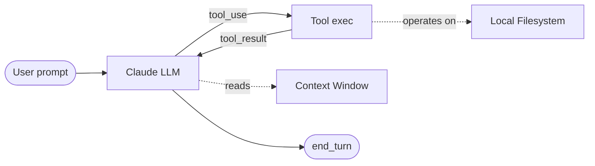

## 第 4 章 · Coding Agent 是什么——五分钟原理

### 4.1 一句话定义

> **Coding Agent = 一个跑在 LLM 上的有限循环**：用户给意图 → LLM 决定调一个或多个 tool → tool 在本地执行 → 结果回喂 LLM → LLM 决定下一步 → 直到 LLM 说"完成"或被强制停止。



### 4.2 Context Window：所有问题的根源

LLM 没有持久记忆——每一次"思考"都要把**它当前知道的一切**装进一个固定大小的窗口（Sonnet 4.6 默认 200k token，Opus 4.7 可达 1M）。

| 占用上下文的东西            | 例子（Babel 项目实测） |
|----------------------------|----------------------|
| System Prompt              | Claude Code 自身约 4–6k token |
| CLAUDE.md（项目 + 全局）   | Babel 全局 + 项目共约 3k |
| Tool definitions           | 内置 + MCP = 1–5k |
| Skill metadata（仅 name+description） | 81+ 个 skill ≈ 4–5k |
| 用户消息 + Claude 回复历史 | 主要消耗 |
| 文件 Read 结果             | 大头 |
| Hook 注入                  | 每次 prompt 可能注入 |

> **Harness 第一定律**：**Context is the bottleneck, not intelligence.** 上下文写满了，再聪明的模型也只会胡说八道或忘事。所有扩展机制（progressive disclosure / sub-agent isolation / compaction）本质都是**省 context**。

### 4.3 Tool Use：Agent 的"手"

Tool 就是一个**带 JSON Schema 的函数**。LLM 在每一步可以选择调用一个或多个 tool，Claude Code 解析 JSON 参数，本地执行，把结果回填。

Claude Code 内置工具（你已经用过）：

| Tool            | 作用                       | 典型 IC 场景 |
|-----------------|----------------------------|--------------|
| `Read`          | 读文件（带行号）           | 读 RTL、读 lib、读 log |
| `Edit`          | 字符串替换式编辑           | 修改一处时序约束 |
| `Write`         | 写整文件                   | 生成新 SDC、新 TB |
| `Bash`          | 跑 shell 命令              | 调 yosys / verilator |
| `Grep`          | 工程级 ripgrep              | 找信号、找模块 |
| `Glob`          | 文件名模式匹配             | 找所有 *.sv |
| `Agent`         | 派生 sub-agent             | 把综合委派给 bba-guru-synthesis |
| `Skill`         | 调用一个 skill             | 跑 /bb-invoke-yosys |
| `TaskCreate/Update/List` | 进度追踪              | 流水线 stage 跟踪 |
| `WebFetch / WebSearch`   | 网络访问              | 查 ASAP7 文档 |

**MCP（Model Context Protocol）工具**——通过 MCP server 注入的外部 tool，命名空间一般是 `mcp__<server>__<tool>`，例如 `mcp__plugin_serena_serena__find_symbol`、`mcp__plugin_ecc_context7__query-docs`。MCP 让你把任何 API（GitHub、JIRA、内部 EDA 服务器）暴露给 agent。

### 4.4 一次 Agentic Loop 的细节（追踪示例）

假设用户输入："综合 designs/foo 这个设计"

```
turn 1:
  USER  → "综合 designs/foo 这个设计"
  LLM   → tool_use: TaskCreate { subject: "综合 foo" }
  HOST  ← task_id=42
turn 2:
  LLM   → tool_use: Read { path: "designs/foo/rtl_artifact.json" }
  HOST  ← {top_module: "foo", file_list: "designs/foo/file_list.f"}
turn 3:
  LLM   → tool_use: Skill { skill: "bb-invoke-yosys", args: "..." }
  HOST  ← {WNS: 0.12, area: 4500, errors: 0}
turn 4:
  LLM   → tool_use: TaskUpdate { taskId: 42, status: "completed" }
  LLM   → end_turn
  LLM   → "综合完成，WNS = 0.12 ns，area = 4500 μm²"
```

每一个 turn，Claude Code 把**完整对话历史 + tool 结果**重新发给 API。**没有隐藏状态**——这是 harness 可调试的基础。

