## 第 5 章 · 四大扩展点（核心概念）

> **记忆口诀：T-H-S-A-C**
>
> - **T**ool   — 能做什么
> - **H**ook   — 何时强制介入
> - **S**kill  — 知识与流程模板
> - **A**gent  — 独立专家（隔离上下文）
> - **C**ommand— 用户触发入口（slash command）

### 5.1 Tool — 最底层的能力单元

Tool 由 Claude Code 或 MCP server 提供。**作为用户你一般不直接写 tool**（除非你写 MCP server），但你必须知道每个 sub-agent 能用哪些 tool。

**Permission system**（settings.json 的 `permissions`）：

```json
{
  "permissions": {
    "allow": ["Bash(yosys *)", "Bash(verilator *)", "Read", "Write"],
    "deny":  ["Bash(rm -rf *)", "Bash(sudo *)"],
    "ask":   ["WebFetch(*)"]
  }
}
```

> Babel 项目把"危险命令"放进 PreToolUse hook（见 `.claude/hooks/bb-hook-validate-bash-cmd.sh`）做软警告，把"目录越界写"放进 hook 做硬阻断（`bb-hook-write-arch-freeze-check.sh`）。

### 5.2 Hook — 生命周期的"门栓"

> Hooks are user-defined shell commands, HTTP endpoints, or LLM prompts that execute automatically at specific points in Claude Code's lifecycle. ——官方文档

#### Hook 事件全集（高频）

| 事件                | 触发时机                              | 典型用途 |
|---------------------|---------------------------------------|---------|
| `SessionStart`      | 会话开始 / resume / compact 后         | 注入项目状态（git status、当前 sprint） |
| `UserPromptSubmit`  | 用户提交 prompt 之前                   | 输入验证、注入额外上下文 |
| `PreToolUse`        | tool 调用之前                          | 阻断危险命令、改写参数、自动批准白名单 |
| `PostToolUse`       | tool 调用成功之后                      | 触发 formatter / linter、日志、流水线 advance |
| `PostToolUseFailure`| tool 调用失败之后                      | 报错诊断、回滚 |
| `Stop`              | Claude 回复结束                        | 完成度自检 |
| `SessionEnd`        | 会话结束                               | 生成 session summary |
| `PreCompact` / `PostCompact` | 上下文压缩前后                | 备份 transcript、重注入关键事实 |
| `SubagentStart` / `SubagentStop` | 子代理启停           | 跨 agent 协调 |
| `FileChanged`       | 受监控文件变更                         | 重新加载环境变量 |
| `CwdChanged`        | 当前目录变化                           | direnv 加载 |

#### Hook 运行模型

1. 事件触发 → Claude Code 检查匹配的 hook 配置。
2. **stdin** 把一个 JSON 对象（含 `session_id`、`cwd`、`tool_name`、`tool_input` 等字段）传给 hook handler。
3. hook 进程是**同步阻塞**的——它跑多久，会话就卡多久（保持 ms～秒级！）。
4. **stdout** 返回 JSON 决策；**exit code** 也参与：非零通常表示"失败/阻断"（PreToolUse 可借此 deny）。

#### 完整结构（settings.json）

```json
{
  "hooks": {
    "PreToolUse": [
      {
        "matcher": "Bash",
        "hooks": [
          {
            "type": "command",
            "if": "Bash(rm *)",                       // ← 新增：二级过滤，避免无谓 spawn
            "command": "${CLAUDE_PROJECT_DIR}/.claude/hooks/block-rm.sh"
          }
        ]
      }
    ]
  }
}
```

#### Matcher 语法（重要）

| Matcher 值                  | 解析为              | 例子 |
|----------------------------|---------------------|------|
| `"*"` / `""` / 省略         | 匹配全部             | 每次都触发 |
| 仅字母/数字/`_`/`|`          | 精确匹配 或 `|` 分隔列表 | `Bash`、`Edit\|Write` |
| 含其他字符                  | JavaScript 正则     | `^Notebook`、`mcp__memory__.*` |

#### Hook 返回结构（PreToolUse 示例）

```bash
#!/bin/bash
COMMAND=$(jq -r '.tool_input.command')
if echo "$COMMAND" | grep -q 'rm -rf'; then
  jq -n '{
    hookSpecificOutput: {
      hookEventName: "PreToolUse",
      permissionDecision: "deny",
      permissionDecisionReason: "Destructive command blocked"
    }
  }'
else
  exit 0
fi
```

#### Babel 项目的 hook 群（实战范例）

```
.claude/hooks/
├── bb-hook-validate-bash-cmd.sh       PreToolUse:Bash    危险命令软警告
├── bb-hook-commit-quality-gate.sh     PreToolUse:Bash    git commit 前跑质量门
├── bb-hook-write-arch-freeze-check.sh PreToolUse:Write|Edit  arch 冻结后禁写
├── bb-hook-instantiate-cbb-search.sh  PreToolUse:Write|Edit  实例化前查 CBB 库
├── bb-hook-validate-wiki.sh           PreToolUse:Read    避免读取无效 wiki 路径
├── bb-hook-change-propagate.sh        PostToolUse:Write|Edit 自动传播变更
├── bb-hook-pipeline-advance.sh        PostToolUse:Write|Edit 写 handoff → 提示下一步
├── bb-hook-create-fix-issue.sh        PostToolUse:Write|Edit 失败自动开 issue
├── bb-hook-validate-input-schema.sh   UserPromptSubmit   schema 校验输入
└── bb-hook-session-summarize.sh       SessionEnd         生成 session 摘要
```

### 5.3 Skill — 知识与流程的"百科条目"

#### 定义

> Skills are markdown files (`SKILL.md`) containing knowledge, workflows, or instructions Claude can load on demand or you can trigger with `/skill-name`. ——官方文档

**位置**：

| 路径                                     | 范围             |
|------------------------------------------|------------------|
| `~/.claude/skills/<name>/SKILL.md`       | 所有项目         |
| `.claude/skills/<name>/SKILL.md`         | 当前项目         |
| Plugin's `skills/<name>/SKILL.md`        | 启用的 plugin    |

#### Progressive Disclosure（三级加载）— Skill 的灵魂

| 层级                    | 何时加载         | 大小预算       | 内容 |
|-------------------------|------------------|----------------|------|
| **L1：metadata**        | 总在 context     | ~100 token/skill | YAML frontmatter（name + description） |
| **L2：SKILL.md body**   | 触发时           | <5000 token   | 工作流、命令、决策树 |
| **L3：bundled 资源**    | LLM 按需读       | 无限           | `references/`、`examples/`、`scripts/` |

**为什么重要？** 装 100 个 skill 也只消耗 ~10k token 的 L1。Skill 的描述必须能让 LLM 一眼看懂"什么时候用我"。

#### Frontmatter 字段

```yaml
---
name: bb-invoke-yosys
description: "调用 Yosys 0.35 对 RTL 进行逻辑综合并技术映射到 ASAP7 标准单元，产出门级网表 + QoR 报告。"
when_to_use: "用户说『综合』『跑 yosys』，或上游 sub-agent 处于 ready-for-synth 状态。"
disable-model-invocation: false   # LLM 可自动调用（默认）
user-invocable: true              # 用户可 /xxx 触发（默认）
---
```

| 字段                       | 说明 |
|----------------------------|------|
| `name`                     | 标识；目录名同名 |
| `description` *(recommended)* | LLM 据此决定是否用；**把最关键的触发场景放在前面** |
| `when_to_use`              | 额外触发线索（与 description 合计 ≤1536 字符） |
| `disable-model-invocation` | `true` = 只允许用户 `/xxx` 触发（适合有副作用的命令，例如 /deploy） |
| `user-invocable`           | `false` = 从 `/` 菜单隐藏，仅 LLM 可用（适合纯背景知识） |

#### 与 Slash Command 的关系（重要演进）

> Custom commands have been merged into skills. `.claude/commands/deploy.md` 和 `.claude/skills/deploy/SKILL.md` 都创建 `/deploy`，二者等价。`.claude/commands/` 仍向后兼容。

**结论**：**新建一律走 skill**，因为 skill 多出三件事：
1. 可以带 `references/`、`scripts/`、`examples/`（progressive disclosure）。
2. 可以被 LLM **自动**调用，不只是用户 `/` 触发。
3. 可以塞进 sub-agent 的 `skills:` 字段预加载。

#### Babel 内部的 skill 分类

```
.claude/skills/
├── bb-prd            ┐
├── bb-arch           │ 流程类（生成产物）
├── bb-mas            │
├── bb-rtl-coder      ┘
│
├── bb-invoke-yosys      ┐
├── bb-invoke-verilator  │ 工具适配层（包装 EDA 命令）
├── bb-invoke-opensta    │
├── bb-invoke-magic      ┘
│
├── bb-check-lint        ┐
├── bb-check-cdc         │ 检查类（lint / CDC / coverage）
├── bb-collect-coverage  ┘
│
├── bb-gate-rtl-quality  ┐
├── bb-gate-test-quality │ 门禁类（pass/fail 决策）
├── bb-gate-synth-quality│
├── bb-gate-pd-quality   ┘
│
├── bb-create-issue   ┐ Babel 自研 issue 协议
├── bb-list-issues    │
├── bb-close-issue    ┘
│
└── bb-search-protocol / bb-search-cbb  搜索类
```

### 5.4 Sub-agent — 独立上下文的"专家"

#### 5.4.1 与 Skill 的本质区别

| 维度          | Skill                    | Sub-agent                        |
|---------------|--------------------------|----------------------------------|
| 运行位置      | **当前会话**             | **新生 isolated context window** |
| 上下文        | 借用主对话 context       | 自己一份，主线只看到"final result" |
| 适用场景      | 流程模板、知识参考       | 长时任务、需要避免主上下文被污染 |
| 工具集        | 主代理拥有的全部         | 可被 `tools:` 收紧               |
| 模型          | 跟主代理一致             | 可独立指定（如 **DeepSeek-V4** 省 token）  |
| 隔离机制      | 无                       | 可加 `isolation: "worktree"`     |

#### 5.4.2 Sub-agent 文件格式

```yaml
---
name: bba-guru-synthesis
description: "Babel synthesis guru. Drafts SDC from MAS, runs CDC+RDC, parallel yosys synthesis, drives WNS≥0 closure. Trigger: ready-for-synth, synth-needs-fix, or explicit /bba-guru-synthesis."
tools: ["Read", "Write", "Edit", "Grep", "Bash", "Skill", "TaskCreate", "TaskUpdate", "TaskList"]
model: inherit          # 或 sonnet / opus / haiku / 完整 ID
                        # 国产模型示例：通过 LiteLLM/OneAPI 网关接入后，可填
                        #   model: deepseek-v4   （需在 settings.json 配置 base_url）
color: yellow
# 可选高级字段：
# maxTurns: 50
# permissionMode: acceptEdits
# memory: project              # 跨 session 持久记忆
# skills: ["bb-create-sdc"]    # 启动时预加载（注入完整内容）
# isolation: worktree          # 在临时 git worktree 里跑
# background: false
# effort: high                 # low | medium | high | xhigh | max
---

## Role
（这里写完整的系统提示——sub-agent 看到的"宪法"）
```

#### 5.4.3 Frontmatter 字段全集（v2.1+）

| 字段                  | 必需 | 说明 |
|----------------------|------|------|
| `name`               | ✅   | 唯一标识；hooks 收到此值作 `agent_type` |
| `description`        | ✅   | 决定 LLM 何时**自动委派**（关键字：`PROACTIVELY` 增强自动性） |
| `tools`              |      | 数组或逗号串；省略 = 继承全部 |
| `disallowedTools`    |      | 黑名单；从继承/指定列表中减去 |
| `model`              |      | `sonnet`/`opus`/`haiku`/`inherit`/完整 ID |
| `permissionMode`     |      | `default`/`acceptEdits`/`auto`/`dontAsk`/`bypassPermissions`/`plan` |
| `maxTurns`           |      | 上限轮数 |
| `skills`             |      | 启动时把完整 skill 内容注入到 context |
| `mcpServers`         |      | 这个 agent 能用的 MCP 服务器 |
| `hooks`              |      | 仅对这个 agent 生效的 hook |
| `memory`             |      | `user`/`project`/`local`——跨 session 学习 |
| `background`         |      | `true` = 后台跑 |
| `effort`             |      | `low`…`max`——推理强度 |
| `isolation`          |      | `"worktree"` = 临时 git worktree 隔离 |
| `color`              |      | 状态栏颜色 |
| `initialPrompt`      |      | 作为 main-session agent 启动时的首轮 prompt |

#### 5.4.4 优先级与冲突

> When multiple sub-agents share the same name, the higher-priority location wins.

| 位置                          | 范围        | 优先级 |
|------------------------------|-------------|--------|
| Managed settings              | 组织级      | 1（最高） |
| `--agents` CLI flag           | 本次会话    | 2 |
| `.claude/agents/`             | 当前项目    | 3 |
| `~/.claude/agents/`           | 用户全局    | 4 |
| Plugin's `agents/`            | 启用插件    | 5（最低） |

#### 5.4.5 任务编排（Task Orchestration）

> Multi-agent 系统的灵魂在编排。本节融合 Google ADK 三类 agent 模型 + 第 2 章八大设计模式的实战手法。

##### Google ADK 的三类 agent 角色

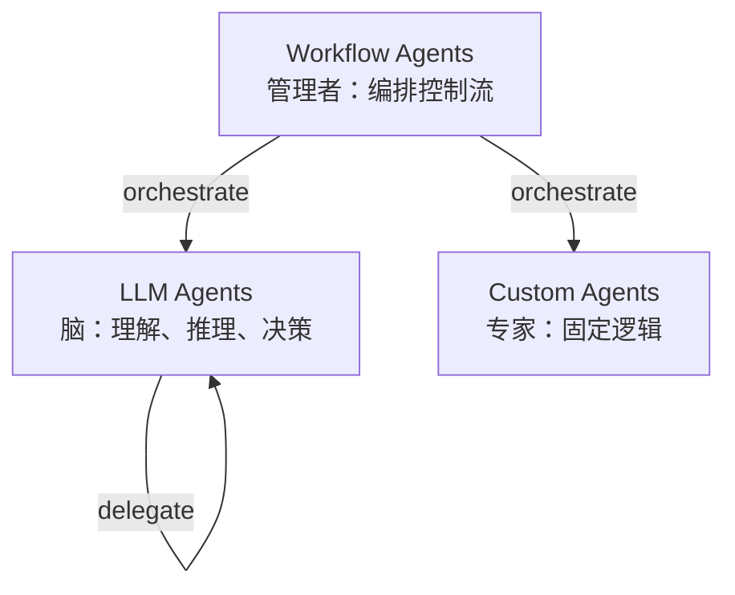

| 类别 | 角色 | 例子 |
|------|------|------|
| **LLM Agents** | "脑" — 自然语言理解 + 推理 + 决策 | bba-guru-rtl 调用 LLM 决定 RTL 怎么写 |
| **Workflow Agents** | "管理者" — 不做事，只编排其他 agent 的执行流 | Sequential / Parallel / Loop（见下） |
| **Custom Agents** | "专家" — 写死的 Python/脚本逻辑，无 LLM | Babel 的 hook 脚本（虽然不是 ADK 概念，但等价） |

##### 三种 Workflow Agent 模式（ADK 原生）

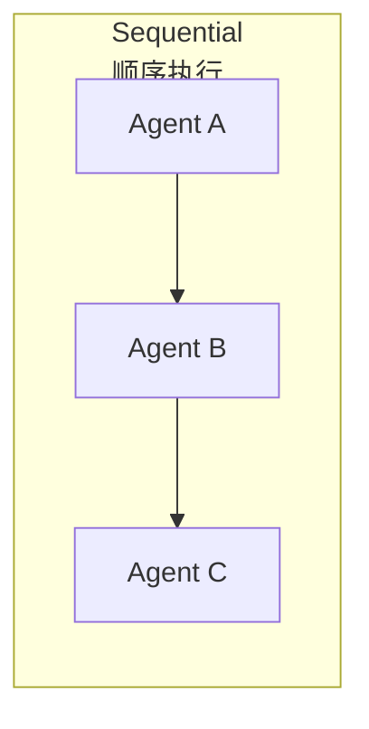

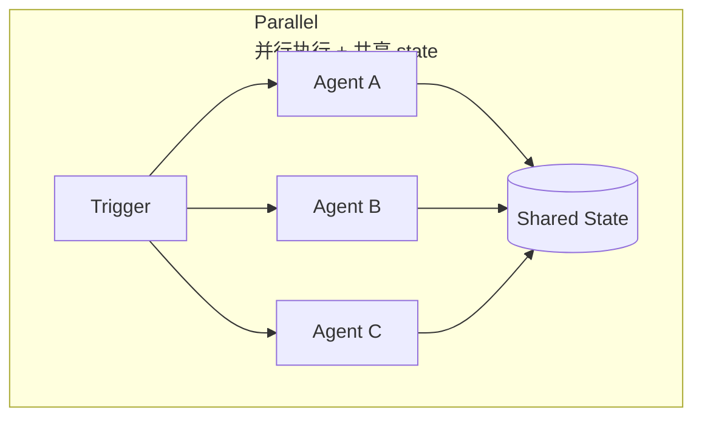

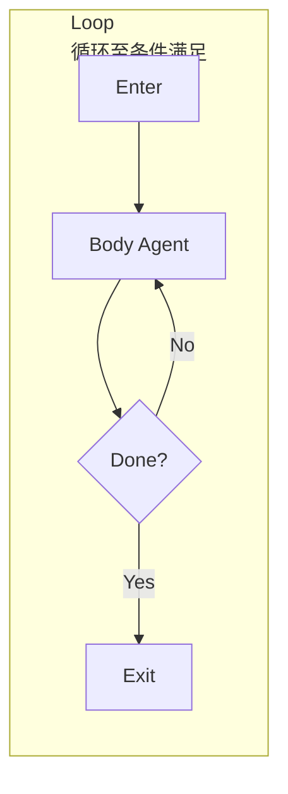

##### Babel 项目的实战编排

Babel 五 guru = **Sequential Pipeline + Hierarchical + Iterative + HITL** 的 Composite：

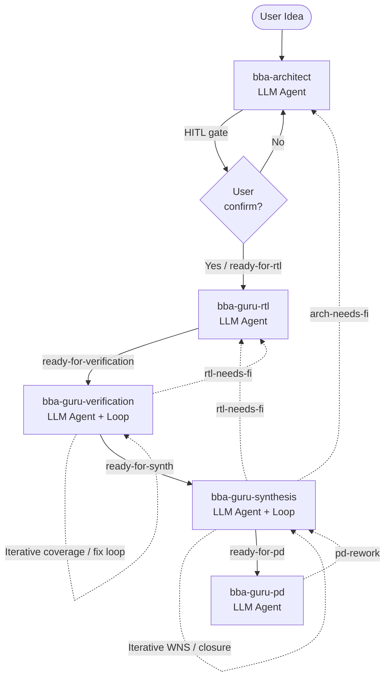

##### 任务分解 vs 任务委派

两种向 sub-agent 派任务的方式（用户视角）：

| 模式 | 控制权 | 典型用法 |
|------|--------|---------|
| **Sub-agent delegation** | 完全交出，子 agent 全程接管对话 | "改用 /bba-guru-rtl 跑这个 handoff" |
| **Agent-as-a-Tool** | 父 agent 保持控制，把 sub-agent 当 function 调一次 | LLM 调 `Agent(reviewer, prompt="审 src/foo.py")` 拿结果 |

mermaid 对比：

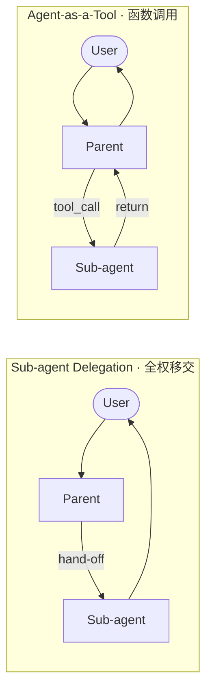

#### 5.4.6 Agent 通信机制（Inter-agent Communication）

四种主流通信机制，每种适用场景不同：

##### 机制 1：Shared Session State（共享白板）

ADK 原生模式。多个 agent 在同一进程内共享一个 `state` dict。

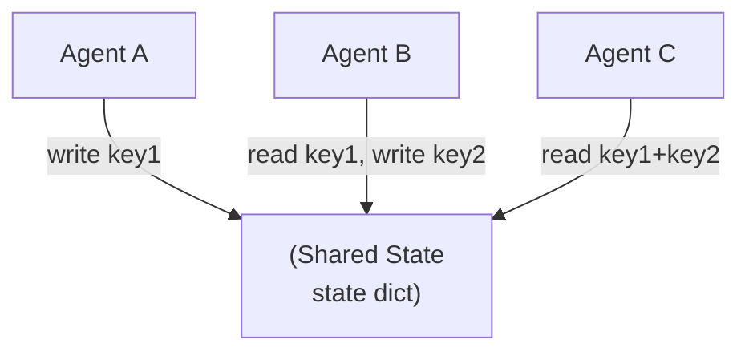

- ✅ 简单、零序列化开销
- ❌ 单进程内，跨主机不行
- ⚠️ Race condition：并行 agent 必须写不同 key

##### 机制 2：LLM-Driven Delegation（智能委派）

父 LLM Agent 看子 agent 的 `description`，自己决定路由。

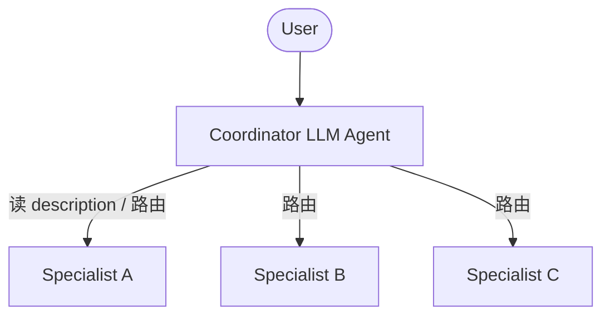

- ✅ 灵活、零硬编码
- ❌ description 写不好就路由错；调试难

##### 机制 3：Explicit Invocation / Agent-as-a-Tool（agent 当 tool）

把 sub-agent 包成一个 tool，父 agent 显式 call。

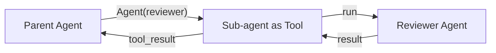

- ✅ 控制权清晰；父 agent 可决定后续动作
- ❌ 必须显式写在 tool 列表

##### 机制 4：A2A 协议（跨进程 / 跨语言 / 跨主机）

Google 2025 推的开放协议，agent 之间通过 HTTP + Agent Card 发现和通信。

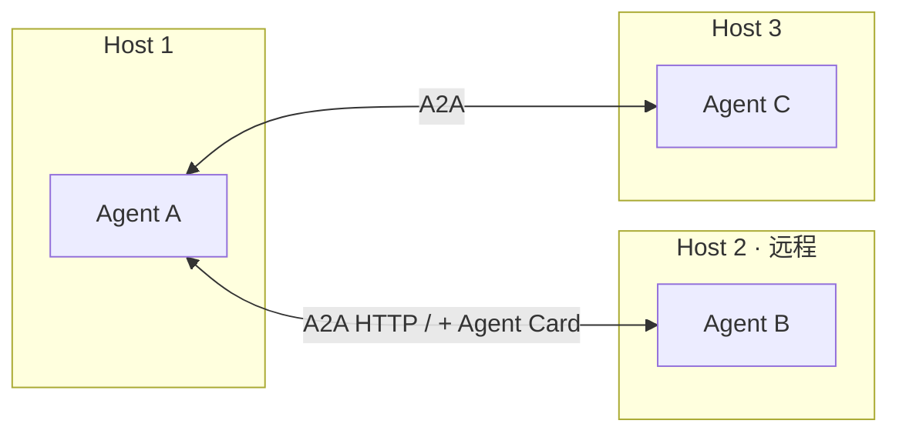

- ✅ 跨主机、跨语言、跨 host 框架
- ❌ 重型基础设施，单进程内不必要

##### Babel 选型：filesystem 信箱模式

Babel 的 5 个 guru 既不用 shared state，也不用 A2A，而是 **filesystem-based message passing**：

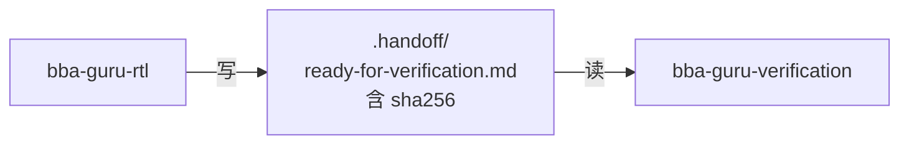

每个 handoff artifact：
- markdown 文件位于 `designs/<name>/.handoff/<label>.md`
- 包含 sha256 of MAS（防 drift）
- label 编码 stage（ready-for-rtl / ready-for-synth / ...）
- bb-create-issue / bb-list-issues skill 提供 enqueue / dequeue API

**这本质是 message queue + content-addressable storage**——比 A2A 轻，比 shared state 持久。

#### 5.4.7 同步与生命周期（Sync & Lifecycle）

##### 阻塞调用 vs Background Sub-agent

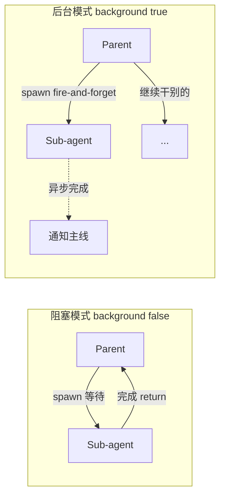

| 模式 | 用法 | 适用 |
|------|------|------|
| `background: false`（默认）| 父 agent 等 sub-agent 返回结果 | Lab 4 的 precheck-rtl 流水线 |
| `background: true` | 父 agent 立即返回，sub-agent 后台继续 | Lab 3 的 qor-watcher（监控类） |

##### Pause / Resume（2026 ADK 新能力）

Google Developers Blog (2026-05) 推出 **event-driven dormancy gate**：

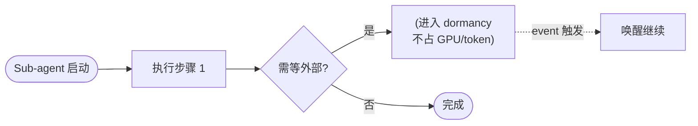

**对 IC 项目的启示**：综合一次几小时、PD 一次几天——agent 不应"占着 LLM token 干等"，应 dormant 直到 LSF 任务回调。Babel 当前是同步阻塞（轮询 yosys log），是改造点。

##### Drift Detection（sha256 校验上游产物）

下游 sub-agent 收到 handoff 后**必须**重新校验上游 artifact 没被偷偷改过：

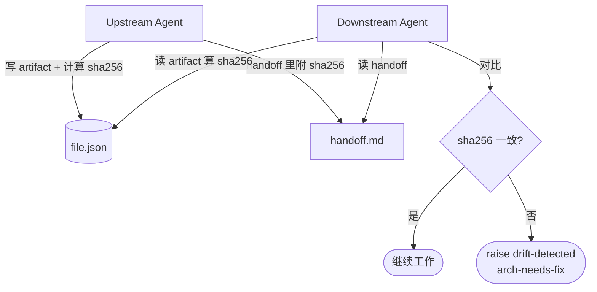

Babel 范例（`bba-guru-rtl.md` workflow step 2）：

> Recompute sha256 over `mas.json` and listed `fsm/*` / `datapath/*`. If it differs from the handoff record, refuse — raise `arch-needs-fix` "MAS-drift detected" with old vs new sha.

##### Bounce + fix_iter 防抖

下游发现问题不直接修，而是 bounce 给上游修：

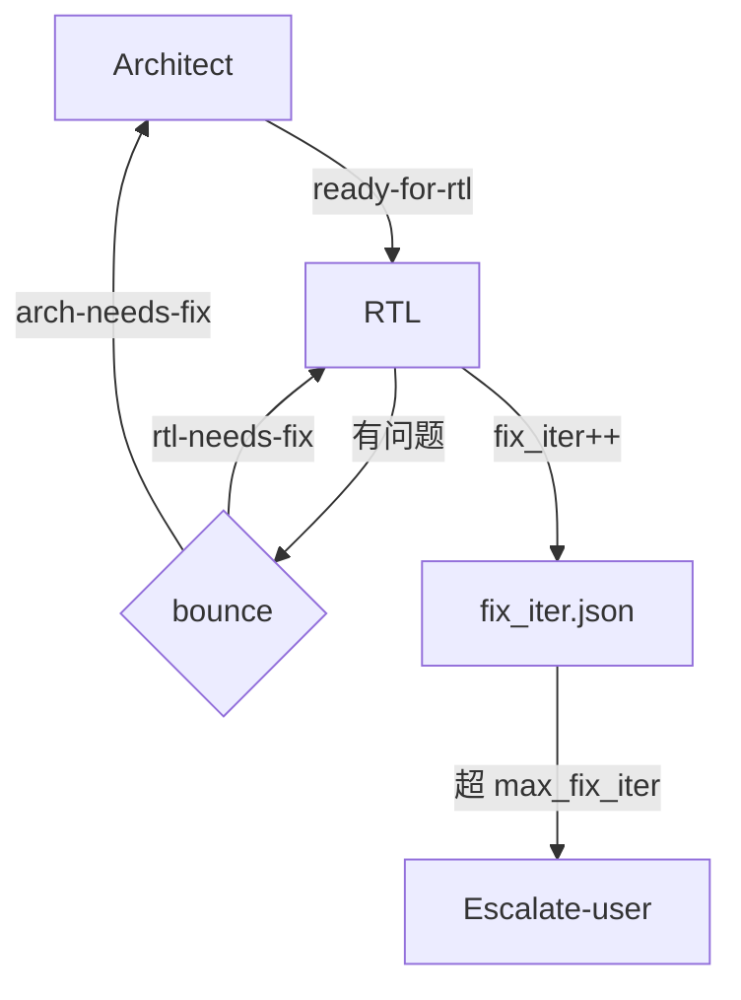

防抖关键：**correlation_id = sha256(failing-artifact)**——同一 sha256 的 bounce 算同一轮，避免无限循环。

##### Worktree 隔离做物理同步隔离

```yaml
isolation: worktree
```

让 sub-agent 在 `git worktree add` 出来的临时副本里跑，主仓库不被污染。`ExitWorktree` 决定保留还是丢弃。**适合大改、实验性、多 agent 并行同一仓库。**

#### 5.4.8 Babel 流水线全景（mermaid）


每个 guru 的产物：
- **bba-architect**：PRD / arch / MAS
- **bba-guru-rtl**：SystemVerilog + file_list.f
- **bba-guru-verification**：100% coverage testbench
- **bba-guru-synthesis**：SDC + 网表 + WNS≥0
- **bba-guru-pd**：GDSII + DRC clean + LVS match

每个 guru 看不到上游的"中间产物"（设计文档/试错日志），**只**看到 handoff artifact 的 sha256 + label。这是 harness 工程的精华——**把"决策权"和"细节"在 agent 间分层**。


---
name: bba-guru-synthesis
description: "Babel synthesis guru. Drafts SDC from MAS, runs CDC+RDC, parallel yosys synthesis, drives WNS≥0 closure. Trigger: ready-for-synth, synth-needs-fix, or explicit /bba-guru-synthesis."
tools: ["Read", "Write", "Edit", "Grep", "Bash", "Skill", "TaskCreate", "TaskUpdate", "TaskList"]
model: inherit          # 或 sonnet / opus / haiku / 完整 ID
                        # 国产模型示例：通过 LiteLLM/OneAPI 网关接入后，可填
                        #   model: deepseek-v4   （需在 settings.json 配置 base_url）
color: yellow
# 可选高级字段：
# maxTurns: 50
# permissionMode: acceptEdits
# memory: project              # 跨 session 持久记忆
# skills: ["bb-create-sdc"]    # 启动时预加载（注入完整内容）
# isolation: worktree          # 在临时 git worktree 里跑
# background: false
# effort: high                 # low | medium | high | xhigh | max
---

## Role
（这里写完整的系统提示——sub-agent 看到的"宪法"）
```

#### Frontmatter 字段全集（v2.1+）

| 字段                  | 必需 | 说明 |
|----------------------|------|------|
| `name`               | ✅   | 唯一标识；hooks 收到此值作 `agent_type` |
| `description`        | ✅   | 决定 LLM 何时**自动委派**（关键字：`PROACTIVELY` 增强自动性） |
| `tools`              |      | 数组或逗号串；省略 = 继承全部 |
| `disallowedTools`    |      | 黑名单；从继承/指定列表中减去 |
| `model`              |      | `sonnet`/`opus`/`haiku`/`inherit`/完整 ID |
| `permissionMode`     |      | `default`/`acceptEdits`/`auto`/`dontAsk`/`bypassPermissions`/`plan` |
| `maxTurns`           |      | 上限轮数 |
| `skills`             |      | 启动时把完整 skill 内容注入到 context |
| `mcpServers`         |      | 这个 agent 能用的 MCP 服务器 |
| `hooks`              |      | 仅对这个 agent 生效的 hook |
| `memory`             |      | `user`/`project`/`local`——跨 session 学习 |
| `background`         |      | `true` = 后台跑 |
| `effort`             |      | `low`…`max`——推理强度 |
| `isolation`          |      | `"worktree"` = 临时 git worktree 隔离 |
| `color`              |      | 状态栏颜色 |
| `initialPrompt`      |      | 作为 main-session agent 启动时的首轮 prompt |

#### 优先级与冲突

> When multiple sub-agents share the same name, the higher-priority location wins.

| 位置                          | 范围        | 优先级 |
|------------------------------|-------------|--------|
| Managed settings              | 组织级      | 1（最高） |
| `--agents` CLI flag           | 本次会话    | 2 |
| `.claude/agents/`             | 当前项目    | 3 |
| `~/.claude/agents/`           | 用户全局    | 4 |
| Plugin's `agents/`            | 启用插件    | 5（最低） |

#### Babel 流水线的五个 guru（实战架构）

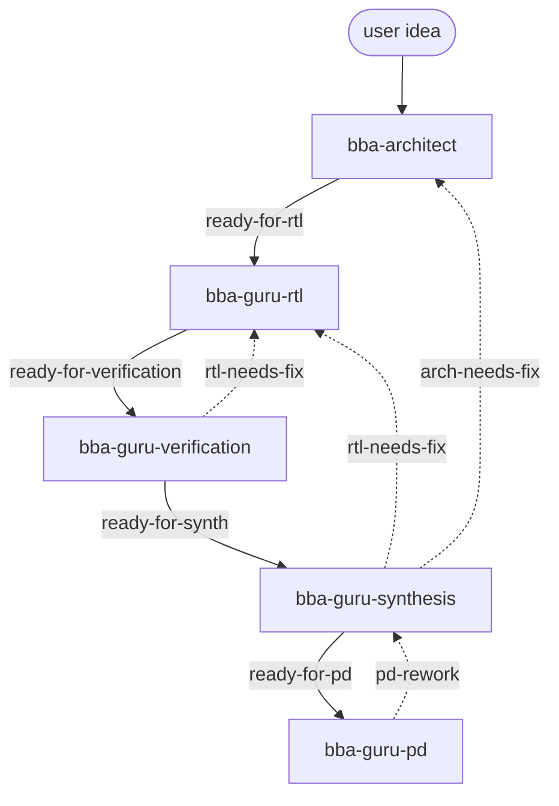

每个 guru 的产物：
- **bba-architect**：PRD / arch / MAS
- **bba-guru-rtl**：SystemVerilog + file_list.f
- **bba-guru-verification**：100% coverage testbench
- **bba-guru-synthesis**：SDC + 网表 + WNS≥0
- **bba-guru-pd**：GDSII + DRC clean + LVS match

每个 guru 看不到上游的"中间产物"（设计文档/试错日志），**只**看到 handoff artifact 的 sha256 + label。这是 harness 工程的精华——**把"决策权"和"细节"在 agent 间分层**。

