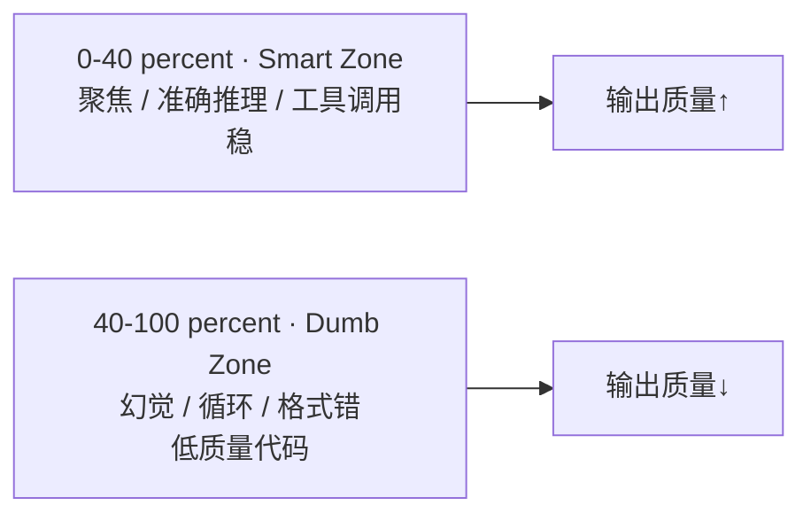
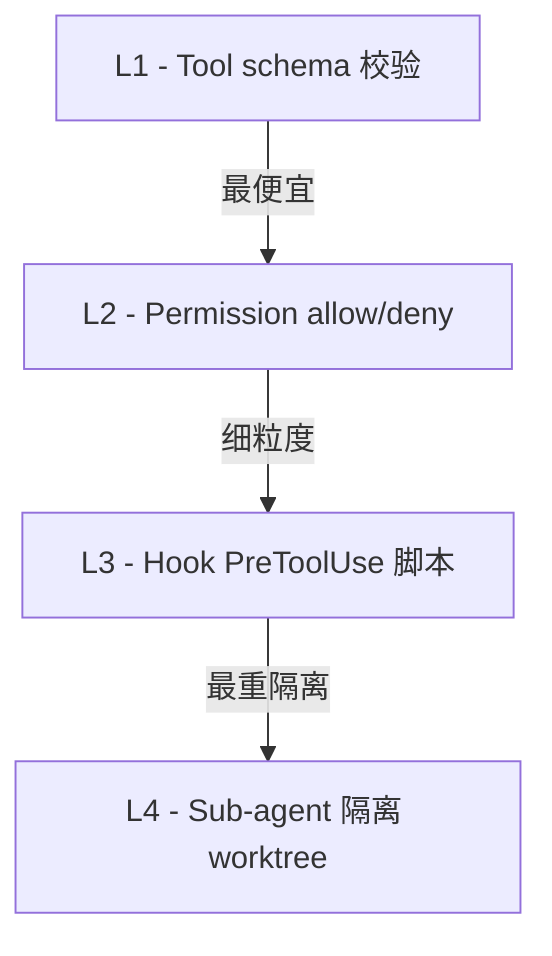
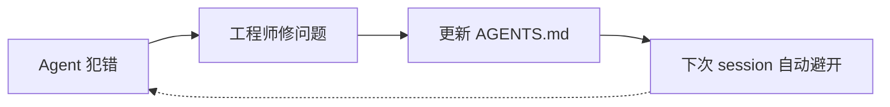
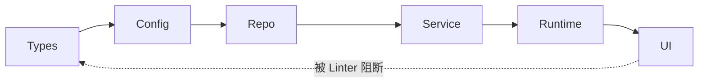
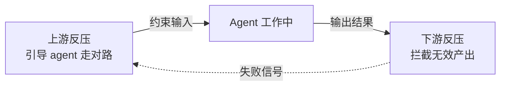
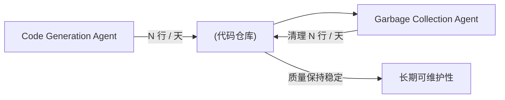

## 第 6 章 · Harness Engineering 方法论

### 6.1 五大设计原则

| 原则                       | 中文 | 实操含义 |
|---------------------------|------|---------|
| **Context Budget**         | 上下文预算 | 始终关心"现在用了多少 token，离压缩还有多远" |
| **Blast Radius**           | 爆炸半径   | 每个 tool / agent / hook 能伤多大范围？危险动作必须裁紧权限 |
| **Layered Defense**        | 分层防御   | permission（粗） → hook（细） → sub-agent isolation（最细） |
| **Observability**          | 可观测性   | transcript、tool log、hook log、TaskList——必须能复盘 |
| **Recoverability**         | 可恢复性   | 不删只移、commit 后再改、worktree 隔离、handoff schema 化 |

### 6.2 Context Budget 实战

**估算公式**（粗略）：

```
total_context = system_prompt + tool_defs + skill_metadata
              + CLAUDE.md + conversation_history + last_tool_results
              + scheduled_injections (hooks)
```

**Babel 项目 Opus 4.7 1M context 实测**（参考 GitHub issue #14882 中 power user 报告）：

| 项目                  | 占用       |
|-----------------------|-----------|
| 22 个 plugin × 81 skill | ~4–5k token（仅 L1） |
| CLAUDE.md（全局+项目）| ~3k       |
| Auto-memory           | 视情况    |
| Tool schemas          | ~2k       |
| **启动总计**           | **~15–20% of 1M**（剩余 ~80%） |

#### 6.2.1 Smart Zone vs Dumb Zone（量化甜蜜区间）

Dex Horthy（"Advanced Context Engineering for Coding Agents"）的实战观察：

> 上下文填得越满，LLM 输出质量越差。**~40% 是分界线**。



**结论**：给 Agent 塞 MCP 工具、冗长文档和累积对话历史，**不会让它更聪明——反而让它变笨**。这是 Context Engineering 时代最被低估的事实。

#### 6.2.2 三层上下文架构（Vasilopoulos 2026 学术验证）

基于 283 个开发会话、108K 行 C# 代码库的学术验证：

| 层级 | 加载时机 | 内容 | Context 占用 |
|------|---------|------|-------------|
| **Tier 1：会话常驻** | 每次 session 自动加载 | AGENTS.md / CLAUDE.md，项目结构概览 | 最小（~2-3k tok）|
| **Tier 2：按需加载** | 子 Agent / Skill 触发时 | 专业化 Agent 上下文、领域知识 | 中等（~5-10k tok 单次）|
| **Tier 3：持久化知识库** | Agent 主动查询时 | 研究文档、规格说明、历史会话 | 按需（vector 检索 top-K）|

**Babel 项目对应**：
- T1：`CLAUDE.md`（全局 + 项目）
- T2：`bba-guru-*.md` agent 启动时加载、skill 触发时加载主体
- T3：`wiki/protocols/` + `wiki/cbb/`（未来加 vector index）+ `.handoff/` 历史

#### 6.2.3 节流手段清单

1. 关掉不用的 plugin（settings.json 的 `enabledPlugins`）
2. 给 skill 加 `disable-model-invocation: true` 让它**不**进 L1
3. 大量背景知识不写进 CLAUDE.md，移到 skill 的 `references/`
4. 长任务用 sub-agent isolation，主上下文不被污染
5. 接近上限时用 `/compact` 压缩，或 `PreCompact` hook 备份关键事实
6. **大 tool 输出落盘**——让 agent 按需 read 文件，而非塞回 context（Carlini 编译器项目"上下文窗口污染缓解"核心做法）
7. **预计算聚合统计**而非输出原始数据（Carlini）
8. **grep 友好的错误格式**：`ERROR: [reason]` 单行，便于 agent 提取关键信息

### 6.3 Blast Radius 与 Least Privilege

**糟糕示范**（一个 sub-agent 拥有全权）：

```yaml
---
name: do-everything
description: "Does anything the user asks"
# 没有 tools 字段 = 继承全部，包括 Bash + Write 主目录
---
```

**Babel 范例**（`bba-architect.md`：仅给必需工具）：

```yaml
tools: ["Read", "Write", "Edit", "Grep", "Bash", "Skill", "TaskCreate", "TaskUpdate", "TaskList"]
```

更严的（`bba-guru-rtl.md`）只能写 `designs/<name>/rtl/`、`.handoff/`、`wiki/cbb/`——这是通过 hook (`bb-hook-write-arch-freeze-check.sh`) 强制的，因为 frontmatter 没有 path-level 限制能力。

### 6.4 Layered Defense（分层防御）



> **Babel ADR-A10 "soft-boundary"**：危险 bash 命令默认走 hook **告警**（fail-soft），把判断权交给用户。这避免了 hook 误杀合法操作（例如 `rm -rf temp/`）的问题。**真正不可挽回的操作**（覆盖 settings、写 /etc/）才硬阻断。

### 6.5 Observability 与 Replay

Claude Code 的核心调试能力：

| 来源                 | 内容 |
|---------------------|------|
| Transcript (`~/.claude/projects/<slug>/<sha>.jsonl`) | 完整对话 + tool call + tool result |
| Hook stderr/stdout  | 自己加 `>&2` 让 hook 信息出现在 session 输出 |
| TaskList            | 主流程的进度快照 |
| Tool result file    | 大 result（>2KB）落盘到 `tool-results/` |
| Settings `output_directory` (Bash) | 自定义日志目录 |

> **Babel 范例**：`bb-hook-pipeline-advance.sh` 在 PostToolUse 把"下一步该跑哪个 agent"打到 stderr，工程师可直接看到下个 ready-for-* label 该指向谁。

#### 6.5.1 把 Agent 的"眼睛"接到生产可观测性（OpenAI 实战）

OpenAI 的 Codex 团队走了一步：**把可观测性反向接给 agent**——不只是工程师看，agent 自己也能查。

| 集成 | 让 agent 能… | OpenAI 用法 |
|------|------------|-----------|
| **Puppeteer / Playwright MCP** | 像人类用户一样跑端到端测试 | 浏览器自动化 + DOM snapshot + screenshot |
| **Chrome DevTools Protocol** | 抓 DOM / network / console | 把"启动时间 < 800ms"变成可度量目标 |
| **日志查询工具** | grep 历史日志 + Span | agent 自主重现 bug + 验证修复 |
| **Metrics API** | 查 P99 延迟 / 错误率 | 性能优化任务的反馈信号 |

**对 IC 项目的启示**：让 sub-agent 能查 `synth/*.log` + 历史 baseline + waveform，而不是工程师手动喂数据。这是从"agent 写代码"升级到"agent 闭环优化"的关键。

### 6.6 Recoverability

| 操作            | 推荐做法 |
|----------------|---------|
| 删文件          | `mv` 到 `./temp/deleted/`（项目 CLAUDE.md 强制） |
| 修改前          | 先 `git commit`，再让 agent 改 |
| 大改            | 用 `EnterWorktree` 隔离实验 |
| Compaction      | `PreCompact` hook 把 transcript 拷到 `.claude/session_summaries/` |
| Agent 失败      | `correlation_id = sha256(failing-artifact)`，同一 sha 同一轮，避免无限重试 |

---

### 6.7 AGENTS.md 活文档模式

> 来源：Hashimoto Ghostty 项目 + OpenAI Codex 实战（知乎《Harness Engineering 深度解析》第 5.1 节）

**核心理念**：

> AGENTS.md 不是一次性写完就丢的静态文档，**每当 Agent 犯错时都要更新**。

Hashimoto 在 Ghostty 项目中说："AGENTS.md 文件的每一行都对应着一个过去的 Agent 失败案例——现在被永久预防"。

#### 6.7.1 失败 → 文档更新的反馈循环



**层级判断**：
- **简单错误**（运行错命令、找错 API）→ 加一行 AGENTS.md 即可
- **复杂错误**（架构违规、跨文件影响）→ 需要工具层解决方案（hook + Linter + 结构测试）

#### 6.7.2 OpenAI 进阶模式：分层 AGENTS.md + 自动维护

OpenAI Codex 团队的做法：
- 主 AGENTS.md 保持**短**——只是导航
- 真正的事实源散布在子目录（设计文档 / 架构图 / 执行计划 / 质量评级）
- **后台 Agent 定期扫描**过期文档并提交清理 PR——**Agent 为 Agent 维护的文档**

**Babel 对应**：
- 项目根 `CLAUDE.md` = 主入口（≤ 200 行）
- `.claude/rules/common/*.md` = 分主题规则
- 子目录 `CLAUDE.md`（如 `designs/<name>/CLAUDE.md`）= 设计专属约束
- 改造空间：加一个 `bba-doc-keeper` 后台 sub-agent 定期扫陈旧文档

---

### 6.8 架构约束机械化执行

> "If it cannot be enforced mechanically, agents will deviate." —— OpenAI Codex 报告原话

#### 6.8.1 依赖方向硬编码

OpenAI 给 Codex 项目定了**依赖方向**：

```
Types → Config → Repo → Service → Runtime → UI
```

**Linter 检测违规并阻止**——文档里写"不要反向依赖"是不够的，agent 会偏离；只有 Linter 报错才会停。



#### 6.8.2 Linter 错误消息内嵌修复指令（OpenAI 巧妙设计）

传统 Linter 错误：

```
ERROR: file UI/page.tsx imports Types/User — circular dependency
```

→ Agent 读完一脸懵，不知道怎么改。

OpenAI 升级版：

```
ERROR: file UI/page.tsx imports Types/User — violates Types→UI direction.
FIX: move shared logic to Repo layer; UI may only import from Service.
EXAMPLE: see UI/login.tsx for correct pattern.
```

→ **Agent 在出错时同时学到了如何修**。工具是"边干边教"。

#### 6.8.3 IC 项目对应

| 通用做法 | Babel 改造点 |
|---------|------------|
| 自定义 Linter 强制依赖方向 | `bb-find-module-deps` 拓扑排序 + 阻止反向依赖 |
| 错误消息内嵌修复 | 升级 `bb-check-lint` 让它输出"用 wiki/cbb/sync-fifo 替代手写"这类提示 |
| 结构测试（ArchUnit 等） | 写 RTL 结构测试：`io_ring` 必须在 top；`fsm/` 必须 leaf |

---

### 6.9 单一事实源原则

> "Knowledge written in Slack discussions or Google Docs is, to agents, equivalent to non-existent." —— OpenAI

#### 6.9.1 反模式

| 知识藏在哪 | Agent 能看见? |
|---------|------------|
| Slack 私聊 / 频道 | ❌ 看不见 |
| Google Docs / Confluence | ❌ 大概率看不见 |
| 工程师脑袋里 | ❌ 看不见 |
| Email 历史 | ❌ 看不见 |
| **代码仓库 + 版本控制** | ✅ 看得见 |

#### 6.9.2 推论：所有团队知识必须进仓库

OpenAI 实战清单：
- 决策记录 → ADR 文件
- 设计讨论 → design docs
- 故障复盘 → postmortems/
- API 约定 → 类型定义 + 测试
- 架构图 → mermaid in markdown（不是 PNG）

**Babel 项目已经做到**：
- `designs/<name>/PRD.md` / `arch_spec/` / `mas/` 全在仓库
- `.claude/agents/` / `.claude/skills/` / `.claude/hooks/` 全在仓库
- `wiki/protocols/` / `wiki/cbb/` 全在仓库
- ADR 模板：`designs/<name>/ADR/*.md`

**改造空间**：把目前散落在 issue 评论 / Slack 的设计讨论也归档进 `designs/<name>/discussions/`。

---

### 6.10 Backpressure 反压理论（Huntley）

> Geoffrey Huntley 的 Ralph Wiggum Loop 出名的是 `while :; do cat PROMPT.md | claude-code; done`，但**核心不是循环——是反压**（Backpressure）。

#### 6.10.1 上游反压 + 下游反压



| 方向 | 机制 | Babel 对应 |
|------|------|-----------|
| **上游反压** | 确定性配置 / 一致上下文 / 引导式 prompt / 现有代码模式 | CLAUDE.md / agent frontmatter / `wiki/cbb/` 模板 |
| **下游反压** | 测试 / 类型检查 / Lint / 构建 / 安全扫描 / 自定义校验 | `bb-check-lint` / `bb-check-cdc` / `bb-collect-coverage` / `bb-gate-*-quality` |

**Huntley 的极致案例**：
- 跑在 NixOS 裸金属
- Agent **直接推 master**，无分支无 PR
- 部署 30 秒完成
- 出错 → 反馈循环直接喂回活跃 session 自修复

→ 这只在**下游反压足够厚**时才安全。否则就是把火药库交给 agent。

#### 6.10.2 反压设计的关键问题

设计 harness 时反复问：

1. **如果 agent 写出错的 X，谁会拦住？**（下游反压点）
2. **如果 agent 不知道某个约束，怎么让它学到？**（上游反压点）
3. **拦住后，agent 能从错误中学习吗？**（活文档闭环）

---

### 6.11 熵管理与"垃圾回收 Agent"

> "AI 写的代码以不同于人类的方式积累技术债。我们称之为**熵**。" —— OpenAI Codex 报告

#### 6.11.1 AI 代码熵的特征

LLM 生成代码常见的"slop"模式：
- 重新实现已有的功能（不知道项目里已经有了）
- 复制粘贴+小改替代抽象
- 命名漂移（同一概念多个名字）
- 注释陈旧（代码改了注释没动）
- 错误处理不一致

#### 6.11.2 OpenAI 演进：手工清理 → 自动 GC Agent

| 阶段 | 做法 |
|------|------|
| 早期 | 工程师每周五 20% 时间手动清理 "AI Slop" |
| 后来 | **Codex 后台 Agent 自动清理** |
| 关键原则 | **清理吞吐量 ∝ 代码生成吞吐量** |



#### 6.11.3 GC Agent 该清什么

| 任务 | 频率 |
|------|------|
| 重复代码检测 + 合并 | 每日 |
| 死代码清理 | 每周 |
| 文档与代码不一致检查 | 每日 |
| 命名一致性扫描 | 每周 |
| 架构违规扫描 | 每提交（CI） |

**Babel 改造空间**：目前没有 GC agent。可以加一个 `bba-doc-keeper` + `bba-dedup-keeper` 后台 sub-agent，每晚跑一次。这是从 H3 Harness 成熟度升 H4 的关键步骤。

