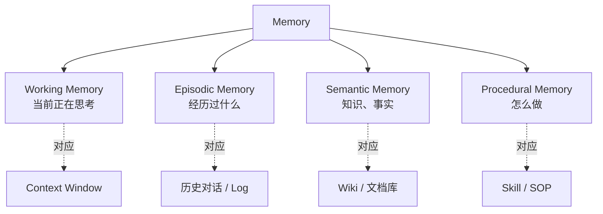
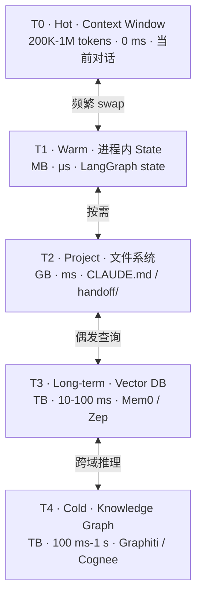
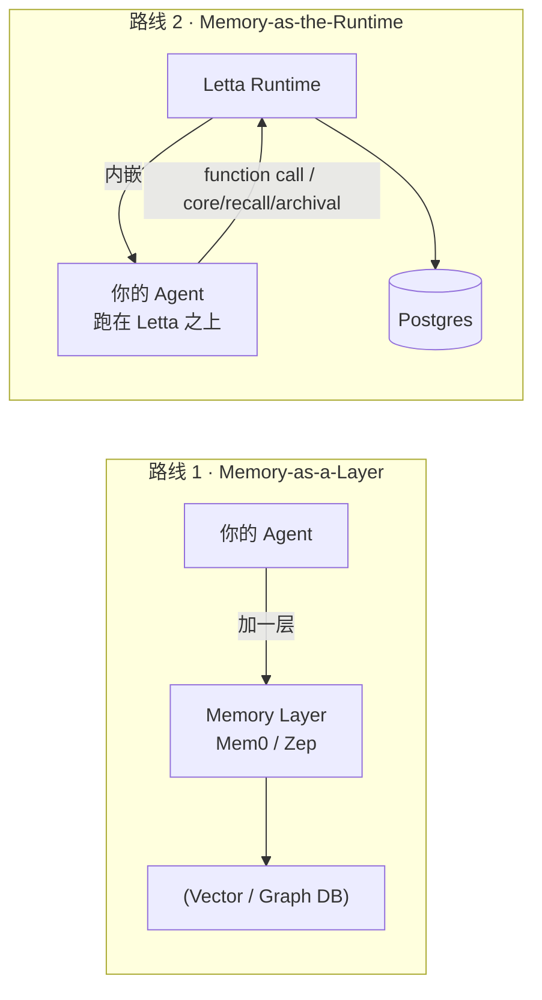
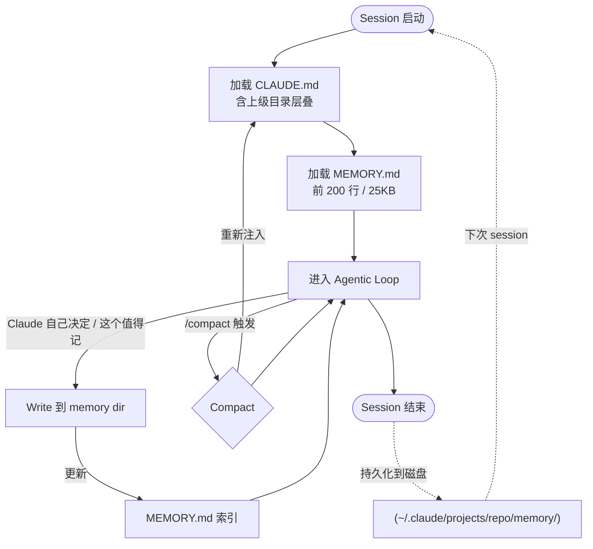
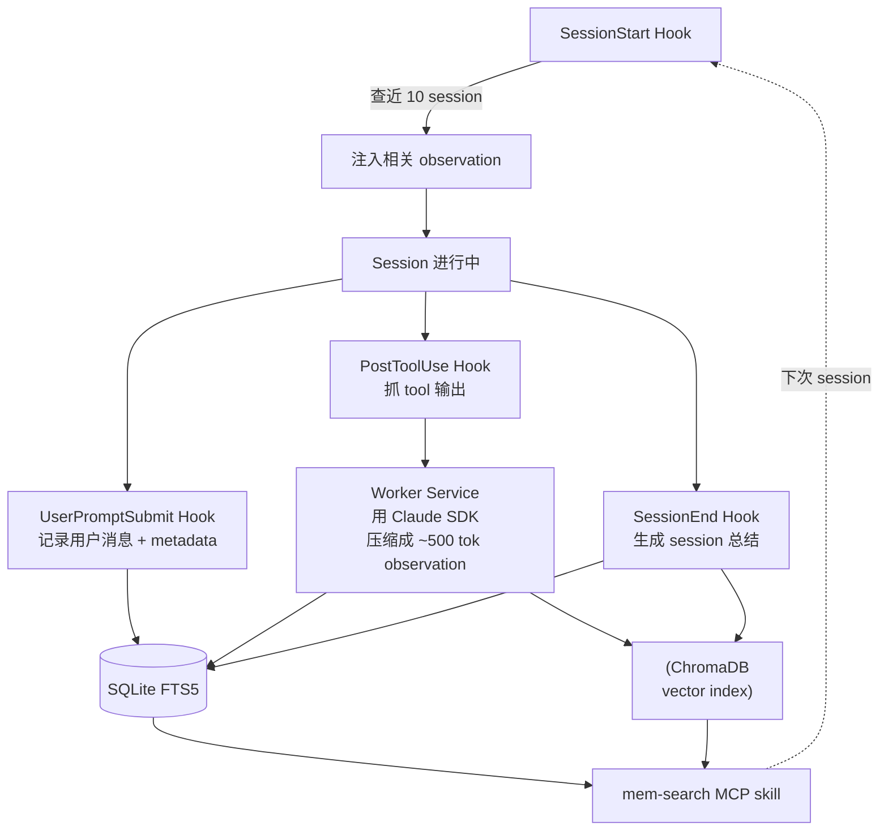
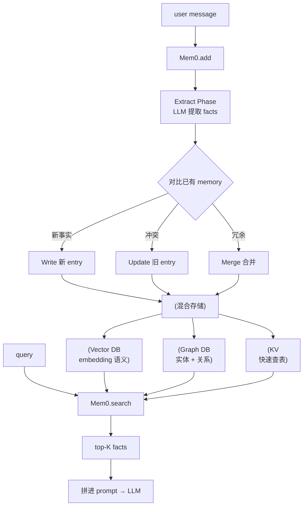
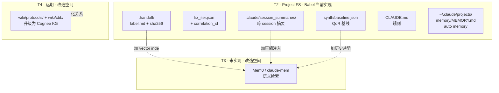
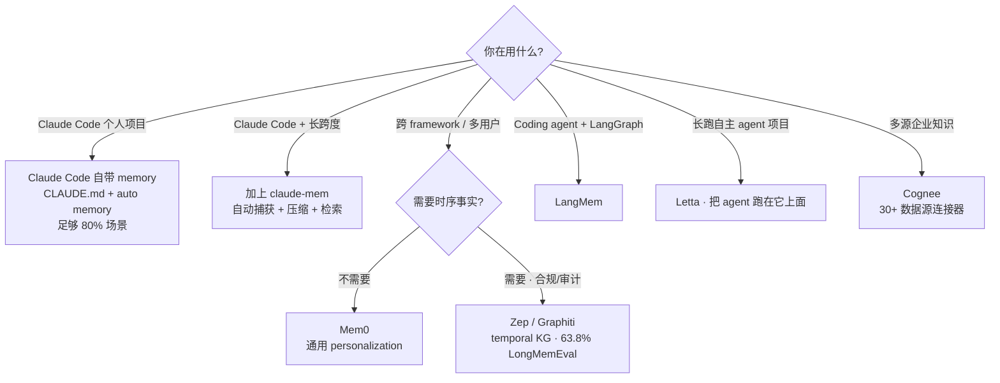

## 第 7 章 · 持久化长期记忆：SOTA 与工程实践

> 本章是对第 1 章 Harness 四大支柱之**Pillar 3：Persistent Memory**的展开。从认知科学分类、工程实现层级、SOTA 框架对比，到三大重点推荐（Claude Code 自带 / claude-mem / Mem0），最后落到 IC 项目实战。

### 7.1 为什么需要持久化记忆 — LLM 的"健忘症"

**根本病因**：LLM 是无状态的。每次 API 调用都得带完整 conversation history。一旦关闭 session，模型对你、对项目、对昨天的进展一无所知。

第 1 章已总结的 4 大失败模式（Anthropic）：
- One-shotting：context 半途耗尽，下次从头开始
- 过早宣胜：忘了还有大量功能未实现
- 过早标完成：没做端到端测试就 done
- 环境启动困难：每次都要重新搞清楚怎么跑

**Smart Zone 上限**（Dex Horthy）：context 填到 ~40% 就开始走下坡路。**给 agent 塞越多 context，反而越笨**。

**IC 项目场景**：
- 综合一次几小时、PD 一次几天——session 很容易跨多次
- 跨工程师交接：A 写完 RTL，B 跑综合，需要看到 A 的设计决策
- 长生命周期项目：芯片设计往往跨季度，知识传承成关键

### 7.2 记忆的认知科学分类

借用 Tulving 人类记忆模型映射到 AI agent：



| 类型 | 含义 | Agent 中的对应 | IC 项目例子 |
|------|------|---------------|------------|
| **Working** | 当前正在处理 | Context window | 这一轮在改的 RTL 文件 |
| **Episodic** | 过去发生的事件 | 历史对话 / log | "上周综合时 WNS 是 0.12" |
| **Semantic** | 事实、知识 | wiki / 文档库 | "AXI4 handshake 是 ready/valid" |
| **Procedural** | 流程、技能 | skill / SOP | "综合流程：lint → CDC → yosys" |

四类记忆都需要被持久化，但**机制和频率不同**——这是后面讲分层的基础。

### 7.3 工程实现的 Tier 分层（OS 虚拟内存类比）

借鉴 OS 虚拟内存：寄存器 → L1/L2 缓存 → 内存 → SSD → HDD → 磁带，越往下越慢、越大、越冷。



| Tier | 存储 | 容量 | 延迟 | 持久性 | 例子 |
|------|------|------|------|--------|------|
| T0 Hot | Context window | 200K-1M tok | 0 ms | session 内 | 当前对话 |
| T1 Warm | 进程内 state | MB | μs | session 内 | LangGraph state |
| T2 Project | 文件系统 | GB | ms | 跨 session | CLAUDE.md / `.handoff/` |
| T3 Long-term | Vector DB | TB | 10-100 ms | 跨项目 | Mem0 / Zep |
| T4 Cold | Knowledge Graph | TB | 100 ms-1 s | 跨组织 | Graphiti / Cognee |

设计原则：**写入要慎重（贵），读取要按需（省）**。所有 SOTA 系统都在这两点之间找平衡。

### 7.4 SOTA 框架对比（2026 五强）

| 框架 | 架构 | LongMemEval | GitHub | 适用场景 | License |
|------|------|------------|--------|---------|---------|
| **Mem0** | Vector + Graph + KV 混合 | 49.0% | 47K+ | 通用 personalization | Apache 2.0 |
| **Zep / Graphiti** | Temporal Knowledge Graph | **63.8%** ⭐ | 24K | 时序事实变化（合规/审计） | Apache 2.0 |
| **Letta**（前 MemGPT） | OS-paged Tiered（core/recall/archival） | 未公布 | 21K | 长跑自主 agent | Apache 2.0 |
| **LangMem** | 模块化（接 LangGraph） | 未公布 | 1.3K | LangChain 生态 | Apache 2.0 |
| **Cognee** | Knowledge Graph + 30+ connectors | 未公布 | 12K | 多源企业知识 | Apache 2.0 |

> **LongMemEval** 是 2024 推出的事实标准 benchmark，测长对话记忆能力。**Zep 比 Mem0 高 15 个点，主要来自 temporal knowledge graph 架构**——它能区分"事实何时为真"，这对合规/审计场景关键。

### 7.5 两种哲学路线



| 路线 | 代表 | 集成方式 | 锁定度 | 适合 |
|------|------|---------|--------|------|
| **Memory-as-a-Layer** | Mem0、Zep | 现有 agent 加一层（一行代码） | 低（API swap）| 已有 agent 想加记忆能力 |
| **Memory-as-the-Runtime** | Letta（MemGPT 商业版） | agent 跑在 Letta 之上 | 高（runtime swap）| 全新 agent，从零开始 |

> **Letta 把 OS 虚拟内存模型直接用到 agent 上**：Core memory（pinned 在 system prompt）、Recall memory（cache）、Archival memory（cold）三层，agent 通过 function call 自己管。

---

### 7.6 ⭐ 重点推荐 1：Claude Code 自带 Memory 系统

**为什么是首选**：你正在用的就是这个，零额外依赖，开箱可用。两个互补机制：

#### 7.6.1 CLAUDE.md（你写的）

| 维度 | 说明 |
|------|------|
| 谁写 | 你（人类） |
| 内容 | 规则、约定、preferences |
| 加载 | 每次 session 自动 |
| 层叠 | `~/.claude/CLAUDE.md`（全局） + 仓库根 `CLAUDE.md` + 子目录 `CLAUDE.md`（向上遍历）+ `CLAUDE.local.md`（gitignored）|
| 经过 `/compact` | **会重新注入**（仓库根那份） |
| Token 占用 | 每次 session 全部加载 |

**最佳实践**：≤200 行，超出移到 skill `references/` 或拆分到子目录。

#### 7.6.2 Auto Memory（Claude 自己写的）

| 维度 | 说明 |
|------|------|
| 谁写 | Claude 自己决定 |
| 内容 | 学到的事实、debug 经验、build 命令、code style |
| 存储 | `~/.claude/projects/<repo-slug>/memory/` |
| 索引 | `MEMORY.md`（首文件） |
| 加载 | session 启动加载 `MEMORY.md` 前 200 行/25KB |
| 控制 | `/memory` 命令查看、开关 |

#### 7.6.3 工作原理图



#### 7.6.4 与 sub-agent `memory:` 字段联动

第 5 章讲过 sub-agent frontmatter 有 `memory: user / project / local`：

| 值 | 存储位置 | 共享性 |
|----|---------|--------|
| `user` | `~/.claude/agent-memory/<name>/` | 仅本机用户，跨项目共享 |
| `project` | `.claude/agent-memory/<name>/` | 项目级，可 git 提交团队共享 |
| `local` | `.claude/agent-memory-local/<name>/` | 项目级，gitignored |

每个 sub-agent 拥有自己的 memory 沙箱，互不污染。

#### 7.6.5 限制 + 何时不够

- ❌ 无语义检索（只有"加载到 200 行/25KB"）
- ❌ 无自动压缩（CLAUDE.md 越长越占 context）
- ❌ Auto memory 写入策略由 Claude 决定，**不可控**
- ❌ 不适合"记下来等几周后查"的非结构化历史

不够时，叠加 claude-mem（推荐 2）或 Mem0（推荐 3）。

---

### 7.7 ⭐ 重点推荐 2：claude-mem 插件

**为什么推荐**：把 Claude Code 自带 memory 升级为**自动捕获 + AI 压缩 + 智能注入**。社区维护（thedotmack/claude-mem，2025-08 创建，2026 持续更新）。

#### 7.7.1 关键能力

- 5 个 lifecycle hooks 自动工作，无需手动维护
- AI 把每次 tool 输出压缩为 ~500 token observation
- SQLite FTS5 + ChromaDB 双轨存储（关键词 + 语义）
- session 启动注入最近 10 个 session 的相关 observation
- `mem-search` MCP skill：progressive disclosure 检索（search → timeline → get_observations）
- "Endless Mode"（β）：实时压缩，对抗 context 爆炸

#### 7.7.2 工作原理图



#### 7.7.3 与 Claude Code 自带 memory 的关系

| 维度 | Claude Code 自带 | claude-mem |
|------|----------------|-----------|
| 写入方式 | 静态规则（CLAUDE.md）+ Claude 自决（MEMORY.md） | **自动捕获**所有 tool 输出 + AI 压缩 |
| 内容类型 | 静态规则 + 偶尔事实 | **动态工作历史 + 决策记录** |
| 检索 | 无（全文加载） | 语义 + 关键词混合 |
| Token 效率 | 文件大就浪费 | 渐进式加载，按需取 |
| 团队共享 | git 提交 CLAUDE.md 即可 | 个人记忆，**不跨设备**同步 |
| 安装 | 内置 | `npx claude-mem install` 或 plugin marketplace |

**推荐组合**：
- CLAUDE.md → **规则**（你写的，project 级）
- 自带 auto memory → **Claude 自决的事实**（小量，关键）
- claude-mem → **完整工作历史**（大量，可检索）

#### 7.7.4 何时启用 claude-mem

✅ 个人开发者，长期跑同一项目
✅ 跨多 session 的 debug、设计探索
✅ 想保留"上次做了什么"的可追溯历史
❌ 团队共享记忆（claude-mem 是个人本地的）
❌ 隐私敏感场景（要审 SQLite + ChromaDB 内容）
❌ 资源吃紧（worker service 持续跑后台进程）

---

### 7.8 ⭐ 重点推荐 3：Mem0（跨平台主流）

**为什么推荐**：跨主流 framework 通用，**不局限于 Claude Code**。47K+ stars，Y Combinator $24M Series A，业界事实标准之一。

#### 7.8.1 关键特性

- 一行集成：`memory.add() / memory.search()`
- 混合存储：vector（Qdrant/Pinecone/Chroma/PGVector）+ graph（Neo4j/Memgraph）+ KV
- LongMemEval 49%（行业基准）
- 支持 Python、JS、Go SDK
- 自动 fact extraction + contradiction handling + 合并冗余
- 90% token 节省 + 26% 准确率提升 + 91% 延迟降低（vs 全 context 方法，团队官方数据）
- 集成主流 framework：OpenAI / LangGraph / CrewAI / Claude Code（via MCP）

#### 7.8.2 工作原理图



#### 7.8.3 三个一致性模型

Mem0 是 **eventually consistent**——写入需异步处理（fact extraction），延迟 ~500 ms。

| 框架 | 一致性 | 适用 |
|------|--------|------|
| **Mem0** | Eventually consistent | 对话 agent，500 ms 延迟可接受 |
| **Letta** | Transactional | agent 在同 session 内构建自己的记忆 |
| **Zep** | Temporal/Transactional | 合规要求"何时事实成真"可证 |

#### 7.8.4 在 Claude Code 中接入

通过 MCP server（Mem0 官方提供）或 supermemory（社区集成）：

```json
{
  "mcpServers": {
    "mem0": {
      "command": "npx",
      "args": ["-y", "@mem0ai/mem0-mcp@latest"],
      "env": { "MEM0_API_KEY": "..." }
    }
  }
}
```

之后 Claude Code 多了 `mcp__mem0__add` / `mcp__mem0__search` 等工具。

#### 7.8.5 何时选 Mem0 而非 Claude Code 自带

✅ 多用户产品（每个用户独立 memory）
✅ 跨 framework 移植（今天 Claude Code，明天 LangGraph）
✅ 需要 SOC 2 / HIPAA 合规
✅ 团队需要共享同一记忆库
❌ 个人开发者（用 Claude Code 自带 + claude-mem 就够了）
❌ 不想引入第三方依赖

---

### 7.9 学术 SOTA：Agentic Memory（前瞻）

| 系统 | 时间 | 核心思想 |
|------|------|---------|
| **MemGPT** (Packer et al.) | 2024 | OS-inspired virtual memory paging。Letta 的源头 |
| **Agentic Memory** (Yu et al.) | 2026 | 用 RL（GRPO）训练记忆操作策略，**超过所有 baseline** |
| **MemoryAgentBench** (Hu et al.) | 2025 | 多 session 任务 benchmark |
| **MemoryArena** (He et al.) | 2026 | 揭示 LoCoMo 满分模型在 agentic 任务跌至 40-60% |

**趋势**：记忆策略从"工程师设计 rule" → **"agent 自学 memory policy"**。这是和 Harness Engineering 演进同方向的——更多决策从人转给 agent，但前提是有正确的反馈信号。

### 7.10 评估基准

| 基准 | 重点 | SOTA | 已知局限 |
|------|------|------|---------|
| **LoCoMo** (2024) | 长对话 QA / event summary | RAG ~50% | 只测 factual recall |
| **LoCoMo-Plus** (2026) | cue-trigger 语义脱节 | 全部模型 < 40% | 仍 open problem |
| **MemoryAgentBench** (2025) | 多 session 任务 | - | - |
| **MemoryArena** (2026) | agentic 任务 | LoCoMo SOTA 跌至 40-60% | - |

**关键发现**：**LoCoMo 满分不代表实战可用**。MemoryArena 把记忆评估嵌入"web 导航 + 偏好规划 + 渐进搜索 + 序列推理"等真实任务，把现有 SOTA 打回 40-60%——揭示**被动召回 vs 主动决策性记忆**的鸿沟。

### 7.11 Babel 项目的持久化记忆设计（IC 实战）



| 持久化对象 | 实现 | SOTA 类型 | 演进方向 |
|-----------|------|----------|---------|
| Agent 间 handoff | `designs/<name>/.handoff/<label>.md` + sha256 | Episodic + Content-addressable | 加 vector index 让历史 handoff 可检索 |
| QoR 历史基线 | `designs/<name>/synth/baseline.json` | Semantic | 加时间轴成 Zep-style temporal |
| Fix iteration 计数 | `fix_iter.json` + `correlation_id` | Episodic + dedup | 当前已 OK |
| 协议 / CBB 库 | `wiki/protocols/`、`wiki/cbb/` | Semantic + Procedural | Cognee 化为 KG，跨 design 复用更准 |
| Session 摘要 | `.claude/session_summaries/*.md` | Episodic（跨 session）| 接 claude-mem 自动化 |
| 项目规则 | `CLAUDE.md` | Procedural | 已用 Claude Code 自带机制 |
| Auto memory | `~/.claude/projects/<repo>/memory/` | 混合 | 已用 Claude Code 自带机制 |

### 7.12 选型决策树



**给 IC 工程师的建议**：
1. **起步**：Claude Code 自带 memory（CLAUDE.md + auto memory）+ 项目级 `.handoff/` filesystem 模式
2. **长期项目**：加 claude-mem（个人）或团队共享 wiki + RAG MCP
3. **大组织 / 多团队**：考虑 Mem0 / Cognee 做组织级知识库

### 7.13 最佳实践 + 常见陷阱 + 开放问题

#### 最佳实践

- ✅ **写记忆比读记忆贵**——精挑写什么；不要把所有 tool 输出都记
- ✅ **加版本号 / 时间戳**防 stale memory（Zep temporal KG 自带，其他要手动）
- ✅ **定期"垃圾回收"**——压缩、合并、清旧
- ✅ **可观测**：记录每次 read/write 用于调试
- ✅ **结构化优于自由文本**——JSON feature list 比 markdown 进度文件更不容易被 agent 误改

#### 常见陷阱

| 陷阱 | 表现 | 解法 |
|------|------|------|
| **什么都写记忆** | 跟把 context 填满一样糟 | 写入门槛设高，prefer "用过验证后再记" |
| **没有 forgetting** | 旧事实污染新决策 | 加 TTL / 定期 GC / temporal scoping |
| **没做 contradiction handling** | 矛盾事实并存 | Mem0 的 update phase / Zep 的 invalidation |
| **Memory + RAG 混淆** | 不知道什么放哪 | 知识 → RAG（不变）；经验 → memory（演化） |
| **个人记忆当团队记忆用** | 私货污染共享 | 严格分 user / project / local scope |

#### 开放问题（业界共识）

- **写路径过滤**：哪些值得记？（Anthropic Memory Tool 让 agent 自决，但 agent 也会过度积累）
- **Contradiction handling**：旧事实如何废止？
- **Privacy**：用户隐私 vs 个性化的张力
- **Eval 与下游任务的差距**：LoCoMo 满分 ≠ MemoryArena 可用（差 30+ 个点）

