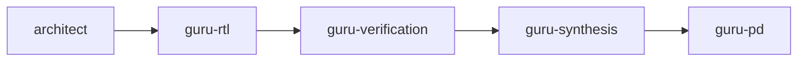

## 第 9 章 · 高级模式

### 9.1 Agent Team 流水线

如 Babel：

每个 agent **只**通过 handoff label + sha256 artifact 通信。这等价于"消息队列 + content-addressable storage"——非常工业流。

关键设计点：
- **Schema**：每个 handoff 都有 JSON Schema（`.claude/schemas/`）。
- **Drift detection**：下游 agent 收到 handoff 后必须重算 sha256，校验上游产物未被偷偷改动。
- **Bounce**：下游发现问题时不直接修，而是发回 `*-needs-fix` 给上游（`fix_iter` 计数）。
- **Escalate**：超过 `max_fix_iter` 或 `max_global_fix_iter` 必须 escalate-user，避免无限循环。

### 9.2 进化型 Skill（Evolution Framework）

Babel `it.deepresearch` 用 `evolve.sh` 框架：当 Phase 失败时，自动分析失败原因 → 决定改进深度 → 修改 SKILL.md → 验证 → 回滚或采纳。**这是"自我编辑"的 agent，对工业项目要慎用**（强烈建议加版本控制 + dry-run）。

### 9.3 长会话的 Compaction 策略

- `PreCompact` hook：备份 transcript 到磁盘。
- `SessionStart matcher=compact` hook：注入"刚才在做什么"的简短摘要。
- 关键事实写进 CLAUDE.md（每次都会自动加载）。
- 用 sub-agent 把"长查询"放到 isolated context（主线只看到结论）。

### 9.4 跨项目复用：Plugin

把一组相关的 skills + agents + hooks 打包成 plugin（目录结构：`plugin-name/{skills, agents, hooks}/`），通过 `enabledPlugins` 在多个项目共享。Anthropic 官方 plugin-dev plugin 是最好的样板。

