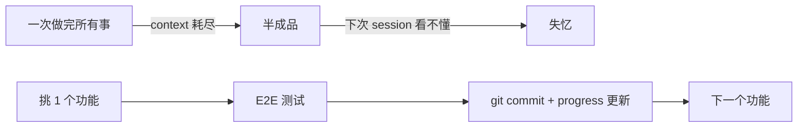

## 第 10 章 · 常见陷阱与最佳实践

### 10.1 易踩坑（13 项）

| 反模式 | 后果 | 修正 |
|--------|------|------|
| Skill description 太抽象（"helps with code"）| LLM 不会自动调它 | 写具体触发场景与关键词 |
| Sub-agent 没 `tools:` 字段 | 继承全部权限——危险 | 显式 allowlist |
| Hook 用 sync IO 调 LLM | 卡死会话 | 用 `async: true` 或拆 PostToolUse |
| 大 result（log）直接吃 context | 吃完上下文 | 落盘到文件，agent 按需 read |
| 用 `rm -rf` 清理 | 误删工作 | 项目 CLAUDE.md 强制 `mv` to `temp/deleted/` |
| Hook 写到 stdout 但不是 JSON | Claude 把 stdout 当成"注入 context"——意外行为 | 配置消息走 stderr，决策走 stdout JSON |
| 一个超大的 do-everything agent | context 爆炸、调试困难 | 拆成多个专精 agent，handoff 通信 |
| Skill 写成 5000 行 | L2 加载就爆 | 主体 ≤2000 词，余下进 `references/` |
| **过早宣胜**（Premature Victory）| Agent 看到部分进展就标 done | 引入 feature checklist + 每项 end-to-end 验证 |
| **过早标完成**（Mark-as-done w/o test）| 写完代码就 done，无 E2E 测试 | PostToolUse hook 强制 / Generator-Critic loop |
| **Linter 错误消息无修复指令** | Agent 不知道怎么改，反复犯同错 | 错误内嵌 FIX:..  EXAMPLE:..（参 6.8.2） |
| **多 agent shared state 并发写** | Race condition，覆盖彼此 | 每 agent 写独立 key；用 output_key 命名约定 |
| **Harness 过度复杂化**（Manus 5 次重写都是简化）| 工具调用噪声 + 调试地狱 | 模型越强 Harness 越薄；避免预设结构 |

### 10.2 最佳实践速查

- ✅ **每个 sub-agent 都写 IO 契约**（输入文件、输出 schema、escalate 条件）。
- ✅ **每个 skill 第一段就告诉 LLM"什么时候用我"**。
- ✅ **Hook 保持 ms 级**——如果要做重活，PostToolUse async 或 SessionEnd。
- ✅ **危险操作软警告 + 用户决策**，非"硬阻断 + 静默"。
- ✅ **每个 artifact 带 sha256**，下游验证 freshness。
- ✅ **每个 stage 有 quality gate**（lint / coverage / WNS / DRC）。
- ✅ **commit 后再让 agent 改大文件**——回滚成本极低。
- ✅ **EDA 工具用 wrapper skill**（如 `bb-invoke-yosys`）而不是让 agent 直接 Bash 调用——便于参数标准化、错误归类、log 落盘。
- ✅ **AGENTS.md 是活文档**：每次失败都更新一行（Hashimoto 范式）。
- ✅ **Linter 错误内嵌修复指令**——边干边教（OpenAI 范式）。
- ✅ **单一事实源**：所有团队知识进 git 仓库；Slack/Doc 里的等于不存在。

### 10.3 IC 项目 Harness 检查清单（带回家用）

- [ ] 项目根有 `.claude/CLAUDE.md`，列出工具链路径、PDK 位置、必读规则。
- [ ] `.claude/agents/` 至少 1 个 agent，明确角色 + 工具白名单。
- [ ] `.claude/skills/` 每个 EDA 工具有 wrapper skill。
- [ ] `.claude/hooks/` 至少 3 个：
  - 一个 PreToolUse 阻断 destructive bash。
  - 一个 PostToolUse 自动跑 lint/format。
  - 一个 SessionStart 注入 git status + 流水线状态。
- [ ] `.claude/settings.json` 配置了 `permissions.allow / deny`。
- [ ] Handoff 走 schema（JSON）+ sha256，不靠 markdown 自由文本。
- [ ] 每个产物（netlist/SDC/GDSII）有 quality gate skill 做 pass/fail 决策。
- [ ] 失败有 escalate 路径，绝不让 agent 静默重试到死。
- [ ] **CLAUDE.md / AGENTS.md 在每次 agent 失败后被更新过**（活文档信号）。
- [ ] **存在单一事实源**：设计讨论 / ADR / postmortem 全部进 git。
- [ ] **存在熵管理机制**（手工或 GC agent）。

---

### 10.4 Anthropic 4 大失败模式深度剖析

> 来自 *Effective harnesses for long-running agents*。这 4 类失败 Prompt/Context Engineering 都解决不了——必须 Harness 干预。

#### 10.4.1 失败 1：One-shotting（试图一步到位）

**症状**：Agent 一上来就想完成所有事，半途 context 耗尽，下一会话只见半成品。

**机理**：LLM 没有"我现在做了多少"的元认知，倾向把任务展开到极致。

**对策**：
- **Feature checklist 强制单功能模式**——initializer agent 生成 200+ 功能列表，coding agent 一次只挑 1 个
- 单功能完成后强制 `git commit` + 进度更新
- PreCompact hook 备份关键状态

**IC 项目对应**：把"实现整个 NPU"分解成 50+ 模块；每模块 lint clean + 单元测试通过 + 提交后再下一个。Babel 的 5 段流水线（PRD/arch/MAS/RTL/synth/PD）就是这个原则的应用。

#### 10.4.2 失败 2：过早宣胜（Premature Victory）

**症状**：项目后期，Agent 看到 80% 已完成，剩下 20% 视而不见，直接宣布"项目完成"。

**机理**：LLM 倾向"找正面信号 → 总结 → 退出"。看到很多"已完成"的功能就给自己一个总结的台阶下。

**对策**：
- 用 **JSON 结构化 feature list**（Markdown 易被 agent 误改）
- Stop hook 在 agent 宣称完成时**自动核对** feature list 是否所有项 `passing`
- 强制要求 agent 每次会话开始读取 list 选**第一个 failing 项**，而不是凭印象

#### 10.4.3 失败 3：过早标完成（Mark-as-done w/o E2E test）

**症状**：Agent 写完代码就标 `done`，没做端到端测试。单元测试或 curl 通过 ≠ 功能可用。

**机理**：LLM 把"通过 unit test"等同于"功能完成"。

**对策**：
- 强制 **E2E 验证**：浏览器自动化（Puppeteer MCP）/ HW emulation / 实际工具链跑全程
- 标 `done` 之前 **Generator-Critic loop**——critic agent 必须独立验证
- 引入 **functional coverage gate**（Babel 的 `bb-gate-test-quality` 强制 100%）

#### 10.4.4 失败 4：环境启动困难（Cold Start Problem）

**症状**：每次新会话，Agent 花大量 token 弄清楚怎么跑应用、启动哪些服务、用哪些环境变量。**真正干活的 token 反而少。**

**机理**：context 不持久；下次 session 又是冷启动。

**对策**：
- **`init.sh` 启动脚本**：会话开始第一件事跑这个，把环境就位
- **`progress.txt` / `MEMORY.md` 进度记录**：上次做到哪一目了然
- **SessionStart hook 自动注入**：当前 git 分支 + 上次 stage + ready-for-* label

**IC 项目对应**：
- `bb-invoke-*` wrapper skills = init.sh 的角色（统一调 EDA 工具）
- `.handoff/<label>.md` = progress.txt（明确下一步该做什么）
- Babel 的 `eda_env.sh` 就是 init.sh 的雏形

---

### 10.5 三大空白与改造空间（业界共识，2026）

> 知乎《Harness Engineering 深度解析》第 9 节梳理了三大开放问题。这是 IC 团队最值得投入探索的方向。

#### 10.5.1 棕地项目改造（最大空白）

**现状**：所有公开成功案例（OpenAI / Carlini / Anthropic / Stripe / Hashimoto）都是**绿地项目**或**可控环境**。

**痛点**：十年历史的遗留代码库怎么引入 Harness Engineering？

> Martin Fowler 类比："**在从未用过静态分析的代码库上跑静态分析——你会被警报淹没**。"

**可能路径**（无成熟方法论）：
1. **代码考古 Agent**：先让 agent 读全仓库生成"现状报告"
2. **从最关键约束开始**：选 1-2 条核心架构红线（如"PD 阶段不准改 RTL"），其他先放
3. **渐进式 Linter**：新代码严格，旧代码白名单
4. **AGENTS.md 慢慢长**：每次让 agent 触碰旧代码时，记录学到的隐式规则

**IC 团队的优势**：芯片设计本身就有强约束（PDK / 时序 / 工艺），可作为 Harness 的天然抓手。

#### 10.5.2 功能验证体系化（次大空白）

**Böckeler 的批评**（针对 OpenAI 报告）：

> 大量讨论了**架构约束**和**熵管理**，但**功能正确性验证**几乎缺席。

**当前能力分布**：
- ✅ "约束 Agent 不做错事"（架构约束 / Linter / 类型检查）—— 业界已经做得不错
- ❌ "**验证 Agent 做对了事**"（功能正确性）—— **远未解决**

**已有偏方**：
- 浏览器自动化（看不到 native alert 等盲区）
- 单元测试（覆盖率高 ≠ 功能对）
- Carlini 的 GCC torture test（仅适用编译器领域）
- LoCoMo / MemoryArena（揭示评测与实战的鸿沟）

**Babel 项目对应**：
- 当前**主要做"约束"**（lint clean / WNS≥0 / DRC clean / LVS match）
- 这些是**必要不充分**条件——RTL 通过所有 lint 但功能错的情况存在
- 改造空间：升级 verification 阶段从"覆盖率 100%" 到 "spec-based property check"（Jasper-style，开源对应是 SymbiYosys）

#### 10.5.3 AI 代码长期可维护性（最深空白）

**Brockman 的问题**（至今无人回答）：

> 怎么防止"功能没问题但维护性很差"的代码渗透进代码库？

**已知现象**：
- LLM 经常重新实现已有功能（Carlini 专配"去重 Agent"才控住）
- 命名漂移、错误处理风格不一
- 注释陈旧
- 抽象层级颠倒

**新兴做法**（缺数据验证）：
- "GC Agent" 周期性整理（参 6.11）
- 风格 Lint（如 `clippy --warn=all`）
- AST-level diff（识别"实质性变化" vs "表面重写"）

**对 IC 项目的启示**：
- RTL 代码也有同类问题——FSM 状态机命名漂移、相同 datapath 反复实现
- 改造空间：把 `wiki/cbb/` 升级为强制复用库，加 `bb-search-cbb` PreToolUse hook 阻止重复造轮子

---

### 10.6 业界争议：Harness Engineering 七大未决问题

> 综合知乎文章第 10 节（业界共识与分歧）+ 2026 年 Q1-Q2 业界讨论，列出**仍存争议**的七个问题。这些不是已知缺陷，而是**取决于场景的取舍**——你需要根据自己情况选边。

#### 争议 1：Harness 越简还是越繁？

| 派别 | 代表 | 论据 |
|------|------|------|
| 越简派 | Manus 团队（半年重写 5 次都是简化）、Phil Schmid | "Harness 越复杂越是过度工程化" |
| 越繁派 | OpenAI Codex 团队（5 月构建大量 Linter / 结构测试 / 后台 Agent）| 深度产品需要深度定制 |

**判断方法**：
- 通用 agent 产品 → 简化派
- 特定项目深度开发 → 精细派
- IC 项目大概率是后者（PDK 约束就是天然的精细化）

#### 争议 2：单 Agent 还是多 Agent？

| 派别 | 代表 | 论据 |
|------|------|------|
| 单 agent | Hashimoto（明确"我不跑多 agent"）、Anthropic 长跑 agent 研究 | 协调成本 > 专业化收益 |
| 多 agent | Carlini 16 个并行 / Vasilopoulos 19 领域 agent / Babel 5 guru | 专业化 + 上下文隔离 |

**判断方法**：
- 任务复杂度 + 代码库规模决定
- 小项目单 agent 够；大项目几乎必然多 agent

#### 争议 3：人介入应该多深？

| 光谱 | 代表 | 论据 |
|------|------|------|
| 深度参与 | Hashimoto（一次只跑一个，深度看每步）| 控制 + 可解释性 |
| 全程委托 | Stripe Minions / Huntley 直推 master | Harness 足够厚就可以放手 |
| 中间值 | OpenAI / Anthropic（规划阶段人审，执行阶段 agent 自主，验证阶段自动化+人审）| 规划是新的编码 |

**判断方法**：取决于 Harness 成熟度（参 1.6 节 H0-H4）

#### 争议 4：术语边界怎么画？

| 派别 | 论据 |
|------|------|
| 嵌套关系（Harness ⊇ Context ⊇ Prompt）| SmartScope / Alex Lavaee |
| 互补关系（Context 让模型思考好；Harness 防系统崩）| mtrajan |
| 术语保留态度 | Martin Fowler / Böckeler："这个词在 OpenAI 报告正文只出现一次，可能是事后追加的标签" |

**实用结论**：争的是怎么画框，不是框里有什么。本培训用嵌套观点（参 1.1 节）。

#### 争议 5：AGENTS.md vs CLAUDE.md vs 多文件分层？

- 单文件巨型 AGENTS.md（早期 OpenAI）→ 不可维护
- 短主文件 + 子目录散落（OpenAI 现在）→ 平衡
- 完全去文件化（auto memory + RAG）→ 过早

**Babel 选型**：短 CLAUDE.md + `.claude/rules/common/*.md` 分主题。

#### 争议 6：是否该让 Agent 自定 goal（L5 自主）？

- Cloud Security Alliance 2026-01：**"L5 不适合企业部署"**
- 学术 Agentic Memory（2026）：用 RL 训练 agent 自学，但仅限 memory policy

**实用结论**：2026 年 IC 项目应停留 L3-L4。

#### 争议 7：Harness 应静态写死还是 Agent 自我演化？

- Babel `it.deepresearch` skill 有 `evolve.sh` 框架（自我编辑 SKILL.md）
- 风险：自我修改后 agent 行为漂移、无法回滚
- **强烈建议**：自我演化的 harness 必须强制 `git commit` + dry-run + 人工 review 通过才落地