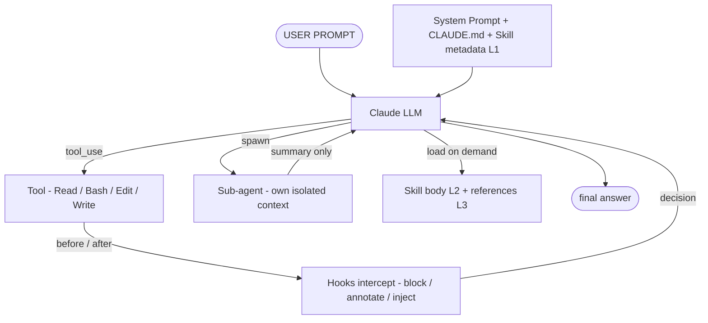

## 第 11 章 · 总结与下一步

### 11.1 核心概念回顾（一图流）

### 11.2 学完之后你应该会的

- [ ] 解释 Claude Code 在每个 turn 发生了什么。
- [ ] 看着 settings.json 解释每个 hook 在干什么。
- [ ] 写一个 5 行 frontmatter + 30 行内容的 Skill。
- [ ] 写一个项目级 Sub-agent，工具白名单、模型选定、handoff 契约都到位。
- [ ] 写一个 Pre/PostToolUse hook，从 stdin JSON 提字段、决策、stderr 报告。
- [ ] 给一条 EDA 流水线设计 5 层防御（permission → hook → schema → gate → escalate）。
- [ ] 估算一次会话的 context 占用，找出节流点。

### 11.3 推荐阅读路径

1. 必读：
   - `~/wrk/Babel/.claude/agents/bba-architect.md`（学 sub-agent 写法）
   - `~/wrk/Babel/.claude/settings.json`（学 hook 注册）
   - `~/wrk/Babel/.claude/hooks/bb-hook-pipeline-advance.sh`（学 hook 脚本）
   - `~/wrk/Babel/.claude/skills/bb-invoke-yosys/SKILL.md`（学 wrapper skill）
2. 进阶：
   - Anthropic 官方 `plugin-dev` plugin 中的 skill-development、agent-development、hook-development SKILL.md
   - Anthropic blog：*Claude Code power user customization: How to configure hooks*
3. 想自动化时找：
   - 本培训 `templates/` 目录的模板
   - `it.skill-maker`、`it.agent-maker`（项目里现成的 generator）

### 11.4 课后作业（建议团队 2 周内完成）

1. 选一条你目前手工跑的 EDA 流水线（综合 / 时序签核 / DRC 等）。
2. 抽取出 2 个 wrapper skill（EDA 工具）+ 1 个 quality-gate skill。
3. 写 1 个 sub-agent 把它们串起来。
4. 加 2 个 hook：destructive 阻断 + PostToolUse 自动跑 gate。
5. 跑一次完整 e2e，把 transcript 提交回来 review。

