# 面向芯片设计工程师的 Harness Engineering 培训

> **本培训目标**
>
> 1. 让工程师理解 Coding Agent（以 Claude Code 为代表）的**运行原理**——它不是"魔法"，而是一个可被检视、可被约束、可被扩展的有限循环系统。
> 2. 掌握 **Tool / Hook / Skill / Sub-agent / Slash Command** 五个核心扩展点的概念、运行方式与边界。
> 3. 学会 **Harness Engineering 方法论**——把 LLM 的不确定性约束在确定的工程边界里。
> 4. 能**亲手创建** Skill、Sub-agent、Hook 用于自己的 EDA 工作流（RTL 生成、综合 QoR 监控、签核 gating 等）。
> 5. 建立**安全直觉**：知道哪些动作会越界、如何 fail-soft / fail-loud 选择、上下文预算如何排布。

本培训用 Babel 项目（`/home/lxx/wrk/Babel`）作为完整范例：5 个 sub-agent、10+ hook、80+ skill 共同把 `idea → PRD → arch → MAS → RTL → verify → synth → PD → GDSII` 自动化串起来。

---


## 第 0 章 · 为什么 IC 工程师要学 Harness Engineering

| 传统脚本流（Makefile / TCL） | Agent Harness |
|------------------------------|---------------|
| 确定输入 → 确定输出           | 自然语言意图 → LLM 推理 + tool 调用 → 工程产物 |
| 失败靠 `exit 1`               | 失败有多种形态：错答案、空输出、错路径、空转 |
| 边界靠权限位/目录              | 边界靠 hook + permission + sub-agent isolation |
| 调试看 stderr                  | 调试看 transcript + tool log + hook log |
| 复用靠 include                 | 复用靠 skill / sub-agent / MCP server |

**Harness Engineering** 就是把"不确定的 LLM 行为"放进"确定的工程外壳"里——给它**手**（tools）、**眼**（context）、**护栏**（hooks）、**专家分工**（sub-agents）、**可复用知识**（skills）。

EDA 流程为什么尤其需要这个？

- **代价高**：综合一次几十分钟，PD 一次几小时；agent 走错路成本巨大。
- **签核严格**：DRC/LVS/timing 任何一条违例就报废，必须**门禁化**而非"事后审查"。
- **跨工具异构**：Yosys / Verilator / OpenSTA / Magic 输入输出格式各异，需要适配层。
- **可恢复性是硬约束**：芯片设计文件不允许被 `rm` 误删——hook 必须把这条护栏钉死。


---

## 第 1 章 · 工程范式的三次演进：Prompt → Context → Harness

> 本章要回答一个问题：**当 IC 工程师听到"Harness Engineering"这个新词时，它和过去三年大家都在谈的 Prompt Engineering、Context Engineering 是什么关系？**

### 1.1 三层嵌套关系

Harness Engineering 不是凭空冒出来的术语，而是 Prompt Engineering 和 Context Engineering 的**自然延伸**。三者构成嵌套关系：

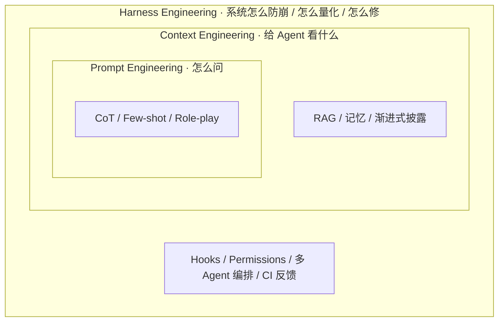

**Phil Schmid 的比喻**：模型是 CPU，Harness 是操作系统——CPU 再强，OS 拉胯也白搭。

**mtrajan 的更直白说法**：
- Context Engineering 管的是 **"给 Agent 看什么"**
- Harness Engineering 管的是 **"系统怎么防崩、怎么量化、怎么修"**

### 1.2 第一次演进：Prompt Engineering（2022-2023）

| 维度 | 说明 |
|------|------|
| 关注点 | 单次 prompt 的措辞、结构、示例 |
| 代表技术 | CoT（Chain-of-Thought）/ Few-shot / Role-playing / Instruction tuning |
| 衡量指标 | 单轮答题正确率 |
| 工具栈 | 写在文档里的 prompt 模板 |
| 局限 | LLM 没有持久记忆；超长任务会失忆；多步任务难协调 |

**典型场景**：用 ChatGPT 写一段代码、翻译一篇文章、生成一个 SQL。

### 1.3 第二次演进：Context Engineering（2024-2025）

随着 LLM 能调用 tool 和 RAG，问题从"prompt 怎么写"变成"**context 里塞什么、什么时候塞、什么时候撤**"。

| 维度 | 说明 |
|------|------|
| 关注点 | 整个 context window 的内容编排 |
| 代表技术 | RAG / Memory / Tool selection / 渐进式披露 / Compaction |
| 衡量指标 | 多轮任务完成率、token 利用效率 |
| 工具栈 | 向量库、memory framework、MCP server |
| 局限 | 还是单 agent 视角；缺约束机制；缺反馈循环 |

**Smart Zone vs Dumb Zone**（Dex Horthy 量化经验）：

> 对一个 168K token 的上下文窗口，**填到约 40% 就开始走下坡路**。

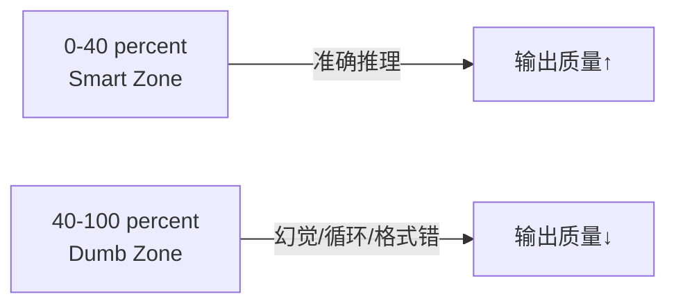

给 Agent 塞一堆 MCP 工具、冗长文档和累积对话历史，**不会让它更聪明——反而让它变笨**。这是 Context Engineering 时代最被低估的事实。

### 1.4 第三次演进：Harness Engineering（2026-）

2026 年 2 月，"Harness Engineering"突然在 AI 工程圈火了起来：

| 时间 | 事件 |
|------|------|
| 2025 年底 | 零星社区讨论 |
| **2026-02** | Mitchell Hashimoto（HashiCorp 创始人）博客**首次明确命名** |
| 2026-02 | OpenAI 发布"Harness engineering: leveraging Codex in an agent-first world"（百万行代码 5 月实验报告）|
| 2026-02 | Martin Fowler 发表深度分析，分类为 Context Engineering / Architecture Constraints / Garbage Collection |
| 2026-03 | Ethan Mollick 重组 AI 指南框架为 "Models, Apps, and Harnesses" 三层 |
| 2026-03 | 知乎 etc. 中文社区跟进 |

#### 关键论断：瓶颈不在智能，而在基础设施

| 实验 | 数据 |
|------|------|
| **Can.ac 实验** | 仅改变 Harness 的工具格式（编辑接口），16 个模型编码基准分数显著提升；**Grok Code Fast 1 从 6.7% 跃升至 68.3%**——零模型权重修改 |
| **LangChain 实验** | 仅 Harness 改进，Terminal Bench 2.0 从第 30 名升至**第 5 名**，同模型 +13.7 分 |
| OpenAI 团队结论 | "真正卡你的不是 Agent 写代码的能力，而是围绕它的结构、工具和反馈机制跟不上" |

> Alex Lavaee 总结："Five independent teams. Same conclusion: **the bottleneck is infrastructure, not intelligence.**"

#### Anthropic 总结的 4 大 Agent 失败模式

| 失败模式 | 表现 |
|---------|------|
| **One-shotting** | 试图一步到位，半途上下文耗尽，下一会话只见半成品 |
| **过早宣胜** | 项目后期看到部分进展就直接宣布"完成"，剩余功能视而不见 |
| **过早标完成** | 写完代码就标 done，没做端到端测试 |
| **环境启动困难** | 每次新会话都要重新搞清楚怎么跑、怎么调，token 全花在重建环境上 |

这 4 大失败模式，单靠 Prompt Engineering 或 Context Engineering 都解决不了——**需要 Harness 层面的干预**。

### 1.5 Harness Engineering 四大支柱

综合 OpenAI、Anthropic、Carlini、Huntley、Horthy 五个独立团队的实践，反复出现并形成收敛：

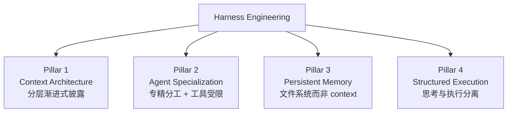

| 支柱 | 核心原则 | 具体做法 |
|------|---------|---------|
| **Pillar 1：Context Architecture** | Agent 应当恰好获得当前任务所需的上下文——不多不少 | AGENTS.md/CLAUDE.md 分层；T1 会话常驻 / T2 按需加载 / T3 知识库 |
| **Pillar 2：Agent Specialization** | 专精 + 受限工具 > 万能 + 全权 | Carlini C 编译器项目分核心/去重/性能/文档四类 Agent；Babel 5 个 bba-guru |
| **Pillar 3：Persistent Memory** | 进度持久化在文件系统，而非 context window | progress.txt + JSON feature list + git 提交；详见第 7 章 |
| **Pillar 4：Structured Execution** | 思考与执行分离 | Boris Tane："永远不要让 Agent 在你审查批准书面计划之前写代码" |

### 1.6 Harness 成熟度模型 H0-H4

不同于第 2 章的 Agent 自主性 L0-L5（讲**单 agent 能力等级**），本节讲**团队/项目的工程化成熟度**：

| 阶段 | 特征 | 工程师角色 | 典型团队 |
|------|------|-----------|---------|
| **H0：无 Harness** | 直接给 Agent prompt，无结构化约束 | 手写代码 + 偶用 AI | 大多数初次接触 AI 编码者 |
| **H1：基础约束** | AGENTS.md + 基础 Linter + 手动测试 | 主要写代码，AI 辅助 | 多数 2024-2025 的团队 |
| **H2：反馈回路** | CI/CD + 自动化测试 + 进度追踪 | 规划+审查为主，部分 AI 编码 | 多数 2026 早期团队 |
| **H3：专业化 Agent** | 多 Agent 角色分工 + 分层上下文 + 持久化记忆 | **环境设计 + 管理为主** | OpenAI / Anthropic / Stripe |
| **H4：自治循环** | 无人值守并行 + 自动熵管理 + 自修复 | **架构师 + 质量把关者** | Stripe Minions / Huntley Ralph Loop |

> ⚠️ **两套不要混淆（H0-H4 vs L0-L5）**：
> - 本章 H0-H4 = **Harness 成熟度**（团队工程化水平）
> - 第 2 章 L0-L5 = **Agent 自主性**（单 agent 能力等级）
> 两者维度正交：成熟 Harness（H4）跑的可能是受限 Agent（L2），反之亦然。

### 1.7 业界六大共识 + 三大空白

#### 六大共识

| # | 共识 | 共识强度 |
|---|------|---------|
| 1 | **基础设施 > 模型智能** | ★★★★★ 全面共识，6+ 来源支持 |
| 2 | **思考与执行必须分离** | ★★★★★ 所有团队独立发现 |
| 3 | **文档必须是活的反馈循环** | ★★★★☆ 强共识 |
| 4 | **上下文不是越多越好（~40% 上限）** | ★★★★☆ 有量化数据 |
| 5 | **约束必须机械化执行** | ★★★★☆ Linter / CI / 结构测试是标配 |
| 6 | **工程师角色：写代码 → 设计环境 + 管理工作** | ★★★★☆ 强共识 |

#### 三大空白（最有探索价值的方向）

| 空白 | 现状 |
|------|------|
| **棕地项目改造** | 所有公开成功案例都是绿地项目；十年遗留代码库怎么引入 Harness？零方法论 |
| **功能验证体系化** | 大家擅长"约束 Agent 不做错事"，但"验证 Agent 做对了事"远未解决 |
| **AI 代码长期可维护性** | LLM 生成代码的技术债积累方式与人类不同；"垃圾回收 Agent"是新兴做法但缺数据 |

### 1.8 IC 工程师的对应物

把上面的抽象概念落到 Babel 这种 IC 项目：

| 通用概念 | Babel 项目落地 |
|---------|---------------|
| AGENTS.md（活文档） | `CLAUDE.md`（项目根 + `.claude/`）+ 每次失败都更新 |
| 专精 Agent 分工 | 5 个 `bba-guru`（architect / rtl / verification / synthesis / pd）|
| 持久化记忆（文件系统） | `designs/<name>/.handoff/*.md` + sha256 + `MEMORY.md` 索引 |
| 思考-执行分离 | MAS 评审 → RTL → 验证 → 综合 → PD 五段流水线，每段有质量门 |
| 机械化约束 | `.claude/hooks/bb-hook-*` + `bb-gate-*-quality` skills |
| Garbage Collection | 待补：Babel 暂未做 AI 代码熵管理（这是 IC 项目改造空间） |

### 1.9 关键引用

主参考：[Harness Engineering 深度解析（知乎，2026-03-08）](https://zhuanlan.zhihu.com/p/2014014859164026634)

一手源：
- Mitchell Hashimoto（2026-02）— Harness Engineering 术语早期命名者
- OpenAI（2026-02）— *Harness engineering: leveraging Codex in an agent-first world*
- Anthropic Engineering — *Effective harnesses for long-running agents*
- Nicholas Carlini（Anthropic）— *Building a C Compiler with Claude*（16 个并行 Agent）
- Martin Fowler — *Harness Engineering* 深度分析
- Stripe — *Minions* 千 PR 无人值守系统
- Dex Horthy — *Advanced Context Engineering for Coding Agents*（Smart Zone 概念）


---

## 第 2 章 · Agent 总体分类与架构（Google 2026 视角）

> 本章基于 Google 一手白皮书：
> - *Agents* (Wiesinger et al., 2024-09) — 三层架构经典模型
> - *Agents Companion* (Gulli et al., 2025-04) — 多智能体进阶
> - *Introduction to Agents* (Blount et al., 2025-11) — Agent 系统五级 taxonomy
> - *Developer's guide to multi-agent patterns in ADK* (Google Developers, 2025-12)
> - *Build Long-running AI agents with ADK* (Google Developers, 2026-05)

### 2.1 Agent 的定义（官方）

Google *Agents* 白皮书原文：

> *"An application that attempts to achieve a goal by observing the world and acting upon it using the tools that it has at its disposal."*

简译：**用工具感知世界、行动达成目标的程序**。

关键词三个：
- **goal**（目标）—— 不是单轮问答
- **observing**（感知）—— 有反馈回路
- **tools**（工具）—— 能改变外界

### 2.2 Agent vs LLM 模型

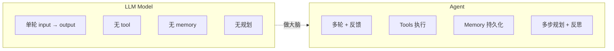

| 维度 | LLM Model | Agent |
|------|-----------|-------|
| 知识范围 | 训练数据 + 单 prompt | + 实时检索 + 持久记忆 |
| 工具 | 无原生支持 | 原生 Extensions/Functions/Data Stores |
| 推理层 | 用户在 prompt 里手写 CoT | 内建 cognitive architecture |
| 状态 | 无状态 | 跨 session 维护 |
| 自主性 | 一问一答 | 主动规划下一步 |

### 2.3 Agent 三层架构（Google 经典模型）

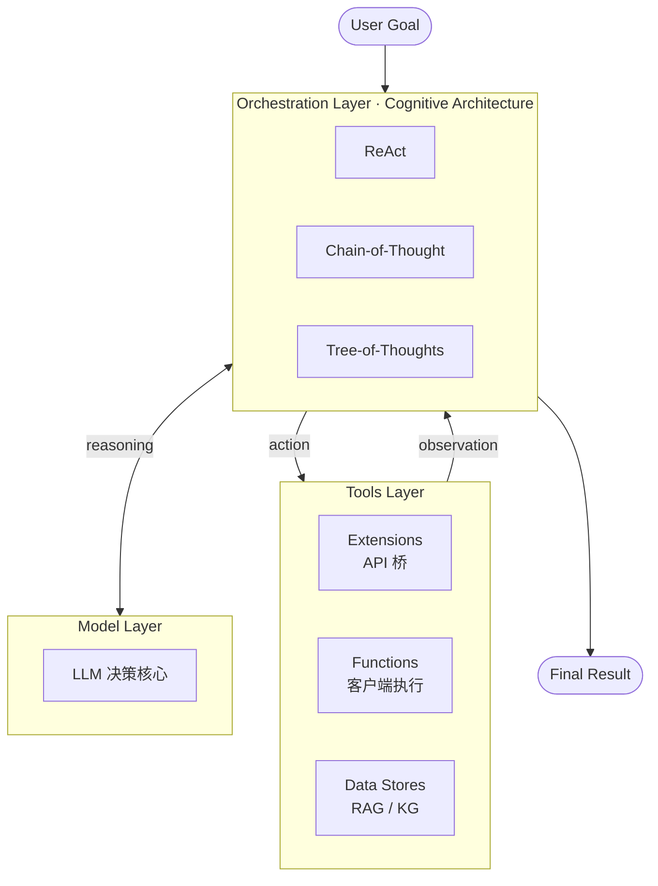

| 层 | 职责 | 关键技术 |
|----|------|---------|
| **Model Layer** | 决策核心 | LLM（Gemini / Claude / GPT / DeepSeek）；可多模型组合 |
| **Orchestration Layer** | 推理 + 规划 + 决策循环 | ReAct（Reason+Action）/ CoT / ToT / 自定义 cognitive arch |
| **Tools Layer** | 与外界交互 | **Extensions**：agent-side API；**Functions**：client-side 执行；**Data Stores**：RAG/KG/vector DB |

> **三个 Tools 子类型的差别**（IC 场景类比）：
> - Extensions = 综合服务器 API 调用（agent 直接调远程）
> - Functions = 本地 verilator 命令（agent 让 host 执行后回传）
> - Data Stores = wiki/protocols/ + cbb 库（向量化检索）

### 2.4 Agent 自主性六个层级 L0-L5

> ⚠️ **来源说明**：Google *Introduction to Agents* (2025-11) 给出 **L0-L4 五级 taxonomy**；本节加入业界普遍认知的 **L5 完全自主**凑成六级。**L5 部分非 Google 原文**，标注清楚以保学术诚实。

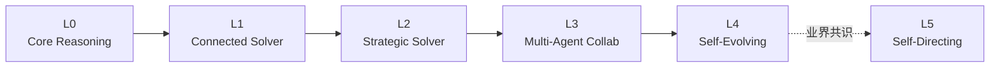

| 级 | 名称 | 一句话定义 | 关键能力 | 例子 | 来源 |
|----|------|-----------|---------|------|------|
| **L0** | Core Reasoning System | LLM 单轮推理，无 tool | 仅 reasoning | ChatGPT 早期、Translate | Google 官方 |
| **L1** | Connected Problem-Solver | LLM + tools 单轮工具调用 | + Tool use | GitHub Copilot autocomplete、ChatGPT with Browsing | Google 官方 |
| **L2** | Strategic Problem-Solver | 多步规划 + memory + 反思 | + 规划 + 记忆 + ReAct | **Claude Code default 模式**、Cursor agent | Google 官方 |
| **L3** | Collaborative Multi-Agent System | 多 agent 协作 + A2A 通信 | + 多 agent + 编排 | **Babel 5 个 bba-guru**、Stripe Minions | Google 官方 |
| **L4** | Self-Evolving System | 自我学习 + 自我改进 | + 持续学习 | Carlini C 编译器项目（16 agent）、Voyager | Google 官方 |
| **L5** | Self-Directing | Agent 自定目标，无人监督 | + 自定 goal | 暂无生产部署；CSA 明确说"L5 不适合企业"| 业界共识（CSA Trust Framework, 2026）|

#### 用户角色与 Agent 自主性的映射

借用 Knight Institute 框架（用户视角）：

| Level | 用户角色 | 控制粒度 |
|-------|---------|---------|
| L0-L1 | **Operator**（操作员）| 每个动作前批准 |
| L2 | **Collaborator**（协作者）| 共同规划，可随时接管 |
| L3 | **Consultant**（顾问）| 提供专业意见与偏好 |
| L4 | **Approver**（审批人）| 仅在风险/失败点介入 |
| L5 | **Observer**（观察者）| 紧急停止开关，平时只看 |

> **2026 年实战**：L2-L3 是大多数生产部署所在；L4 在 Carlini 编译器、Stripe Minions 等先驱团队出现；**L5 没有任何可信生产案例**（Cloud Security Alliance 2026-01 报告原话："not appropriate for enterprise deployment today"）。

#### Claude Code 在哪一级

| 模式 | 默认级别 |
|------|---------|
| Claude Code 普通对话 | **L2**（Strategic Problem-Solver）|
| 启用 sub-agent 后 | **L3**（Multi-Agent Collaboration）|
| Claude Code Auto Mode（2026-03 推出） | **L3-L4** 之间（Background full auto with sandbox）|
| Babel 五 guru 流水线 | **L3** |

### 2.5 单 Agent vs 多 Agent 系统

何时升级到多 Agent？Google ADK 团队的判断标准：

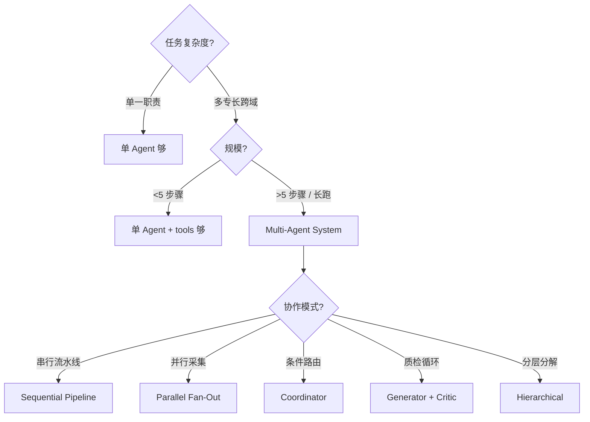

**多 Agent 比单 Agent 多付出的代价**：
- 协调成本（编排开销）
- 状态同步（race condition）
- 调试难度（分布式 trace）
- token 成本（每个 agent 都吃 context）

### 2.6 八大 Multi-Agent 设计模式（Google ADK, 2025-12）

直接来自 Google 官方 *Developer's guide to multi-agent patterns in ADK*：

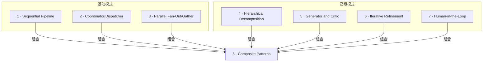

| # | 模式 | 别名 | 适用场景 | IC 例子 |
|---|------|------|---------|---------|
| 1 | **Sequential Pipeline** | 流水线 | 步骤固定的串行流程 | **Babel：architect → rtl → verify → synth → pd** |
| 2 | **Coordinator/Dispatcher** | concierge 接待员 | 按意图路由到专家 | 用户说"综合"→ 路由到 synth guru |
| 3 | **Parallel Fan-Out/Gather** | octopus 八爪鱼 | 同任务多视角并行 | 多 corner 并行 STA + 综合 + PD timing 三家同时跑 |
| 4 | **Hierarchical Decomposition** | russian doll 套娃 | 复杂任务递归分解 | top-level architect → 把 IO ring 分给 child agent |
| 5 | **Generator and Critic** | editor's desk 编辑桌 | 质检循环 | RTL coder 生成 → code reviewer 审查 → 修改 |
| 6 | **Iterative Refinement** | sculptor 雕刻 | 多轮逼近最优 | yosys 综合 → STA 报错 → 加约束再综合，循环至 WNS≥0 |
| 7 | **Human-in-the-loop** | 人类安全网 | 高风险决策需人审 | PD signoff 前必须用户批准（Babel USER_GATE）|
| 8 | **Composite** | 组合套用 | 真实大型系统 | Babel 整体 = Sequential + Hierarchical + HITL + Iterative 组合 |

#### 八大模式各自的 mermaid

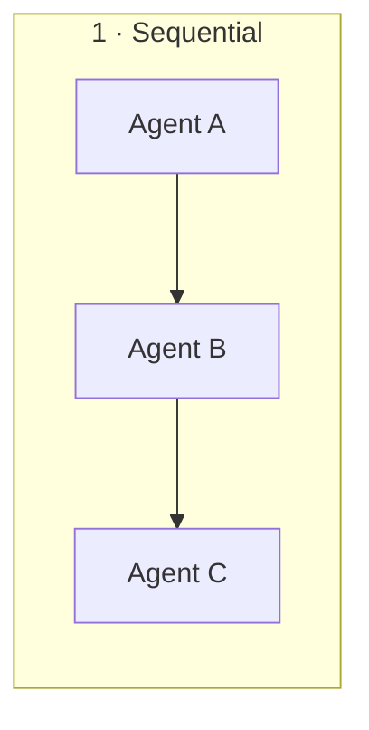

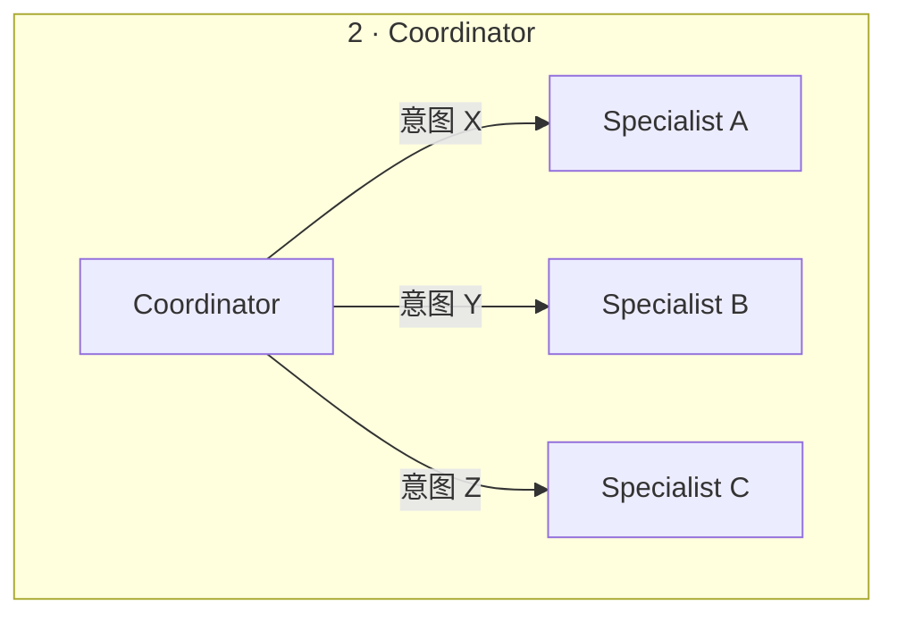

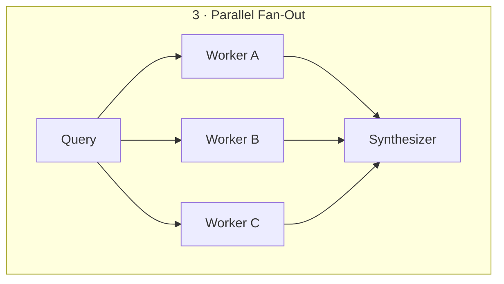

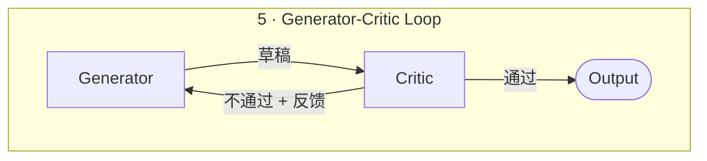

### 2.7 Agent 互通协议：MCP + A2A

两个互补的开放协议，2025 起在 Google / Anthropic / 业界协同推动：

| 协议 | 用途 | 主推方 | 时间 |
|------|------|--------|------|
| **MCP** (Model Context Protocol) | Agent ↔ 外部工具/数据 | Anthropic 2024-11 | 已成事实标准 |
| **A2A** (Agent2Agent Protocol) | Agent ↔ Agent | Google 2025 | 与 MCP 互补 |

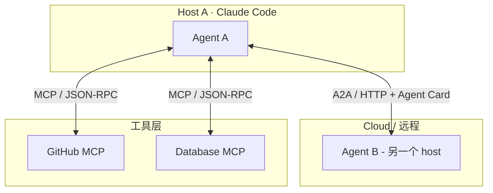

#### Agent Card — Agent 的"名片"

A2A 协议的核心概念：每个 agent 暴露一个 JSON 文件描述自己：

```json
{
  "name": "qor-watcher",
  "description": "QoR regression monitor",
  "url": "https://my-cluster.local/agents/qor-watcher",
  "capabilities": ["query_status", "open_issue"],
  "input_schema": { "design": "string" },
  "output_schema": { "regression": "boolean", "details": "object" }
}
```

调用方读到这张"名片"后，知道这个 agent 能做什么、怎么调。**类似服务发现 / OpenAPI**，但是面向 agent-to-agent 的。

#### Babel 项目目前用的是什么？

- ✅ **MCP**：通过 `mcp__plugin_*` 接入 Context7、Serena、Exa 等
- ❌ **A2A**：**未使用**。Babel 的 5 个 guru 通过**文件系统 handoff**（`.handoff/<label>.md` + sha256）通信，本质是"信箱模式"

A2A 适合**跨 host / 跨进程 / 跨语言**的多 agent 协作；Babel 单 host 内部用文件系统更轻量。**两种都是合法的多 agent 通信模式**——后者类似 message queue + content-addressable storage。

### 2.8 长任务 Agent 设计（2026 趋势）

Google Developers Blog (2026-05-12) *Build Long-running AI agents that pause, resume, and never lose context with ADK* 提出的关键能力：

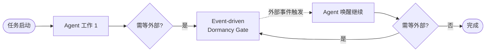

**用例**：员工入职 onboarding agent
1. 发欢迎邮件
2. **暂停几天**等员工签文件（不占资源）
3. 委托 IT provisioning sub-agent
4. **再暂停**等硬件到货
5. 发 day-1 personalized schedule

**关键设计点**：
- ❌ 不要"主动 polling"或"阻塞线程"
- ✅ 用 **event-driven dormancy gate** —— agent 进入睡眠，由外部事件唤醒
- ✅ 持久化所有状态到文件系统（详见第 7 章）

**对 IC 项目的启示**：综合一次几小时、PD 一次几天——agent 不应"占着 GPU 干等"，应该 dormant 直到 LSF 任务回调通知。Babel 项目目前是**同步阻塞**模式（轮询 yosys log），是改造点。


---

## 第 3 章 · 底层支撑技术：LLM / CLI / MCP / RAG / LSP

> 第 1 章讲了"为什么"，第 2 章讲了"分类"，本章讲"五脏六腑"。看完这章你能解释：一次 `Read .claude/agents/foo.md` 背后到底走了多少层协议。

### 3.1 关系全景图

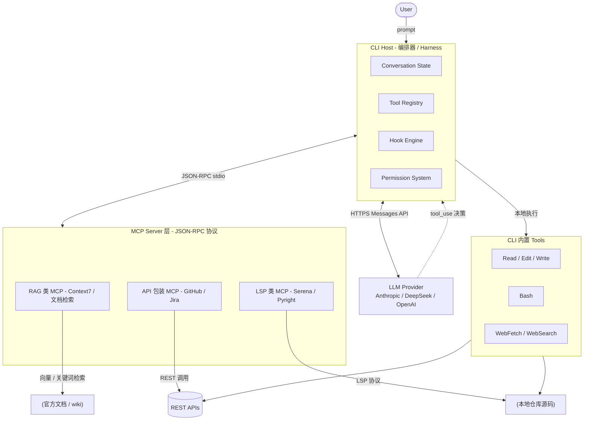

**一句话**：CLI 是壳，LLM 是脑，MCP 是骨架，RAG 与 LSP 是两类典型的"外接器官"。

### 3.2 LLM — 大脑

**定义**：自回归 Transformer。给定 input tokens，逐 token 输出概率分布并采样。

**与 agent 相关的关键属性**：

| 属性 | 含义 | 工程后果 |
|------|------|---------|
| **无状态** | 每次 API 调用都需带完整对话历史 | 上下文是唯一"记忆"——所以才需要 CLI 维护 conversation state |
| **Tool use 微调** | 模型被 fine-tune 学会"什么时候输出 tool_use 而非 text" | tool description 直接影响调用决策；写不清就不会被调 |
| **Token 经济** | 输入 + 输出都按 token 计费 | "省 token" = 省钱 + 提升质量 |
| **Thinking budget** | 高级模型支持"扩展思考"tokens | 复杂决策给更大 budget，简单任务关掉 |
| **Knowledge cutoff** | 训练数据有截止日期 | 新文档/新 API 必须靠 RAG / WebFetch 现拉 |

**调用链路**：

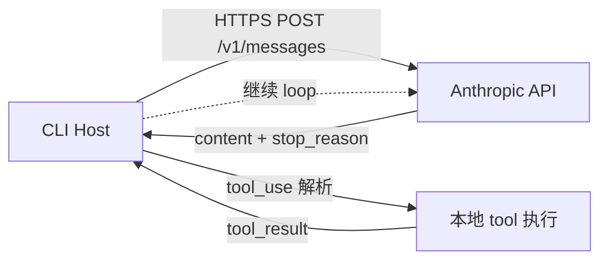

请求 body：`{ model, system, messages[], tools[], thinking? }`
返回：`{ content: [text|tool_use], stop_reason }`

> **国产模型接入**：通过 LiteLLM/OneAPI 网关把 DeepSeek-V4 的 OpenAI 协议转成 Anthropic Messages 协议。Claude Code 不关心后端是谁，只认协议。

### 3.3 CLI — 编排器（Host / Harness）

**定义**：跑在工程师机器上的命令行客户端。Claude Code、Cursor、Aider、Codex 都是同一品类。

**核心职责**（详见第 1 章 Harness 框架的 OS 类比）：

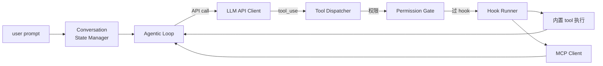

**为什么叫 "Harness"**（参见第 1 章详述）：harness 是"挽具"，套在 LLM 这匹"野马"外把不确定性约束在工程边界里。

**CLI 形态 vs IDE 插件（Cursor 等）**：CLI 把 agent 编排和编辑器渲染解耦——可无 GUI 跑（CI 里跑 review agent）、可远程跑（ssh 进生产机）、可批跑（夜间 30 个 issue 并行）。

### 3.4 MCP — 工具连接协议

**定义**：Model Context Protocol，Anthropic 2024-11 开源。被誉为"AI 时代的 USB-C"。

**为什么需要**：

- 没 MCP：每个 agent host（Cursor / Claude Desktop / ...）自定义工具集成方式；工具方写 N 份适配
- 有 MCP：工具方实现一次 MCP server，所有 host 都能直接接入

**协议三要素**：

| 原语 | 类型 | 作用 |
|------|------|------|
| `tools` | 函数调用 | 模型可触发的"动作" |
| `resources` | 数据读取 | 模型可读的"文件" |
| `prompts` | 提示模板 | 用户/agent 可调用的预置 prompt |

**通信方式**：

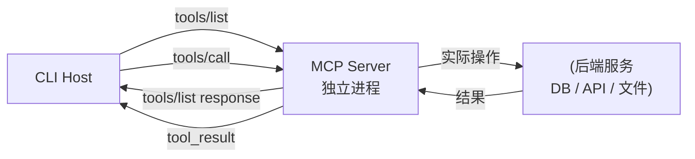

实际 transport 三种：
- **stdio**（最常用）：MCP server 是子进程，stdin/stdout 双向 JSON
- **HTTP / SSE**：远程 MCP server（团队共享）
- **WebSocket**：长连接

**Claude Code 中的 MCP 例子**：

| MCP server | 提供能力 | 类别 |
|-----------|---------|------|
| `context7` | 主流库官方文档检索 | RAG 类 |
| `serena` | 多语言 LSP 桥（find_symbol/references） | LSP 类 |
| `playwright` | 浏览器自动化 | 工具类 |
| `github` | GitHub API 完整封装 | API 类 |
| `memory` | 跨 session KV 记忆 | 状态类 |

注册到 settings.json：

```json
{
  "mcpServers": {
    "context7": {
      "command": "npx",
      "args": ["-y", "@upstash/context7-mcp@latest"]
    }
  }
}
```

工具命名空间：`mcp__<server>__<tool>`。

#### 与 A2A 的关系（参见第 2 章 2.7 节）

- **MCP**：agent ↔ tools / data
- **A2A**：agent ↔ agent
- 两者互补，不替代

### 3.5 RAG — 检索增强生成

**定义**：Retrieval-Augmented Generation。先**检索**与 query 相关的知识片段，再把片段塞进 prompt 让 LLM 基于片段**生成**答案。

**为什么需要**：

- LLM 训练数据有 cutoff，新文档没见过
- 参数知识压缩损失大、易幻觉
- 私有/内部知识不在公开训练集
- 一次塞整本手册超 context 窗口

**三种 RAG 风味**：

| 类别 | 检索方式 | 适用 | 例子 |
|------|---------|------|------|
| **向量 RAG** | embedding 余弦相似度 | 语义模糊查询、跨语言、概念匹配 | Context7、ChromaDB、Pinecone |
| **关键词 RAG** | BM25 / 倒排索引 / grep | 精确符号、错误码、固定术语 | ripgrep、ElasticSearch |
| **Agentic Search** | LLM 自己决定下一步查什么（多轮） | 复杂、需多次细化 | Claude Code 的 Explore agent |

**典型工作流**（向量 RAG）：

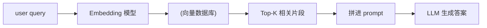

**Claude Code 中的 RAG 体现**：

| 场景 | 实现 |
|------|------|
| 查 React/PostgreSQL 等开源库文档 | `context7` MCP（向量 + 全文） |
| 查 Babel 协议 wiki | `bb-search-protocol` skill |
| 查 Babel CBB 复用库 | `bb-search-cbb` skill |
| 搜代码语义 | Explore agent（agentic） |

**IC 工程师的 RAG 应用场景**：

- **协议库 RAG**：UART/AXI/UCIe 文档建索引，agent 写 RTL 前先检索 protocol handshake
- **CBB 复用 RAG**：sync-fifo / 2ff-sync / clock-gate 等实现 + 接口 + 验证报告打包向量库
- **错误码 RAG**：yosys / OpenSTA 错误码 + 历史 fix，综合失败时自动检索类似 case
- **PDK doc RAG**：ASAP7 lib 文档（drive strength 选择、metal stack）建库

### 3.6 LSP — 语义透镜

**定义**：Language Server Protocol。Microsoft 2016 提出的 IDE 与语言分析工具标准化协议。VSCode/Vim/Emacs/IntelliJ 都靠它支持几十种语言。

**核心思想**：IDE 端通用 UI ↔ 语言端通用分析——把 N×M 的实现量降到 N+M。

**协议**：JSON-RPC（与 MCP 同源思想）。常用 transport 是 stdio 或 socket。

**LSP 提供的能力**（agent 视角）：

| 请求 | 作用 | grep / Read 替代成本 |
|------|------|---------------------|
| `textDocument/definition` | 跳到定义 | grep 找定义靠运气 |
| `textDocument/references` | 找所有引用 | grep 漏 alias、宏、跨语言 |
| `textDocument/hover` | 悬停信息（签名+doc） | Read 整个文件再人脑解析 |
| `textDocument/documentSymbol` | 文件内符号大纲 | grep 头尾不全 |
| `workspace/symbol` | 全工程符号搜索 | grep 全仓库 |
| `textDocument/rename` | 跨文件安全重命名 | sed 危险 |
| `textDocument/diagnostics` | 实时错误/警告 | 得跑编译 |

**典型 LSP 调用**：

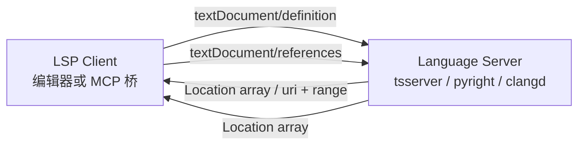

**为什么 agent 时代 LSP 极其重要**：

- agent 的"原始 IO"是 grep + Read。grep 找不到语义；Read 一次只能看一个文件
- LSP 让 agent 像编译器一样"看见"代码：函数和类不是字符串，是有定义、引用、类型的实体
- token 经济：LSP 返回的是结构化短结果（路径+行号+签名），不是文件全文

**Claude Code 中的 LSP 体现**：

| MCP / 工具 | 桥接的 LSP |
|------------|-----------|
| `serena` MCP | 多语言（Pyright / TS Server / clangd / gopls / ...） |
| `pyright-lsp` 插件 | 仅 Python |
| 用户自有 `thanosLSP` | SystemVerilog（IC 工程师专用） |

**IC 场景**：

- **SystemVerilog LSP**（thanosLSP / svlangserver / verible）：跳到 module 定义、查找所有实例化、解析端口连接
- **TCL LSP**（SDC / 综合脚本）：跳到 procedure 定义、查找 set_clock_groups 用法
- **Python LSP**（pyright）：写 testbench / cocotb / 自动化脚本

```
agent 接到 ready-for-rtl handoff
    ↓
用 thanosLSP MCP 的 documentSymbol 列出 mas 所述 modules
    ↓
对每个 module 用 references 找引用关系
    ↓
跨域信号检查：用 LSP 找到所有 always 块的 sensitivity list
```

用 grep 做这些，要么漏要么多——LSP 是精确语法分析。

### 3.7 RAG vs LSP — 一表辨析

| 维度 | RAG | LSP |
|------|-----|-----|
| **输入** | 自然语言 query | 符号位置（uri + line + col） |
| **输出** | 相关文本片段（带相似度） | 精确结构化结果（location / symbol） |
| **模糊度** | 高（语义相似就行） | 零（语法精确） |
| **协议** | 私有 / 各家不同 | 标准 JSON-RPC |
| **适合** | 文档、wiki、跨项目知识 | 单仓库内代码导航 |
| **token 成本** | 中（top-k 片段 ≈ 1-3k） | 低（仅必要片段 ≈ 100-500） |
| **新鲜度** | 取决于索引更新频率 | 实时（基于当前文件） |
| **Claude Code 入口** | `mcp__context7__*` / 自研 search skill | `mcp__serena__*` / `thanosLSP` |

**协同范式**：

```
阶段 1：RAG 找候选
    "我要 32-bit FIFO" → context7 → wiki + 3 个候选实现

阶段 2：LSP 验证候选
    serena.find_symbol("sync_fifo_v2") → 看签名、参数、引用

阶段 3：Read 加载完整代码
    把锁定的目标文件读进 context

阶段 4：LLM 生成 + Edit
    基于 RAG 的"为什么"+ LSP 的"在哪里" + Read 的"长什么样"
```

### 3.8 五件套关系总结

```mermaid
flowchart TB
    LLM["LLM<br/>大脑：决策与生成"]
    CLI["CLI<br/>身体：编排与执行"]
    MCP["MCP<br/>骨架：工具连接协议"]
    RAG["RAG<br/>记忆：外部知识检索"]
    LSP["LSP<br/>视觉：代码语义分析"]

    CLI -->|HTTPS| LLM
    CLI -->|JSON-RPC| MCP
    MCP -->|实现路径之一| RAG
    MCP -->|实现路径之一| LSP
```

**口诀**：

> CLI 是身体，LLM 是脑，MCP 是脊柱，RAG 是记忆，LSP 是眼睛。
> 没有 CLI，LLM 不能动手；没有 MCP，扩展只能写死；没有 RAG，新知识进不来；没有 LSP，代码看得见名字看不见结构。

### 3.9 IC 工程师的"先做哪个"建议路径

刚开始建 harness 的优先级（每天都有可见产出，不陷入"先架构后产出"的泥潭）：

| 顺序 | 工作 | 时间投入 |
|------|------|---------|
| 1 | **CLI（Claude Code）装好** | 1 天 |
| 2 | **写 1 个简单 hook** — 阻断 destructive bash | 半天 |
| 3 | **接入 1 个 RAG MCP** — `context7` 或自建协议 wiki 索引 | 半天 |
| 4 | **写 1 个 wrapper skill** — 把 yosys 包装一下 | 1 天 |
| 5 | **接入 1 个 LSP MCP** — `serena` 或 SystemVerilog LSP | 1 天 |
| 6 | **写 1 个 sub-agent** — Lab 3 的 QoR Watcher | 1 天 |


---

## 第 4 章 · Coding Agent 是什么——五分钟原理

### 4.1 一句话定义

> **Coding Agent = 一个跑在 LLM 上的有限循环**：用户给意图 → LLM 决定调一个或多个 tool → tool 在本地执行 → 结果回喂 LLM → LLM 决定下一步 → 直到 LLM 说"完成"或被强制停止。

```mermaid
flowchart LR
    U([User prompt]) --> LLM[Claude LLM]
    LLM -->|tool_use| T[Tool exec]
    T -->|tool_result| LLM
    LLM -.->|reads| CTX[Context Window]
    T -.->|operates on| FS[Local Filesystem]
    LLM --> EXIT([end_turn])
```

### 4.2 Context Window：所有问题的根源

LLM 没有持久记忆——每一次"思考"都要把**它当前知道的一切**装进一个固定大小的窗口（Sonnet 4.6 默认 200k token，Opus 4.7 可达 1M）。

| 占用上下文的东西            | 例子（Babel 项目实测） |
|----------------------------|----------------------|
| System Prompt              | Claude Code 自身约 4–6k token |
| CLAUDE.md（项目 + 全局）   | Babel 全局 + 项目共约 3k |
| Tool definitions           | 内置 + MCP = 1–5k |
| Skill metadata（仅 name+description） | 81+ 个 skill ≈ 4–5k |
| 用户消息 + Claude 回复历史 | 主要消耗 |
| 文件 Read 结果             | 大头 |
| Hook 注入                  | 每次 prompt 可能注入 |

> **Harness 第一定律**：**Context is the bottleneck, not intelligence.** 上下文写满了，再聪明的模型也只会胡说八道或忘事。所有扩展机制（progressive disclosure / sub-agent isolation / compaction）本质都是**省 context**。

### 4.3 Tool Use：Agent 的"手"

Tool 就是一个**带 JSON Schema 的函数**。LLM 在每一步可以选择调用一个或多个 tool，Claude Code 解析 JSON 参数，本地执行，把结果回填。

Claude Code 内置工具（你已经用过）：

| Tool            | 作用                       | 典型 IC 场景 |
|-----------------|----------------------------|--------------|
| `Read`          | 读文件（带行号）           | 读 RTL、读 lib、读 log |
| `Edit`          | 字符串替换式编辑           | 修改一处时序约束 |
| `Write`         | 写整文件                   | 生成新 SDC、新 TB |
| `Bash`          | 跑 shell 命令              | 调 yosys / verilator |
| `Grep`          | 工程级 ripgrep              | 找信号、找模块 |
| `Glob`          | 文件名模式匹配             | 找所有 *.sv |
| `Agent`         | 派生 sub-agent             | 把综合委派给 bba-guru-synthesis |
| `Skill`         | 调用一个 skill             | 跑 /bb-invoke-yosys |
| `TaskCreate/Update/List` | 进度追踪              | 流水线 stage 跟踪 |
| `WebFetch / WebSearch`   | 网络访问              | 查 ASAP7 文档 |

**MCP（Model Context Protocol）工具**——通过 MCP server 注入的外部 tool，命名空间一般是 `mcp__<server>__<tool>`，例如 `mcp__plugin_serena_serena__find_symbol`、`mcp__plugin_ecc_context7__query-docs`。MCP 让你把任何 API（GitHub、JIRA、内部 EDA 服务器）暴露给 agent。

### 4.4 一次 Agentic Loop 的细节（追踪示例）

假设用户输入："综合 designs/foo 这个设计"

```
turn 1:
  USER  → "综合 designs/foo 这个设计"
  LLM   → tool_use: TaskCreate { subject: "综合 foo" }
  HOST  ← task_id=42
turn 2:
  LLM   → tool_use: Read { path: "designs/foo/rtl_artifact.json" }
  HOST  ← {top_module: "foo", file_list: "designs/foo/file_list.f"}
turn 3:
  LLM   → tool_use: Skill { skill: "bb-invoke-yosys", args: "..." }
  HOST  ← {WNS: 0.12, area: 4500, errors: 0}
turn 4:
  LLM   → tool_use: TaskUpdate { taskId: 42, status: "completed" }
  LLM   → end_turn
  LLM   → "综合完成，WNS = 0.12 ns，area = 4500 μm²"
```

每一个 turn，Claude Code 把**完整对话历史 + tool 结果**重新发给 API。**没有隐藏状态**——这是 harness 可调试的基础。


---

## 第 5 章 · 四大扩展点（核心概念）

> **记忆口诀：T-H-S-A-C**
>
> - **T**ool   — 能做什么
> - **H**ook   — 何时强制介入
> - **S**kill  — 知识与流程模板
> - **A**gent  — 独立专家（隔离上下文）
> - **C**ommand— 用户触发入口（slash command）

### 5.1 Tool — 最底层的能力单元

Tool 由 Claude Code 或 MCP server 提供。**作为用户你一般不直接写 tool**（除非你写 MCP server），但你必须知道每个 sub-agent 能用哪些 tool。

**Permission system**（settings.json 的 `permissions`）：

```json
{
  "permissions": {
    "allow": ["Bash(yosys *)", "Bash(verilator *)", "Read", "Write"],
    "deny":  ["Bash(rm -rf *)", "Bash(sudo *)"],
    "ask":   ["WebFetch(*)"]
  }
}
```

> Babel 项目把"危险命令"放进 PreToolUse hook（见 `.claude/hooks/bb-hook-validate-bash-cmd.sh`）做软警告，把"目录越界写"放进 hook 做硬阻断（`bb-hook-write-arch-freeze-check.sh`）。

### 5.2 Hook — 生命周期的"门栓"

> Hooks are user-defined shell commands, HTTP endpoints, or LLM prompts that execute automatically at specific points in Claude Code's lifecycle. ——官方文档

#### Hook 事件全集（高频）

| 事件                | 触发时机                              | 典型用途 |
|---------------------|---------------------------------------|---------|
| `SessionStart`      | 会话开始 / resume / compact 后         | 注入项目状态（git status、当前 sprint） |
| `UserPromptSubmit`  | 用户提交 prompt 之前                   | 输入验证、注入额外上下文 |
| `PreToolUse`        | tool 调用之前                          | 阻断危险命令、改写参数、自动批准白名单 |
| `PostToolUse`       | tool 调用成功之后                      | 触发 formatter / linter、日志、流水线 advance |
| `PostToolUseFailure`| tool 调用失败之后                      | 报错诊断、回滚 |
| `Stop`              | Claude 回复结束                        | 完成度自检 |
| `SessionEnd`        | 会话结束                               | 生成 session summary |
| `PreCompact` / `PostCompact` | 上下文压缩前后                | 备份 transcript、重注入关键事实 |
| `SubagentStart` / `SubagentStop` | 子代理启停           | 跨 agent 协调 |
| `FileChanged`       | 受监控文件变更                         | 重新加载环境变量 |
| `CwdChanged`        | 当前目录变化                           | direnv 加载 |

#### Hook 运行模型

1. 事件触发 → Claude Code 检查匹配的 hook 配置。
2. **stdin** 把一个 JSON 对象（含 `session_id`、`cwd`、`tool_name`、`tool_input` 等字段）传给 hook handler。
3. hook 进程是**同步阻塞**的——它跑多久，会话就卡多久（保持 ms～秒级！）。
4. **stdout** 返回 JSON 决策；**exit code** 也参与：非零通常表示"失败/阻断"（PreToolUse 可借此 deny）。

#### 完整结构（settings.json）

```json
{
  "hooks": {
    "PreToolUse": [
      {
        "matcher": "Bash",
        "hooks": [
          {
            "type": "command",
            "if": "Bash(rm *)",                       // ← 新增：二级过滤，避免无谓 spawn
            "command": "${CLAUDE_PROJECT_DIR}/.claude/hooks/block-rm.sh"
          }
        ]
      }
    ]
  }
}
```

#### Matcher 语法（重要）

| Matcher 值                  | 解析为              | 例子 |
|----------------------------|---------------------|------|
| `"*"` / `""` / 省略         | 匹配全部             | 每次都触发 |
| 仅字母/数字/`_`/`|`          | 精确匹配 或 `|` 分隔列表 | `Bash`、`Edit\|Write` |
| 含其他字符                  | JavaScript 正则     | `^Notebook`、`mcp__memory__.*` |

#### Hook 返回结构（PreToolUse 示例）

```bash
#!/bin/bash
COMMAND=$(jq -r '.tool_input.command')
if echo "$COMMAND" | grep -q 'rm -rf'; then
  jq -n '{
    hookSpecificOutput: {
      hookEventName: "PreToolUse",
      permissionDecision: "deny",
      permissionDecisionReason: "Destructive command blocked"
    }
  }'
else
  exit 0
fi
```

#### Babel 项目的 hook 群（实战范例）

```
.claude/hooks/
├── bb-hook-validate-bash-cmd.sh       PreToolUse:Bash    危险命令软警告
├── bb-hook-commit-quality-gate.sh     PreToolUse:Bash    git commit 前跑质量门
├── bb-hook-write-arch-freeze-check.sh PreToolUse:Write|Edit  arch 冻结后禁写
├── bb-hook-instantiate-cbb-search.sh  PreToolUse:Write|Edit  实例化前查 CBB 库
├── bb-hook-validate-wiki.sh           PreToolUse:Read    避免读取无效 wiki 路径
├── bb-hook-change-propagate.sh        PostToolUse:Write|Edit 自动传播变更
├── bb-hook-pipeline-advance.sh        PostToolUse:Write|Edit 写 handoff → 提示下一步
├── bb-hook-create-fix-issue.sh        PostToolUse:Write|Edit 失败自动开 issue
├── bb-hook-validate-input-schema.sh   UserPromptSubmit   schema 校验输入
└── bb-hook-session-summarize.sh       SessionEnd         生成 session 摘要
```

### 5.3 Skill — 知识与流程的"百科条目"

#### 定义

> Skills are markdown files (`SKILL.md`) containing knowledge, workflows, or instructions Claude can load on demand or you can trigger with `/skill-name`. ——官方文档

**位置**：

| 路径                                     | 范围             |
|------------------------------------------|------------------|
| `~/.claude/skills/<name>/SKILL.md`       | 所有项目         |
| `.claude/skills/<name>/SKILL.md`         | 当前项目         |
| Plugin's `skills/<name>/SKILL.md`        | 启用的 plugin    |

#### Progressive Disclosure（三级加载）— Skill 的灵魂

| 层级                    | 何时加载         | 大小预算       | 内容 |
|-------------------------|------------------|----------------|------|
| **L1：metadata**        | 总在 context     | ~100 token/skill | YAML frontmatter（name + description） |
| **L2：SKILL.md body**   | 触发时           | <5000 token   | 工作流、命令、决策树 |
| **L3：bundled 资源**    | LLM 按需读       | 无限           | `references/`、`examples/`、`scripts/` |

**为什么重要？** 装 100 个 skill 也只消耗 ~10k token 的 L1。Skill 的描述必须能让 LLM 一眼看懂"什么时候用我"。

#### Frontmatter 字段

```yaml
---
name: bb-invoke-yosys
description: "调用 Yosys 0.35 对 RTL 进行逻辑综合并技术映射到 ASAP7 标准单元，产出门级网表 + QoR 报告。"
when_to_use: "用户说『综合』『跑 yosys』，或上游 sub-agent 处于 ready-for-synth 状态。"
disable-model-invocation: false   # LLM 可自动调用（默认）
user-invocable: true              # 用户可 /xxx 触发（默认）
---
```

| 字段                       | 说明 |
|----------------------------|------|
| `name`                     | 标识；目录名同名 |
| `description` *(recommended)* | LLM 据此决定是否用；**把最关键的触发场景放在前面** |
| `when_to_use`              | 额外触发线索（与 description 合计 ≤1536 字符） |
| `disable-model-invocation` | `true` = 只允许用户 `/xxx` 触发（适合有副作用的命令，例如 /deploy） |
| `user-invocable`           | `false` = 从 `/` 菜单隐藏，仅 LLM 可用（适合纯背景知识） |

#### 与 Slash Command 的关系（重要演进）

> Custom commands have been merged into skills. `.claude/commands/deploy.md` 和 `.claude/skills/deploy/SKILL.md` 都创建 `/deploy`，二者等价。`.claude/commands/` 仍向后兼容。

**结论**：**新建一律走 skill**，因为 skill 多出三件事：
1. 可以带 `references/`、`scripts/`、`examples/`（progressive disclosure）。
2. 可以被 LLM **自动**调用，不只是用户 `/` 触发。
3. 可以塞进 sub-agent 的 `skills:` 字段预加载。

#### Babel 内部的 skill 分类

```
.claude/skills/
├── bb-prd            ┐
├── bb-arch           │ 流程类（生成产物）
├── bb-mas            │
├── bb-rtl-coder      ┘
│
├── bb-invoke-yosys      ┐
├── bb-invoke-verilator  │ 工具适配层（包装 EDA 命令）
├── bb-invoke-opensta    │
├── bb-invoke-magic      ┘
│
├── bb-check-lint        ┐
├── bb-check-cdc         │ 检查类（lint / CDC / coverage）
├── bb-collect-coverage  ┘
│
├── bb-gate-rtl-quality  ┐
├── bb-gate-test-quality │ 门禁类（pass/fail 决策）
├── bb-gate-synth-quality│
├── bb-gate-pd-quality   ┘
│
├── bb-create-issue   ┐ Babel 自研 issue 协议
├── bb-list-issues    │
├── bb-close-issue    ┘
│
└── bb-search-protocol / bb-search-cbb  搜索类
```

### 5.4 Sub-agent — 独立上下文的"专家"

#### 5.4.1 与 Skill 的本质区别

| 维度          | Skill                    | Sub-agent                        |
|---------------|--------------------------|----------------------------------|
| 运行位置      | **当前会话**             | **新生 isolated context window** |
| 上下文        | 借用主对话 context       | 自己一份，主线只看到"final result" |
| 适用场景      | 流程模板、知识参考       | 长时任务、需要避免主上下文被污染 |
| 工具集        | 主代理拥有的全部         | 可被 `tools:` 收紧               |
| 模型          | 跟主代理一致             | 可独立指定（如 **DeepSeek-V4** 省 token）  |
| 隔离机制      | 无                       | 可加 `isolation: "worktree"`     |

#### 5.4.2 Sub-agent 文件格式

```yaml
---
name: bba-guru-synthesis
description: "Babel synthesis guru. Drafts SDC from MAS, runs CDC+RDC, parallel yosys synthesis, drives WNS≥0 closure. Trigger: ready-for-synth, synth-needs-fix, or explicit /bba-guru-synthesis."
tools: ["Read", "Write", "Edit", "Grep", "Bash", "Skill", "TaskCreate", "TaskUpdate", "TaskList"]
model: inherit          # 或 sonnet / opus / haiku / 完整 ID
                        # 国产模型示例：通过 LiteLLM/OneAPI 网关接入后，可填
                        #   model: deepseek-v4   （需在 settings.json 配置 base_url）
color: yellow
# 可选高级字段：
# maxTurns: 50
# permissionMode: acceptEdits
# memory: project              # 跨 session 持久记忆
# skills: ["bb-create-sdc"]    # 启动时预加载（注入完整内容）
# isolation: worktree          # 在临时 git worktree 里跑
# background: false
# effort: high                 # low | medium | high | xhigh | max
---

## Role
（这里写完整的系统提示——sub-agent 看到的"宪法"）
```

#### 5.4.3 Frontmatter 字段全集（v2.1+）

| 字段                  | 必需 | 说明 |
|----------------------|------|------|
| `name`               | ✅   | 唯一标识；hooks 收到此值作 `agent_type` |
| `description`        | ✅   | 决定 LLM 何时**自动委派**（关键字：`PROACTIVELY` 增强自动性） |
| `tools`              |      | 数组或逗号串；省略 = 继承全部 |
| `disallowedTools`    |      | 黑名单；从继承/指定列表中减去 |
| `model`              |      | `sonnet`/`opus`/`haiku`/`inherit`/完整 ID |
| `permissionMode`     |      | `default`/`acceptEdits`/`auto`/`dontAsk`/`bypassPermissions`/`plan` |
| `maxTurns`           |      | 上限轮数 |
| `skills`             |      | 启动时把完整 skill 内容注入到 context |
| `mcpServers`         |      | 这个 agent 能用的 MCP 服务器 |
| `hooks`              |      | 仅对这个 agent 生效的 hook |
| `memory`             |      | `user`/`project`/`local`——跨 session 学习 |
| `background`         |      | `true` = 后台跑 |
| `effort`             |      | `low`…`max`——推理强度 |
| `isolation`          |      | `"worktree"` = 临时 git worktree 隔离 |
| `color`              |      | 状态栏颜色 |
| `initialPrompt`      |      | 作为 main-session agent 启动时的首轮 prompt |

#### 5.4.4 优先级与冲突

> When multiple sub-agents share the same name, the higher-priority location wins.

| 位置                          | 范围        | 优先级 |
|------------------------------|-------------|--------|
| Managed settings              | 组织级      | 1（最高） |
| `--agents` CLI flag           | 本次会话    | 2 |
| `.claude/agents/`             | 当前项目    | 3 |
| `~/.claude/agents/`           | 用户全局    | 4 |
| Plugin's `agents/`            | 启用插件    | 5（最低） |

#### 5.4.5 任务编排（Task Orchestration）

> Multi-agent 系统的灵魂在编排。本节融合 Google ADK 三类 agent 模型 + 第 2 章八大设计模式的实战手法。

##### Google ADK 的三类 agent 角色

```mermaid
flowchart TB
    LLMA["LLM Agents<br/>脑：理解、推理、决策"]
    WFA["Workflow Agents<br/>管理者：编排控制流"]
    CSTA["Custom Agents<br/>专家：固定逻辑"]

    WFA -->|orchestrate| LLMA
    WFA -->|orchestrate| CSTA
    LLMA -->|delegate| LLMA
```

| 类别 | 角色 | 例子 |
|------|------|------|
| **LLM Agents** | "脑" — 自然语言理解 + 推理 + 决策 | bba-guru-rtl 调用 LLM 决定 RTL 怎么写 |
| **Workflow Agents** | "管理者" — 不做事，只编排其他 agent 的执行流 | Sequential / Parallel / Loop（见下） |
| **Custom Agents** | "专家" — 写死的 Python/脚本逻辑，无 LLM | Babel 的 hook 脚本（虽然不是 ADK 概念，但等价） |

##### 三种 Workflow Agent 模式（ADK 原生）

```mermaid
flowchart LR
    subgraph SEQ["Sequential<br/>顺序执行"]
        A1[Agent A] --> B1[Agent B] --> C1[Agent C]
    end
```

```mermaid
flowchart TB
    subgraph PAR["Parallel<br/>并行执行 + 共享 state"]
        Q[Trigger] --> A2[Agent A]
        Q --> B2[Agent B]
        Q --> C2[Agent C]
        A2 --> SS[(Shared State)]
        B2 --> SS
        C2 --> SS
    end
```

```mermaid
flowchart LR
    subgraph LP["Loop<br/>循环至条件满足"]
        E[Enter] --> Body[Body Agent]
        Body --> Check{Done?}
        Check -->|No| Body
        Check -->|Yes| Exit[Exit]
    end
```

##### Babel 项目的实战编排

Babel 五 guru = **Sequential Pipeline + Hierarchical + Iterative + HITL** 的 Composite：

```mermaid
flowchart TD
    User([User Idea]) --> ARC["bba-architect<br/>LLM Agent"]
    ARC -->|HITL gate| ARC2{User<br/>confirm?}
    ARC2 -->|No| ARC
    ARC2 -->|Yes / ready-for-rtl| RTL["bba-guru-rtl<br/>LLM Agent"]

    RTL -->|ready-for-verification| VER["bba-guru-verification<br/>LLM Agent + Loop"]
    VER -.->|Iterative coverage / fix loop| VER
    VER -->|ready-for-synth| SYN["bba-guru-synthesis<br/>LLM Agent + Loop"]
    SYN -.->|Iterative WNS / closure| SYN
    SYN -->|ready-for-pd| PD["bba-guru-pd<br/>LLM Agent"]

    VER -.rtl-needs-fix.-> RTL
    SYN -.rtl-needs-fix.-> RTL
    SYN -.arch-needs-fix.-> ARC
    PD -.pd-rework.-> SYN
```

##### 任务分解 vs 任务委派

两种向 sub-agent 派任务的方式（用户视角）：

| 模式 | 控制权 | 典型用法 |
|------|--------|---------|
| **Sub-agent delegation** | 完全交出，子 agent 全程接管对话 | "改用 /bba-guru-rtl 跑这个 handoff" |
| **Agent-as-a-Tool** | 父 agent 保持控制，把 sub-agent 当 function 调一次 | LLM 调 `Agent(reviewer, prompt="审 src/foo.py")` 拿结果 |

mermaid 对比：

```mermaid
flowchart LR
    subgraph DEL["Sub-agent Delegation · 全权移交"]
        U1([User]) --> P1[Parent]
        P1 -->|hand-off| S1[Sub-agent]
        S1 --> U1
    end
    subgraph AAT["Agent-as-a-Tool · 函数调用"]
        U2([User]) --> P2[Parent]
        P2 -->|tool_call| S2[Sub-agent]
        S2 -->|return| P2
        P2 --> U2
    end
```

#### 5.4.6 Agent 通信机制（Inter-agent Communication）

四种主流通信机制，每种适用场景不同：

##### 机制 1：Shared Session State（共享白板）

ADK 原生模式。多个 agent 在同一进程内共享一个 `state` dict。

```mermaid
flowchart TB
    A[Agent A] -->|write key1| SS["(Shared State<br/>state dict)"]
    B[Agent B] -->|read key1, write key2| SS
    C[Agent C] -->|read key1+key2| SS
```

- ✅ 简单、零序列化开销
- ❌ 单进程内，跨主机不行
- ⚠️ Race condition：并行 agent 必须写不同 key

##### 机制 2：LLM-Driven Delegation（智能委派）

父 LLM Agent 看子 agent 的 `description`，自己决定路由。

```mermaid
flowchart TB
    User([User]) --> Coord[Coordinator LLM Agent]
    Coord -->|读 description / 路由| A[Specialist A]
    Coord -->|路由| B[Specialist B]
    Coord -->|路由| C[Specialist C]
```

- ✅ 灵活、零硬编码
- ❌ description 写不好就路由错；调试难

##### 机制 3：Explicit Invocation / Agent-as-a-Tool（agent 当 tool）

把 sub-agent 包成一个 tool，父 agent 显式 call。

```mermaid
flowchart LR
    P[Parent Agent] -->|"Agent(reviewer)"| Tool[Sub-agent as Tool]
    Tool -->|run| S[Reviewer Agent]
    S -->|result| Tool
    Tool -->|tool_result| P
```

- ✅ 控制权清晰；父 agent 可决定后续动作
- ❌ 必须显式写在 tool 列表

##### 机制 4：A2A 协议（跨进程 / 跨语言 / 跨主机）

Google 2025 推的开放协议，agent 之间通过 HTTP + Agent Card 发现和通信。

```mermaid
flowchart LR
    subgraph H1[Host 1]
        AA[Agent A]
    end
    subgraph H2["Host 2 · 远程"]
        AB[Agent B]
    end
    subgraph H3[Host 3]
        AC[Agent C]
    end

    AA <-->|A2A HTTP / + Agent Card| AB
    AA <-->|A2A| AC
```

- ✅ 跨主机、跨语言、跨 host 框架
- ❌ 重型基础设施，单进程内不必要

##### Babel 选型：filesystem 信箱模式

Babel 的 5 个 guru 既不用 shared state，也不用 A2A，而是 **filesystem-based message passing**：

```mermaid
flowchart LR
    A[bba-guru-rtl] -->|写| F[".handoff/<br/>ready-for-verification.md<br/>含 sha256"]
    F -->|读| B[bba-guru-verification]
```

每个 handoff artifact：
- markdown 文件位于 `designs/<name>/.handoff/<label>.md`
- 包含 sha256 of MAS（防 drift）
- label 编码 stage（ready-for-rtl / ready-for-synth / ...）
- bb-create-issue / bb-list-issues skill 提供 enqueue / dequeue API

**这本质是 message queue + content-addressable storage**——比 A2A 轻，比 shared state 持久。

#### 5.4.7 同步与生命周期（Sync & Lifecycle）

##### 阻塞调用 vs Background Sub-agent

```mermaid
flowchart LR
    subgraph BLOCK["阻塞模式 background false"]
        P1[Parent] -->|spawn 等待| S1[Sub-agent]
        S1 -->|完成 return| P1
    end
    subgraph BG["后台模式 background true"]
        P2[Parent] -->|spawn fire-and-forget| S2[Sub-agent]
        P2 -->|继续干别的| Px[...]
        S2 -.异步完成.-> Notify["通知主线"]
    end
```

| 模式 | 用法 | 适用 |
|------|------|------|
| `background: false`（默认）| 父 agent 等 sub-agent 返回结果 | Lab 4 的 precheck-rtl 流水线 |
| `background: true` | 父 agent 立即返回，sub-agent 后台继续 | Lab 3 的 qor-watcher（监控类） |

##### Pause / Resume（2026 ADK 新能力）

Google Developers Blog (2026-05) 推出 **event-driven dormancy gate**：

```mermaid
flowchart LR
    Start([Sub-agent 启动]) --> A1["执行步骤 1"]
    A1 --> Wait{需等外部?}
    Wait -->|是| Dorm["(进入 dormancy<br/>不占 GPU/token)"]
    Dorm -.event 触发.-> A2["唤醒继续"]
    Wait -->|否| Done([完成])
```

**对 IC 项目的启示**：综合一次几小时、PD 一次几天——agent 不应"占着 LLM token 干等"，应 dormant 直到 LSF 任务回调。Babel 当前是同步阻塞（轮询 yosys log），是改造点。

##### Drift Detection（sha256 校验上游产物）

下游 sub-agent 收到 handoff 后**必须**重新校验上游 artifact 没被偷偷改过：

```mermaid
flowchart TD
    Up[Upstream Agent] -->|写 artifact + 计算 sha256| F[(file.json)]
    Up -->|handoff 里附 sha256| H[handoff.md]
    Down[Downstream Agent] -->|读 handoff| H
    Down -->|读 artifact 算 sha256| F
    Down -->|对比| Cmp{sha256 一致?}
    Cmp -->|是| Proceed([继续工作])
    Cmp -->|否| Bounce([raise drift-detected<br/>arch-needs-fix])
```

Babel 范例（`bba-guru-rtl.md` workflow step 2）：

> Recompute sha256 over `mas.json` and listed `fsm/*` / `datapath/*`. If it differs from the handoff record, refuse — raise `arch-needs-fix` "MAS-drift detected" with old vs new sha.

##### Bounce + fix_iter 防抖

下游发现问题不直接修，而是 bounce 给上游修：

```mermaid
flowchart TD
    A[Architect] -->|ready-for-rtl| R[RTL]
    R -->|有问题| Bounce{bounce}
    Bounce -->|rtl-needs-fix| R
    Bounce -->|arch-needs-fix| A
    R -->|fix_iter++| Iter[fix_iter.json]
    Iter -->|超 max_fix_iter| Esc[Escalate-user]
```

防抖关键：**correlation_id = sha256(failing-artifact)**——同一 sha256 的 bounce 算同一轮，避免无限循环。

##### Worktree 隔离做物理同步隔离

```yaml
isolation: worktree
```

让 sub-agent 在 `git worktree add` 出来的临时副本里跑，主仓库不被污染。`ExitWorktree` 决定保留还是丢弃。**适合大改、实验性、多 agent 并行同一仓库。**

#### 5.4.8 Babel 流水线全景（mermaid）

```mermaid
flowchart TD
    U([user idea])
    A[bba-architect]
    R[bba-guru-rtl]
    V[bba-guru-verification]
    S[bba-guru-synthesis]
    P[bba-guru-pd]

    U --> A
    A -->|ready-for-rtl| R
    R -->|ready-for-verification| V
    V -->|ready-for-synth| S
    S -->|ready-for-pd| P

    V -.->|rtl-needs-fix| R
    S -.->|rtl-needs-fix| R
    S -.->|arch-needs-fix| A
    P -.->|pd-rework| S
```

每个 guru 的产物：
- **bba-architect**：PRD / arch / MAS
- **bba-guru-rtl**：SystemVerilog + file_list.f
- **bba-guru-verification**：100% coverage testbench
- **bba-guru-synthesis**：SDC + 网表 + WNS≥0
- **bba-guru-pd**：GDSII + DRC clean + LVS match

每个 guru 看不到上游的"中间产物"（设计文档/试错日志），**只**看到 handoff artifact 的 sha256 + label。这是 harness 工程的精华——**把"决策权"和"细节"在 agent 间分层**。


---
name: bba-guru-synthesis
description: "Babel synthesis guru. Drafts SDC from MAS, runs CDC+RDC, parallel yosys synthesis, drives WNS≥0 closure. Trigger: ready-for-synth, synth-needs-fix, or explicit /bba-guru-synthesis."
tools: ["Read", "Write", "Edit", "Grep", "Bash", "Skill", "TaskCreate", "TaskUpdate", "TaskList"]
model: inherit          # 或 sonnet / opus / haiku / 完整 ID
                        # 国产模型示例：通过 LiteLLM/OneAPI 网关接入后，可填
                        #   model: deepseek-v4   （需在 settings.json 配置 base_url）
color: yellow
# 可选高级字段：
# maxTurns: 50
# permissionMode: acceptEdits
# memory: project              # 跨 session 持久记忆
# skills: ["bb-create-sdc"]    # 启动时预加载（注入完整内容）
# isolation: worktree          # 在临时 git worktree 里跑
# background: false
# effort: high                 # low | medium | high | xhigh | max
---

## Role
（这里写完整的系统提示——sub-agent 看到的"宪法"）
```

#### Frontmatter 字段全集（v2.1+）

| 字段                  | 必需 | 说明 |
|----------------------|------|------|
| `name`               | ✅   | 唯一标识；hooks 收到此值作 `agent_type` |
| `description`        | ✅   | 决定 LLM 何时**自动委派**（关键字：`PROACTIVELY` 增强自动性） |
| `tools`              |      | 数组或逗号串；省略 = 继承全部 |
| `disallowedTools`    |      | 黑名单；从继承/指定列表中减去 |
| `model`              |      | `sonnet`/`opus`/`haiku`/`inherit`/完整 ID |
| `permissionMode`     |      | `default`/`acceptEdits`/`auto`/`dontAsk`/`bypassPermissions`/`plan` |
| `maxTurns`           |      | 上限轮数 |
| `skills`             |      | 启动时把完整 skill 内容注入到 context |
| `mcpServers`         |      | 这个 agent 能用的 MCP 服务器 |
| `hooks`              |      | 仅对这个 agent 生效的 hook |
| `memory`             |      | `user`/`project`/`local`——跨 session 学习 |
| `background`         |      | `true` = 后台跑 |
| `effort`             |      | `low`…`max`——推理强度 |
| `isolation`          |      | `"worktree"` = 临时 git worktree 隔离 |
| `color`              |      | 状态栏颜色 |
| `initialPrompt`      |      | 作为 main-session agent 启动时的首轮 prompt |

#### 优先级与冲突

> When multiple sub-agents share the same name, the higher-priority location wins.

| 位置                          | 范围        | 优先级 |
|------------------------------|-------------|--------|
| Managed settings              | 组织级      | 1（最高） |
| `--agents` CLI flag           | 本次会话    | 2 |
| `.claude/agents/`             | 当前项目    | 3 |
| `~/.claude/agents/`           | 用户全局    | 4 |
| Plugin's `agents/`            | 启用插件    | 5（最低） |

#### Babel 流水线的五个 guru（实战架构）

```mermaid
flowchart TD
    U([user idea])
    A[bba-architect]
    R[bba-guru-rtl]
    V[bba-guru-verification]
    S[bba-guru-synthesis]
    P[bba-guru-pd]

    U --> A
    A -->|ready-for-rtl| R
    R -->|ready-for-verification| V
    V -->|ready-for-synth| S
    S -->|ready-for-pd| P

    V -.->|rtl-needs-fix| R
    S -.->|rtl-needs-fix| R
    S -.->|arch-needs-fix| A
    P -.->|pd-rework| S
```

每个 guru 的产物：
- **bba-architect**：PRD / arch / MAS
- **bba-guru-rtl**：SystemVerilog + file_list.f
- **bba-guru-verification**：100% coverage testbench
- **bba-guru-synthesis**：SDC + 网表 + WNS≥0
- **bba-guru-pd**：GDSII + DRC clean + LVS match

每个 guru 看不到上游的"中间产物"（设计文档/试错日志），**只**看到 handoff artifact 的 sha256 + label。这是 harness 工程的精华——**把"决策权"和"细节"在 agent 间分层**。


---

## 第 6 章 · Harness Engineering 方法论

### 6.1 五大设计原则

| 原则                       | 中文 | 实操含义 |
|---------------------------|------|---------|
| **Context Budget**         | 上下文预算 | 始终关心"现在用了多少 token，离压缩还有多远" |
| **Blast Radius**           | 爆炸半径   | 每个 tool / agent / hook 能伤多大范围？危险动作必须裁紧权限 |
| **Layered Defense**        | 分层防御   | permission（粗） → hook（细） → sub-agent isolation（最细） |
| **Observability**          | 可观测性   | transcript、tool log、hook log、TaskList——必须能复盘 |
| **Recoverability**         | 可恢复性   | 不删只移、commit 后再改、worktree 隔离、handoff schema 化 |

### 6.2 Context Budget 实战

**估算公式**（粗略）：

```
total_context = system_prompt + tool_defs + skill_metadata
              + CLAUDE.md + conversation_history + last_tool_results
              + scheduled_injections (hooks)
```

**Babel 项目 Opus 4.7 1M context 实测**（参考 GitHub issue #14882 中 power user 报告）：

| 项目                  | 占用       |
|-----------------------|-----------|
| 22 个 plugin × 81 skill | ~4–5k token（仅 L1） |
| CLAUDE.md（全局+项目）| ~3k       |
| Auto-memory           | 视情况    |
| Tool schemas          | ~2k       |
| **启动总计**           | **~15–20% of 1M**（剩余 ~80%） |

#### 6.2.1 Smart Zone vs Dumb Zone（量化甜蜜区间）

Dex Horthy（"Advanced Context Engineering for Coding Agents"）的实战观察：

> 上下文填得越满，LLM 输出质量越差。**~40% 是分界线**。

```mermaid
flowchart LR
    A["0-40 percent · Smart Zone<br/>聚焦 / 准确推理 / 工具调用稳"] --> B["输出质量↑"]
    C["40-100 percent · Dumb Zone<br/>幻觉 / 循环 / 格式错<br/>低质量代码"] --> D["输出质量↓"]
```

**结论**：给 Agent 塞 MCP 工具、冗长文档和累积对话历史，**不会让它更聪明——反而让它变笨**。这是 Context Engineering 时代最被低估的事实。

#### 6.2.2 三层上下文架构（Vasilopoulos 2026 学术验证）

基于 283 个开发会话、108K 行 C# 代码库的学术验证：

| 层级 | 加载时机 | 内容 | Context 占用 |
|------|---------|------|-------------|
| **Tier 1：会话常驻** | 每次 session 自动加载 | AGENTS.md / CLAUDE.md，项目结构概览 | 最小（~2-3k tok）|
| **Tier 2：按需加载** | 子 Agent / Skill 触发时 | 专业化 Agent 上下文、领域知识 | 中等（~5-10k tok 单次）|
| **Tier 3：持久化知识库** | Agent 主动查询时 | 研究文档、规格说明、历史会话 | 按需（vector 检索 top-K）|

**Babel 项目对应**：
- T1：`CLAUDE.md`（全局 + 项目）
- T2：`bba-guru-*.md` agent 启动时加载、skill 触发时加载主体
- T3：`wiki/protocols/` + `wiki/cbb/`（未来加 vector index）+ `.handoff/` 历史

#### 6.2.3 节流手段清单

1. 关掉不用的 plugin（settings.json 的 `enabledPlugins`）
2. 给 skill 加 `disable-model-invocation: true` 让它**不**进 L1
3. 大量背景知识不写进 CLAUDE.md，移到 skill 的 `references/`
4. 长任务用 sub-agent isolation，主上下文不被污染
5. 接近上限时用 `/compact` 压缩，或 `PreCompact` hook 备份关键事实
6. **大 tool 输出落盘**——让 agent 按需 read 文件，而非塞回 context（Carlini 编译器项目"上下文窗口污染缓解"核心做法）
7. **预计算聚合统计**而非输出原始数据（Carlini）
8. **grep 友好的错误格式**：`ERROR: [reason]` 单行，便于 agent 提取关键信息

### 6.3 Blast Radius 与 Least Privilege

**糟糕示范**（一个 sub-agent 拥有全权）：

```yaml
---
name: do-everything
description: "Does anything the user asks"
# 没有 tools 字段 = 继承全部，包括 Bash + Write 主目录
---
```

**Babel 范例**（`bba-architect.md`：仅给必需工具）：

```yaml
tools: ["Read", "Write", "Edit", "Grep", "Bash", "Skill", "TaskCreate", "TaskUpdate", "TaskList"]
```

更严的（`bba-guru-rtl.md`）只能写 `designs/<name>/rtl/`、`.handoff/`、`wiki/cbb/`——这是通过 hook (`bb-hook-write-arch-freeze-check.sh`) 强制的，因为 frontmatter 没有 path-level 限制能力。

### 6.4 Layered Defense（分层防御）

```mermaid
flowchart TD
    L1["L1 - Tool schema 校验"]
    L2["L2 - Permission allow/deny"]
    L3["L3 - Hook PreToolUse 脚本"]
    L4["L4 - Sub-agent 隔离 worktree"]
    L1 -->|最便宜| L2
    L2 -->|细粒度| L3
    L3 -->|最重隔离| L4
```

> **Babel ADR-A10 "soft-boundary"**：危险 bash 命令默认走 hook **告警**（fail-soft），把判断权交给用户。这避免了 hook 误杀合法操作（例如 `rm -rf temp/`）的问题。**真正不可挽回的操作**（覆盖 settings、写 /etc/）才硬阻断。

### 6.5 Observability 与 Replay

Claude Code 的核心调试能力：

| 来源                 | 内容 |
|---------------------|------|
| Transcript (`~/.claude/projects/<slug>/<sha>.jsonl`) | 完整对话 + tool call + tool result |
| Hook stderr/stdout  | 自己加 `>&2` 让 hook 信息出现在 session 输出 |
| TaskList            | 主流程的进度快照 |
| Tool result file    | 大 result（>2KB）落盘到 `tool-results/` |
| Settings `output_directory` (Bash) | 自定义日志目录 |

> **Babel 范例**：`bb-hook-pipeline-advance.sh` 在 PostToolUse 把"下一步该跑哪个 agent"打到 stderr，工程师可直接看到下个 ready-for-* label 该指向谁。

#### 6.5.1 把 Agent 的"眼睛"接到生产可观测性（OpenAI 实战）

OpenAI 的 Codex 团队走了一步：**把可观测性反向接给 agent**——不只是工程师看，agent 自己也能查。

| 集成 | 让 agent 能… | OpenAI 用法 |
|------|------------|-----------|
| **Puppeteer / Playwright MCP** | 像人类用户一样跑端到端测试 | 浏览器自动化 + DOM snapshot + screenshot |
| **Chrome DevTools Protocol** | 抓 DOM / network / console | 把"启动时间 < 800ms"变成可度量目标 |
| **日志查询工具** | grep 历史日志 + Span | agent 自主重现 bug + 验证修复 |
| **Metrics API** | 查 P99 延迟 / 错误率 | 性能优化任务的反馈信号 |

**对 IC 项目的启示**：让 sub-agent 能查 `synth/*.log` + 历史 baseline + waveform，而不是工程师手动喂数据。这是从"agent 写代码"升级到"agent 闭环优化"的关键。

### 6.6 Recoverability

| 操作            | 推荐做法 |
|----------------|---------|
| 删文件          | `mv` 到 `./temp/deleted/`（项目 CLAUDE.md 强制） |
| 修改前          | 先 `git commit`，再让 agent 改 |
| 大改            | 用 `EnterWorktree` 隔离实验 |
| Compaction      | `PreCompact` hook 把 transcript 拷到 `.claude/session_summaries/` |
| Agent 失败      | `correlation_id = sha256(failing-artifact)`，同一 sha 同一轮，避免无限重试 |

---

### 6.7 AGENTS.md 活文档模式

> 来源：Hashimoto Ghostty 项目 + OpenAI Codex 实战（知乎《Harness Engineering 深度解析》第 5.1 节）

**核心理念**：

> AGENTS.md 不是一次性写完就丢的静态文档，**每当 Agent 犯错时都要更新**。

Hashimoto 在 Ghostty 项目中说："AGENTS.md 文件的每一行都对应着一个过去的 Agent 失败案例——现在被永久预防"。

#### 6.7.1 失败 → 文档更新的反馈循环

```mermaid
flowchart LR
    Fail["Agent 犯错"]
    Fix["工程师修问题"]
    Doc["更新 AGENTS.md"]
    Reuse["下次 session 自动避开"]

    Fail --> Fix --> Doc --> Reuse
    Reuse -.-> Fail
```

**层级判断**：
- **简单错误**（运行错命令、找错 API）→ 加一行 AGENTS.md 即可
- **复杂错误**（架构违规、跨文件影响）→ 需要工具层解决方案（hook + Linter + 结构测试）

#### 6.7.2 OpenAI 进阶模式：分层 AGENTS.md + 自动维护

OpenAI Codex 团队的做法：
- 主 AGENTS.md 保持**短**——只是导航
- 真正的事实源散布在子目录（设计文档 / 架构图 / 执行计划 / 质量评级）
- **后台 Agent 定期扫描**过期文档并提交清理 PR——**Agent 为 Agent 维护的文档**

**Babel 对应**：
- 项目根 `CLAUDE.md` = 主入口（≤ 200 行）
- `.claude/rules/common/*.md` = 分主题规则
- 子目录 `CLAUDE.md`（如 `designs/<name>/CLAUDE.md`）= 设计专属约束
- 改造空间：加一个 `bba-doc-keeper` 后台 sub-agent 定期扫陈旧文档

---

### 6.8 架构约束机械化执行

> "If it cannot be enforced mechanically, agents will deviate." —— OpenAI Codex 报告原话

#### 6.8.1 依赖方向硬编码

OpenAI 给 Codex 项目定了**依赖方向**：

```
Types → Config → Repo → Service → Runtime → UI
```

**Linter 检测违规并阻止**——文档里写"不要反向依赖"是不够的，agent 会偏离；只有 Linter 报错才会停。

```mermaid
flowchart LR
    T[Types] --> C[Config]
    C --> R[Repo]
    R --> S[Service]
    S --> RT[Runtime]
    RT --> UI[UI]

    UI -.被 Linter 阻断.-> T
```

#### 6.8.2 Linter 错误消息内嵌修复指令（OpenAI 巧妙设计）

传统 Linter 错误：

```
ERROR: file UI/page.tsx imports Types/User — circular dependency
```

→ Agent 读完一脸懵，不知道怎么改。

OpenAI 升级版：

```
ERROR: file UI/page.tsx imports Types/User — violates Types→UI direction.
FIX: move shared logic to Repo layer; UI may only import from Service.
EXAMPLE: see UI/login.tsx for correct pattern.
```

→ **Agent 在出错时同时学到了如何修**。工具是"边干边教"。

#### 6.8.3 IC 项目对应

| 通用做法 | Babel 改造点 |
|---------|------------|
| 自定义 Linter 强制依赖方向 | `bb-find-module-deps` 拓扑排序 + 阻止反向依赖 |
| 错误消息内嵌修复 | 升级 `bb-check-lint` 让它输出"用 wiki/cbb/sync-fifo 替代手写"这类提示 |
| 结构测试（ArchUnit 等） | 写 RTL 结构测试：`io_ring` 必须在 top；`fsm/` 必须 leaf |

---

### 6.9 单一事实源原则

> "Knowledge written in Slack discussions or Google Docs is, to agents, equivalent to non-existent." —— OpenAI

#### 6.9.1 反模式

| 知识藏在哪 | Agent 能看见? |
|---------|------------|
| Slack 私聊 / 频道 | ❌ 看不见 |
| Google Docs / Confluence | ❌ 大概率看不见 |
| 工程师脑袋里 | ❌ 看不见 |
| Email 历史 | ❌ 看不见 |
| **代码仓库 + 版本控制** | ✅ 看得见 |

#### 6.9.2 推论：所有团队知识必须进仓库

OpenAI 实战清单：
- 决策记录 → ADR 文件
- 设计讨论 → design docs
- 故障复盘 → postmortems/
- API 约定 → 类型定义 + 测试
- 架构图 → mermaid in markdown（不是 PNG）

**Babel 项目已经做到**：
- `designs/<name>/PRD.md` / `arch_spec/` / `mas/` 全在仓库
- `.claude/agents/` / `.claude/skills/` / `.claude/hooks/` 全在仓库
- `wiki/protocols/` / `wiki/cbb/` 全在仓库
- ADR 模板：`designs/<name>/ADR/*.md`

**改造空间**：把目前散落在 issue 评论 / Slack 的设计讨论也归档进 `designs/<name>/discussions/`。

---

### 6.10 Backpressure 反压理论（Huntley）

> Geoffrey Huntley 的 Ralph Wiggum Loop 出名的是 `while :; do cat PROMPT.md | claude-code; done`，但**核心不是循环——是反压**（Backpressure）。

#### 6.10.1 上游反压 + 下游反压

```mermaid
flowchart LR
    UP["上游反压<br/>引导 agent 走对路"]
    AG["Agent 工作中"]
    DOWN["下游反压<br/>拦截无效产出"]

    UP -->|约束输入| AG
    AG -->|输出结果| DOWN
    DOWN -.失败信号.-> UP
```

| 方向 | 机制 | Babel 对应 |
|------|------|-----------|
| **上游反压** | 确定性配置 / 一致上下文 / 引导式 prompt / 现有代码模式 | CLAUDE.md / agent frontmatter / `wiki/cbb/` 模板 |
| **下游反压** | 测试 / 类型检查 / Lint / 构建 / 安全扫描 / 自定义校验 | `bb-check-lint` / `bb-check-cdc` / `bb-collect-coverage` / `bb-gate-*-quality` |

**Huntley 的极致案例**：
- 跑在 NixOS 裸金属
- Agent **直接推 master**，无分支无 PR
- 部署 30 秒完成
- 出错 → 反馈循环直接喂回活跃 session 自修复

→ 这只在**下游反压足够厚**时才安全。否则就是把火药库交给 agent。

#### 6.10.2 反压设计的关键问题

设计 harness 时反复问：

1. **如果 agent 写出错的 X，谁会拦住？**（下游反压点）
2. **如果 agent 不知道某个约束，怎么让它学到？**（上游反压点）
3. **拦住后，agent 能从错误中学习吗？**（活文档闭环）

---

### 6.11 熵管理与"垃圾回收 Agent"

> "AI 写的代码以不同于人类的方式积累技术债。我们称之为**熵**。" —— OpenAI Codex 报告

#### 6.11.1 AI 代码熵的特征

LLM 生成代码常见的"slop"模式：
- 重新实现已有的功能（不知道项目里已经有了）
- 复制粘贴+小改替代抽象
- 命名漂移（同一概念多个名字）
- 注释陈旧（代码改了注释没动）
- 错误处理不一致

#### 6.11.2 OpenAI 演进：手工清理 → 自动 GC Agent

| 阶段 | 做法 |
|------|------|
| 早期 | 工程师每周五 20% 时间手动清理 "AI Slop" |
| 后来 | **Codex 后台 Agent 自动清理** |
| 关键原则 | **清理吞吐量 ∝ 代码生成吞吐量** |

```mermaid
flowchart LR
    Gen[Code Generation Agent] -->|N 行 / 天| Repo["(代码仓库)"]
    Repo --> GC[Garbage Collection Agent]
    GC -->|清理 N 行 / 天| Repo
    Repo -->|质量保持稳定| Quality["长期可维护性"]
```

#### 6.11.3 GC Agent 该清什么

| 任务 | 频率 |
|------|------|
| 重复代码检测 + 合并 | 每日 |
| 死代码清理 | 每周 |
| 文档与代码不一致检查 | 每日 |
| 命名一致性扫描 | 每周 |
| 架构违规扫描 | 每提交（CI） |

**Babel 改造空间**：目前没有 GC agent。可以加一个 `bba-doc-keeper` + `bba-dedup-keeper` 后台 sub-agent，每晚跑一次。这是从 H3 Harness 成熟度升 H4 的关键步骤。


---

## 第 7 章 · 持久化长期记忆：SOTA 与工程实践

> 本章是对第 1 章 Harness 四大支柱之**Pillar 3：Persistent Memory**的展开。从认知科学分类、工程实现层级、SOTA 框架对比，到三大重点推荐（Claude Code 自带 / claude-mem / Mem0），最后落到 IC 项目实战。

### 7.1 为什么需要持久化记忆 — LLM 的"健忘症"

**根本病因**：LLM 是无状态的。每次 API 调用都得带完整 conversation history。一旦关闭 session，模型对你、对项目、对昨天的进展一无所知。

第 1 章已总结的 4 大失败模式（Anthropic）：
- One-shotting：context 半途耗尽，下次从头开始
- 过早宣胜：忘了还有大量功能未实现
- 过早标完成：没做端到端测试就 done
- 环境启动困难：每次都要重新搞清楚怎么跑

**Smart Zone 上限**（Dex Horthy）：context 填到 ~40% 就开始走下坡路。**给 agent 塞越多 context，反而越笨**。

**IC 项目场景**：
- 综合一次几小时、PD 一次几天——session 很容易跨多次
- 跨工程师交接：A 写完 RTL，B 跑综合，需要看到 A 的设计决策
- 长生命周期项目：芯片设计往往跨季度，知识传承成关键

### 7.2 记忆的认知科学分类

借用 Tulving 人类记忆模型映射到 AI agent：

```mermaid
flowchart TB
    M[Memory]
    M --> WM["Working Memory<br/>当前正在思考"]
    M --> EM["Episodic Memory<br/>经历过什么"]
    M --> SM["Semantic Memory<br/>知识、事实"]
    M --> PM["Procedural Memory<br/>怎么做"]

    WM -.对应.-> CC[Context Window]
    EM -.对应.-> Hist["历史对话 / Log"]
    SM -.对应.-> Wiki["Wiki / 文档库"]
    PM -.对应.-> Skill["Skill / SOP"]
```

| 类型 | 含义 | Agent 中的对应 | IC 项目例子 |
|------|------|---------------|------------|
| **Working** | 当前正在处理 | Context window | 这一轮在改的 RTL 文件 |
| **Episodic** | 过去发生的事件 | 历史对话 / log | "上周综合时 WNS 是 0.12" |
| **Semantic** | 事实、知识 | wiki / 文档库 | "AXI4 handshake 是 ready/valid" |
| **Procedural** | 流程、技能 | skill / SOP | "综合流程：lint → CDC → yosys" |

四类记忆都需要被持久化，但**机制和频率不同**——这是后面讲分层的基础。

### 7.3 工程实现的 Tier 分层（OS 虚拟内存类比）

借鉴 OS 虚拟内存：寄存器 → L1/L2 缓存 → 内存 → SSD → HDD → 磁带，越往下越慢、越大、越冷。

```mermaid
flowchart TB
    T0["T0 · Hot · Context Window<br/>200K-1M tokens · 0 ms · 当前对话"]
    T1["T1 · Warm · 进程内 State<br/>MB · μs · LangGraph state"]
    T2["T2 · Project · 文件系统<br/>GB · ms · CLAUDE.md / handoff/"]
    T3["T3 · Long-term · Vector DB<br/>TB · 10-100 ms · Mem0 / Zep"]
    T4["T4 · Cold · Knowledge Graph<br/>TB · 100 ms-1 s · Graphiti / Cognee"]

    T0 <-->|频繁 swap| T1
    T1 <-->|按需| T2
    T2 <-->|偶发查询| T3
    T3 <-->|跨域推理| T4
```

| Tier | 存储 | 容量 | 延迟 | 持久性 | 例子 |
|------|------|------|------|--------|------|
| T0 Hot | Context window | 200K-1M tok | 0 ms | session 内 | 当前对话 |
| T1 Warm | 进程内 state | MB | μs | session 内 | LangGraph state |
| T2 Project | 文件系统 | GB | ms | 跨 session | CLAUDE.md / `.handoff/` |
| T3 Long-term | Vector DB | TB | 10-100 ms | 跨项目 | Mem0 / Zep |
| T4 Cold | Knowledge Graph | TB | 100 ms-1 s | 跨组织 | Graphiti / Cognee |

设计原则：**写入要慎重（贵），读取要按需（省）**。所有 SOTA 系统都在这两点之间找平衡。

### 7.4 SOTA 框架对比（2026 五强）

| 框架 | 架构 | LongMemEval | GitHub | 适用场景 | License |
|------|------|------------|--------|---------|---------|
| **Mem0** | Vector + Graph + KV 混合 | 49.0% | 47K+ | 通用 personalization | Apache 2.0 |
| **Zep / Graphiti** | Temporal Knowledge Graph | **63.8%** ⭐ | 24K | 时序事实变化（合规/审计） | Apache 2.0 |
| **Letta**（前 MemGPT） | OS-paged Tiered（core/recall/archival） | 未公布 | 21K | 长跑自主 agent | Apache 2.0 |
| **LangMem** | 模块化（接 LangGraph） | 未公布 | 1.3K | LangChain 生态 | Apache 2.0 |
| **Cognee** | Knowledge Graph + 30+ connectors | 未公布 | 12K | 多源企业知识 | Apache 2.0 |

> **LongMemEval** 是 2024 推出的事实标准 benchmark，测长对话记忆能力。**Zep 比 Mem0 高 15 个点，主要来自 temporal knowledge graph 架构**——它能区分"事实何时为真"，这对合规/审计场景关键。

### 7.5 两种哲学路线

```mermaid
flowchart LR
    subgraph LAY["路线 1 · Memory-as-a-Layer"]
        AG1["你的 Agent"] -->|加一层| ML["Memory Layer<br/>Mem0 / Zep"]
        ML --> DB1["(Vector / Graph DB)"]
    end
    subgraph RT["路线 2 · Memory-as-the-Runtime"]
        Lt[Letta Runtime]
        Lt -->|内嵌| AG2["你的 Agent<br/>跑在 Letta 之上"]
        AG2 -->|function call / core/recall/archival| Lt
        Lt --> DB2[(Postgres)]
    end
```

| 路线 | 代表 | 集成方式 | 锁定度 | 适合 |
|------|------|---------|--------|------|
| **Memory-as-a-Layer** | Mem0、Zep | 现有 agent 加一层（一行代码） | 低（API swap）| 已有 agent 想加记忆能力 |
| **Memory-as-the-Runtime** | Letta（MemGPT 商业版） | agent 跑在 Letta 之上 | 高（runtime swap）| 全新 agent，从零开始 |

> **Letta 把 OS 虚拟内存模型直接用到 agent 上**：Core memory（pinned 在 system prompt）、Recall memory（cache）、Archival memory（cold）三层，agent 通过 function call 自己管。

---

### 7.6 ⭐ 重点推荐 1：Claude Code 自带 Memory 系统

**为什么是首选**：你正在用的就是这个，零额外依赖，开箱可用。两个互补机制：

#### 7.6.1 CLAUDE.md（你写的）

| 维度 | 说明 |
|------|------|
| 谁写 | 你（人类） |
| 内容 | 规则、约定、preferences |
| 加载 | 每次 session 自动 |
| 层叠 | `~/.claude/CLAUDE.md`（全局） + 仓库根 `CLAUDE.md` + 子目录 `CLAUDE.md`（向上遍历）+ `CLAUDE.local.md`（gitignored）|
| 经过 `/compact` | **会重新注入**（仓库根那份） |
| Token 占用 | 每次 session 全部加载 |

**最佳实践**：≤200 行，超出移到 skill `references/` 或拆分到子目录。

#### 7.6.2 Auto Memory（Claude 自己写的）

| 维度 | 说明 |
|------|------|
| 谁写 | Claude 自己决定 |
| 内容 | 学到的事实、debug 经验、build 命令、code style |
| 存储 | `~/.claude/projects/<repo-slug>/memory/` |
| 索引 | `MEMORY.md`（首文件） |
| 加载 | session 启动加载 `MEMORY.md` 前 200 行/25KB |
| 控制 | `/memory` 命令查看、开关 |

#### 7.6.3 工作原理图

```mermaid
flowchart TB
    Start([Session 启动]) --> L1["加载 CLAUDE.md<br/>含上级目录层叠"]
    L1 --> L2["加载 MEMORY.md<br/>前 200 行 / 25KB"]
    L2 --> Loop["进入 Agentic Loop"]

    Loop -->|Claude 自己决定 / 这个值得记| W["Write 到 memory dir"]
    W -->|更新| Idx["MEMORY.md 索引"]
    Idx --> Loop

    Loop -->|/compact 触发| C{Compact}
    C -->|重新注入| L1
    C --> Loop

    Loop --> End([Session 结束])
    End -.持久化到磁盘.-> Disk["(~/.claude/projects/repo/memory/)"]
    Disk -.下次 session.-> Start
```

#### 7.6.4 与 sub-agent `memory:` 字段联动

第 5 章讲过 sub-agent frontmatter 有 `memory: user / project / local`：

| 值 | 存储位置 | 共享性 |
|----|---------|--------|
| `user` | `~/.claude/agent-memory/<name>/` | 仅本机用户，跨项目共享 |
| `project` | `.claude/agent-memory/<name>/` | 项目级，可 git 提交团队共享 |
| `local` | `.claude/agent-memory-local/<name>/` | 项目级，gitignored |

每个 sub-agent 拥有自己的 memory 沙箱，互不污染。

#### 7.6.5 限制 + 何时不够

- ❌ 无语义检索（只有"加载到 200 行/25KB"）
- ❌ 无自动压缩（CLAUDE.md 越长越占 context）
- ❌ Auto memory 写入策略由 Claude 决定，**不可控**
- ❌ 不适合"记下来等几周后查"的非结构化历史

不够时，叠加 claude-mem（推荐 2）或 Mem0（推荐 3）。

---

### 7.7 ⭐ 重点推荐 2：claude-mem 插件

**为什么推荐**：把 Claude Code 自带 memory 升级为**自动捕获 + AI 压缩 + 智能注入**。社区维护（thedotmack/claude-mem，2025-08 创建，2026 持续更新）。

#### 7.7.1 关键能力

- 5 个 lifecycle hooks 自动工作，无需手动维护
- AI 把每次 tool 输出压缩为 ~500 token observation
- SQLite FTS5 + ChromaDB 双轨存储（关键词 + 语义）
- session 启动注入最近 10 个 session 的相关 observation
- `mem-search` MCP skill：progressive disclosure 检索（search → timeline → get_observations）
- "Endless Mode"（β）：实时压缩，对抗 context 爆炸

#### 7.7.2 工作原理图

```mermaid
flowchart TB
    SS[SessionStart Hook] -->|查近 10 session| Inj["注入相关 observation"]
    Inj --> Sess["Session 进行中"]

    Sess --> UPS["UserPromptSubmit Hook<br/>记录用户消息 + metadata"]
    Sess --> PTU["PostToolUse Hook<br/>抓 tool 输出"]

    PTU --> WK["Worker Service<br/>用 Claude SDK<br/>压缩成 ~500 tok observation"]
    UPS --> SQL[(SQLite FTS5)]
    WK --> SQL
    WK --> CH["(ChromaDB<br/>vector index)"]

    Sess --> SE["SessionEnd Hook<br/>生成 session 总结"]
    SE --> SQL
    SE --> CH

    SQL --> MS[mem-search MCP skill]
    CH --> MS
    MS -.下次 session.-> SS
```

#### 7.7.3 与 Claude Code 自带 memory 的关系

| 维度 | Claude Code 自带 | claude-mem |
|------|----------------|-----------|
| 写入方式 | 静态规则（CLAUDE.md）+ Claude 自决（MEMORY.md） | **自动捕获**所有 tool 输出 + AI 压缩 |
| 内容类型 | 静态规则 + 偶尔事实 | **动态工作历史 + 决策记录** |
| 检索 | 无（全文加载） | 语义 + 关键词混合 |
| Token 效率 | 文件大就浪费 | 渐进式加载，按需取 |
| 团队共享 | git 提交 CLAUDE.md 即可 | 个人记忆，**不跨设备**同步 |
| 安装 | 内置 | `npx claude-mem install` 或 plugin marketplace |

**推荐组合**：
- CLAUDE.md → **规则**（你写的，project 级）
- 自带 auto memory → **Claude 自决的事实**（小量，关键）
- claude-mem → **完整工作历史**（大量，可检索）

#### 7.7.4 何时启用 claude-mem

✅ 个人开发者，长期跑同一项目
✅ 跨多 session 的 debug、设计探索
✅ 想保留"上次做了什么"的可追溯历史
❌ 团队共享记忆（claude-mem 是个人本地的）
❌ 隐私敏感场景（要审 SQLite + ChromaDB 内容）
❌ 资源吃紧（worker service 持续跑后台进程）

---

### 7.8 ⭐ 重点推荐 3：Mem0（跨平台主流）

**为什么推荐**：跨主流 framework 通用，**不局限于 Claude Code**。47K+ stars，Y Combinator $24M Series A，业界事实标准之一。

#### 7.8.1 关键特性

- 一行集成：`memory.add() / memory.search()`
- 混合存储：vector（Qdrant/Pinecone/Chroma/PGVector）+ graph（Neo4j/Memgraph）+ KV
- LongMemEval 49%（行业基准）
- 支持 Python、JS、Go SDK
- 自动 fact extraction + contradiction handling + 合并冗余
- 90% token 节省 + 26% 准确率提升 + 91% 延迟降低（vs 全 context 方法，团队官方数据）
- 集成主流 framework：OpenAI / LangGraph / CrewAI / Claude Code（via MCP）

#### 7.8.2 工作原理图

```mermaid
flowchart TB
    UM[user message] --> Add[Mem0.add]

    Add --> EXT["Extract Phase<br/>LLM 提取 facts"]
    EXT --> Cmp{对比已有 memory}
    Cmp -->|新事实| WI["Write 新 entry"]
    Cmp -->|冲突| Upd["Update 旧 entry"]
    Cmp -->|冗余| Mer["Merge 合并"]

    WI --> Store["(混合存储)"]
    Upd --> Store
    Mer --> Store

    Store --> V["(Vector DB<br/>embedding 语义)"]
    Store --> G["(Graph DB<br/>实体 + 关系)"]
    Store --> K["(KV<br/>快速查表)"]

    Q[query] --> Sea[Mem0.search]
    V --> Sea
    G --> Sea
    K --> Sea
    Sea --> TopK[top-K facts]
    TopK --> Prompt["拼进 prompt → LLM"]
```

#### 7.8.3 三个一致性模型

Mem0 是 **eventually consistent**——写入需异步处理（fact extraction），延迟 ~500 ms。

| 框架 | 一致性 | 适用 |
|------|--------|------|
| **Mem0** | Eventually consistent | 对话 agent，500 ms 延迟可接受 |
| **Letta** | Transactional | agent 在同 session 内构建自己的记忆 |
| **Zep** | Temporal/Transactional | 合规要求"何时事实成真"可证 |

#### 7.8.4 在 Claude Code 中接入

通过 MCP server（Mem0 官方提供）或 supermemory（社区集成）：

```json
{
  "mcpServers": {
    "mem0": {
      "command": "npx",
      "args": ["-y", "@mem0ai/mem0-mcp@latest"],
      "env": { "MEM0_API_KEY": "..." }
    }
  }
}
```

之后 Claude Code 多了 `mcp__mem0__add` / `mcp__mem0__search` 等工具。

#### 7.8.5 何时选 Mem0 而非 Claude Code 自带

✅ 多用户产品（每个用户独立 memory）
✅ 跨 framework 移植（今天 Claude Code，明天 LangGraph）
✅ 需要 SOC 2 / HIPAA 合规
✅ 团队需要共享同一记忆库
❌ 个人开发者（用 Claude Code 自带 + claude-mem 就够了）
❌ 不想引入第三方依赖

---

### 7.9 学术 SOTA：Agentic Memory（前瞻）

| 系统 | 时间 | 核心思想 |
|------|------|---------|
| **MemGPT** (Packer et al.) | 2024 | OS-inspired virtual memory paging。Letta 的源头 |
| **Agentic Memory** (Yu et al.) | 2026 | 用 RL（GRPO）训练记忆操作策略，**超过所有 baseline** |
| **MemoryAgentBench** (Hu et al.) | 2025 | 多 session 任务 benchmark |
| **MemoryArena** (He et al.) | 2026 | 揭示 LoCoMo 满分模型在 agentic 任务跌至 40-60% |

**趋势**：记忆策略从"工程师设计 rule" → **"agent 自学 memory policy"**。这是和 Harness Engineering 演进同方向的——更多决策从人转给 agent，但前提是有正确的反馈信号。

### 7.10 评估基准

| 基准 | 重点 | SOTA | 已知局限 |
|------|------|------|---------|
| **LoCoMo** (2024) | 长对话 QA / event summary | RAG ~50% | 只测 factual recall |
| **LoCoMo-Plus** (2026) | cue-trigger 语义脱节 | 全部模型 < 40% | 仍 open problem |
| **MemoryAgentBench** (2025) | 多 session 任务 | - | - |
| **MemoryArena** (2026) | agentic 任务 | LoCoMo SOTA 跌至 40-60% | - |

**关键发现**：**LoCoMo 满分不代表实战可用**。MemoryArena 把记忆评估嵌入"web 导航 + 偏好规划 + 渐进搜索 + 序列推理"等真实任务，把现有 SOTA 打回 40-60%——揭示**被动召回 vs 主动决策性记忆**的鸿沟。

### 7.11 Babel 项目的持久化记忆设计（IC 实战）

```mermaid
flowchart TB
    subgraph T2["T2 · Project FS · Babel 当前实现"]
        H[".handoff/<br/>label.md + sha256"]
        FI["fix_iter.json<br/>+ correlation_id"]
        BL["synth/baseline.json<br/>QoR 基线"]
        SS[".claude/session_summaries/<br/>跨 session 摘要"]
        MD["CLAUDE.md<br/>规则"]
        MEM["~/.claude/projects/<br/>memory/MEMORY.md<br/>auto memory"]
    end
    subgraph T3["T3 · 未实现 · 改造空间"]
        VEC["Mem0 / claude-mem<br/>语义检索"]
    end
    subgraph KG["T4 · 远期 · 改造空间"]
        WIKI["wiki/protocols/ + wiki/cbb/<br/>升级为 Cognee KG"]
    end

    H -.加 vector index.-> VEC
    SS -.加压缩注入.-> VEC
    BL -.加历史趋势.-> VEC
    WIKI -.加结构化关系.-> KG
```

| 持久化对象 | 实现 | SOTA 类型 | 演进方向 |
|-----------|------|----------|---------|
| Agent 间 handoff | `designs/<name>/.handoff/<label>.md` + sha256 | Episodic + Content-addressable | 加 vector index 让历史 handoff 可检索 |
| QoR 历史基线 | `designs/<name>/synth/baseline.json` | Semantic | 加时间轴成 Zep-style temporal |
| Fix iteration 计数 | `fix_iter.json` + `correlation_id` | Episodic + dedup | 当前已 OK |
| 协议 / CBB 库 | `wiki/protocols/`、`wiki/cbb/` | Semantic + Procedural | Cognee 化为 KG，跨 design 复用更准 |
| Session 摘要 | `.claude/session_summaries/*.md` | Episodic（跨 session）| 接 claude-mem 自动化 |
| 项目规则 | `CLAUDE.md` | Procedural | 已用 Claude Code 自带机制 |
| Auto memory | `~/.claude/projects/<repo>/memory/` | 混合 | 已用 Claude Code 自带机制 |

### 7.12 选型决策树

```mermaid
flowchart TD
    Q1{你在用什么?}
    Q1 -->|Claude Code 个人项目| CC["Claude Code 自带 memory<br/>CLAUDE.md + auto memory<br/>足够 80% 场景"]
    Q1 -->|Claude Code + 长跨度| CCM["加上 claude-mem<br/>自动捕获 + 压缩 + 检索"]
    Q1 -->|跨 framework / 多用户| Q2{需要时序事实?}
    Q1 -->|Coding agent + LangGraph| LM[LangMem]
    Q1 -->|长跑自主 agent 项目| Lt["Letta · 把 agent 跑在它上面"]

    Q2 -->|不需要| Mem["Mem0<br/>通用 personalization"]
    Q2 -->|需要 · 合规/审计| Zep["Zep / Graphiti<br/>temporal KG · 63.8% LongMemEval"]

    Q1 -->|多源企业知识| Cog["Cognee<br/>30+ 数据源连接器"]
```

**给 IC 工程师的建议**：
1. **起步**：Claude Code 自带 memory（CLAUDE.md + auto memory）+ 项目级 `.handoff/` filesystem 模式
2. **长期项目**：加 claude-mem（个人）或团队共享 wiki + RAG MCP
3. **大组织 / 多团队**：考虑 Mem0 / Cognee 做组织级知识库

### 7.13 最佳实践 + 常见陷阱 + 开放问题

#### 最佳实践

- ✅ **写记忆比读记忆贵**——精挑写什么；不要把所有 tool 输出都记
- ✅ **加版本号 / 时间戳**防 stale memory（Zep temporal KG 自带，其他要手动）
- ✅ **定期"垃圾回收"**——压缩、合并、清旧
- ✅ **可观测**：记录每次 read/write 用于调试
- ✅ **结构化优于自由文本**——JSON feature list 比 markdown 进度文件更不容易被 agent 误改

#### 常见陷阱

| 陷阱 | 表现 | 解法 |
|------|------|------|
| **什么都写记忆** | 跟把 context 填满一样糟 | 写入门槛设高，prefer "用过验证后再记" |
| **没有 forgetting** | 旧事实污染新决策 | 加 TTL / 定期 GC / temporal scoping |
| **没做 contradiction handling** | 矛盾事实并存 | Mem0 的 update phase / Zep 的 invalidation |
| **Memory + RAG 混淆** | 不知道什么放哪 | 知识 → RAG（不变）；经验 → memory（演化） |
| **个人记忆当团队记忆用** | 私货污染共享 | 严格分 user / project / local scope |

#### 开放问题（业界共识）

- **写路径过滤**：哪些值得记？（Anthropic Memory Tool 让 agent 自决，但 agent 也会过度积累）
- **Contradiction handling**：旧事实如何废止？
- **Privacy**：用户隐私 vs 个性化的张力
- **Eval 与下游任务的差距**：LoCoMo 满分 ≠ MemoryArena 可用（差 30+ 个点）


---

## 第 8 章 · 动手实验

> **完整 step-by-step 实验材料见 `labs/` 目录**。本章给出每个实验的目标和最小代码骨架。

### Lab 1: 写一个 Skill — `/check-clock-domain`

**目标**：写一个 skill，输入 RTL 文件路径，调用 grep 统计每个 `always @(posedge ...)` 出现的时钟域，输出 markdown 表格。

最小骨架：

```yaml
---
name: check-clock-domain
description: "扫描 SystemVerilog 文件统计 always 块使用的时钟域，输出 markdown 表格。触发：用户问『这个 RTL 有几个时钟域』或想做 quick CDC 自查。"
---

# check-clock-domain

## 用途
快速识别 RTL 中的时钟域，用于 CDC 风险初筛。

## 工作流程
1. 解析参数：第一个 token 是文件路径或 glob。
2. 用 Bash 跑 `grep -oP 'posedge \K\w+' <files> | sort -u`。
3. 把结果整理成 markdown 表格输出。

## 输出格式
| 时钟信号 | 出现次数 |
|---------|---------|
| clk_100m | 12 |
| clk_apb  | 5 |
```

完整文件见 `labs/lab1-skill/`。

### Lab 2: 写一个 Hook — 禁止综合阶段写 RTL

**目标**：当 sub-agent `bba-guru-synthesis` 正在跑时，PreToolUse 拦截任何对 `designs/*/rtl/**.sv` 的 Write/Edit，因为 RTL 应在更上游就冻结。

```bash
#!/usr/bin/env bash
# .claude/hooks/bb-hook-synthesis-rtl-freeze.sh
set -eu
INPUT="$(cat || true)"
TARGET="$(printf '%s' "$INPUT" | python3 -c \
  'import sys,json; d=json.load(sys.stdin); print(d.get("tool_input",{}).get("file_path",""))')"
AGENT="$(printf '%s' "$INPUT" | python3 -c \
  'import sys,json; d=json.load(sys.stdin); print(d.get("agent_type",""))')"

case "$AGENT:$TARGET" in
  bba-guru-synthesis:*designs/*/rtl/*.sv)
    jq -n '{
      hookSpecificOutput: {
        hookEventName: "PreToolUse",
        permissionDecision: "deny",
        permissionDecisionReason: "RTL frozen at synthesis stage. Bounce back via rtl-needs-fix."
      }
    }'
    exit 0
    ;;
  *) exit 0 ;;
esac
```

注册到 `.claude/settings.json`：

```json
{
  "hooks": {
    "PreToolUse": [
      { "matcher": "Write|Edit",
        "hooks": [ { "type": "command",
                     "command": ".claude/hooks/bb-hook-synthesis-rtl-freeze.sh" } ] }
    ]
  }
}
```

完整文件见 `labs/lab2-hook/`。

### Lab 3: 写一个 Sub-agent — `qor-watcher`

**目标**：一个**只读、后台运行**的 sub-agent，监控 `designs/*/synth/` 下的 yosys log，发现 WNS<0 / area 暴涨 时自动开 issue。

```yaml
---
name: qor-watcher
description: "Monitors yosys synth logs for QoR regressions (WNS<0, area>baseline×1.2) and opens an issue. PROACTIVELY check after every synthesis run."
tools: ["Read", "Grep", "Glob", "Skill"]
disallowedTools: ["Write", "Edit", "Bash"]   # 只读，绝不改文件
model: haiku                                  # 便宜的小模型够用
color: green
background: true
memory: project
---

## Role
You are the QoR Watcher. Whenever yosys finishes, you:
1. Glob `designs/*/synth/*.log`.
2. Extract WNS, area, errors.
3. Compare against `designs/<name>/synth/baseline.json`.
4. If WNS<0 OR area>baseline×1.2 OR errors>0:
   - Invoke /bb-create-issue with label `qor-regression`, artifact=log path.
5. Else: stay silent.

## Constraints
- READ-ONLY. Never modify any file.
- Output must be a one-line summary per design.
```

完整文件见 `labs/lab3-subagent/`。

### Lab 4: 组合实验 — `/precheck-rtl` pipeline

把 Lab 1 (skill) + Lab 2 (hook) + Lab 3 (sub-agent) 串成一条短流水线：

```
user: /precheck-rtl designs/foo
  └─> skill: check-clock-domain  ──► clock_domains.md
  └─> hook: 检查文件位置          ──► permit / deny
  └─> Agent: qor-watcher          ──► 历史 QoR baseline 比对
  └─> markdown report 输出
```

### Lab 5: 写一个 MCP server（选做）

把内部 EDA 调度系统（LSF/SLURM）暴露给 Claude Code，让 agent 能 `submit_job` / `query_job_status`。参考模板 `templates/mcp-server-skeleton/`。


---

## 第 9 章 · 高级模式

### 9.1 Agent Team 流水线

如 Babel：

```mermaid
flowchart LR
    architect --> rtl[guru-rtl] --> ver[guru-verification] --> syn[guru-synthesis] --> pd[guru-pd]
```

每个 agent **只**通过 handoff label + sha256 artifact 通信。这等价于"消息队列 + content-addressable storage"——非常工业流。

关键设计点：
- **Schema**：每个 handoff 都有 JSON Schema（`.claude/schemas/`）。
- **Drift detection**：下游 agent 收到 handoff 后必须重算 sha256，校验上游产物未被偷偷改动。
- **Bounce**：下游发现问题时不直接修，而是发回 `*-needs-fix` 给上游（`fix_iter` 计数）。
- **Escalate**：超过 `max_fix_iter` 或 `max_global_fix_iter` 必须 escalate-user，避免无限循环。

### 9.2 进化型 Skill（Evolution Framework）

Babel `it.deepresearch` 用 `evolve.sh` 框架：当 Phase 失败时，自动分析失败原因 → 决定改进深度 → 修改 SKILL.md → 验证 → 回滚或采纳。**这是"自我编辑"的 agent，对工业项目要慎用**（强烈建议加版本控制 + dry-run）。

### 9.3 长会话的 Compaction 策略

- `PreCompact` hook：备份 transcript 到磁盘。
- `SessionStart matcher=compact` hook：注入"刚才在做什么"的简短摘要。
- 关键事实写进 CLAUDE.md（每次都会自动加载）。
- 用 sub-agent 把"长查询"放到 isolated context（主线只看到结论）。

### 9.4 跨项目复用：Plugin

把一组相关的 skills + agents + hooks 打包成 plugin（目录结构：`plugin-name/{skills, agents, hooks}/`），通过 `enabledPlugins` 在多个项目共享。Anthropic 官方 plugin-dev plugin 是最好的样板。


---

## 第 10 章 · 常见陷阱与最佳实践

### 10.1 易踩坑（13 项）

| 反模式 | 后果 | 修正 |
|--------|------|------|
| Skill description 太抽象（"helps with code"）| LLM 不会自动调它 | 写具体触发场景与关键词 |
| Sub-agent 没 `tools:` 字段 | 继承全部权限——危险 | 显式 allowlist |
| Hook 用 sync IO 调 LLM | 卡死会话 | 用 `async: true` 或拆 PostToolUse |
| 大 result（log）直接吃 context | 吃完上下文 | 落盘到文件，agent 按需 read |
| 用 `rm -rf` 清理 | 误删工作 | 项目 CLAUDE.md 强制 `mv` to `temp/deleted/` |
| Hook 写到 stdout 但不是 JSON | Claude 把 stdout 当成"注入 context"——意外行为 | 配置消息走 stderr，决策走 stdout JSON |
| 一个超大的 do-everything agent | context 爆炸、调试困难 | 拆成多个专精 agent，handoff 通信 |
| Skill 写成 5000 行 | L2 加载就爆 | 主体 ≤2000 词，余下进 `references/` |
| **过早宣胜**（Premature Victory）| Agent 看到部分进展就标 done | 引入 feature checklist + 每项 end-to-end 验证 |
| **过早标完成**（Mark-as-done w/o test）| 写完代码就 done，无 E2E 测试 | PostToolUse hook 强制 / Generator-Critic loop |
| **Linter 错误消息无修复指令** | Agent 不知道怎么改，反复犯同错 | 错误内嵌 FIX:..  EXAMPLE:..（参 6.8.2） |
| **多 agent shared state 并发写** | Race condition，覆盖彼此 | 每 agent 写独立 key；用 output_key 命名约定 |
| **Harness 过度复杂化**（Manus 5 次重写都是简化）| 工具调用噪声 + 调试地狱 | 模型越强 Harness 越薄；避免预设结构 |

### 10.2 最佳实践速查

- ✅ **每个 sub-agent 都写 IO 契约**（输入文件、输出 schema、escalate 条件）。
- ✅ **每个 skill 第一段就告诉 LLM"什么时候用我"**。
- ✅ **Hook 保持 ms 级**——如果要做重活，PostToolUse async 或 SessionEnd。
- ✅ **危险操作软警告 + 用户决策**，非"硬阻断 + 静默"。
- ✅ **每个 artifact 带 sha256**，下游验证 freshness。
- ✅ **每个 stage 有 quality gate**（lint / coverage / WNS / DRC）。
- ✅ **commit 后再让 agent 改大文件**——回滚成本极低。
- ✅ **EDA 工具用 wrapper skill**（如 `bb-invoke-yosys`）而不是让 agent 直接 Bash 调用——便于参数标准化、错误归类、log 落盘。
- ✅ **AGENTS.md 是活文档**：每次失败都更新一行（Hashimoto 范式）。
- ✅ **Linter 错误内嵌修复指令**——边干边教（OpenAI 范式）。
- ✅ **单一事实源**：所有团队知识进 git 仓库；Slack/Doc 里的等于不存在。

### 10.3 IC 项目 Harness 检查清单（带回家用）

- [ ] 项目根有 `.claude/CLAUDE.md`，列出工具链路径、PDK 位置、必读规则。
- [ ] `.claude/agents/` 至少 1 个 agent，明确角色 + 工具白名单。
- [ ] `.claude/skills/` 每个 EDA 工具有 wrapper skill。
- [ ] `.claude/hooks/` 至少 3 个：
  - 一个 PreToolUse 阻断 destructive bash。
  - 一个 PostToolUse 自动跑 lint/format。
  - 一个 SessionStart 注入 git status + 流水线状态。
- [ ] `.claude/settings.json` 配置了 `permissions.allow / deny`。
- [ ] Handoff 走 schema（JSON）+ sha256，不靠 markdown 自由文本。
- [ ] 每个产物（netlist/SDC/GDSII）有 quality gate skill 做 pass/fail 决策。
- [ ] 失败有 escalate 路径，绝不让 agent 静默重试到死。
- [ ] **CLAUDE.md / AGENTS.md 在每次 agent 失败后被更新过**（活文档信号）。
- [ ] **存在单一事实源**：设计讨论 / ADR / postmortem 全部进 git。
- [ ] **存在熵管理机制**（手工或 GC agent）。

---

### 10.4 Anthropic 4 大失败模式深度剖析

> 来自 *Effective harnesses for long-running agents*。这 4 类失败 Prompt/Context Engineering 都解决不了——必须 Harness 干预。

#### 10.4.1 失败 1：One-shotting（试图一步到位）

**症状**：Agent 一上来就想完成所有事，半途 context 耗尽，下一会话只见半成品。

**机理**：LLM 没有"我现在做了多少"的元认知，倾向把任务展开到极致。

**对策**：
- **Feature checklist 强制单功能模式**——initializer agent 生成 200+ 功能列表，coding agent 一次只挑 1 个
- 单功能完成后强制 `git commit` + 进度更新
- PreCompact hook 备份关键状态

```mermaid
flowchart LR
    Bad["一次做完所有事"] -->|context 耗尽| Half["半成品"]
    Half -->|下次 session 看不懂| Lost["失忆"]

    Good["挑 1 个功能"] --> Test["E2E 测试"]
    Test --> Commit["git commit + progress 更新"]
    Commit --> Next["下一个功能"]
```

**IC 项目对应**：把"实现整个 NPU"分解成 50+ 模块；每模块 lint clean + 单元测试通过 + 提交后再下一个。Babel 的 5 段流水线（PRD/arch/MAS/RTL/synth/PD）就是这个原则的应用。

#### 10.4.2 失败 2：过早宣胜（Premature Victory）

**症状**：项目后期，Agent 看到 80% 已完成，剩下 20% 视而不见，直接宣布"项目完成"。

**机理**：LLM 倾向"找正面信号 → 总结 → 退出"。看到很多"已完成"的功能就给自己一个总结的台阶下。

**对策**：
- 用 **JSON 结构化 feature list**（Markdown 易被 agent 误改）
- Stop hook 在 agent 宣称完成时**自动核对** feature list 是否所有项 `passing`
- 强制要求 agent 每次会话开始读取 list 选**第一个 failing 项**，而不是凭印象

#### 10.4.3 失败 3：过早标完成（Mark-as-done w/o E2E test）

**症状**：Agent 写完代码就标 `done`，没做端到端测试。单元测试或 curl 通过 ≠ 功能可用。

**机理**：LLM 把"通过 unit test"等同于"功能完成"。

**对策**：
- 强制 **E2E 验证**：浏览器自动化（Puppeteer MCP）/ HW emulation / 实际工具链跑全程
- 标 `done` 之前 **Generator-Critic loop**——critic agent 必须独立验证
- 引入 **functional coverage gate**（Babel 的 `bb-gate-test-quality` 强制 100%）

```mermaid
flowchart LR
    G["Generator agent<br/>实现 + unit test"] -->|声称 done| Cr["Critic agent<br/>E2E 测试 + 边界"]
    Cr -->|all pass| Done([真 done])
    Cr -->|fail| G
```

#### 10.4.4 失败 4：环境启动困难（Cold Start Problem）

**症状**：每次新会话，Agent 花大量 token 弄清楚怎么跑应用、启动哪些服务、用哪些环境变量。**真正干活的 token 反而少。**

**机理**：context 不持久；下次 session 又是冷启动。

**对策**：
- **`init.sh` 启动脚本**：会话开始第一件事跑这个，把环境就位
- **`progress.txt` / `MEMORY.md` 进度记录**：上次做到哪一目了然
- **SessionStart hook 自动注入**：当前 git 分支 + 上次 stage + ready-for-* label

**IC 项目对应**：
- `bb-invoke-*` wrapper skills = init.sh 的角色（统一调 EDA 工具）
- `.handoff/<label>.md` = progress.txt（明确下一步该做什么）
- Babel 的 `eda_env.sh` 就是 init.sh 的雏形

---

### 10.5 三大空白与改造空间（业界共识，2026）

> 知乎《Harness Engineering 深度解析》第 9 节梳理了三大开放问题。这是 IC 团队最值得投入探索的方向。

#### 10.5.1 棕地项目改造（最大空白）

**现状**：所有公开成功案例（OpenAI / Carlini / Anthropic / Stripe / Hashimoto）都是**绿地项目**或**可控环境**。

**痛点**：十年历史的遗留代码库怎么引入 Harness Engineering？

> Martin Fowler 类比："**在从未用过静态分析的代码库上跑静态分析——你会被警报淹没**。"

**可能路径**（无成熟方法论）：
1. **代码考古 Agent**：先让 agent 读全仓库生成"现状报告"
2. **从最关键约束开始**：选 1-2 条核心架构红线（如"PD 阶段不准改 RTL"），其他先放
3. **渐进式 Linter**：新代码严格，旧代码白名单
4. **AGENTS.md 慢慢长**：每次让 agent 触碰旧代码时，记录学到的隐式规则

**IC 团队的优势**：芯片设计本身就有强约束（PDK / 时序 / 工艺），可作为 Harness 的天然抓手。

#### 10.5.2 功能验证体系化（次大空白）

**Böckeler 的批评**（针对 OpenAI 报告）：

> 大量讨论了**架构约束**和**熵管理**，但**功能正确性验证**几乎缺席。

**当前能力分布**：
- ✅ "约束 Agent 不做错事"（架构约束 / Linter / 类型检查）—— 业界已经做得不错
- ❌ "**验证 Agent 做对了事**"（功能正确性）—— **远未解决**

**已有偏方**：
- 浏览器自动化（看不到 native alert 等盲区）
- 单元测试（覆盖率高 ≠ 功能对）
- Carlini 的 GCC torture test（仅适用编译器领域）
- LoCoMo / MemoryArena（揭示评测与实战的鸿沟）

**Babel 项目对应**：
- 当前**主要做"约束"**（lint clean / WNS≥0 / DRC clean / LVS match）
- 这些是**必要不充分**条件——RTL 通过所有 lint 但功能错的情况存在
- 改造空间：升级 verification 阶段从"覆盖率 100%" 到 "spec-based property check"（Jasper-style，开源对应是 SymbiYosys）

#### 10.5.3 AI 代码长期可维护性（最深空白）

**Brockman 的问题**（至今无人回答）：

> 怎么防止"功能没问题但维护性很差"的代码渗透进代码库？

**已知现象**：
- LLM 经常重新实现已有功能（Carlini 专配"去重 Agent"才控住）
- 命名漂移、错误处理风格不一
- 注释陈旧
- 抽象层级颠倒

**新兴做法**（缺数据验证）：
- "GC Agent" 周期性整理（参 6.11）
- 风格 Lint（如 `clippy --warn=all`）
- AST-level diff（识别"实质性变化" vs "表面重写"）

**对 IC 项目的启示**：
- RTL 代码也有同类问题——FSM 状态机命名漂移、相同 datapath 反复实现
- 改造空间：把 `wiki/cbb/` 升级为强制复用库，加 `bb-search-cbb` PreToolUse hook 阻止重复造轮子

---

### 10.6 业界争议：Harness Engineering 七大未决问题

> 综合知乎文章第 10 节（业界共识与分歧）+ 2026 年 Q1-Q2 业界讨论，列出**仍存争议**的七个问题。这些不是已知缺陷，而是**取决于场景的取舍**——你需要根据自己情况选边。

#### 争议 1：Harness 越简还是越繁？

| 派别 | 代表 | 论据 |
|------|------|------|
| 越简派 | Manus 团队（半年重写 5 次都是简化）、Phil Schmid | "Harness 越复杂越是过度工程化" |
| 越繁派 | OpenAI Codex 团队（5 月构建大量 Linter / 结构测试 / 后台 Agent）| 深度产品需要深度定制 |

**判断方法**：
- 通用 agent 产品 → 简化派
- 特定项目深度开发 → 精细派
- IC 项目大概率是后者（PDK 约束就是天然的精细化）

#### 争议 2：单 Agent 还是多 Agent？

| 派别 | 代表 | 论据 |
|------|------|------|
| 单 agent | Hashimoto（明确"我不跑多 agent"）、Anthropic 长跑 agent 研究 | 协调成本 > 专业化收益 |
| 多 agent | Carlini 16 个并行 / Vasilopoulos 19 领域 agent / Babel 5 guru | 专业化 + 上下文隔离 |

**判断方法**：
- 任务复杂度 + 代码库规模决定
- 小项目单 agent 够；大项目几乎必然多 agent

#### 争议 3：人介入应该多深？

| 光谱 | 代表 | 论据 |
|------|------|------|
| 深度参与 | Hashimoto（一次只跑一个，深度看每步）| 控制 + 可解释性 |
| 全程委托 | Stripe Minions / Huntley 直推 master | Harness 足够厚就可以放手 |
| 中间值 | OpenAI / Anthropic（规划阶段人审，执行阶段 agent 自主，验证阶段自动化+人审）| 规划是新的编码 |

**判断方法**：取决于 Harness 成熟度（参 1.6 节 H0-H4）

#### 争议 4：术语边界怎么画？

| 派别 | 论据 |
|------|------|
| 嵌套关系（Harness ⊇ Context ⊇ Prompt）| SmartScope / Alex Lavaee |
| 互补关系（Context 让模型思考好；Harness 防系统崩）| mtrajan |
| 术语保留态度 | Martin Fowler / Böckeler："这个词在 OpenAI 报告正文只出现一次，可能是事后追加的标签" |

**实用结论**：争的是怎么画框，不是框里有什么。本培训用嵌套观点（参 1.1 节）。

#### 争议 5：AGENTS.md vs CLAUDE.md vs 多文件分层？

- 单文件巨型 AGENTS.md（早期 OpenAI）→ 不可维护
- 短主文件 + 子目录散落（OpenAI 现在）→ 平衡
- 完全去文件化（auto memory + RAG）→ 过早

**Babel 选型**：短 CLAUDE.md + `.claude/rules/common/*.md` 分主题。

#### 争议 6：是否该让 Agent 自定 goal（L5 自主）？

- Cloud Security Alliance 2026-01：**"L5 不适合企业部署"**
- 学术 Agentic Memory（2026）：用 RL 训练 agent 自学，但仅限 memory policy

**实用结论**：2026 年 IC 项目应停留 L3-L4。

#### 争议 7：Harness 应静态写死还是 Agent 自我演化？

- Babel `it.deepresearch` skill 有 `evolve.sh` 框架（自我编辑 SKILL.md）
- 风险：自我修改后 agent 行为漂移、无法回滚
- **强烈建议**：自我演化的 harness 必须强制 `git commit` + dry-run + 人工 review 通过才落地
---

## 第 11 章 · 总结与下一步

### 11.1 核心概念回顾（一图流）

```mermaid
flowchart TB
    USER([USER PROMPT])
    CTX[System Prompt + CLAUDE.md + Skill metadata L1]
    LLM[Claude LLM]
    TOOL["Tool - Read / Bash / Edit / Write"]
    SUB[Sub-agent - own isolated context]
    HOOK["Hooks intercept - block / annotate / inject"]
    SKILL[Skill body L2 + references L3]
    ANS([final answer])

    USER --> LLM
    CTX --> LLM
    LLM -->|tool_use| TOOL
    LLM -->|spawn| SUB
    TOOL -->|before / after| HOOK
    LLM -->|load on demand| SKILL
    SUB -->|summary only| LLM
    HOOK -->|decision| LLM
    LLM --> ANS
```

### 11.2 学完之后你应该会的

- [ ] 解释 Claude Code 在每个 turn 发生了什么。
- [ ] 看着 settings.json 解释每个 hook 在干什么。
- [ ] 写一个 5 行 frontmatter + 30 行内容的 Skill。
- [ ] 写一个项目级 Sub-agent，工具白名单、模型选定、handoff 契约都到位。
- [ ] 写一个 Pre/PostToolUse hook，从 stdin JSON 提字段、决策、stderr 报告。
- [ ] 给一条 EDA 流水线设计 5 层防御（permission → hook → schema → gate → escalate）。
- [ ] 估算一次会话的 context 占用，找出节流点。

### 11.3 推荐阅读路径

1. 必读：
   - `~/wrk/Babel/.claude/agents/bba-architect.md`（学 sub-agent 写法）
   - `~/wrk/Babel/.claude/settings.json`（学 hook 注册）
   - `~/wrk/Babel/.claude/hooks/bb-hook-pipeline-advance.sh`（学 hook 脚本）
   - `~/wrk/Babel/.claude/skills/bb-invoke-yosys/SKILL.md`（学 wrapper skill）
2. 进阶：
   - Anthropic 官方 `plugin-dev` plugin 中的 skill-development、agent-development、hook-development SKILL.md
   - Anthropic blog：*Claude Code power user customization: How to configure hooks*
3. 想自动化时找：
   - 本培训 `templates/` 目录的模板
   - `it.skill-maker`、`it.agent-maker`（项目里现成的 generator）

### 11.4 课后作业（建议团队 2 周内完成）

1. 选一条你目前手工跑的 EDA 流水线（综合 / 时序签核 / DRC 等）。
2. 抽取出 2 个 wrapper skill（EDA 工具）+ 1 个 quality-gate skill。
3. 写 1 个 sub-agent 把它们串起来。
4. 加 2 个 hook：destructive 阻断 + PostToolUse 自动跑 gate。
5. 跑一次完整 e2e，把 transcript 提交回来 review。


---

## References

> 引用格式：[Source]. (Year). Title. URL/Path. (最后访问 2026-05-20 北京时间)

### 官方文档（一手源）
1. Anthropic. (2026). *Create custom subagents*. https://docs.claude.com/en/docs/claude-code/sub-agents [Source: Exa fetch, 227KB; mirror at code.claude.com/docs/en/sub-agents.md]
2. Anthropic. (2026). *Extend Claude with skills*. https://docs.claude.com/en/docs/claude-code/skills [Source: Exa fetch]
3. Anthropic. (2026). *Hooks reference*. https://docs.claude.com/en/docs/claude-code/hooks [Source: Exa fetch]
4. Anthropic. (2026). *Settings*. https://docs.claude.com/en/docs/claude-code/settings
5. Anthropic. (2026). *Slash commands*. https://docs.claude.com/en/docs/claude-code/slash-commands
6. Anthropic. (2026). *Agent Skills overview*. https://docs.claude.com/en/docs/agents-and-tools/agent-skills/overview

### Anthropic Engineering（一手）
7. Anthropic Engineering. (2025-12-11). *Claude Code power user customization: How to configure hooks*. https://claude.com/blog/how-to-configure-hooks

### Anthropic 官方 GitHub（一手代码）
8. `anthropics/claude-code`. *plugin-dev/skills/agent-development/SKILL.md*. https://github.com/anthropics/claude-code (via Context7 /anthropics/claude-code)
9. `anthropics/claude-code`. *plugin-dev/skills/hook-development/SKILL.md*. https://github.com/anthropics/claude-code
10. `anthropics/claude-code`. *plugin-dev/skills/skill-development/SKILL.md*. https://github.com/anthropics/claude-code

### 二手 / 社区（用于交叉验证）
11. JuanMaPerals. *claude-code-best-practice/best-practice/claude-subagents.md*. https://github.com/JuanMaPerals/claude-code-best-practice/blob/main/best-practice/claude-subagents.md
12. The Claude Codex. (2026-03-10). *Creating a sub-agent*. https://claude-codex.fr/en/agents/create-subagent/
13. Tinker AI. *Claude Code hooks: where they fire, what they can read, and what they can't*. https://tinker-ai.com/guides/claude-code-hooks-system/
14. AgentPatterns.ai. *Claude Code Sub-Agents for Delegating Complex Tasks*. https://agentpatterns.ai/tools/claude/sub-agents/
15. claudelint. *Hooks Configuration schema*. https://claudelint.com/api/schemas/hooks
16. GitHub Issue. (2025-12-20). *Skills consume full token count at startup instead of progressive disclosure*. https://github.com/anthropics/claude-code/issues/14882

### 本地范例（实战参考）
17. Babel project. `/home/lxx/wrk/Babel/.claude/agents/bba-architect.md` — 完整 sub-agent 定义示例
18. Babel project. `/home/lxx/wrk/Babel/.claude/agents/bba-guru-rtl.md` — 流水线下游 agent 示例
19. Babel project. `/home/lxx/wrk/Babel/.claude/settings.json` — hooks 注册示例（5 类 hook event）
20. Babel project. `/home/lxx/wrk/Babel/.claude/hooks/bb-hook-validate-bash-cmd.sh` — fail-soft PreToolUse hook
21. Babel project. `/home/lxx/wrk/Babel/.claude/hooks/bb-hook-pipeline-advance.sh` — PostToolUse pipeline advancer


---

## Appendix A. 术语表

| 术语                    | 解释 |
|------------------------|------|
| Agent                  | 一次"LLM + tool 循环"的执行实例 |
| Sub-agent              | 在新 context 里跑的子 agent，主线只看 final result |
| Skill                  | `SKILL.md` 形式的可复用知识/流程包 |
| Slash Command          | 用户用 `/` 触发的命令——新版即"user-invocable skill" |
| Tool                   | LLM 在 turn 中能调用的函数（Read/Bash/...） |
| Hook                   | 在生命周期事件触发的本地脚本 |
| MCP                    | Model Context Protocol，外部 tool 接入协议 |
| Context Window         | 一次 LLM 调用能携带的总 token |
| Progressive Disclosure | Skill 的三级懒加载（metadata / body / resources） |
| Compaction             | 上下文压缩——LLM 总结历史以腾出空间 |
| Handoff                | sub-agent 之间通过 schema-validated artifact 传递工作 |
| Correlation ID         | `sha256(失败 artifact)`，用于 fix iter 计数防抖 |
| Worktree Isolation     | sub-agent 在临时 git worktree 里跑，主仓库不被污染 |
| Blast Radius           | 一个动作影响的范围；越小越安全 |
| Fail-soft / Fail-loud  | 失败时静默通过 vs 大声警告——前者用于不确定，后者用于确定危险 |


---

## Appendix B. 不明白的问题：直接问 Claude Code

> **核心心法**：你正在使用的 AI 编程助手，本身就是关于自己最权威的资料。不要去背速查卡——背了也会过时。**学会怎么问**比记住答案更值钱。

### B.1 为什么不发"速查表"

Claude Code 在以每月一个 minor 版本的速度演进：hook 事件每季度新增几个，skill 字段语义在 v1→v2 调整过两次，sub-agent 的 `effort`/`isolation`/`memory` 都是后来加的。任何打印贴墙的速查表上线即过期。

**唯一不会过期的速查表，是你正在用的 Claude Code 自己**。把"问 Claude Code"养成肌肉记忆。

### B.2 怎么问最有效——五种姿势

**姿势 1：直接读官方文档**

```
帮我读 https://docs.claude.com/en/docs/claude-code/hooks 的 PreToolUse 部分，
告诉我能拦截哪些 tool、stdin JSON 长什么样、怎么 deny。
```

LLM 会 WebFetch / 用 MCP 文档源把权威答案拉回来——比你 Google 强多了。

**姿势 2：让它读项目里的范例**

```
读 .claude/agents/bba-architect.md 和 .claude/settings.json，
告诉我这个项目的 sub-agent 是怎么和 hook 配合的。
```

代码就在身边，比抽象解释更直观。

**姿势 3：让它解释自己的行为**

```
你刚才为什么调用了 Bash 而不是 Edit？
解释一下你在这一轮选择 tool 的依据。
```

让 agent 自陈决策路径——这是 harness engineering 最强的调试技巧。

**姿势 4：让它写一个"最小复现"再分析**

```
给我写一个最小的 hook，能在 PreToolUse 上拦截 rm 命令。
要能拷到 .claude/hooks/ 直接跑通，10 行内。然后解释每行。
```

让模型先给可运行的最小例子，再让你"读懂"。比读文档高效。

**姿势 5：让它做苏格拉底式拷问**

```
我打算把综合用的 sub-agent 写成 maxTurns=200、permissionMode=bypassPermissions，
你来挑战一下我的方案，列出至少三种这样做会爆炸的场景。
```

把 LLM 当对抗评审员用——比你自己想风险全。

### B.3 回答的可信度怎么辨

LLM 也会幻觉。**校验三步法**：

1. **要 URL**：让它给出官方文档链接，并用 WebFetch 把那一段抓回来对照。
2. **要 commit hash / version**：问"这个字段在 Claude Code 哪个版本引入的"。能给具体版本号的回答可信度高很多。
3. **要 1 行 reproducer**：能让你 30 秒内自己跑出结果验证的，最可信。

> **黄金法则**：**Don't trust, verify.** 把每个"问 AI 拿到的答案"都当成"PR 评审"——查证后再用。

### B.4 培训之后的求助路径

```mermaid
flowchart TD
    Q["遇到不懂的问题"]
    A1["问 Claude Code"]
    A2{答案能直接验证吗?}
    A3["拷代码跑一下"]
    A4["让它给 reproducer"]
    A5{还有疑问?}
    A6["读官方文档原文"]
    A7["搜 GitHub issues"]
    A8["问同事或开 issue"]
    DONE([解决])

    Q --> A1 --> A2
    A2 -->|是| A3 --> DONE
    A2 -->|否| A4 --> A3
    A3 --> A5
    A5 -->|是| A6 --> A7 --> A8 --> DONE
    A5 -->|否| DONE
```

记住：**第一步不是 Google，不是 Stack Overflow，不是同事——是你正在打字的这个对话框**。
┌──────────────────────────────────────────────────────────────┐
│  CLAUDE CODE HARNESS CHEATSHEET                              │
├──────────────────────────────────────────────────────────────┤
│ FILE TYPE  | LOCATION                            | TRIGGER   │
│ Skill      | .claude/skills/<n>/SKILL.md         | /n or auto│
│ Sub-agent  | .claude/agents/<n>.md               | Agent()/  │
│            |                                     | /n        │
│ Hook       | .claude/settings.json (hooks: {})   | 事件触发  │
│ Permission | .claude/settings.json (permissions) | 工具调用  │
│ Memory     | CLAUDE.md / ~/.claude/CLAUDE.md     | 自动加载  │
├──────────────────────────────────────────────────────────────┤
│ HOOK EVENTS (most useful)                                    │
│  SessionStart | UserPromptSubmit | PreToolUse                │
│  PostToolUse  | Stop | PreCompact | SessionEnd               │
├──────────────────────────────────────────────────────────────┤
│ HOOK I/O                                                     │
│  stdin: JSON（含 tool_name, tool_input, cwd, session_id）    │
│  stdout: JSON 决策（permissionDecision: allow|deny）         │
│  stderr: 自由日志（人看，不影响 LLM）                        │
│  exit: 0=允许（无 stdout），非 0=失败                        │
├──────────────────────────────────────────────────────────────┤
│ SKILL FRONTMATTER (only `description` recommended)           │
│  name / description / when_to_use                            │
│  disable-model-invocation / user-invocable                   │
├──────────────────────────────────────────────────────────────┤
│ AGENT FRONTMATTER (only `name` + `description` required)     │
│  name / description / tools / disallowedTools / model        │
│  permissionMode / maxTurns / skills / mcpServers / hooks     │
│  memory / background / effort / isolation / color            │
├──────────────────────────────────────────────────────────────┤
│ PROGRESSIVE DISCLOSURE                                       │
│  L1 metadata  : 总在 context (~100 tok/skill)                │
│  L2 body      : 触发时 (<5k tok)                             │
│  L3 references: LLM 按需读 (∞)                               │
├──────────────────────────────────────────────────────────────┤
│ CONTEXT BUDGET                                               │
│  关掉不用的 plugin → 减 L1                                    │
│  CLAUDE.md ≤ 200 行 → 余下进 skill references/                │
│  长任务 → sub-agent isolation                                 │
│  接近上限 → /compact + PreCompact hook 备份                  │
├──────────────────────────────────────────────────────────────┤
│ FIVE LAWS OF HARNESS ENGINEERING                             │
│  1. Context is the bottleneck.                               │
│  2. Mind the blast radius.                                   │
│  3. Layer your defenses.                                     │
│  4. Make it replayable.                                      │
│  5. Move, don't delete.                                      │
└──────────────────────────────────────────────────────────────┘
```
