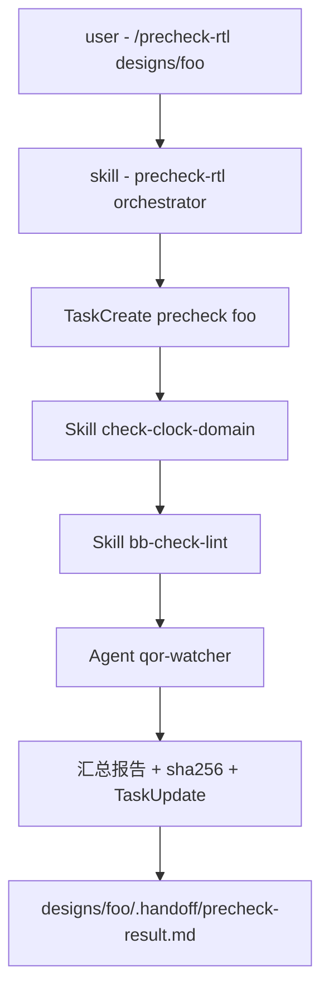

# Lab 4: 串成一条流水线 — `/precheck-rtl`

> **目标**：把 Lab 1（skill）+ Lab 2（hook）+ Lab 3（sub-agent）组合成一条短流水线：用户 `/precheck-rtl designs/foo` 一键完成时钟扫描 + QoR 基线对比 + 路径权限检查。
>
> **预计时长**：1 小时
>
> **学到什么**：
> - Skill 调 Skill（嵌套调用）
> - Skill 调 Sub-agent（用 Agent tool）
> - 用 TaskCreate 把流水线进度显式化
> - handoff artifact 的设计（json schema + sha256）

## 前置

- 已完成 Lab 1 / Lab 2 / Lab 3

## Step 1: 设计流水线



注意流水线只跑**只读检查**——没有 Write/Edit，所以即便有 bug 也只是误报，不会伤数据。

## Step 2: 写 orchestrator skill

新建 `.claude/skills/precheck-rtl/SKILL.md`：

```markdown
---
name: precheck-rtl
description: "RTL 提交前的只读预检流水线：扫描时钟域 + 跑 lint + 对比 QoR baseline，汇总报告。触发：用户说『precheck』『提交前检查』『RTL 自检』，或给一个 designs/<name> 路径请求 quick check。"
---

# precheck-rtl

## 用途

在把 RTL 推给 verification 之前跑一组只读检查，提前发现明显问题：
- 时钟域分布异常（>1 时钟域是高 CDC 风险）
- Lint error（综合不友好）
- 历史 QoR 已有回归（baseline 与现状对比）

**只读流水线**——绝不修改任何文件。

## 输入

`$ARGUMENTS` 第一个 token 是 design 路径，如 `designs/foo`。

## 工作流程

1. **进度跟踪**：TaskCreate `subject="precheck-rtl <design>"`。
2. **时钟域扫描**：Skill(check-clock-domain) 输入 `<design>/rtl/**/*.sv`。
3. **Lint**：Skill(bb-check-lint) 输入 `<design>/file_list.f`（若不存在，glob 现写一个临时的）。
4. **QoR 回归**：Agent(qor-watcher)，让它对 `<design>` 跑一次回归扫描。
5. **汇总**：把 3 段结果拼成一份 markdown：
   ```
   # Precheck Report: <design> @ <ISO timestamp>
   ## Clock Domains
   <step 2 输出>
   ## Lint
   <step 3 输出>
   ## QoR
   <step 4 输出>
   ## Status
   - 时钟域: <X> 个 → OK / WARN
   - Lint errors: <N> → OK / FAIL
   - QoR regression: <YES/NO>
   - 综合判定: <PASS / FAIL>
   ```
6. **落盘**：用 Write 写到 `<design>/.handoff/precheck-result.md`（**这是预检报告，允许写**）。
7. **TaskUpdate**：completed。
8. **返回**：给用户一段中文摘要 + 报告路径。

## 错误处理

- 任一 step 失败 → 在汇总报告里标 `FAIL: <reason>`，但**继续**跑其他 step。
- 整个流水线 fail → TaskUpdate `subject` 加 "[FAILED]" 后缀。
- 不要"自动修复"任何东西——这是只读流水线的强约束。

## 输出格式

```
✅ Precheck 完成：designs/foo
- 时钟域: 2 (clk_100m, clk_apb)
- Lint: 0 error, 3 warning
- QoR: OK（无回归）
- 综合判定: PASS
- 详细报告: designs/foo/.handoff/precheck-result.md
```
```

## Step 3: 测试

```
/precheck-rtl designs/foo
```

期望：
1. TaskList 里出现一项进行中的 task
2. Claude 顺序调用 3 个 skill/agent
3. 中间结果通过 tool_result 链路传递，不污染主对话
4. 最后落盘一份 precheck-result.md
5. 用户看到一段简短摘要

## Step 4: 验证流水线的"原子性"

注意一个**陷阱**：第 6 步 Write 是允许的（这是流水线**自己**的产物），但是 Lab 2 的 hook 应该会查 path 是否在白名单。修一下 `.claude/hooks/bb-hook-write-arch-freeze-check.sh`，确认它放行 `.handoff/` 路径写入。

## Step 5: 进阶——加 handoff schema

用 JSON 而不是 markdown 落盘，下游可机读：

新建 `.claude/schemas/precheck.schema.json`：

```json
{
  "$schema": "http://json-schema.org/draft-07/schema#",
  "type": "object",
  "required": ["design", "timestamp", "clock_domains", "lint", "qor", "verdict"],
  "properties": {
    "design": {"type": "string"},
    "timestamp": {"type": "string", "format": "date-time"},
    "clock_domains": {"type": "array", "items": {"type": "string"}},
    "lint": {
      "type": "object",
      "required": ["errors", "warnings"],
      "properties": {
        "errors":   {"type": "integer", "minimum": 0},
        "warnings": {"type": "integer", "minimum": 0}
      }
    },
    "qor": {
      "type": "object",
      "required": ["regression"],
      "properties": {
        "regression": {"type": "boolean"},
        "wns_ns":     {"type": "number"},
        "area_um2":   {"type": "number"}
      }
    },
    "verdict": {"enum": ["PASS", "FAIL"]}
  }
}
```

把第 6 步改成写 JSON 并用 python3 校验。这是工业级 handoff 的标准做法（Babel 项目 `mas.json`、`rtl_artifact.json` 都这么做）。

## 反思问题

1. 这个流水线该不该让 LLM 自动调用（即 `disable-model-invocation: false`）？
   <details><summary>参考答案</summary>
   建议 `disable-model-invocation: true`。原因：流水线虽是只读，但跑一次要消耗多个 sub-agent + skill，token 成本不小。让用户显式触发更可控。LLM 自动决定"先跑个 precheck 再说"会快速烧 quota。
   </details>

2. Skill 调 Agent，Agent 又调 Skill——会不会无限嵌套？
   <details><summary>参考答案</summary>
   Sub-agent 有 `maxTurns`（默认无限，建议显式设 ≤50）；Skill 没有递归调用上限，但因为每次调用都消耗 turn，主代理的 `maxTurns` 也会限制。真要避免：在 description 里写明"不在 precheck-rtl 内部嵌套调用本 skill"，让 LLM 知道。
   </details>

3. precheck 失败时，要不要直接开 `rtl-needs-fix` issue？
   <details><summary>参考答案</summary>
   不要。precheck 是开发者**主动**触发的自检工具，不是流水线 stage。失败只代表"开发者还需要修一下再提交"，不应该触发上游 agent。如果想要自动 issue，单独做一个 stage（如 `ready-for-precheck`），与 precheck-rtl 解耦。
   </details>
