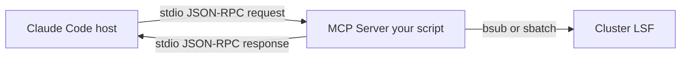

# Lab 5（选做）: 写一个 MCP server — LSF/SLURM 集成

> **目标**：实现一个 MCP server，把企业 EDA 集群（LSF 或 SLURM）暴露成 Claude Code 能调用的 tool：`submit_job`、`query_job_status`、`cancel_job`。
>
> **预计时长**：3–4 小时（含调试）
>
> **学到什么**：
> - MCP（Model Context Protocol）的整体架构
> - 用 Python/TypeScript SDK 写一个 stdio MCP server
> - JSON Schema 设计 tool 参数
> - 如何把自研 server 注入 Claude Code 的工具池
> - 安全考量：白名单、超时、副作用控制

## 为什么需要 MCP

Claude Code 内置 tool 只能跑本地。但 IC 工程师真正的"工具"是企业 EDA 集群——VCS / DC / Innovus 都跑在 LSF/SLURM 上。如果 agent 想跑一次综合，必须能：

```python
job_id = mcp__lsf__submit_job(
    cmd="dc_shell -f syn.tcl",
    queue="long_run",
    cores=16,
    memory_gb=64
)
# ...later...
status = mcp__lsf__query_job_status(job_id)
```

MCP 把这层"集群作业 API"封装成标准 tool。

## 架构



MCP server 是一个**独立进程**，通过 stdin/stdout 用 JSON-RPC 与 Claude Code 通信。

## Step 1: 装 SDK

```bash
uv venv .venv-mcp
source .venv-mcp/bin/activate
uv pip install mcp
```

## Step 2: 最小可用 server

新建 `~/wrk/mcp-servers/lsf-mcp/server.py`：

```python
#!/usr/bin/env python3
"""LSF MCP server — submit/query/cancel LSF jobs."""

import asyncio
import subprocess
from typing import Any
from mcp.server import Server
from mcp.server.stdio import stdio_server
from mcp.types import Tool, TextContent

app = Server("lsf-mcp")

# 1. 声明 tools 给 Claude
@app.list_tools()
async def list_tools() -> list[Tool]:
    return [
        Tool(
            name="submit_job",
            description=(
                "Submit a job to LSF cluster. Returns job_id. "
                "Use for: yosys synthesis, verilator simulation, "
                "any compute-heavy EDA task."
            ),
            inputSchema={
                "type": "object",
                "required": ["cmd", "queue"],
                "properties": {
                    "cmd":      {"type": "string", "description": "Shell command"},
                    "queue":    {"type": "string", "enum": ["short", "long_run", "gpu"]},
                    "cores":    {"type": "integer", "minimum": 1, "maximum": 64, "default": 1},
                    "memory_gb":{"type": "integer", "minimum": 1, "maximum": 256, "default": 4},
                    "name":     {"type": "string"}
                }
            }
        ),
        Tool(
            name="query_job_status",
            description="Query LSF job status by job_id. Returns RUNNING/DONE/EXIT/PENDING.",
            inputSchema={
                "type": "object",
                "required": ["job_id"],
                "properties": {"job_id": {"type": "string"}}
            }
        ),
        Tool(
            name="cancel_job",
            description="Cancel a running LSF job. Returns success status.",
            inputSchema={
                "type": "object",
                "required": ["job_id"],
                "properties": {"job_id": {"type": "string"}}
            }
        ),
    ]

# 2. 实现 tool handler
@app.call_tool()
async def call_tool(name: str, arguments: dict[str, Any]) -> list[TextContent]:
    if name == "submit_job":
        cmd       = arguments["cmd"]
        queue     = arguments["queue"]
        cores     = arguments.get("cores", 1)
        memory_gb = arguments.get("memory_gb", 4)
        job_name  = arguments.get("name", "claude-job")

        # 安全：白名单 + escape
        if not _is_allowed_cmd(cmd):
            return [TextContent(type="text", text=f"ERROR: cmd not in allowlist: {cmd}")]

        bsub_cmd = [
            "bsub", "-q", queue,
            "-n", str(cores),
            "-M", str(memory_gb * 1024),
            "-J", job_name,
            cmd
        ]
        result = subprocess.run(bsub_cmd, capture_output=True, text=True, timeout=30)
        if result.returncode != 0:
            return [TextContent(type="text", text=f"ERROR: {result.stderr}")]

        # bsub 输出："Job <12345> is submitted to queue <long_run>."
        import re
        m = re.search(r"Job <(\d+)>", result.stdout)
        job_id = m.group(1) if m else "unknown"
        return [TextContent(type="text", text=f"job_id={job_id}")]

    elif name == "query_job_status":
        job_id = arguments["job_id"]
        result = subprocess.run(["bjobs", "-o", "stat", "-noheader", job_id],
                                capture_output=True, text=True, timeout=10)
        status = result.stdout.strip() or "UNKNOWN"
        return [TextContent(type="text", text=f"status={status}")]

    elif name == "cancel_job":
        job_id = arguments["job_id"]
        result = subprocess.run(["bkill", job_id],
                                capture_output=True, text=True, timeout=10)
        ok = result.returncode == 0
        return [TextContent(type="text", text=f"cancelled={ok}, msg={result.stdout}")]

    else:
        return [TextContent(type="text", text=f"unknown tool: {name}")]


# 3. 命令白名单（防 prompt injection 跑任意命令）
ALLOWED_CMD_PREFIXES = [
    "yosys", "verilator", "opensta", "magic", "klayout",
    "dc_shell", "vcs", "modelsim",
    "make", "bash",   # 仅允许这些
]

def _is_allowed_cmd(cmd: str) -> bool:
    first_token = cmd.strip().split()[0] if cmd.strip() else ""
    return any(first_token.startswith(p) for p in ALLOWED_CMD_PREFIXES)


# 4. 启动 server
async def main():
    async with stdio_server() as (read_stream, write_stream):
        await app.run(read_stream, write_stream, app.create_initialization_options())


if __name__ == "__main__":
    asyncio.run(main())
```

## Step 3: 注册到 Claude Code

编辑 `.claude/settings.json`（项目级）或 `~/.claude/settings.json`（全局）：

```json
{
  "mcpServers": {
    "lsf": {
      "command": "uv",
      "args": [
        "run",
        "--with", "mcp",
        "python3",
        "/home/lxx/wrk/mcp-servers/lsf-mcp/server.py"
      ]
    }
  }
}
```

重启 Claude Code。新工具会以 `mcp__lsf__submit_job` / `mcp__lsf__query_job_status` / `mcp__lsf__cancel_job` 形式出现。

## Step 4: 测试

```
让 claude 跑：用 LSF 提交一个 yosys 综合任务，cmd 是 "yosys -s syn.tcl"，queue 用 long_run
```

LLM 应该调用 `mcp__lsf__submit_job(cmd="yosys -s syn.tcl", queue="long_run", cores=16)`，拿到 job_id。

## Step 5: 加 polling 模式（进阶）

写一个 skill `wait-job` 在 SKILL.md 里调用 `mcp__lsf__query_job_status` + `sleep`，轮询到 DONE 才返回。这样 agent 提交完作业可以等结果。

## Step 6: 安全加固清单

- [ ] **命令白名单**：上面的 `_is_allowed_cmd` 必须严格；用户/LLM 写 `rm -rf` 也得被拒
- [ ] **超时**：`subprocess.run(timeout=...)` 必填
- [ ] **资源上限**：cores ≤ 64、memory ≤ 256 GB（schema 里 enforced）
- [ ] **作业归属**：建议在 bsub 加 `-G <group>` 让作业归到 Claude 专用 user group，方便审计
- [ ] **日志**：每次 call_tool 都写到 `~/.claude/mcp-logs/lsf.log`
- [ ] **dry-run 模式**：env 变量 `LSF_MCP_DRY_RUN=1` 时不真提交，只打 echo

## 反思问题

1. 为什么不直接让 Claude `Bash("bsub ...")`？
   <details><summary>参考答案</summary>
   - 没有 schema 验证：LLM 拼 bsub 参数容易拼错
   - 没有结构化返回：得自己 grep job_id
   - 没有权限隔离：Bash 啥都能跑
   - 没有跨 session 复用：每个新 session 都得 LLM 重新"学"一遍 bsub 用法
   
   MCP 把这些都封装了。
   </details>

2. MCP server 挂掉会怎么样？
   <details><summary>参考答案</summary>
   Claude Code 检测到 server 挂会从 tool 池移除相关工具。已经发起但未完成的 tool call 会报错。建议给 server 加 supervisor（systemd / pm2）或在 `args` 里用 wrapper 脚本自动重启。
   </details>

3. 如果团队 5 个人都装这个 MCP，会有什么问题？
   <details><summary>参考答案</summary>
   - 5 个独立 stdio 进程，每人一个——没问题
   - 但日志、作业归属、审计要做好（建议每个 user 在 bsub 加 `-P <project>`）
   - 配置同步：用 `.claude/settings.json` 提交到 git，所有团队成员一致
   - 升级 server 代码：放共享路径或包成 plugin
   </details>

4. 这个 MCP 能在多个项目复用吗？怎么打包？
   <details><summary>参考答案</summary>
   能。两种方式：
   1. 放共享路径（如 `~/wrk/mcp-servers/`），在 `~/.claude/settings.json` 全局注册。
   2. 打包成 Claude Code Plugin（含 `plugin.json` + `mcp.json`），上传到团队 marketplace，用户 enable 即可。
   推荐方式 2 进入正式使用阶段时再做。
   </details>

## 下一步

完成 Lab 5 后，你已经有了**完整的 harness 工具箱**：
- ✅ Skill（流程模板）
- ✅ Hook（生命周期门栓）
- ✅ Sub-agent（专精专家）
- ✅ Pipeline（多组件协同）
- ✅ MCP server（外部世界接入）

接下来：选一条你团队真实的 EDA 痛点，做一次完整 harness 改造，提交 PR。
