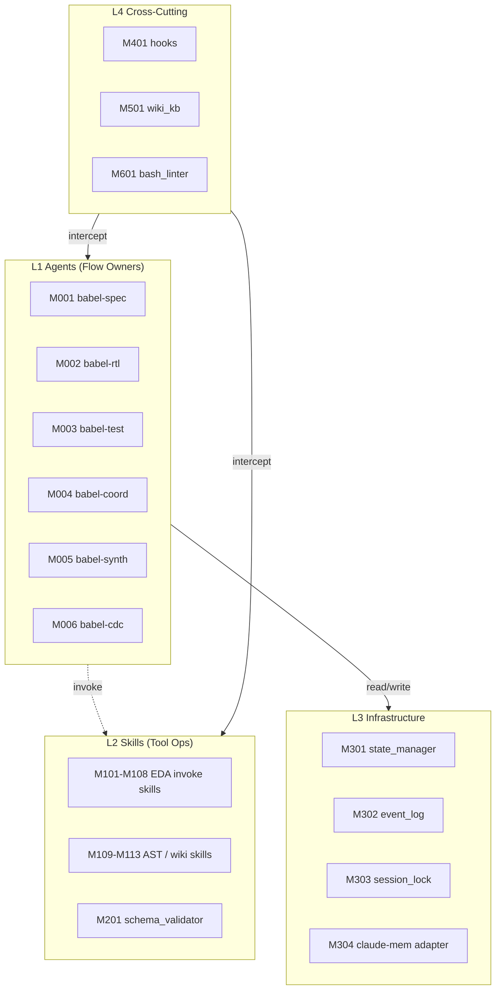
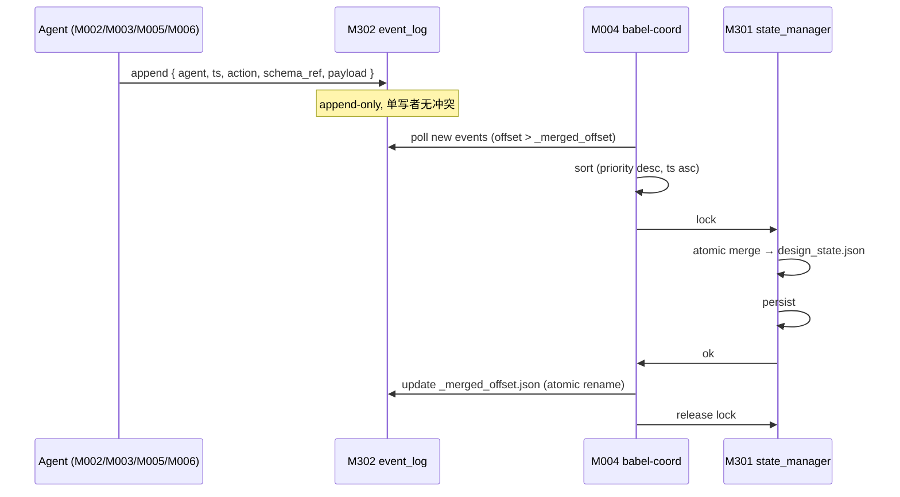
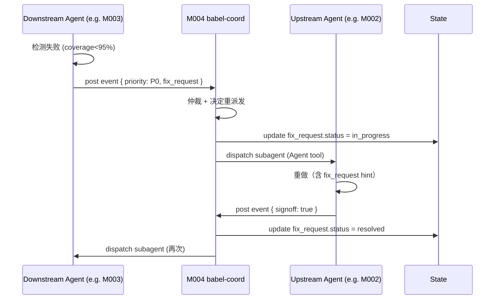
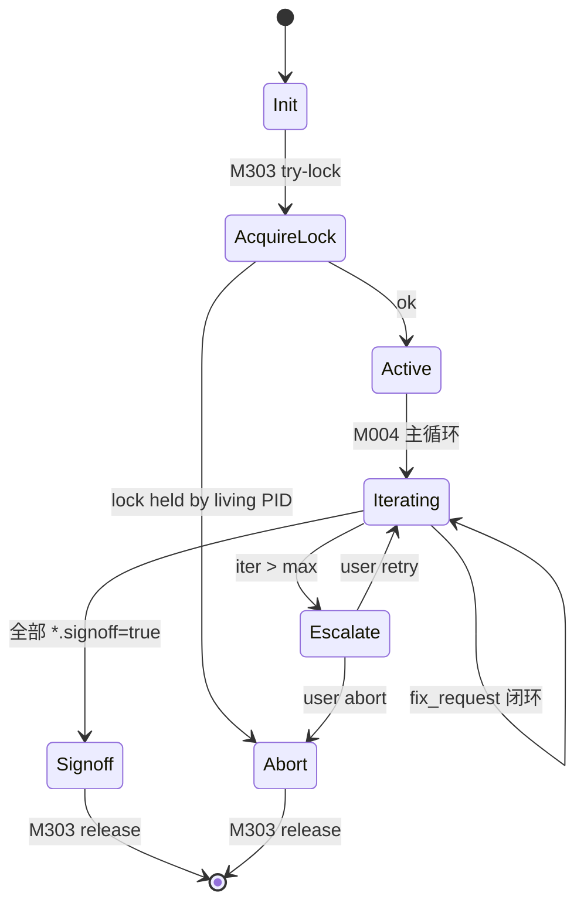
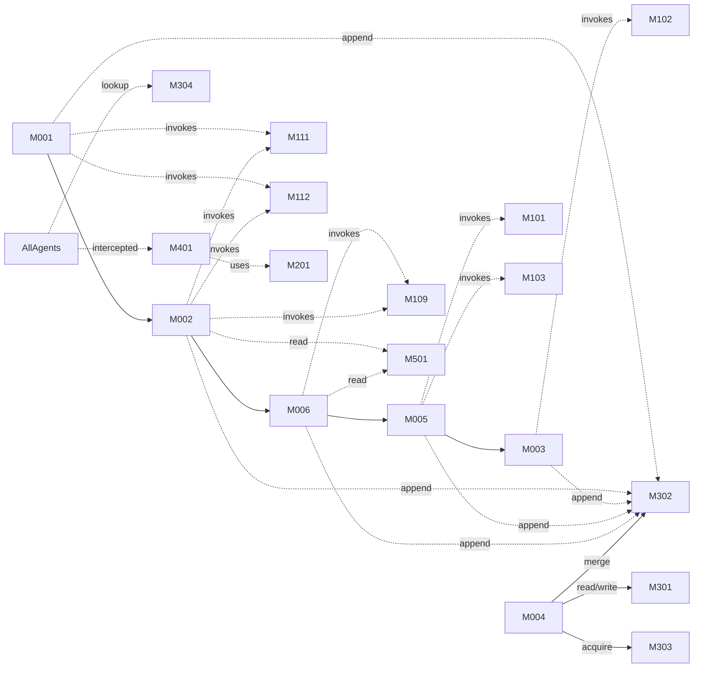

# Babel 架构规范

> 模块划分（M00X）、接口契约、依赖图、生命周期。Agent / Skill / Hook / Module 四层分离。

---

## 0. Glossary（补全 v1.1-issue H8）

| 术语 | 定义 |
|------|------|
| **Agent** | Claude Code subagent；承担 **flow ownership**（决策何时调用 skill、判读输出、生成 fix_request） |
| **Flow Owner** | 拥有某条流程闭环责任的 agent；MVP 内每条 flow 唯一 owner |
| **Skill** | Claude Code skill；封装单一工具操作（Bash + CLI），**无业务决策** |
| **Hook** | Claude Code hook；triggered by Pre/PostToolUse / Session 事件，强制策略 |
| **Module (M-ID)** | 架构层抽象单元；可由 1+ agent / skill / hook 实现 |
| **Single Writer** | 仅 1 个 agent 写共享状态文件，其余通过 append-only event 提交 |
| **fix_request** | 下游 agent 发现失败 → 向 coordinator 提交的修复请求 |
| **Composite Input** | 多上游 schema 合并的输入（如 synth 取 rtl_artifact + cdc_report） |
| **CBB** | Common Building Block；wiki/cbb/ 中的可复用 RTL 模板 |
| **flow** | 一条端到端业务流（spec→rtl→cdc→synth→test→signoff） |

---

## 1. 总体分层



**依赖方向**（单向）：L1 → L2 → L3，L4 横切。L2 **禁止**调用 L1（详见 ADR-A08）。

---

## 2. L1: Agent 模块（Flow Owners）

### M001 — babel-spec

```yaml
id: M001
name: babel-spec
description: 规格生成 flow owner
flow: spec
upstream_inputs:
  - schema: schemas/idea.schema.json
    source: user (via /babel-design)
downstream_outputs:
  - schema: schemas/spec.schema.json
    artifact: spec.json
invokes_skills: [babel-plan-spec, babel-search-protocol, babel-search-cbb]
tools: [Read, Write, Grep, Glob]
write_paths: ["designs/*/PRD.md", "designs/*/spec.json", "designs/*/ADR-*.md"]
max_tokens: 80000
trigger: /babel-design
failure_modes:
  - schema_violation → halt + write halt_report
  - cbb_not_found → fix_request to user
implements_functions: [F001]
```

### M002 — babel-rtl

```yaml
id: M002
name: babel-rtl
description: RTL 生成 flow owner
flow: rtl
upstream_inputs:
  - schema: schemas/spec.schema.json
    source: M001
downstream_outputs:
  - schema: schemas/rtl_artifact.schema.json
    artifact: rtl/*.sv + constraints/*.sdc (草稿)
invokes_skills: [babel-generate-rtl, babel-check-lint]
tools: [Read, Write, Edit, Bash, Grep, Glob]
write_paths: ["designs/*/rtl/**", "designs/*/constraints/**"]
max_tokens: 100000
trigger: M001 sign-off + state.spec.signoff=true
failure_modes:
  - lint_error → 自重试（≤2 次），失败则 fix_request to M001
  - cbb_instantiation_mismatch → fix_request to M001
implements_functions: [F002, F003]
explicit_non_responsibilities:
  - CDC 检查 (delegated to M006)
  - 综合预检 (delegated to M005)
```

### M003 — babel-test

```yaml
id: M003
name: babel-test
description: 动态验证 flow owner
flow: test
upstream_inputs:
  - schema: schemas/rtl_artifact.schema.json
    source: M002
  - schema: schemas/synth_report.schema.json
    source: M005
downstream_outputs:
  - schema: schemas/test_report.schema.json
    artifact: tb/*.sv + coverage.json
invokes_skills: [babel-generate-tb, babel-invoke-verilator, babel-collect-coverage]
tools: [Read, Write, Edit, Bash, Grep, Glob]
write_paths: ["designs/*/tb/**", "designs/*/sim_results/**"]
max_tokens: 80000
trigger: M005 sign-off + state.synth.signoff=true
failure_modes:
  - coverage<95% → fix_request to M002
  - sim_failure → fix_request to M002 (with failing seed)
implements_functions: [F006]
explicit_non_responsibilities:
  - 形式验证 (Future: babel-property-prover)
  - 波形分析 (out of scope, VSCode 用户侧)
```

### M004 — babel-coord（原 babel-cross-domain-coordinator，应用 ADR-A07）

```yaml
id: M004
name: babel-coord
description: 跨域协调 flow owner + 唯一 state 写者
flow: coordination
upstream_inputs:
  - schema: schemas/event.schema.json
    source: any agent (via M302)
downstream_outputs:
  - schema: schemas/design_state.schema.json
    artifact: design_state.json
invokes_skills: []  # 不调用 EDA tool skills
tools: [Read, Write, Edit, Bash, Grep, Glob, Task]
write_paths: ["designs/*/design_state.json", "${OUTPUT_DIR}/events/_merged_offset.json"]
max_tokens: 60000
trigger:
  - SessionStart
  - periodic (every 30s during active design)
  - event posted (notified via inotify or polling)
failure_modes:
  - state_schema_violation → halt + restore from backup
  - event_merge_conflict → 按 (priority desc, ts asc) 仲裁（详见 §6.3）
  - max_iter_exceeded → 按 on_max_iter_reached 分支（halt/escalate_user/force_signoff）
implements_functions: [F007, F008, F010, F016]
```

### M005 — babel-synth（原 yosys-synth-planner，ADR-A07）

```yaml
id: M005
name: babel-synth
description: 综合 flow owner
flow: synthesis
upstream_inputs:
  - schema: schemas/rtl_artifact.schema.json
    source: M002
  - schema: schemas/cdc_report.schema.json
    source: M006 (gating)
  - composite_schema: schemas/synth_input.schema.json
downstream_outputs:
  - schema: schemas/synth_report.schema.json
    artifact: synth/netlist.v + synth/qor.json + constraints/*.sdc (final)
invokes_skills: [babel-invoke-yosys, babel-invoke-opensta]
tools: [Read, Write, Edit, Bash, Grep, Glob]
write_paths: ["designs/*/synth/**", "designs/*/constraints/*.sdc"]
max_tokens: 60000
trigger: M002 signoff AND M006 cdc_report no_unwaived_violation
failure_modes:
  - WNS_below_threshold → fix_request to M002 (with timing path)
  - synthesis_error → fix_request to M002
implements_functions: [F005]
```

### M006 — babel-cdc（原 clock-domain-guard，ADR-A07）

```yaml
id: M006
name: babel-cdc
description: CDC/RDC 检查 flow owner
flow: cdc
upstream_inputs:
  - schema: schemas/rtl_artifact.schema.json
    source: M002
downstream_outputs:
  - schema: schemas/cdc_report.schema.json
    artifact: cdc_report.json
invokes_skills: [babel-parse-ast, babel-check-cdc]
tools: [Read, Write, Bash, Grep, Glob]
write_paths: ["designs/*/cdc_report.json"]
max_tokens: 40000
trigger: M002 signoff
failure_modes:
  - unwaived_violation → fix_request to M002
implements_functions: [F004]
```

---

## 3. L2: Skill 模块（Tool Operations）

### M101-M108 — EDA Invoke Skills

| M-ID | Skill | CLI | Pinned Version |
|------|-------|-----|----------------|
| M101 | babel-invoke-yosys | yosys | 0.35.x (prefix match) |
| M102 | babel-invoke-verilator | verilator | 5.012 |
| M103 | babel-invoke-opensta | sta | 2.5.0 |
| M104 | babel-invoke-magic | magic | 8.3.641 |
| M105 | babel-invoke-netgen | netgen | 1.5.275 |
| M106 | babel-invoke-klayout | klayout | 0.30.8 |
| M107 | babel-invoke-abc | abc | tag `latest-stable` (commit pinned at Phase 1 实施) |
| M108 | babel-invoke-qrouter | qrouter | 1.4 |

> v1.1-issue **M1** 解决：M107 在 Phase 1 实施时由 `scripts/lock_references.sh` 锁定 commit SHA。
> v1.1-issue **M2** 解决：M101 yosys 版本检查改用 prefix 匹配（`yosys -V | grep -E "^Yosys 0\.35"`）。

Skill 通用 frontmatter（详见 design_doc §4 + ADR-A08）：

```yaml
input_args:
  - { name: <arg>, type: <type>, required: <bool> }
output_contract:
  artifact_path: <glob>
  schema_ref: <path>
forbidden_tools: [Task, Agent, Skill]   # ADR-A08：skill 单向依赖强制
```

### M109 — babel-parse-ast (+ M110 fallback)

| M-ID | Skill | 工具 |
|------|-------|------|
| M109 | babel-parse-ast | pyverilog (主) |
| M110 | babel-parse-ast-fallback | verible-verilog-syntax / slang (ADR-005) |

调用约定：M109 先试；解析失败（unsupported SV 特性）→ 自动回落 M110。

### M111-M113 — Knowledge Search Skills

| M-ID | Skill | 实现 |
|------|-------|------|
| M111 | babel-search-protocol | `rg -i {pattern} wiki/protocols/` |
| M112 | babel-search-cbb | `rg -i {pattern} wiki/cbb/` |
| M113 | babel-get-interface-template | Read wiki/cbb/{template}.md |

### M201 — schema_validator

```yaml
id: M201
name: schema_validator
description: 通用 JSON Schema 校验
implementation: python jsonschema CLI wrapper
input: { artifact_path, schema_path }
output: { valid: bool, errors: [...] }
called_by: M401 hooks + 各 agent 启动期
fail_behavior:
  - 写 violation 到 stderr
  - 创建 priority=P0 fix_request (issue v1.1 M7 解决)
implements_functions: [F009]
```

---

## 4. L3: Infrastructure

### M301 — state_manager

```yaml
id: M301
name: state_manager
description: design_state.json 读写抽象 + 单写者锁
written_by: M004 only (single writer)
read_by: all agents
lock_mechanism:
  type: sqlite-based mutex   # v1.1-issue H3 解决：替代 flock，NFS-safe
  table: __babel_state_lock
  fields: { pid, acquired_at, design_id, lock_token (UUIDv7) }
  release: explicit + atexit hook
schema: schemas/design_state.schema.json
history_capacity: 200
history_eviction:
  policy: FIFO with priority_pin
  pinned_events: [max_iter_reached, manual_override, signoff]
  # v1.1-issue H6 解决：可配置 eviction 行为
backup: 写前先 atomic-rename 旧版到 .state_backup_<ts>/
related_adr: ADR-A03, ADR-A05
```

### M302 — event_log

```yaml
id: M302
name: event_log
description: append-only event log; coordinator 合并入 state
location: ${OUTPUT_DIR}/events/<session_id>-<agent>.jsonl
write_protocol:
  - 每个 agent 自己的 .jsonl，append 单行 JSON
  - 文件名含 agent name → 隐式按 agent 分流
merge_protocol:
  - coord 读取所有 .jsonl 自 _merged_offset.json 记录的偏移开始
  - 按 (priority desc, timestamp asc) 排序合并   # v1.1-issue M11 解决
  - 持久化 state.json 完成后，atomic-rename 更新 _merged_offset.json   # v1.1-issue M9 解决
crash_recovery:
  - coord 启动时检测 offset.json mtime vs state.json mtime
  - 若 offset 旧于 state → 重做最后 N 秒事件（幂等）
```

### M303 — session_lock

```yaml
id: M303
name: session_lock
description: 全局会话锁（multi-session 冲突防护）
location: ${OUTPUT_DIR}/state/.babel_session.lock
content: { pid, acquired_at_iso8601, design_id, host }
acquire:
  - 启动时 try-write lock; 若已存在 → 校验 pid 是否活跃 (kill -0)
  - 活跃 → 拒绝启动 + 友好错误
  - 不活跃 + lock mtime > 10min → 抢占 + 警告
release: 正常退出 + atexit hook
implements_functions: [F014]
related_adr: ADR-A06
```

### M304 — claude-mem adapter

```yaml
id: M304
name: claude-mem-adapter
description: 跨会话记忆委托接口
delegate_to: claude-mem 插件
fallback:
  trigger: claude-mem unavailable / API error
  behavior:
    - Babel 降级 stateless 模式
    - stderr 警告横幅
    - 不阻断主流程（agent 仍可完成设计，只是不学习历史经验）
  related_adr: ADR-A04
write_protocol: 仅 hook babel-hook-experience-record 可写（通过 claude-mem API）
implements_functions: [F011]
related_adr: ADR-007, ADR-A04
```

---

## 5. L4: Cross-Cutting

### M401 — hooks

| Hook | Trigger | Action | M-ID Owner |
|------|---------|--------|-----------|
| babel-hook-write-arch-freeze-check | PreToolUse Write/Edit | 阻止违背架构冻结的修改 | M201 |
| babel-hook-instantiate-cbb-search | PreToolUse 实例化 CBB | 强制 wiki 检索 | M111 |
| babel-hook-commit-quality-gate | PreToolUse git commit RTL | 跑 lint + 综合 (M101/M002) | M002 |
| babel-hook-validate-input-schema | Agent 启动 | M201 校验 upstream artifact | M201 |
| babel-hook-validate-bash-cmd | PreToolUse Bash (developer-error guard) | 软警告越界命令（不阻断） | M601 |
| babel-hook-change-propagate | PostToolUse 上游文档变更 | 检查级联更新 | M004 |
| babel-hook-bug-escalate-fix-request | PostToolUse 验证失败 | 创建 fix_request | M004 |
| babel-hook-session-sync-state | SessionStart/End | M301 同步 + 版本验证 | M301 |
| babel-hook-session-summarize | SessionEnd | 生成执行摘要 | M004 |
| babel-hook-validate-wiki | PreToolUse wiki 读取 | 校验 frontmatter content_hash | M501 |
| babel-hook-skill-purity | CI hook | 扫描 skill markdown forbidden_tools | M201 |

### M501 — wiki_kb

```yaml
id: M501
name: wiki_kb
description: 协议 + CBB 知识库
mvp_scope:
  protocols: [uart.md, axi4-lite.md, ucie-overview.md]
  cbb: [sync-fifo.md, 2ff-sync.md, clock-gate.md]
frontmatter_required:
  - schema_version: "1.0"
  - content_hash: <sha256 of body>
  - last_verified: <iso8601 date>
integrity:
  - pre-commit hook 校验 frontmatter ↔ body 一致性
  - external hash store: wiki/.hashes.txt (signed manifest, planned)
  # v1.1-issue M6 改进：外置 hash store 避免自引用
ucie_split:   # v1.1-issue M14 解决
  - ucie-overview.md (MVP, 概述)
  - ucie-d2d.md (Phase 3+)
  - ucie-flit.md (Phase 3+)
implements_functions: [F012]
```

### M601 — bash_linter (developer-error guard)

```yaml
id: M601
name: bash_linter
description: PreToolUse Bash 命令软警告（不强制阻断）
purpose: |
  ADR-010 接受 Bash 绕过 write_paths/read_denylist 作为残留风险。
  M601 作为 developer-error guard，在 agent 意外越界时警告，
  避免开发期 bug 静默；不作为安全边界。
detection:
  - bash AST 解析（shlex / shellcheck）
  - 检测 redirect 目标在 write_paths 外
  - 检测 cat/head/tail 读 read_denylist 路径变形
behavior:
  - 命中 → stderr 警告 + 写 events/<sid>-warning.jsonl
  - 不阻断命令执行
related_adr: ADR-010, ADR-A09
implements_functions: [F015]
```

---

## 6. 关键内部协议

### 6.1 Single Writer 协议

详见 design_doc §2.3 + §13.2 + ADR-003。本文档补充时序：



### 6.2 fix_request 闭环



### 6.3 Event 合并冲突仲裁（v1.1-issue M11 解决）

| 字段 | 冲突仲裁规则 |
|------|-------------|
| `*.signoff` | 后者覆盖（agent 自己最权威） |
| `babel_fix_requests` | 数组 append（每条 fix_request 自带 ID） |
| `cross_domain_iteration_count` | coord 唯一权威，其他 agent 不允许写 |
| `pending_approval` | priority desc → ts asc |
| 其他 | last-writer-wins by ts |

---

## 7. 启动 / 关闭生命周期



---

## 8. 配置参考

```yaml
# babel.config.yaml (Phase 1 实施)
babel_config:
  max_cross_domain_iterations: 3
  on_max_iter_reached: escalate_user   # halt | escalate_user | force_signoff
  history_capacity: 200
  state_lock_backend: sqlite           # sqlite | flock (deprecated, see ADR-A03)
  claude_mem_fallback: stateless       # stateless | abort
  bash_linter:
    enabled: true
    mode: warn                         # warn | log_only
```

---

## 9. 依赖图（M-ID 级）



---

## 10. 关联文档

| 路径 | 用途 |
|------|------|
| `functional_specification.md` | F00X 与本 M00X 交叉引用 |
| `schemas_seed.md` | 所有 schema 字段骨架 |
| `data_flow_diagrams.md` | 数据流图详细版 |
| `workflow_diagrams.md` | 业务流程详细版 |
| `ADR/` | 8 项 architecture 决策 |
| `../idea/design_doc.md` | 上游 idea |
| `../idea/decisions.md` | 上游 ADR-001~010 |
