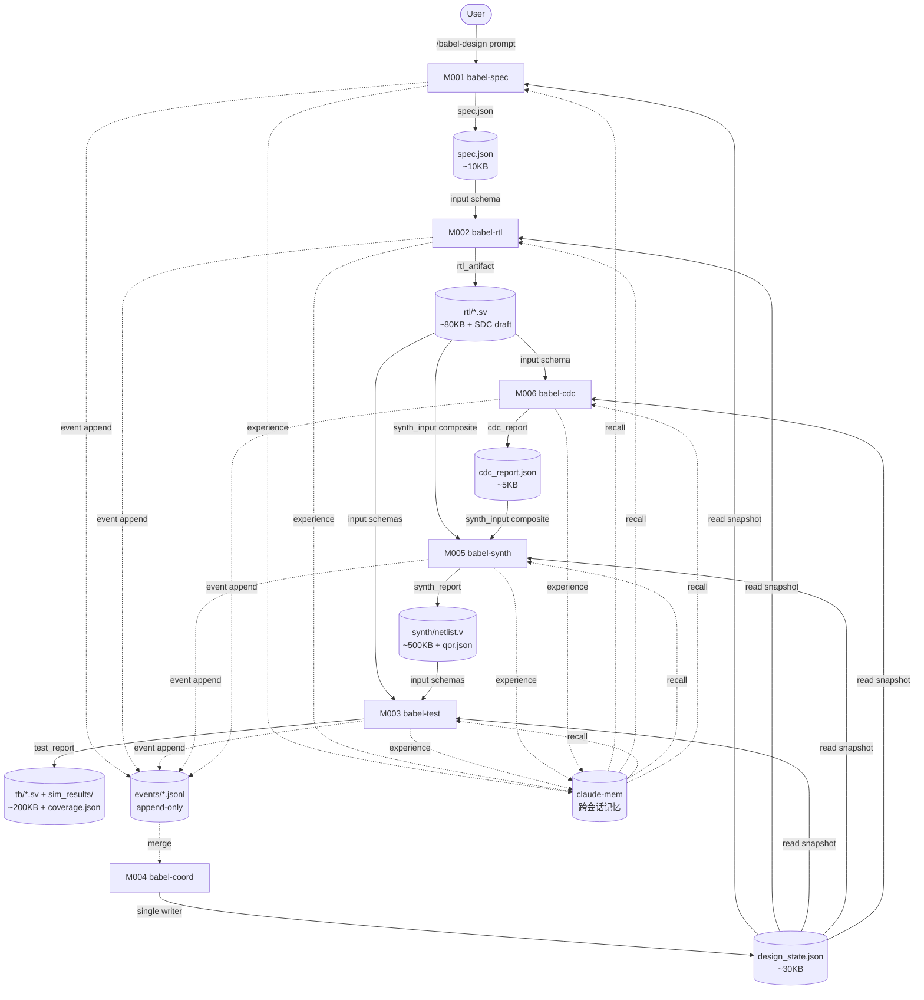
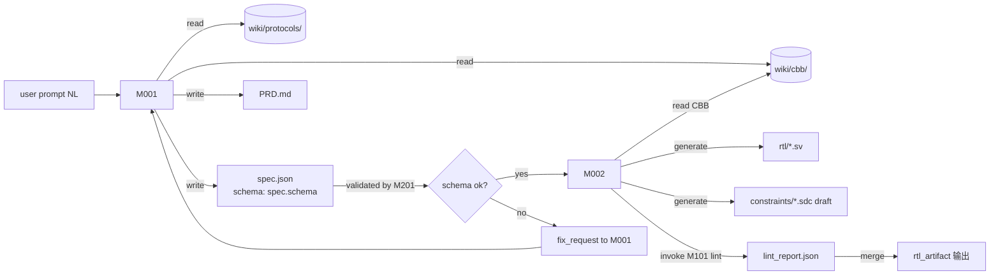
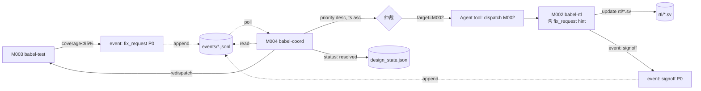
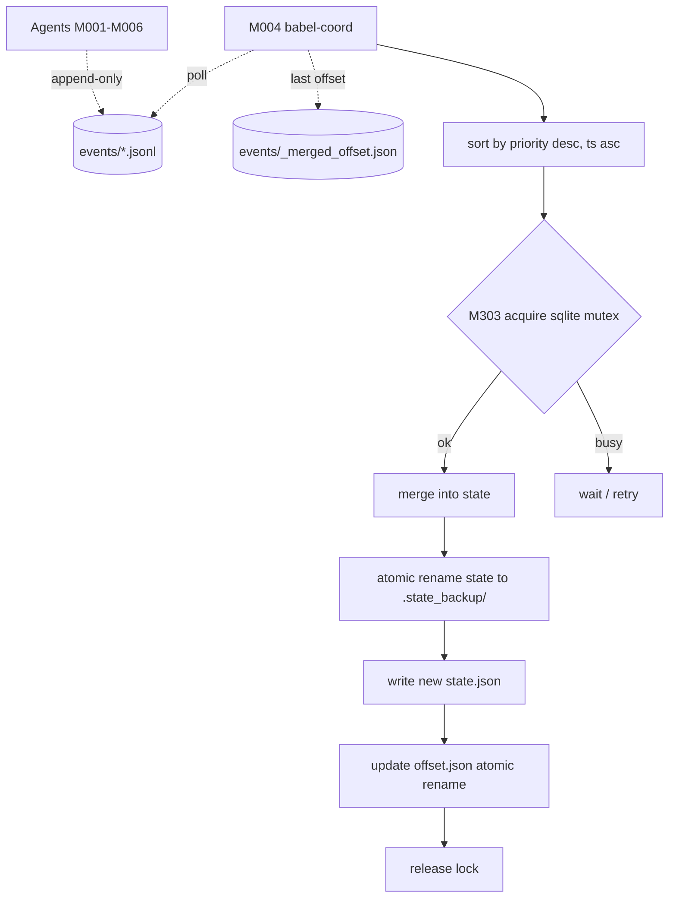
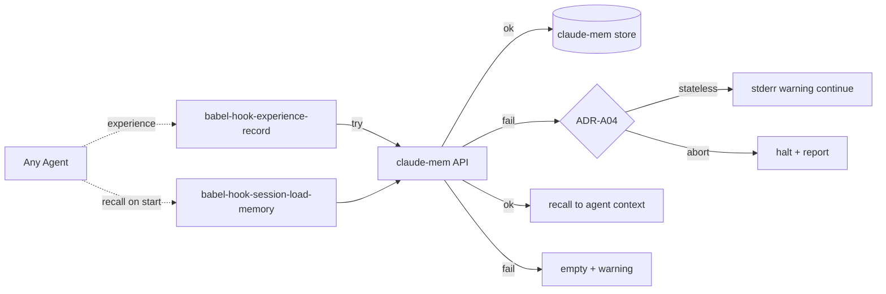
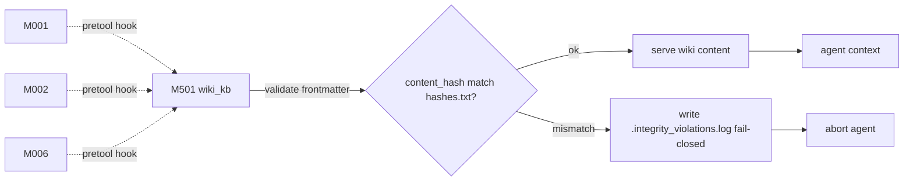

# Babel 数据流图

> Mermaid 格式。System-level（全局视图）、module-level（M-ID 内部）。
> 边标注数据大小、schema 引用、传输介质（state / event / direct）。

---

## 1. System-Level Data Flow

---

## 2. Spec → RTL 数据流（M001 ↔ M002）

---

## 3. fix_request 闭环数据流

---

## 4. State 写入数据流（Single Writer）

> 提示：crash recovery（v1.1-issue M9）— coord 启动时检测 offset.json mtime vs state.json mtime；
> 若 offset 旧于 state → 重做最后 N 秒事件（事件幂等保证可重做）。

---

## 5. claude-mem 数据流（with fallback）

---

## 6. Wiki 读取数据流

---

## 7. 关联文档

| 路径 | 用途 |
|------|------|
| `architecture_specification.md` | M-ID 详细定义；§9 依赖图 |
| `workflow_diagrams.md` | 时序图（业务流程） |
| `schemas_seed.md` | 每条数据流引用的 schema |
