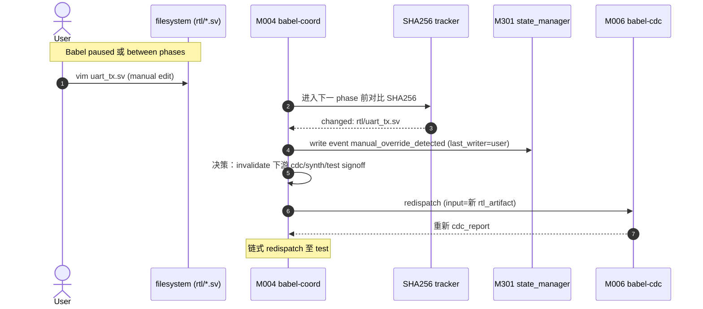
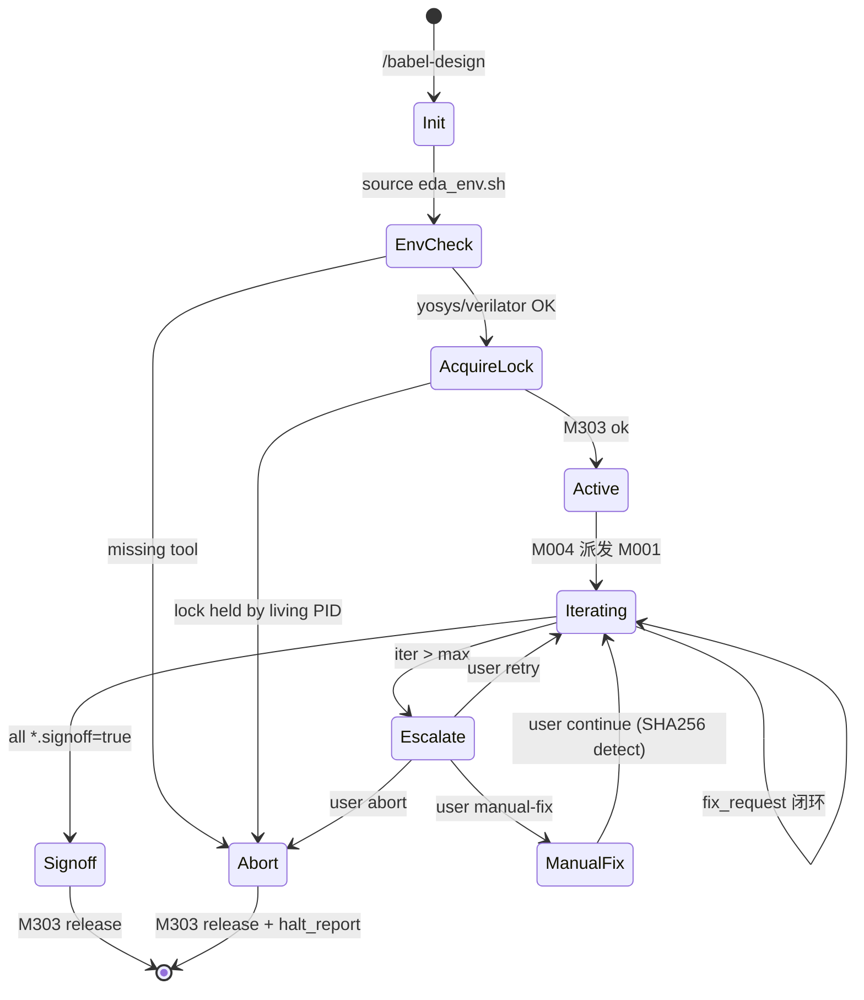

# Babel 工作流图

> Mermaid 时序图 + 状态图。覆盖端到端 happy path、fix_request 闭环、max_iter 升级、手动 override。

---

## 1. UART 端到端 Happy Path

```mermaid
sequenceDiagram
    autonumber
    actor User
    participant CC as Claude Code (slash cmd)
    participant Coord as M004 babel-coord
    participant Spec as M001 babel-spec
    participant RTL as M002 babel-rtl
    participant CDC as M006 babel-cdc
    participant Synth as M005 babel-synth
    participant Test as M003 babel-test
    participant State as M301 state_manager

    User->>CC: /babel-design uart "..."
    CC->>Coord: init session + acquire M303 lock
    Coord->>State: create design_state.json (UUIDv7)
    Coord->>Spec: dispatch (input=idea)
    Spec->>Spec: search wiki/protocols/uart.md
    Spec-->>State: append event: signoff (spec.signoff=true)
    Coord->>RTL: dispatch (input=spec.json)
    RTL->>RTL: invoke babel-generate-rtl + babel-check-lint
    RTL-->>State: append event: signoff (rtl.signoff=true)
    Coord->>CDC: dispatch (input=rtl_artifact)
    CDC->>CDC: invoke babel-parse-ast + babel-check-cdc
    CDC-->>State: append event: signoff (cdc.signoff=true)
    Coord->>Synth: dispatch (input=synth_input composite)
    Synth->>Synth: invoke babel-invoke-yosys
    Synth-->>State: append event: signoff (synth.signoff=true)
    Coord->>Test: dispatch (input=rtl + netlist)
    Test->>Test: invoke babel-generate-tb + babel-invoke-verilator
    Test-->>State: append event: signoff (test.signoff=true, coverage>=95%)
    Coord->>State: full signoff; release M303 lock
    Coord-->>User: design complete, artifacts at designs/uart/
```

---

## 2. fix_request 闭环（coverage 不足）

```mermaid
sequenceDiagram
    autonumber
    participant Test as M003 babel-test
    participant Coord as M004 babel-coord
    participant Events as M302 event_log
    participant State as M301 state_manager
    participant RTL as M002 babel-rtl

    Test->>Test: 检测 coverage=87% < 95%
    Test->>Events: append fix_request P0 (target=babel-rtl)
    Coord->>Events: poll new events
    Coord->>Coord: 仲裁 (priority desc, ts asc)
    Coord->>State: update fix_request.status=in_progress; iter++
    Coord->>RTL: dispatch (input=rtl_artifact + fix_request hint)
    RTL->>RTL: 重做（参考 hint：补充 tx_busy_state）
    RTL-->>Events: append event signoff P0
    Coord->>State: update fix_request.status=resolved
    Coord->>Test: redispatch (重新跑覆盖率)
    Test-->>Events: append event signoff (coverage=96%)
    Coord->>State: full signoff
```

---

## 3. max_iter 升级（escalate_user）

```mermaid
sequenceDiagram
    autonumber
    participant Coord as M004 babel-coord
    participant State as M301 state_manager
    actor User
    participant Term as Terminal stderr

    Note over Coord: iter=4, max=3
    Coord->>State: write pending_approval (reason + options)
    Coord->>Term: print stderr banner
    Term-->>User: ⚠ Babel: pending_approval ...<br/>Respond /babel-respond
    alt retry
        User->>Coord: /babel-respond uart --action retry
        Coord->>State: clear pending_approval; iter=0
        Note over Coord: 重入 fix_request 闭环
    else abort
        User->>Coord: /babel-respond uart --action abort
        Coord->>State: write halt_report; release lock
    else manual-fix
        User->>Coord: /babel-respond uart --action manual-fix
        Coord->>State: pause; await user edit
        User->>Coord: /babel-respond uart --action continue
        Coord->>Coord: SHA256 diff → manual_override 流程 (§4)
    end
```

---

## 4. 用户中途修改 RTL（manual override）



---

## 5. Multi-session 冲突（v1.1-issue H7）

```mermaid
sequenceDiagram
    autonumber
    actor U1 as User Terminal 1
    actor U2 as User Terminal 2
    participant Lock as M303 session_lock
    participant FS as .babel_session.lock

    U1->>Lock: /babel-design uart (start)
    Lock->>FS: write lock (PID 12345, ts 2026-05-16T17:00)
    FS-->>Lock: ok
    Lock-->>U1: acquired
    Note over U1: babel running...

    U2->>Lock: /babel-design uart (start, different prompt)
    Lock->>FS: try write
    FS-->>Lock: exists; PID 12345
    Lock->>Lock: kill -0 12345 → alive
    Lock-->>U2: ❌ Error: already active<br/>PID 12345 acquired 2026-05-16T17:00<br/>Action: wait or kill PID
```

---

## 6. 启动 / 关闭状态机



---

## 7. claude-mem fallback 时序

```mermaid
sequenceDiagram
    autonumber
    participant Agent as Any Agent (e.g. M002)
    participant Hook as babel-hook-experience-record
    participant Adapter as M304 claude-mem adapter
    participant Plugin as claude-mem 插件
    participant Term as stderr

    Agent->>Hook: PostToolUse (task complete)
    Hook->>Adapter: write_experience(...)
    Adapter->>Plugin: API call
    alt Plugin OK
        Plugin-->>Adapter: ok
        Adapter-->>Hook: ok
    else Plugin unavailable
        Plugin-->>Adapter: error / timeout
        Adapter->>Term: ⚠ claude-mem unavailable; stateless mode
        Adapter-->>Hook: degraded (continue)
        Note over Adapter: 不阻断主流程
    end
```

---

## 8. 关联文档

| 路径 | 用途 |
|------|------|
| `architecture_specification.md` | 模块详细定义 |
| `data_flow_diagrams.md` | 数据视角图 |
| `user_manual.md` | 用户视角操作 |
| `functional_specification.md` | F00X 映射到本图的 step |
