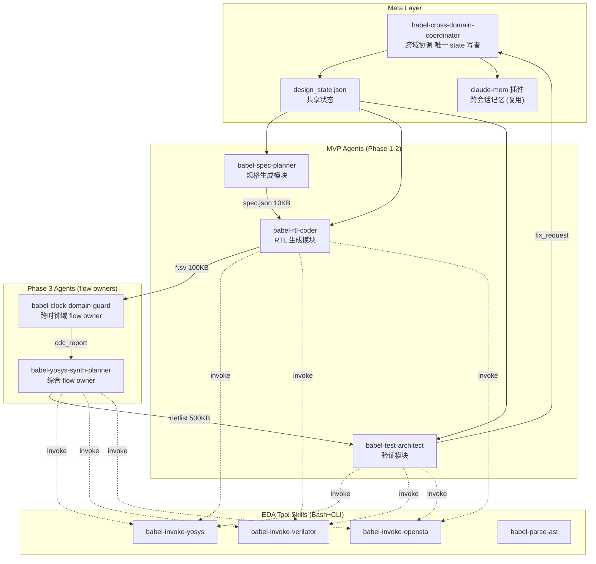
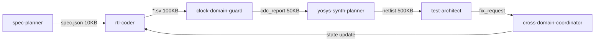

# Babel — AI 原生 Chiplet 多 Agent 系统设计方案 (v1.1)

> v1.1 修订说明：根据 `harness_spec/idea/.review/issues.md` 修复 46 项 issue（4 CRITICAL / 15 HIGH / 20 MEDIUM / 7 LOW），同时收纳 3 项用户简化决策（ADR-007 claude-mem / ADR-008 VSCode waveform / ADR-009 EDA = skill only）。关键决策见 `harness_spec/idea/decisions.md`。

---

## 0. 文档约定

### 0.1 术语表 (Glossary)

| 术语 | 全称 | 含义 |
|------|------|------|
| RTL | Register Transfer Level | 寄存器传输级硬件描述 |
| CDC | Clock Domain Crossing | 跨时钟域 |
| RDC | Reset Domain Crossing | 跨复位域 |
| CBB | Common Building Block | 通用构建模块 |
| UPF | Unified Power Format | 统一功耗格式 |
| ICG | Integrated Clock Gating | 集成时钟门控 |
| SVA | SystemVerilog Assertions | SystemVerilog 断言 |
| QoR | Quality of Results | 综合质量指标 |
| DFT | Design for Test | 可测性设计 |
| ATPG | Automatic Test Pattern Generation | 自动测试向量生成 |
| WNS | Worst Negative Slack | 最差负时序裕量 |
| LVS | Layout vs Schematic | 版图-原理图对比 |
| DRC | Design Rule Check | 设计规则检查 |
| UCIe | Universal Chiplet Interconnect Express | 通用芯粒互连标准 |
| ADR | Architecture Decision Record | 架构决策记录 |
| DoD | Definition of Done | 完成定义 |

### 0.2 优先级语义

| 标签 | 含义 |
|------|------|
| P0 | 必须采纳，缺失则系统不可用 |
| P1 | 优先采纳，缺失则核心质量受损 |
| P2 | 可选采纳，缺失不影响主流程 |

### 0.3 决策日志

关键设计决策以 ADR 形式记录在 `harness_spec/idea/decisions.md`：

| ADR | 决策 |
|-----|------|
| ADR-001 | EDA 工具集成方式 — Bash + CLI（非 MCP server） |
| ADR-002 | Agent 命名与描述 — 去人格化，使用功能短语 |
| ADR-003 | 状态管理 — 单写者（coordinator）模式 |
| ADR-004 | MVP 范围 — 4 个 agent，其余转 Future |
| ADR-005 | Pyverilog 不支持的 SV 子集使用 verible/slang fallback |
| ADR-007 | Memory system 复用 `claude-mem` 插件，不自建 |
| ADR-008 | Waveform 查看 — VSCode 扩展，不在 Babel skill 范围 |
| ADR-009 | EDA 工具 = skill；flow owner = agent（严格分离） |
| ADR-010 | Bash agent 下 write_paths/read_denylist 为软边界，接受残留风险 |

### 0.4 版本

| Version | Date | Notes |
|---------|------|-------|
| 1.0.0 | 2026-05-16 | 初版 |
| 1.1.0 | 2026-05-16 | 按 spec-review 修复 46 issue + 3 项简化决策 |
| 1.1.1 | 2026-05-16 | 修复 v1.1 review C2 (IO contract 多 upstream) / C3 (UTF-8 line 106)；ADR-010 接受 C1；其余 v1.1 issue 推迟到 it.arch 阶段处理 |

---

## 一、参考项目核心模式汇总

### 1.1 Multi-Agent 协调模式对比

| 项目 | 协调模式 | 核心机制 |
|------|----------|----------|
| digital-chip-design-agents | Pipeline Orchestrator | fix_request protocol, cross-domain loop |
| fnw | 12 Role Agents + Flow JSON | 强制门禁, Wiki 检索 |
| MAGE | Planner→Programmer→Reviewer→Evaluator | 4-shot prompts, Fix Loop |
| VerilogCoder | Planner→Coder→Fixer | Graph-based Planning, AST Tracing |

详细引用（含 commit / 访问日期）见 §17 附录 B。

### 1.2 关键采纳内容

| 优先级 | 内容 | 来源 |
|--------|------|------|
| P0 | fix_request Protocol | digital-chip-design-agents |
| P0 | Pipeline Orchestrator 跨域协调 | digital-chip-design-agents |
| P0 | Graph-based Planning 模式 | VerilogCoder（实现映射见 §10） |
| P0 | 强制质量门禁体系 | fnw |
| P0 | Memory 复用 claude-mem 插件（ADR-007） | 现有 Claude Code 生态 |
| P1 | AST 静态分析 | VerilogCoder |
| P1 | 对抗性评审 (devils-advocate) | fnw |
| P1 | 4-shot Prompt 模板 | MAGE |

> Waveform tracing 不进入 Babel 设计范围 — 由 VSCode 波形扩展承担（ADR-008）。
> 原 v1.0 §11 "命名差异化验证" 表格已删除（自评 PASS、虚构引用风险）。命名唯一性改由 CI 脚本保障，见 §15.2。

---

## 二、系统架构设计

### 2.1 整体架构



> 节点 ID 英文，中文为 description 注释；边标签注明数据规模。
> Agents（实心箭头）拥有 flow；Skills（虚线箭头）只被调用。

### 2.2 Domain Pipeline (MVP)



### 2.3 单写者模型 (Single Writer)

- **仅** `babel-cross-domain-coordinator` 可写 `design_state.json`
- 其他 agent 通过 `events/*.jsonl`（append-only）提交状态变更请求
- coordinator 周期性合并事件 → state
- 详见 §7.3 与 §13.2

---

## 三、Sub-Agent 定义

### 3.0 Agent vs Skill 职责分离（ADR-009）

| 类别 | 实现形式 | 职责 |
|------|---------|------|
| **Agent** | Claude Code subagent | **Flow ownership**：决定何时调用哪些 skill、判断输出、生成 fix_request、推动闭环 |
| **Skill** | Claude Code skill (Bash + CLI 封装) | **Tool operation**：执行单一 EDA 工具，输出结构化结果，无业务决策 |

EDA 工具（yosys、verilator、opensta、magic、netgen、klayout、abc 等）**仅以 skill 实现**，不存在"agent 等价物"。
Flow owner（如 `babel-yosys-synth-planner`）是 agent，通过调用 skill `babel-invoke-yosys` 完成综合工作。
反之，skill 内**不允许**调用 Agent 工具或派发 subagent（保持单向依赖）。

### 3.0.1 命名规则

- Agent：`babel-{name}` — 单 token name（v1.0 的 `babel-{domain}-{role}` 双层修饰过度冗余）
- 每个 agent 配置 YAML 包含：
  - `tools`: 允许使用的 Claude Code 工具 allowlist
  - `write_paths`: 可写路径 glob
  - `read_denylist`: 禁读路径
  - `max_tokens`: 单次任务上下文预算
  - `output_schema`: 输出 JSON Schema 引用

### 3.1 MVP Agents (Phase 1-2, 4 个)

#### 3.1.1 babel-spec-planner

```yaml
name: babel-spec-planner
description: 规格生成模块 — 需求探索、规格定义、架构评估
tools: [Read, Write, Grep, Glob]
write_paths:
  - "idea/**"
  - "spec/**"
  - "${OUTPUT_DIR}/spec/**"
read_denylist:
  - "~/.ssh/**"
  - "~/.aws/**"
  - "/etc/shadow"
max_tokens: 80000
output_schema: schemas/spec.schema.json
artifacts: [PRD.md, spec.json, "ADR-*.md"]
```

职责：需求探索、PRD 生成、架构评估、接口与协议选型（参考 `wiki/protocols/`）。不涉及 RTL 实现细节。

#### 3.1.2 babel-rtl-coder

```yaml
name: babel-rtl-coder
description: RTL 生成模块 — 仅生成 RTL 与轻量 lint
tools: [Read, Write, Edit, Bash, Grep, Glob]
write_paths:
  - "rtl/**"
  - "constraints/**"
  - "${OUTPUT_DIR}/rtl/**"
read_denylist:
  - "~/.ssh/**"
  - "~/.aws/**"
  - "/etc/shadow"
max_tokens: 100000
output_schema: schemas/rtl_artifact.schema.json
artifacts: ["rtl/*.sv", "rtl/*.v", "constraints/*.sdc (草稿)"]
```

职责（边界明确）：
- 生成 SystemVerilog/Verilog RTL
- 调用 skill `babel-check-lint` 执行 RTL 语法 lint
- **不做** CDC/RDC 检查 → 交 `babel-clock-domain-guard`
- **不做** 综合预检 → 交 `babel-yosys-synth-planner`
- 输出 SDC 草稿，由 `synth-planner` 最终拍板

#### 3.1.3 babel-test-architect

```yaml
name: babel-test-architect
description: 验证 flow owner — 测试规划、动态仿真、覆盖率收集
tools: [Read, Write, Edit, Bash, Grep, Glob]
write_paths:
  - "tb/**"
  - "sim_results/**"
  - "${OUTPUT_DIR}/test/**"
read_denylist:
  - "~/.ssh/**"
  - "~/.aws/**"
max_tokens: 80000
output_schema: schemas/test_report.schema.json
artifacts: ["tb/*.sv", coverage.json, "sim_results/*.log"]
```

职责：cocotb/UVM 测试台生成、调用 skill `babel-invoke-verilator` 执行仿真、覆盖率收集与分析。**不做** 形式验证（交 future `babel-property-prover`）。波形产物（VCD/FST）由用户在 VSCode 中查看（ADR-008）。

#### 3.1.4 babel-cross-domain-coordinator

```yaml
name: babel-cross-domain-coordinator
description: 跨域协调模块 — 调度、fix_request 仲裁、唯一 state 写者
tools: [Read, Write, Edit, Bash, Grep, Glob, Task]
write_paths:
  - "${OUTPUT_DIR}/state/**"
  - "${OUTPUT_DIR}/events/_merged_offset.json"
read_denylist:
  - "~/.ssh/**"
  - "~/.aws/**"
max_tokens: 60000
output_schema: schemas/design_state.schema.json
```

职责：
- **唯一可写 `design_state.json` 的 agent**
- 周期性合并 `events/*.jsonl` 到 state
- fix_request 优先级仲裁
- 控制 cross-domain 迭代次数（见 §10.4）

### 3.2 Phase 3 Agents (2 个 flow owner)

#### 3.2.1 babel-yosys-synth-planner

```yaml
name: babel-yosys-synth-planner
description: 综合 flow owner — 调用 yosys skill、QoR 分析、SDC 最终化
tools: [Read, Write, Edit, Bash, Grep, Glob]
write_paths:
  - "synth/**"
  - "${OUTPUT_DIR}/synth/**"
max_tokens: 60000
output_schema: schemas/synth_report.schema.json
artifacts: ["synth/netlist.v", "synth/qor.json", "constraints/*.sdc (final)"]
```

职责：综合流程唯一 flow owner。调用 skill `babel-invoke-yosys` 完成综合执行；接收 `rtl-coder` 的 SDC 草稿后最终拍板。

#### 3.2.2 babel-clock-domain-guard

```yaml
name: babel-clock-domain-guard
description: 跨时钟域 flow owner — 调用 AST/lint skill、综合 CDC/RDC 报告
tools: [Read, Write, Bash, Grep, Glob]
write_paths:
  - "${OUTPUT_DIR}/cdc/**"
max_tokens: 40000
output_schema: schemas/cdc_report.schema.json
```

职责：CDC/RDC 检查唯一 flow owner。调用 skill `babel-parse-ast` + `babel-check-cdc` 执行检查。

### 3.3 Future Agents (附录 A)

| Agent | 描述 | 触发条件 |
|-------|------|---------|
| babel-power-optimizer | 功耗优化 flow owner (ICG / UPF) | Phase 4+；rtl-coder 完成 + synth 报告功耗超标 |
| babel-property-prover | 形式验证 flow owner (SVA / 等价性) | Phase 4+；test-architect 动态验证完成后 |
| babel-layout-planner | 物理设计 flow owner | Phase 4+ |
| babel-scan-chain-planner | DFT flow owner (扫描链 + ATPG) | Phase 4+ |
| babel-top-integration-planner | 顶层集成 flow owner | Phase 5+ |

> v1.0 把这 5 个 agent 列入 "辅助域 Specialists" → 12 agent MVP。v1.1 收敛为 4 agent MVP（参考 MAGE=4、VerilogCoder=3）。

### 3.4 Agent IO Contracts

每个 agent 的输入与输出契约由 JSON Schema 强制。**部分 agent 有多个 upstream**（合并多 schema），下表显式列出：

| Agent | Inputs (upstream → schema) | Output Schema |
|-------|----------------------------|---------------|
| spec-planner | user → idea.schema.json | spec.schema.json |
| rtl-coder | spec-planner → spec.schema.json | rtl_artifact.schema.json |
| clock-domain-guard | rtl-coder → rtl_artifact.schema.json | cdc_report.schema.json |
| **yosys-synth-planner** | rtl-coder → rtl_artifact.schema.json; clock-domain-guard → cdc_report.schema.json | synth_report.schema.json |
| **test-architect** | rtl-coder → rtl_artifact.schema.json; yosys-synth-planner → synth_report.schema.json | test_report.schema.json |
| coordinator | any agent → event.schema.json | design_state.schema.json |

> 多 input agent（synth-planner / test-architect）的输入由 coordinator 在派发时打包成 composite payload；
> 各 input 必须分别通过 schema 校验。

启动 hook `babel-hook-validate-input-schema` 校验**每一个** input；任一不通过则阻断 agent 启动。

---

## 四、Skill 定义框架

命名规则：`babel-{action}-{target}`

每个 skill frontmatter 必含：
```yaml
input_args:
  - { name: <arg>, type: <type>, required: <bool>, description: ... }
output_contract:
  artifact_path: <glob>
  schema_ref: <path>
```

> **重申 ADR-009**：skill 是"工具操作"，不做业务判断。任何"何时调用、调用结果是否可接受"由 flow owner agent 决定。

### 4.1 Core Workflow Skills (MVP)

| Skill | Domain | 输入 | 输出契约 |
|-------|--------|------|----------|
| babel-plan-spec | spec | idea.md | spec.json (schemas/spec.schema.json) |
| babel-generate-rtl | rtl | spec.json | rtl/*.sv (schemas/rtl_artifact.schema.json) |
| babel-check-lint | rtl | rtl/*.sv | lint_report.json |
| babel-check-cdc | rtl | rtl/*.sv | cdc_report.json |
| babel-generate-tb | test | rtl/*.sv | tb/*.sv |
| babel-collect-coverage | test | sim logs | coverage.json |

### 4.2 EDA Tool Skills (替代 v1.0 MCP-EDA — ADR-001 + ADR-009)

每个 EDA 工具一个 skill，通过 **Bash + CLI** 调用：

| Skill | CLI | Pinned Version |
|-------|-----|---------------|
| babel-invoke-yosys | yosys | 0.35 |
| babel-invoke-verilator | verilator | 5.012 |
| babel-invoke-opensta | sta | 2.5.0 |
| babel-invoke-magic | magic | 8.3.641 |
| babel-invoke-netgen | netgen | 1.5.275 |
| babel-invoke-klayout | klayout | 0.30.8 |
| babel-invoke-abc | abc | latest (TBD pin) |
| babel-invoke-qrouter | qrouter | 1.4 |

Skill 模板示例：

```markdown
---
name: babel-invoke-yosys
input_args:
  - { name: rtl_files, type: array<path>, required: true }
  - { name: top_module, type: string, required: true }
  - { name: liberty, type: path, required: true }
output_contract:
  artifact_path: ${OUTPUT_DIR}/synth/netlist.v
  report_path: ${OUTPUT_DIR}/synth/qor.json
  schema_ref: schemas/synth_report.schema.json
---

执行：
Bash: yosys -p "read_verilog {rtl_files}; synth -top {top_module}; ..."
```

> **关键约束**：这些 skill 没有对应的 agent 包装。flow owner agent（如 `babel-yosys-synth-planner`）直接调用 skill。

### 4.3 AST Analysis Skills (替代 v1.0 MCP-AST)

通过 Pyverilog + bash 包装，**非 MCP**：

| Skill | 工具 |
|-------|------|
| babel-parse-ast | pyverilog |
| babel-trace-signal-path | pyverilog AST visitor |
| babel-find-module-deps | pyverilog + python script |

**Pyverilog 已知不支持的 SystemVerilog 子集**（见 ADR-005）：
- SV interface / modport
- SV class / virtual class
- Covergroup
- Bind / configuration

Fallback skill `babel-parse-ast-fallback`：使用 `verible-verilog-syntax` 或 `slang`。主 skill 解析失败时自动回落。

> Waveform 解析（VCD/FST → 用户可视化）**不**作为 babel skill 实现（ADR-008）。

### 4.4 Knowledge Base Skills (替代 v1.0 MCP-Knowledge)

Wiki 通过 bash + ripgrep 检索：

| Skill | 实现 |
|-------|------|
| babel-search-protocol | `rg -i {pattern} wiki/protocols/` |
| babel-search-cbb | `rg -i {pattern} wiki/cbb/` |
| babel-get-interface-template | Read wiki/cbb/{template}.md |

### 4.5 Quality Gate Skills

| Skill | 检查项 | 通过标准 |
|-------|--------|----------|
| babel-gate-rtl-quality | Lint + CDC + 综合 | 0 error, 0 unwaived CDC |
| babel-gate-test-quality | 覆盖率 + 断言 | 100% functional, 95% code |
| babel-gate-synth-quality | WNS + Area | WNS > -0.5ns, Area < 120% (依据见 §14.1) |
| babel-challenge-code | 对抗性评审 | ruthless / linus / balanced |

---

## 五、Hooks 定义

命名规则：`babel-hook-{trigger}-{action}`

### 5.1 PreToolUse / PostToolUse / Session

| Hook | 触发 | 动作 |
|------|------|------|
| babel-hook-write-arch-freeze-check | PreToolUse Write/Edit RTL | 检查是否违背架构冻结 |
| babel-hook-instantiate-cbb-search | PreToolUse 实例化 CBB | 强制 wiki 检索 |
| babel-hook-commit-quality-gate | PreToolUse git commit RTL | 执行 lint + 综合 |
| babel-hook-validate-input-schema | Agent 启动 | 校验上游输出符合 schema |
| babel-hook-change-propagate | PostToolUse 上游文档变更 | 检查级联更新 |
| babel-hook-bug-escalate-fix-request | PostToolUse 验证发现 bug | 创建 fix_request |
| babel-hook-session-sync-state | SessionStart/End | 同步 design_state.json |
| babel-hook-session-summarize | SessionEnd | 生成执行摘要 |

> 跨会话记忆由 `claude-mem` 插件托管（ADR-007）；Babel 不再自定义 experience-record hook。

### 5.2 Bypass 缓解

`babel-hook-commit-quality-gate` 可被 `git commit --no-verify` 绕过。缓解措施：
- 服务端 `pre-receive` hook 强制重跑 quality gate（部署在远端 git server）
- CI 流水线再跑一次（兜底）
- 文档明确：`--no-verify` 仅用于紧急情况，需在 commit message 附 ADR 引用

---

## 六、EDA 工具集成

> **关键决策 ADR-001 + ADR-009**：EDA 工具通过 Bash + CLI 调用，封装为 skill；**不**使用 MCP server，**不**为单个工具创建 agent。原 v1.0 §6.1 babel-eda MCP 定义已删除。

### 6.1 集成方式

- 每个 EDA 工具一个 skill（命名见 §4.2）
- 通过 Bash 工具执行 CLI
- 标准输出位置：
  - 日志 → `${OUTPUT_DIR}/{tool}/{stamp}.log`
  - 结构化结果（JSON）→ `${OUTPUT_DIR}/{tool}/{stamp}.json`
- 调用者：flow owner agent（见 §3.2、§3.3）

### 6.2 Environment Setup

- Babel 启动前必须 source `~/wrk/eda_opensources/eda_env.sh`
- 启动 hook `babel-hook-session-sync-state` 同时验证版本：
  ```bash
  yosys -V | grep "0.35" || abort
  verilator --version | grep "5.012" || abort
  ```

### 6.3 AST / Knowledge 同样改 skill+bash

原 v1.0 §6.2 babel-ast MCP 与 §6.3 babel-knowledge MCP 删除，改为 skill+bash 形态（见 §4.3、§4.4）。**MCP server 全部从 Babel 设计中移除。**

---

## 七、状态管理设计

### 7.1 design_state.json (v1.1)

Schema 引用：`schemas/design_state.schema.json`

```json
{
  "format_version": "1.1",
  "design_name": "uart_chiplet",
  "design_id": "design_01HW2K3M4N5P6Q7R8S9TABCDEF",
  "babel_session_id": "01HW2K3M4N5P6Q7R8S9TABCDEF",
  "lock_token": "coord-pid-12345-2026-05-16T17:00:00+08:00",
  "last_writer": "babel-cross-domain-coordinator",
  "created_at": "2026-05-16T15:00:00+08:00",
  "updated_at": "2026-05-16T16:00:00+08:00",
  "cross_domain_iteration_count": 0,
  "babel_config": {
    "max_cross_domain_iterations": 3,
    "on_max_iter_reached": "escalate_user",
    "history_capacity": 200
  },
  "pending_approval": null,
  "spec": { "top_module": "uart_top", "interfaces": ["axi4-lite", "uart"] },
  "rtl": { "files": ["rtl/uart.sv"], "lint_clean": false, "signoff": false },
  "cdc_status": { "report_path": null, "signoff": false },
  "synth_status": { "wns": null, "area": null, "signoff": false },
  "test_status": { "coverage_pct": null, "sim_signoff": false, "signoff": false },
  "babel_fix_requests": [],
  "archive_fix_requests": [],
  "history": []
}
```

变更要点：
- `babel_session_id` / `design_id`：UUIDv7（替代 v1.0 时间戳格式，消除分钟级碰撞）
- `lock_token` + `last_writer`：单写者乐观锁
- `history_capacity = 200`：环形缓冲上限
- `on_max_iter_reached` enum：`halt` | `escalate_user` | `force_signoff`

**Schema 迁移**（v1.0 → v1.1）：脚本 `scripts/migrate_state_1.0_to_1.1.py`，详见 ADR-006（Phase 1 实施时落档）。

### 7.2 fix_request schema (v1.1)

```json
{
  "id": "bfr_01HW2K3M4N5P6Q7R8S9TABCDEF",
  "priority": "P0",
  "status": "open",
  "created_at": "2026-05-16T16:00:00+08:00",
  "created_by": "babel-test-architect",
  "summary": "TX data corruption under backpressure"
}
```

字段说明：
- `id`：UUIDv7 前缀 `bfr_`
- `priority`：enum `P0 | P1 | P2`
- `status`：enum `open | in_progress | resolved | wontfix | escalated`

**MVP 仅含上述 6 字段**。`failure_class` / `suspected_rtl` / `expected_behavior` / `observed_behavior` / `rtl_response` / `history` 转为 P1 可选字段，Phase 3+ 启用。

### 7.3 events/ 目录

```
${OUTPUT_DIR}/events/
├── 01HW2K3M-spec-planner.jsonl       # 每个 agent 一个 append-only 文件
├── 01HW2K3M-rtl-coder.jsonl
├── 01HW2K3M-test-architect.jsonl
└── _merged_offset.json               # coordinator 已合并偏移
```

事件 schema：`schemas/event.schema.json`

---

## 八、Memory System — 复用 claude-mem（ADR-007）

> 简化决策：Babel **不**自建 Two-tier Memory System。所有跨会话记忆委托给现有 `claude-mem` 插件。

### 8.1 集成方式

- `claude-mem` 插件已在 `~/.claude/settings.json` 中默认 enable
- 项目级记忆存储路径由 claude-mem 管理（典型路径 `~/.claude/projects/-home-lxx-wrk-Babel/memory/`）
- agent 经由 claude-mem 自身机制读写记忆（mcp tool / file API 视 claude-mem 实现而定）

### 8.2 Babel 特定需求

- agent 失败 / 成功的关键经验通过 claude-mem 自动持久化
- 不维护 `babel_experiences.jsonl` / `babel_knowledge.md` 自定义结构
- 不创建 `babel_memory/` 目录

### 8.3 残留风险与回退

| spec-review 原 issue | 解决方式 |
|---------------------|---------|
| M003 (rotation policy) | 由 claude-mem 自身管理；若 gap，叠加 wrapper hook（新增 ADR） |
| H015 (experience pollution) | 由 claude-mem 自身管理；同上 |
| L004 (rtl-coding vs rtl naming) | N/A — 无自建 memory dir |

若 Phase 2 实施中发现 claude-mem 行为不满足 chip 设计场景需求，再新增 ADR 评估是否：
(a) 给 claude-mem 提 PR；(b) 局部 wrapper；(c) 必要时仍可自建 — 但需新 ADR supersede ADR-007。

---

## 九、Wiki 知识库

### 9.1 MVP 范围与优先级

MVP 阶段仅维护与首批设计相关的最小集合：

```
wiki/protocols/
├── uart.md           # MVP - 首批设计
├── axi4-lite.md      # MVP
└── ucie.md           # MVP - chiplet 互连核心

wiki/cbb/
├── sync-fifo.md      # MVP
├── 2ff-sync.md       # MVP - CDC 必备
└── clock-gate.md     # MVP - ICG 必备
```

其余协议与 CBB 模板（axi4、axi-stream、ahb、apb、spi、i2c、async-fifo、arbiter、reset-ctrl、ram-1p、ram-2p、crc、ecc）转 Future，按设计需求逐步补全。

### 9.2 完整性保护

每个 wiki 文件 frontmatter 必含：

```yaml
schema_version: "1.0"
content_hash: <sha256 of body>
last_verified: 2026-05-16
```

- pre-commit hook 校验 frontmatter 与 schema
- `babel-hook-validate-wiki` 在 agent 读取前验签
- 不通过则记录到 `wiki/.integrity_violations.log`

---

## 十、Graph-based Planning 实现

VerilogCoder 提出的 graph planning 模式映射到 Claude Code 原生能力：

### 10.1 Graph Node → TodoWrite

每个子任务作为 todo 条目，含：
- `subject`、`activeForm`
- `blocks` / `blockedBy`（图边）
- `metadata`: `{ agent, est_tokens, est_minutes, schema_ref }`

### 10.2 Dispatch → Agent (Subagent) 工具

- `coordinator` 调用 Claude Code 的 `Agent` 工具派发子任务给指定 flow owner agent
- 派发前由 `babel-hook-validate-input-schema` 校验输入
- subagent 返回结构化 JSON（符合 `output_schema`）

### 10.3 Re-plan on Failure

- subagent 失败 → 创建 `fix_request` → coordinator 调整 todo 图
- 最多 `max_cross_domain_iterations` 次重排

### 10.4 max_iter 超出行为

`on_max_iter_reached` enum：

| 值 | 行为 |
|----|------|
| `halt` | 停止并写错误报告到 `${OUTPUT_DIR}/halt_report.md`（CI 模式默认） |
| `escalate_user` | 暂停，写 `pending_approval` 字段，等待用户决策（交互模式默认） |
| `force_signoff` | 强制 sign-off（高风险，仅 manual override） |

---

## 十一、End-to-End Example: UART 设计

### 11.1 用户调用

```
$ babel design uart "UART tx/rx, 115200 baud, 8N1, AXI4-Lite slave config, single clock domain"
```

### 11.2 调用链 (MVP 4-agent 流程)

| Step | Agent (flow owner) | 调用的 Skill | Input | Output | 数据量 |
|------|--------------------|--------------|-------|--------|--------|
| 1 | spec-planner | babel-plan-spec | 用户提示 | `PRD.md`, `spec.json` | ~10KB |
| 2 | coordinator | — | spec.json | 更新 `design_state.json` (spec 部分) | <5KB delta |
| 3 | rtl-coder | babel-generate-rtl, babel-check-lint | spec.json | `rtl/uart_tx.sv`, `rtl/uart_rx.sv`, `rtl/uart_top.sv`, `constraints/uart.sdc` | ~80KB |
| 4 | clock-domain-guard | babel-parse-ast, babel-check-cdc | rtl/*.sv | `cdc_report.json`（单时钟域 → pass） | ~5KB |
| 5 | yosys-synth-planner | babel-invoke-yosys | rtl_artifact (rtl/*.sv + SDC draft) + cdc_report | `synth/netlist.v`, `synth/qor.json` (final SDC 内含) | ~500KB |
| 6 | test-architect | babel-generate-tb, babel-invoke-verilator, babel-collect-coverage | rtl_artifact + synth_report (netlist) | `tb/uart_tb.sv`, `sim_results/`, `coverage.json` | ~200KB |
| 7 | (coverage<95%) | — | — | fix_request → coordinator 重排 → step 3 (rtl-coder 补充) | |
| 8 | (收敛) | — | — | final signoff in design_state.json | |

> 波形（VCD / FST）由 step 6 的 verilator skill 产出，**由用户在 VSCode 打开**（ADR-008，不由 agent 分析）。

### 11.3 关键 metric (验收依据)

- 端到端时间：≤ 2h
- coordinator iteration: ≤ 5
- coverage：≥ 95%

### 11.4 失败回退

- subagent 卡死 / 异常 → coordinator 记 fix_request
- 超 `max_cross_domain_iterations` → 默认 `escalate_user`
- 用户在终端看到 `pending_approval`，可选 retry / abort / manual override

---

## 十二、Performance & Scalability

### 12.1 系统吞吐目标

| Phase | 目标 |
|-------|------|
| Phase 1-2 (MVP) | 单实例每日完成 1 个中等模块（500-2000 行 RTL）端到端 |
| Phase 3 | 每日 3 个模块 |
| Phase 4+ | 并行多设计（design_id 隔离） |

### 12.2 Per-Agent Context Budget

| Agent | max_tokens |
|-------|-----------|
| spec-planner | 80,000 |
| rtl-coder | 100,000 |
| test-architect | 80,000 |
| coordinator | 60,000 |
| yosys-synth-planner | 60,000 |
| clock-domain-guard | 40,000 |

参考 `~/.claude/ctx_budget.env` 调整。

### 12.3 并发设计

- MVP：单 Babel 实例处理单设计
- Phase 4+：多设计需求通过 `design_id` namespace 隔离，各自独立 state.json

---

## 十三、Security & Concurrency

### 13.1 Agent 权限模型

每个 agent yaml 必含三字段（见 §3.1 各 agent 配置）：
- `tools`: 工具 allowlist
- `write_paths`: 可写路径 glob
- `read_denylist`: 禁读路径

默认 fail-closed：未声明的 tool / path 不可访问。运行时由 Claude Code agent runtime 强制（不支持时由 `babel-hook-validate-tool-call` 兜底拒绝）。

> **威胁模型（ADR-010）**：本模型假定 agent 诚实但可能 buggy，**不防御恶意 agent**。
> `write_paths` / `read_denylist` 在持有 `Bash` 工具的 agent 上是软提示 — Bash 可经路径变形、
> symlink、临时脚本等方式绕过 glob 检查。Babel 用例为用户本机芯片设计开发，接受此残留风险；
> 详见 `harness_spec/idea/decisions.md` ADR-010。若部署到不信任环境，须新增 ADR 引入进程级 sandbox。

### 13.2 状态并发控制

- 单写者：仅 coordinator 写 state.json
- Events：其他 agent 通过 `events/*.jsonl`（append-only）提交
- 写时 `flock(state.json)`，避免 coordinator 自身多线程冲突
- 乐观锁 `lock_token`：读时记录，写时校验

### 13.3 Memory 完整性

由 claude-mem 自身机制承担（ADR-007）。Babel 不重复造轮子。

### 13.4 Wiki 完整性

见 §9.2：frontmatter schema_version + content_hash、pre-commit + 读取期 hook 双层校验。

### 13.5 Hook 绕过缓解

见 §5.2。

---

## 十四、Acceptance Criteria

### 14.1 系统级验收 metric

| Metric | Target | 依据 (rationale) |
|--------|--------|------------------|
| UART 端到端时间 | ≤ 2h | 内部目标；人工设计基线约 8h |
| 平均 coordinator iteration | ≤ 5 | 参考 VerilogCoder benchmark（Fix Loop 平均 3-4 次） |
| RTL lint clean rate | 100% (no waived) | 业界 ASIC 设计标准 |
| Functional coverage | ≥ 95% | ASIC 行业惯例（流片前最低门槛） |
| Code coverage | ≥ 95% | 同上 |
| Synthesis WNS @ ASAP7 1GHz | > -0.5ns | ASAP7 内部 ring oscillator sample 实测 |
| Area overhead vs hand-coded | < 120% | 自动综合工业基线（≈ DC 实测） |

### 14.2 Per-Phase DoD

| Phase | Definition of Done |
|-------|--------------------|
| Phase 1 (基础框架, 2w + 0.5w buffer) | 4 个 MVP agent yaml + 7 个 schema 文件均通过 jsonschema CLI 校验；design_state.schema.json 与 sample state 互验通过；claude-mem 集成 smoke test 通过 |
| Phase 2 (MVP 实现, 3w + 0.5w buffer) | UART 模块完成 spec→rtl→test 端到端；至少 1 次 fix_request 闭环；UART 端到端时间 ≤ 4h（Phase 2 放宽，Phase 4 收紧到 2h） |
| Phase 3 (yosys + cdc 接入, 3w + 1w buffer) | UART 收敛到 WNS > -0.5ns；cdc_report.json 通过；coordinator iteration ≤ 7 |
| Phase 4 (验证与优化, 2w + 0.5w buffer) | 3 个不同协议模块（uart / spi / i2c）端到端通过；coordinator iteration ≤ 5；端到端时间 ≤ 2h |

---

## 十五、命名规则

### 15.1 命名约定

- Agent：`babel-{name}`
- Skill：`babel-{action}-{target}`
- Hook：`babel-hook-{trigger}-{action}`

### 15.2 唯一性保证

原 v1.0 §11 "命名差异化验证" 表删除，理由：
- 部分原参考命名（如 `sta-orchestrator`）在引用仓库中未必存在，虚构引用风险
- 人工自评 PASS 无外部验证依据

替代：CI 脚本 `scripts/check_name_uniqueness.py`
- 扫描 `agents/*.yaml` + `skills/**/*.md`
- 与参考项目 yaml 名单（白名单：从 §17 附录 B commit 自动 fetch）对比
- 任何冲突或前缀模糊匹配 → CI 红灯

---

## 十六、实施路线图

| Phase | 任务 | 周数 | Buffer | DoD |
|-------|------|------|--------|-----|
| 1: 基础框架 | 4 agent yaml + 7 schema + state 模块 + claude-mem 集成验证 | 2 | 0.5 | 见 §14.2 |
| 2: MVP 实现 | spec-planner / rtl-coder / test-architect / coordinator 实现；UART 端到端 | 3 | 0.5 | 见 §14.2 |
| 3: Phase 3 agent + EDA skill | yosys-synth-planner + clock-domain-guard + EDA skill 全集 + hooks | 3 | 1 | 见 §14.2 |
| 4: 验证与优化 | 3 协议样例；memory 调优；性能调优 | 2 | 0.5 | 见 §14.2 |
| **总计** | | **10w + 2.5w buffer** | | |

---

## 十七、附录

### A. Future Agents (Phase 4+)

见 §3.3 表格。

### B. 参考文献

| Repo | URL | Access Date | Commit (TBD by Phase 1) |
|------|-----|-------------|-------------------------|
| digital-chip-design-agents | https://github.com/chuanseng-ng/digital-chip-design-agents | 2026-05-16 | TBD |
| fnw | https://github.com/zhaixin244-wq/fnw | 2026-05-16 | TBD |
| MAGE | https://github.com/stable-lab/MAGE | 2026-05-16 | TBD |
| VerilogCoder | https://github.com/NVlabs/VerilogCoder | 2026-05-16 | TBD |
| RTL-Coder | https://github.com/hkust-zhiyao/RTL-Coder | 2026-05-16 | TBD |
| OriGen | https://github.com/pku-liang/OriGen | 2026-05-16 | TBD |
| claude-mem (依赖插件) | (官方插件 marketplace) | 2026-05-16 | TBD |

> Phase 1 实施时由 `scripts/lock_references.sh` 自动 fetch 每个 repo 当前 HEAD 并填充 Commit 列；之后通过 git submodule 或 pinning 保证可复现。

### C. 关联文档

| 路径 | 用途 |
|------|------|
| `harness_spec/idea/decisions.md` | ADR 决策日志（ADR-001~010，本文档 §0.3 引用） |
| `harness_spec/idea/.review/issues.md` | v1.0 spec-review 评审 issue 清单 |
| `schemas/` | JSON Schema 定义（Phase 1 创建） |
| `scripts/migrate_state_1.0_to_1.1.py` | 状态格式迁移脚本（Phase 1 创建） |
| `scripts/check_name_uniqueness.py` | 命名唯一性 CI 脚本（Phase 1 创建） |
| `scripts/lock_references.sh` | 参考项目 commit pin 脚本（Phase 1 创建） |

### D. Issue 修复对照表

| Issue ID | 修复位置 |
|----------|---------|
| C001 | §6 EDA 工具集成（替代 MCP）；ADR-001 + ADR-009 |
| C002 | §3 各 agent description（去人格化）；ADR-002 |
| C003 | §2.3, §7.1 (lock_token), §13.2；ADR-003 |
| C004 | §3.1 各 agent yaml (tools / write_paths / read_denylist)；§13.1 |
| H001 | §14.1 acceptance metric |
| H002 | §11 UART walkthrough（含 agent×skill 矩阵） |
| H003 | §14.2 Per-Phase DoD |
| H004 | §12.1 throughput target |
| H005 | §7.1 history_capacity ring buffer |
| H006 | §10 graph planning 映射 |
| H007 | §4.3 Pyverilog 不支持子集 + fallback；ADR-005 |
| H008 | §3.1 MVP=4 agent + §3.3 Future agents；ADR-004 |
| H009 | §4.3 / §4.4 AST / Knowledge 改 skill+bash；§6.3 |
| H010 | §3.1.2 rtl-coder 不做 CDC；§3.2.2 clock-domain-guard 唯一 flow owner |
| H011 | §3.1.2 rtl-coder 不做综合；§3.2.1 synth-planner 唯一 flow owner |
| H012 | §3.4 IO Contracts；各 agent output_schema 字段 |
| H013 | §4 skill frontmatter input_args + output_contract |
| H014 | §15.2 删除原命名对比表 |
| H015 | §8.3 delegated to claude-mem (ADR-007) |
| M001 | §0.3 决策日志；§14.2 Phase DoD |
| M002 | §0.1 glossary |
| M003 | §8.3 delegated to claude-mem (ADR-007) |
| M004 | §12.2 per-agent budget |
| M005 | §12.3 concurrent designs |
| M006 | §4.2 pinned versions |
| M007 | §16 buffer 列 |
| M008 | §10.4 on_max_iter_reached enum |
| M009 | §15.2 删除自评表 |
| M010 | §7 state / §8 claude-mem / §9 wiki 各层职责分离 |
| M011 | §15.1 简化命名规则 |
| M012 | §3.3 power-optimizer 触发条件明确 |
| M013 | §3.1.3 test-architect 不做形式验证；§3.3 property-prover 划归 |
| M014 | §7.1 schema 迁移说明（ADR-006 占位） |
| M015 | §7.2 priority 字段 |
| M016 | §7.1 UUIDv7 |
| M017 | §2.1 §2.2 mermaid 英文 ID |
| M018 | §17.B 含 access date + commit |
| M019 | §5.2 bypass 缓解 |
| M020 | §9.2 + §13.4 wiki 完整性 |
| L001 | §2.1 §2.2 mermaid 数据量标注 |
| L002 | §17.B commit 列 |
| L003 | §7.2 MVP 仅 6 字段 |
| L004 | §8.3 N/A（无自建 memory dir） |
| L005 | §7.2 status enum |
| L006 | §0.2 优先级语义 |
| L007 | §11 改为步骤表 + §0.4 版本表 |

共计 46 项全部覆盖。

### E. 用户简化决策对照

| 用户指令 | 落点 |
|---------|------|
| memory 复用 claude-mem | §8 重写；ADR-007；§13.3 |
| waveform 用 VSCode 扩展 | §1.2 备注；§3.1.3 备注；§4.3 备注；§11.2 备注；ADR-008 |
| 开源工具链只用 skill 不用 agent | §3.0 agent/skill 分离；§4.2 EDA skill；ADR-009 |
| EDA 操作=skill, flow owner=agent | §3.0 表格；§3.2.1/3.2.2 命名"flow owner"；ADR-009 |
