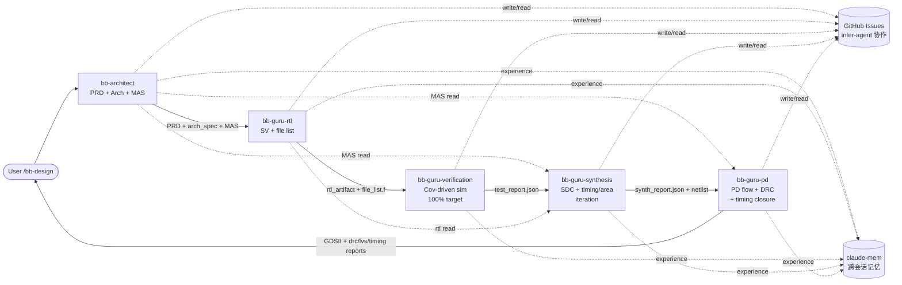
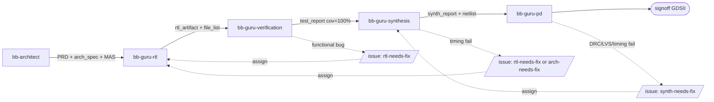
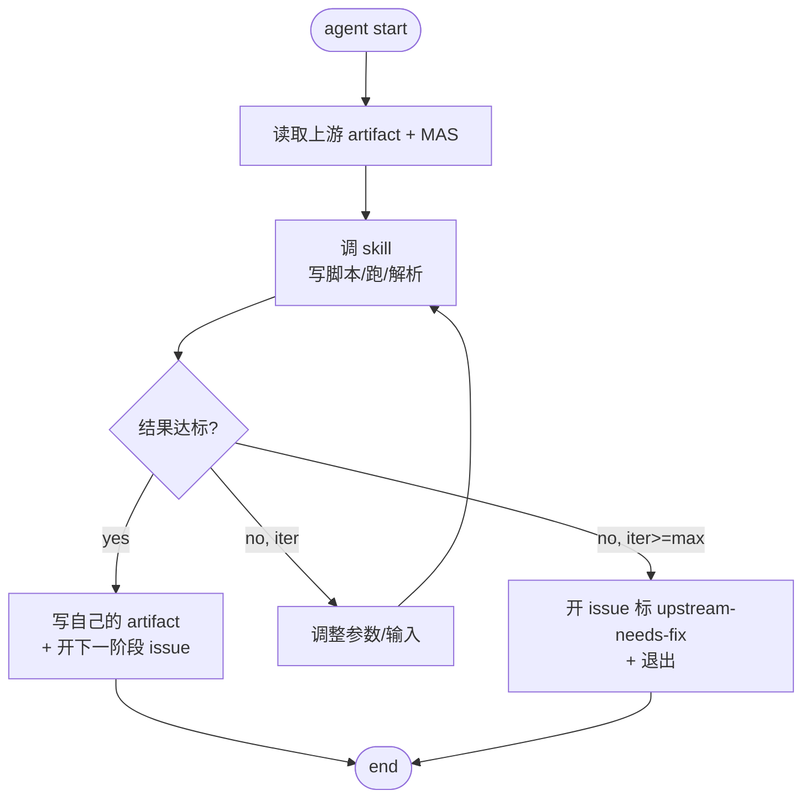
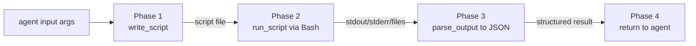

# Babel — AI 原生 Chiplet 多 Agent 系统设计方案 (v1.3)

> v1.3 修订摘要：
> - 流水线扩展至 **5 个 agent**：新增 `bb-guru-pd`（物理设计 flow owner）
> - 顺序调整为 `architect → rtl → verification → synthesis → pd`（RTL-level 验证在综合之前；signoff 在 PD 完成）
> - `bb-architect` **复用既有 ic-* skills**：`bb-prd` / `bb-arch` / `bb-mas`（不重写 bb- 版本）
> - `bb-guru-rtl` 复用 `bb-rtl-coder` skill；输出 hierarchical SV + file list；**不再**输出 SDC
> - `bb-guru-synthesis` 从 MAS 推导 SDC（新 skill `bb-create-sdc`）；跑综合 + 迭代时序/面积优化
> - `bb-guru-pd` 跑物理设计 flow（floorplan / place / route / DRC / LVS / timing closure / GDSII）
> - Coverage target **100%**（替代 v1.2 ≥95%）
>
> v1.2 修订继承（不再列出）：bb- 前缀；bb-architect / bb-guru-*；sequential + git issues；skill 写脚本范式。

---

## 0. 文档约定

### 0.1 Glossary

| 术语 | 定义 |
|------|------|
| Agent | Claude Code subagent；承担 flow ownership 与 optimization loop |
| Flow Owner | 拥有某 flow 闭环责任的 agent（`bb-architect` 或 `bb-guru-*`） |
| Skill | Claude Code skill；写脚本 → 跑脚本 → 解析输出 → 回传（详见 §10） |
| Hook | Claude Code hook（PreToolUse / PostToolUse / Session） |
| Sequential Pipeline | 各 agent 按固定顺序执行，无中央协调进程 |
| Git Issue | inter-agent 协作的通信载体（label 表示阶段） |
| Optimization Loop | agent 内迭代：调 skill → 检结果 → 调参 → 再调 skill；上限 `max_optim_iter` |
| CBB | Common Building Block（wiki/cbb/ 复用模板） |
| CDC / RDC | 跨时钟域 / 跨复位域 |
| **MAS** | Microarchitecture Specification — 微架构规格说明书（bb-architect 产出，下游各 agent 共同消费） |
| **PD** | Physical Design — 物理设计（floorplan / place / route / fill / DRC / LVS） |
| **GDSII** | Graphic Design System II — 版图二进制交付格式（PD 终态产物） |
| **Timing Closure** | 时序收敛（WNS ≥ 0 across all PVT corners） |
| **File List** | 综合 / 仿真工具的输入 RTL 文件清单（`*.f` 格式或 JSON） |
| WNS / QoR / UPF / ICG / SVA / DFT / ATPG / DRC / LVS / UCIe | 与 v1.1 相同含义 |

### 0.2 优先级语义

| 标签 | 含义 |
|------|------|
| P0 | MVP（Phase 1-4）必交付 |
| P1 | Phase 5 交付 |
| P2 | Phase 6+ 交付 |

### 0.3 决策日志

| ADR | 决策 | Status |
|-----|------|--------|
| ADR-001 | EDA 工具 = Bash + CLI（非 MCP server） | Accepted |
| ADR-002 | 去人格化命名 + bb-{role} 命名约定 | Accepted (v1.2 扩展) |
| ADR-003 | ~~单写者 state.json~~ | **Deprecated by ADR-012** |
| ADR-004 | MVP 范围；v1.3 更新为 **5 agent**：`bb-architect / bb-guru-rtl / bb-guru-verification / bb-guru-synthesis / bb-guru-pd` | Accepted (v1.3 更新) |
| ADR-005 | Pyverilog SV fallback (verible / slang) | Accepted |
| ADR-006 | ~~v1.0→v1.1 state schema migration~~ | **Deprecated** |
| ADR-007 | Memory 复用 claude-mem | Accepted |
| ADR-008 | Waveform → VSCode 扩展 | Accepted |
| ADR-009 | EDA = skill；agent = flow owner | Accepted |
| ADR-010 | Bash 软边界 / 接受残留风险 | Accepted |
| ADR-011 | Inter-agent comms = GitHub issues | Accepted (v1.2) |
| ADR-012 | Sequential pipeline 作为 MVP 协作模型 | Accepted (v1.2) |
| ADR-013 | Skill 执行范式 (write-script → run → parse) | Accepted (v1.2) |
| **ADR-014** | **复用既有 ic-* skills（bb-prd / bb-arch / bb-mas / bb-rtl-coder）；不重新实现 bb- 版本** | **Accepted (v1.3)** |
| **ADR-015** | **流水线顺序：architect → rtl → verification → synthesis → pd（验证在综合前；signoff 落在 PD GDSII）** | **Accepted (v1.3)** |
| **ADR-016** | **SDC 来源：bb-guru-synthesis 从 MAS 派生 SDC（不再由 bb-guru-rtl 起草）** | **Accepted (v1.3)** |

### 0.4 版本

| Version | Date | Notes |
|---------|------|-------|
| 1.0.0 | 2026-05-16 | 初版 |
| 1.1.0 | 2026-05-16 | 修复 46 review issue + 3 项简化决策 |
| 1.1.1 | 2026-05-16 | 修复 v1.1 review C2 / C3 + 接受 C1（ADR-010） |
| 1.2.0 | 2026-05-16 | bb- 前缀；bb-architect / bb-guru-*；sequential + git issues；skill 写脚本范式 |
| 1.3.0 | 2026-05-16 | 流水线扩展至 5 agent（+bb-guru-pd）；重排 rtl→verify→synth→pd；coverage 100%；复用 ic-* skills；SDC 由 synth 从 MAS 派生 |

---

## 一、参考项目核心模式汇总

### 1.1 Multi-Agent 协调模式对比

| 项目 | 协调模式 | 核心机制 |
|------|----------|----------|
| digital-chip-design-agents | Pipeline Orchestrator | fix_request, cross-domain loop |
| fnw | 12 Role Agents + Flow JSON | 强制门禁, Wiki 检索 |
| MAGE | Planner→Programmer→Reviewer→Evaluator | 4-shot prompts, Fix Loop |
| VerilogCoder | Planner→Coder→Fixer | Graph-based Planning, AST Tracing |

> v1.2 决策保留：Babel 选用 sequential pipeline，inter-agent 协作通过 git issues 而非中央 coord（ADR-012）。
> v1.3 决策：流水线顺序 RTL 验证在综合前；signoff 在 PD 完成（ADR-015）。

### 1.2 关键采纳

| 优先级 | 内容 | 来源 |
|--------|------|------|
| P0 | Sequential pipeline (5 agent, architect → rtl → verify → synth → pd) | Babel v1.3 自创 |
| P0 | Git issues 作为 inter-agent comms | Babel v1.2 自创 |
| P0 | Skill 写脚本范式 (write → run → parse) | Babel v1.2 自创 |
| P0 | 复用既有 ic-* skills | 用户既有 skill 库（ADR-014） |
| P0 | 强制质量门禁体系 | fnw |
| P0 | Memory 复用 claude-mem 插件 | 现有 Claude Code 生态 |
| P1 | AST 静态分析 | VerilogCoder |
| P1 | 对抗性评审 (devils-advocate) | fnw |
| P1 | 4-shot Prompt 模板 | MAGE |

> Waveform tracing 不进入 Babel 设计范围 — 由 VSCode 扩展承担（ADR-008）。
> 命名差异化对比表已删除；命名唯一性 CI 检查见 §15.2。

---

## 二、系统架构设计

### 2.1 整体架构



关键约束：
- 上游 agent 完成 → 创建 git issue 标 `ready-for-<next>` → 下游 agent 拾起
- 下游失败 → 创建 issue 标 `<upstream>-needs-fix` → 上游 agent 拾起并重做
- 没有中央 state.json 或 coordinator 进程；每个 agent 独立写自己的产物
- MAS（bb-architect 产出）被 rtl / synth / pd 共同消费
- 最终 signoff 落在 PD 输出 GDSII + DRC clean + timing closure

### 2.2 Sequential Pipeline 流程



### 2.3 Agent 内 Optimization Loop



---

## 三、Sub-Agent 定义

### 3.0 Agent vs Skill 职责分离（ADR-009 复述）

| 类别 | 实现 | 职责 |
|------|------|------|
| Agent | Claude Code subagent | Flow ownership + optimization loop（决定何时调 skill、读结果、调参重调） |
| Skill | Claude Code skill (Bash + CLI) | Tool operation：写脚本、跑脚本、解析输出（无业务判断） |

EDA 工具仅以 skill 实现，不存在"agent 等价物"。CDC / 综合 / 仿真 / PR 等执行细节均封装在 skill 内；agent 负责"调用哪条 skill、什么时候停"。

> v1.3 注：bb-architect 直接复用既有 `bb-prd` / `bb-arch` / `bb-mas` skill；bb-guru-rtl 直接复用 `bb-rtl-coder`（ADR-014）。

### 3.0.1 命名规则

- Top-level architect：`bb-architect`
- Flow owner：`bb-guru-{flow}`（`bb-guru-rtl` / `bb-guru-verification` / `bb-guru-synthesis` / `bb-guru-pd`）
- Skill：`bb-{action}-{target}`（Babel 原生）或 `ic-{name}`（外部复用，ADR-014）
- Hook：`bb-hook-{trigger}-{action}`

### 3.1 MVP Agents (Phase 1-4, 5 个)

#### 3.1.1 bb-architect

```yaml
name: bb-architect
description: 架构 flow owner — 输出 PRD / arch_spec / MAS 三类文档
tools: [Read, Write, Edit, Grep, Glob, Bash]
write_paths:
  - "designs/*/PRD.md"
  - "designs/*/arch_spec/**"
  - "designs/*/mas/**"
  - "designs/*/ADR/*.md"
read_denylist:
  - "~/.ssh/**"
  - "~/.aws/**"
max_tokens: 120000
output_schema: schemas/mas.schema.json
artifacts:
  - PRD.md                # 产品需求（bb-prd 产出）
  - arch_spec/            # 架构规格（bb-arch 产出，含 arch_doc.md / data_flow.md / workflow.md）
  - mas/                  # 微架构规格（bb-mas 产出，含 mas.md / mas.json / fsm/ / datapath/ / verif_plan_seed.md / dft_plan_seed.md）
  - ADR/*.md              # 关键决策
invokes_skills:
  - bb-prd                # 外部 skill（ADR-014）
  - bb-arch               # 外部 skill
  - bb-mas                # 外部 skill
  - bb-search-protocol
  - bb-search-cbb
  - bb-get-interface-template
  - bb-create-issue
```

职责：
- 用户 prompt → 调用 `bb-prd` 产 PRD.md
- PRD → 调用 `bb-arch` 产架构规格（含模块划分、信号流、workflow）
- 架构规格 → 调用 `bb-mas` 产微架构规格（含 FSM、datapath、接口信号表、verification plan 种子、DFT plan 种子）
- 不写 RTL，不做综合 / 验证 / PD

完成后：写 git issue `label=ready-for-rtl`，引用 mas/mas.json 路径 + sha256。

> 关键变化：MAS 是后续 3 个 guru agent 的共同输入（rtl/synth/pd 都需 read mas.json）。

#### 3.1.2 bb-guru-rtl

```yaml
name: bb-guru-rtl
description: RTL 生成 flow owner — 输入 MAS，输出 hierarchical SV + file list
tools: [Read, Write, Edit, Bash, Grep, Glob]
write_paths:
  - "designs/*/rtl/**"
  - "designs/*/rtl_artifact.json"
  - "designs/*/file_list.f"
max_tokens: 100000
output_schema: schemas/rtl_artifact.schema.json
artifacts:
  - rtl/*.sv              # hierarchical SystemVerilog HDL
  - rtl/*/*.sv            # 子层级模块
  - file_list.f           # 综合 / 仿真工具输入文件清单
  - rtl_artifact.json     # 元数据（schema-validated）
invokes_skills:
  - bb-rtl-coder          # 外部 skill（ADR-014）
  - bb-check-lint
  - bb-find-module-deps
  - bb-list-issues
  - bb-create-issue
  - bb-close-issue
optimization_loop:
  trigger: lint error
  max_iter: 3
  param_strategy: 根据 lint error 类型反馈给 bb-rtl-coder 重新生成
```

职责：
- 输入：mas/mas.json + mas/fsm/* + mas/datapath/*（从 git issue 拾起 MAS 路径）
- 调 `bb-rtl-coder` 生成 hierarchical SV RTL（顶层 + 各子模块）
- 调 `bb-check-lint` 跑 verible-verilog-lint
- 生成 `file_list.f`（按 hierarchy 排序，顶层在最后；含 `+incdir+` / `+define+` 必要项）
- lint error → optimization loop（≤ 3 次重生成）
- 写 rtl_artifact.json + 开 issue `ready-for-verification`

不做：
- CDC 检查（交 bb-guru-synthesis 用 skill `bb-check-cdc`）
- 综合预检（交 bb-guru-synthesis）
- SDC 草稿（**v1.3 变化**：SDC 由 bb-guru-synthesis 从 MAS 派生，详见 ADR-016）
- TB 生成（交 bb-guru-verification）

#### 3.1.3 bb-guru-verification

```yaml
name: bb-guru-verification
description: 动态验证 flow owner — Cov-driven simulation，target coverage 100%
tools: [Read, Write, Edit, Bash, Grep, Glob]
write_paths:
  - "designs/*/verif/**"
  - "designs/*/tb/**"
  - "designs/*/sim_results/**"
  - "designs/*/test_report.json"
max_tokens: 100000
output_schema: schemas/test_report.schema.json
artifacts:
  - verif/verification_plan.md   # 验证计划（从 mas/verif_plan_seed.md 衍生）
  - verif/test_cases.md          # 测试用例清单
  - tb/*.sv                      # SystemVerilog UVM / cocotb TB
  - tb/*.py                      # cocotb 测试驱动（备选）
  - sim_results/*.log
  - sim_results/*.vcd            # 用户用 VSCode 看（ADR-008）
  - coverage.json
  - test_report.json
invokes_skills:
  - bb-create-verif-plan         # 新 skill：从 mas verif_plan_seed → 完整验证计划
  - bb-generate-tb               # TB / test case 生成
  - bb-invoke-verilator          # 仿真执行
  - bb-collect-coverage          # 覆盖率解析
  - bb-list-issues
  - bb-create-issue
  - bb-close-issue
optimization_loop:
  trigger: coverage < 100% 或 sim failure
  max_iter: 8
  param_strategy:
    - 增加约束随机种子数 (常规)
    - 添加 corner-case 用例（针对 uncovered bins）
    - 调整 testbench constraints
    - 反复仍失败（functional bug） → rtl-needs-fix issue
```

职责：
- 输入：rtl_artifact.json + file_list.f + mas/verif_plan_seed.md
- 调 `bb-create-verif-plan` 完整化验证计划
- 调 `bb-generate-tb` 产生 TB + test cases
- 调 `bb-invoke-verilator` 跑 coverage-driven simulation
- 调 `bb-collect-coverage` 解析覆盖率
- coverage < 100% → optimization loop（加 corner case 或调约束，≤ 8 次）
- 收敛（**functional + code coverage = 100%**）→ 写 test_report.json + 开 issue `ready-for-synth`

不做形式验证（Future: bb-guru-formal）；不分析波形（用户用 VSCode）。

> v1.3 变化：coverage target 提升至 100%（v1.2 是 ≥95%）；位置移到综合之前（先验证再综合）。

#### 3.1.4 bb-guru-synthesis

```yaml
name: bb-guru-synthesis
description: 综合 flow owner — 从 MAS 派生 SDC，跑综合，迭代时序+面积
tools: [Read, Write, Edit, Bash, Grep, Glob]
write_paths:
  - "designs/*/synth/**"
  - "designs/*/cdc/**"
  - "designs/*/constraints/*.sdc"
  - "designs/*/synth_report.json"
max_tokens: 100000
output_schema: schemas/synth_report.schema.json
artifacts:
  - constraints/*.sdc          # SDC 时序约束（从 MAS 派生，最终化）
  - cdc/cdc_report.json        # CDC 子结果（嵌入 synth_report）
  - synth/netlist.v            # 综合网表
  - synth/qor.json             # WNS / Area / Power 估算
  - synth_report.json          # 合并产物（含 cdc / sdc / qor 子段）
invokes_skills:
  - bb-create-sdc              # 新 skill：MAS → SDC（替代 v1.2 rtl-coder 起草）
  - bb-check-cdc               # CDC / RDC 检查
  - bb-parse-ast
  - bb-invoke-yosys            # 综合
  - bb-invoke-opensta          # STA
  - bb-list-issues
  - bb-create-issue
  - bb-close-issue
optimization_loop:
  trigger: WNS < 0 或 area > target_area × 1.2
  max_iter: 6
  param_strategy:
    - 调 yosys synth 参数（abc_options / mapping_effort / retiming）
    - 调 SDC 余量与例外（false_path / multi_cycle）
    - 严重时回退给 rtl-needs-fix 或 arch-needs-fix
```

职责：
1. SDC 派生：调 `bb-create-sdc` 从 mas/mas.json 提取 clock domain / IO timing / exception → 写 constraints/*.sdc
2. CDC 阶段：调 `bb-check-cdc` skill；若 unwaived violation → 开 issue `rtl-needs-fix`；退出
3. 综合阶段：调 `bb-invoke-yosys` 写综合脚本 + 跑 yosys + 解析 QoR
4. STA 阶段：调 `bb-invoke-opensta` 验证时序
5. 优化循环：WNS < 0 或 area 超标 → 调参 / 调 SDC 重综合（≤ 6 次）
6. 收敛后写 synth_report.json（含 cdc / sdc / qor 子段）+ 开 issue `ready-for-pd`

> v1.3 变化（ADR-016）：SDC 来源由 `bb-guru-rtl` 转为 `bb-guru-synthesis`，因为 SDC 的源头是 MAS（时钟 / 复位 / IO timing），而非 RTL。RTL 阶段不应该假定时序约束。

#### 3.1.5 bb-guru-pd（新增）

```yaml
name: bb-guru-pd
description: 物理设计 flow owner — floorplan / place / route / DRC / LVS / timing closure / GDSII
tools: [Read, Write, Edit, Bash, Grep, Glob]
write_paths:
  - "designs/*/pd/**"
  - "designs/*/pd_report.json"
  - "designs/*/gdsii/*.gds"
max_tokens: 100000
output_schema: schemas/pd_report.schema.json
artifacts:
  - pd/floorplan.def           # Floorplan DEF
  - pd/placed.def              # Placement DEF
  - pd/routed.def              # 路由后 DEF
  - pd/drc_report.txt          # DRC 检查报告
  - pd/lvs_report.txt          # LVS 对比报告
  - pd/timing_signoff.json     # post-PD STA（含 OCV / PVT corners）
  - gdsii/*.gds                # 最终 GDSII（signoff 产物）
  - pd_report.json             # 汇总报告（含 DRC clean / LVS match / timing closure status）
invokes_skills:
  - bb-create-floorplan        # 新 skill：从 MAS + netlist 生成 floorplan 脚本
  - bb-invoke-magic            # DRC / 版图操作
  - bb-invoke-netgen           # LVS
  - bb-invoke-qrouter          # 详细布线
  - bb-invoke-opensta          # post-route STA
  - bb-invoke-klayout          # GDSII 查看 / 流式 export
  - bb-list-issues
  - bb-create-issue
  - bb-close-issue
optimization_loop:
  trigger: DRC violation 或 LVS mismatch 或 post-PD WNS < 0
  max_iter: 5
  param_strategy:
    - 调 floorplan（utilization / aspect ratio / IO 位置）
    - 调 placement constraints（macro placement / region constraints）
    - 调 routing strategy（layer assignment / spacing rules）
    - 严重时退回 synth-needs-fix（如 timing 无法 close）
```

职责：
- 输入：synth_report.json + synth/netlist.v + mas/mas.json（IO ring / clock plan / pad-list）
- Floorplan：调 `bb-create-floorplan` 生成 floorplan 脚本 → 调 `bb-invoke-magic` 执行
- Placement：调用 `bb-invoke-magic` 跑 placement（或外部 PR 工具 wrapper）
- Routing：调用 `bb-invoke-qrouter` 跑详细布线
- DRC：调 `bb-invoke-magic` 跑 DRC，零 violation 才通过
- LVS：调 `bb-invoke-netgen` 对比 netlist vs layout，必须 match
- Post-PD STA：调 `bb-invoke-opensta` 验证 OCV / corner timing
- GDSII export：调 `bb-invoke-klayout` 输出最终 `*.gds`
- 任一项失败 → optimization loop 或 retreat（开 `synth-needs-fix` issue）
- 收敛 → 写 pd_report.json + 开 issue `signoff`（最终 ack）

#### 3.1 总结对比表

| Agent | 上游产物消费 | 主要产物 | 主要外部 skill | 关键 metric |
|-------|------------|----------|---------------|-----------|
| bb-architect | user prompt | PRD / arch_spec / MAS | bb-prd / bb-arch / bb-mas | MAS schema valid + 3 量化 KPI |
| bb-guru-rtl | MAS | rtl/*.sv + file_list.f | bb-rtl-coder + bb-check-lint | lint 0 error |
| bb-guru-verification | rtl + file_list + verif_plan_seed | tb + sim_results + coverage.json | bb-generate-tb + bb-invoke-verilator | **coverage = 100%** |
| bb-guru-synthesis | MAS + rtl + test signoff | sdc + netlist + qor | bb-create-sdc + bb-invoke-yosys + bb-invoke-opensta | WNS ≥ 0 + area target |
| bb-guru-pd | MAS + netlist + sdc | GDSII + DRC/LVS/timing reports | bb-invoke-magic + bb-invoke-netgen + bb-invoke-qrouter + bb-invoke-klayout | DRC clean + LVS match + WNS ≥ 0 |

### 3.2 Future Agents (Phase 5+)

| Agent | 触发条件 |
|-------|---------|
| bb-guru-formal | 形式验证（SVA + 等价性）；test 完成后 |
| bb-guru-power | 功耗优化（ICG / UPF）；synth 报告功耗超标后 |
| bb-guru-dft | 扫描链插入 + ATPG（从 mas/dft_plan_seed.md） |
| bb-guru-integration | 顶层集成 / IP 集成 |

> v1.3 调整：原 v1.2 `bb-guru-physical` Future agent **晋升为 MVP** 并更名 `bb-guru-pd`。

### 3.3 Agent IO 契约

| Agent | Inputs（schema） | Output Schema |
|-------|-----------------|---------------|
| bb-architect | user prompt → idea.schema.json | mas.schema.json (顶层；arch_spec + PRD 嵌入或链接) |
| bb-guru-rtl | mas.schema.json | rtl_artifact.schema.json |
| bb-guru-verification | rtl_artifact.schema.json + mas.schema.json (读 verif_plan_seed) | test_report.schema.json |
| bb-guru-synthesis | rtl_artifact + mas (读 timing/IO) + test_report (signoff gate) | synth_report.schema.json |
| bb-guru-pd | synth_report + mas (读 IO ring / clock plan) | pd_report.schema.json |

启动 hook `bb-hook-validate-input-schema` 校验上游 artifact；不通过 → 写 issue `<upstream>-needs-fix` 并退出。

---

## 四、Skill 定义

命名：`bb-{action}-{target}`（Babel 原生）或 `ic-{name}`（外部复用 ADR-014）

每个 skill frontmatter 必含：

```yaml
input_args:
  - { name: <arg>, type: <type>, required: <bool> }
output_contract:
  artifact_path: <glob>
  schema_ref: <path>
forbidden_tools: [Task, Agent, Skill]   # 单向依赖强制
```

### 4.1 Design Generation Skills（部分复用外部）

| Skill | 来源 | 调用方 | 职责 |
|-------|------|--------|------|
| bb-prd | 外部（既有） | bb-architect | 用户 prompt → PRD.md |
| bb-arch | 外部（既有） | bb-architect | PRD → architecture spec（arch_doc / data_flow / workflow） |
| bb-mas | 外部（既有） | bb-architect | arch → 微架构规格（fsm / datapath / 接口表 / verif_plan_seed / dft_plan_seed） |
| bb-rtl-coder | 外部（既有） | bb-guru-rtl | MAS → hierarchical SV RTL |
| bb-check-lint | Babel 原生 | bb-guru-rtl | verible-verilog-lint |
| bb-create-verif-plan | Babel 原生（新） | bb-guru-verification | verif_plan_seed → 完整验证计划 |
| bb-generate-tb | Babel 原生 | bb-guru-verification | mas + rtl → testbench / test cases |
| bb-collect-coverage | Babel 原生 | bb-guru-verification | 覆盖率解析（functional + code） |
| bb-create-sdc | Babel 原生（新） | bb-guru-synthesis | MAS → SDC（替代 v1.2 rtl-coder 起草） |
| bb-check-cdc | Babel 原生 | bb-guru-synthesis | CDC / RDC |
| bb-create-floorplan | Babel 原生（新） | bb-guru-pd | MAS + netlist → floorplan 脚本 |

### 4.2 EDA Tool Skills (Bash + CLI；ADR-001 / ADR-009 / ADR-013)

全部封装为 Babel 原生 skill；v1.3 因 PD 加入，magic / netgen / qrouter / klayout 升为 MVP。

| Skill | CLI | Version | 调用方 |
|-------|-----|---------|--------|
| bb-invoke-yosys | yosys | 0.35.x (prefix match) | bb-guru-synthesis |
| bb-invoke-verilator | verilator | 5.012 | bb-guru-verification |
| bb-invoke-opensta | sta | 2.5.0 | bb-guru-synthesis + bb-guru-pd |
| bb-invoke-magic | magic | 8.3.641 | bb-guru-pd (floorplan / DRC) |
| bb-invoke-netgen | netgen | 1.5.275 | bb-guru-pd (LVS) |
| bb-invoke-klayout | klayout | 0.30.8 | bb-guru-pd (GDSII export) |
| bb-invoke-qrouter | qrouter | 1.4 | bb-guru-pd (routing) |
| bb-invoke-abc | abc | Phase 1 commit-pin | bb-guru-synthesis (内嵌 yosys) |

### 4.3 AST Analysis Skills

| Skill | 工具 | 调用方 |
|-------|------|--------|
| bb-parse-ast | pyverilog（主） | bb-guru-synthesis（CDC 用） |
| bb-parse-ast-fallback | verible-verilog-syntax / slang（ADR-005） | bb-guru-synthesis |
| bb-trace-signal-path | pyverilog AST visitor | bb-guru-synthesis |
| bb-find-module-deps | pyverilog + python script | bb-guru-rtl（file_list.f 排序） |

### 4.4 Knowledge Search Skills

| Skill | 实现 |
|-------|------|
| bb-search-protocol | `rg -i {pattern} wiki/protocols/` |
| bb-search-cbb | `rg -i {pattern} wiki/cbb/` |
| bb-get-interface-template | Read wiki/cbb/{template}.md |

### 4.5 Issue Comms Skills（ADR-011）

| Skill | 实现 | 用途 |
|-------|------|------|
| bb-create-issue | `gh issue create --label <label> --body <yaml>` | agent 完成阶段开 issue |
| bb-list-issues | `gh issue list --label <label> --json ...` | agent 启动查待处理 issue |
| bb-close-issue | `gh issue close <num> --comment <body>` | 任务完成关 issue |

### 4.6 Quality Gate Skills

| Skill | 检查项 | 通过标准 |
|-------|--------|----------|
| bb-gate-rtl-quality | lint + 基础结构 | 0 error |
| bb-gate-test-quality | 覆盖率 + 断言 | functional **100%**, code **100%** |
| bb-gate-synth-quality | WNS + Area | WNS ≥ 0, Area < 120% baseline |
| bb-gate-pd-quality | DRC + LVS + post-PD timing | 0 DRC, LVS match, post-PD WNS ≥ 0 |
| bb-challenge-code | 对抗评审 | ruthless / linus / balanced |

---

## 五、Hooks

命名：`bb-hook-{trigger}-{action}`

| Hook | Trigger | 动作 |
|------|---------|------|
| bb-hook-write-arch-freeze-check | PreToolUse Write/Edit RTL | 检查是否违背架构冻结 |
| bb-hook-instantiate-cbb-search | PreToolUse 实例化 CBB | 强制 wiki 检索 |
| bb-hook-commit-quality-gate | PreToolUse git commit RTL | lint + 综合 |
| bb-hook-validate-input-schema | Agent 启动 | 校验上游 artifact schema |
| bb-hook-validate-bash-cmd | PreToolUse Bash | 软警告越界命令（不阻断，ADR-010） |
| bb-hook-pipeline-advance | PostToolUse agent 完成 | 检查 git issues 自动触发下一 agent（可选） |
| bb-hook-change-propagate | PostToolUse 上游变更 | 触发下游 invalidate |
| bb-hook-create-fix-issue | PostToolUse agent 失败 | 自动开 `<upstream>-needs-fix` issue |
| bb-hook-session-summarize | SessionEnd | 生成执行摘要 |
| bb-hook-validate-wiki | PreToolUse wiki 读取 | 校验 frontmatter content_hash |

---

## 六、EDA 工具集成

> 关键决策（ADR-001 + ADR-009）：EDA 工具通过 Bash + CLI 调用，封装为 skill；不使用 MCP server；不为单个工具创建 agent。
> v1.3 PD 引入 magic / netgen / qrouter / klayout 至 MVP（详见 §4.2）。

### 6.1 集成约定

- 每个 EDA 工具一个 skill（命名见 §4.2）
- skill 内通过 Bash 工具调用 CLI
- 标准输出位置：
  - 日志 → `designs/<name>/<tool>/{stamp}.log`
  - 结构化结果（JSON）→ `designs/<name>/<tool>/{stamp}.json`
- 调用者：flow owner agent

### 6.2 Environment

```bash
source ~/wrk/eda_opensources/eda_env.sh

# 启动期 hook 同步验证（v1.3 扩展含 PD 工具）：
yosys -V | grep -E "^Yosys 0\.35"
verilator --version | grep "5.012"
magic --version | grep "8.3"
netgen -batch lvs --version 2>&1 | grep "1.5"
qrouter -v 2>&1 | grep "1.4"
klayout -v 2>&1 | grep "0.30"
```

### 6.3 AST / Knowledge 同样为 skill

原 v1.0 MCP 化设计已废弃；AST / wiki 全部以 skill 实现（见 §4.3 / §4.4）。

---

## 七、状态管理（v1.2 简化，v1.3 扩展）

> ADR-003（单写者 state.json）废弃；各 agent 独立 schema-validated artifact + GitHub issues 协作（ADR-012）。

### 7.1 Per-Agent Artifact

每个 agent 写自己的产物到 `designs/<name>/`：

```
designs/<name>/
├── PRD.md                       # bb-architect (via bb-prd)
├── arch_spec/                   # bb-architect (via bb-arch)
│   ├── arch_doc.md
│   ├── data_flow.md
│   └── workflow.md
├── mas/                         # bb-architect (via bb-mas)
│   ├── mas.md
│   ├── mas.json                 # 结构化 MAS (schema: mas.schema)
│   ├── fsm/
│   ├── datapath/
│   ├── verif_plan_seed.md       # 给 bb-guru-verification 用
│   └── dft_plan_seed.md         # 给 future bb-guru-dft 用
├── ADR/*.md                     # bb-architect
├── rtl/                         # bb-guru-rtl
│   ├── *.sv                     # hierarchical SV
│   └── ...
├── file_list.f                  # bb-guru-rtl (工具输入文件清单)
├── rtl_artifact.json            # bb-guru-rtl
├── verif/                       # bb-guru-verification
│   ├── verification_plan.md
│   └── test_cases.md
├── tb/                          # bb-guru-verification
├── sim_results/                 # bb-guru-verification (含 *.vcd 给用户)
├── coverage.json                # bb-guru-verification
├── test_report.json             # bb-guru-verification
├── constraints/                 # bb-guru-synthesis (SDC 由 MAS 派生)
│   └── *.sdc
├── cdc/                         # bb-guru-synthesis via bb-check-cdc
│   └── cdc_report.json
├── synth/                       # bb-guru-synthesis
│   ├── netlist.v
│   └── qor.json
├── synth_report.json            # bb-guru-synthesis
├── pd/                          # bb-guru-pd
│   ├── floorplan.def
│   ├── placed.def
│   ├── routed.def
│   ├── drc_report.txt
│   ├── lvs_report.txt
│   └── timing_signoff.json
├── gdsii/                       # bb-guru-pd（最终 signoff 产物）
│   └── *.gds
├── pd_report.json               # bb-guru-pd
└── design_summary.json          # 各 agent 完成后追加自己的 signoff 行
```

### 7.2 design_summary.json (append-only)

```json
{
  "design_id": "design_01HW2K3M4N5P6Q7R8S9TABCDEF",
  "design_name": "uart",
  "created_at": "2026-05-16T15:00:00+08:00",
  "stages": [
    { "agent": "bb-architect",        "ts": "2026-05-16T15:10:00+08:00", "artifact": "mas/mas.json",      "sha256": "<hex>", "signoff": true },
    { "agent": "bb-guru-rtl",         "ts": "2026-05-16T15:30:00+08:00", "artifact": "rtl_artifact.json", "sha256": "<hex>", "signoff": true },
    { "agent": "bb-guru-verification","ts": "2026-05-16T16:00:00+08:00", "artifact": "test_report.json",  "sha256": "<hex>", "signoff": true, "coverage_pct": 100 },
    { "agent": "bb-guru-synthesis",   "ts": "2026-05-16T16:30:00+08:00", "artifact": "synth_report.json", "sha256": "<hex>", "signoff": true, "wns_ns": 0.12 },
    { "agent": "bb-guru-pd",          "ts": "2026-05-16T17:30:00+08:00", "artifact": "pd_report.json",    "sha256": "<hex>", "signoff": true, "gdsii": "gdsii/uart.gds" }
  ]
}
```

### 7.3 Git Issues 协作模式（ADR-011）

#### Label 体系

| Label | 含义 | 拾起方 |
|-------|------|--------|
| `ready-for-rtl` | bb-architect 完成（MAS 就绪） | bb-guru-rtl |
| `ready-for-verification` | bb-guru-rtl 完成 | bb-guru-verification |
| `ready-for-synth` | bb-guru-verification 完成（cov=100%） | bb-guru-synthesis |
| `ready-for-pd` | bb-guru-synthesis 完成（timing 收敛） | bb-guru-pd |
| `signoff` | bb-guru-pd 完成（GDSII 出炉） | 用户 |
| `arch-needs-fix` | 下游报告 MAS 问题 | bb-architect |
| `rtl-needs-fix` | verification / synth / pd 报告 RTL 问题 | bb-guru-rtl |
| `synth-needs-fix` | pd 报告 netlist 问题 | bb-guru-synthesis |

#### Issue Body 格式

```yaml
---
design_name: uart
design_id: design_01HW2K3M4N5P6Q7R8S9TABCDEF
from_agent: bb-guru-pd
to_agent: bb-guru-synthesis
artifact_ref: designs/uart/synth_report.json
artifact_sha256: <hex>
fix_iteration: 2
---

## Summary
Post-PD timing fails: critical path A to B has WNS = -0.3ns at SS 0.7V -40C corner.

## Details
- Path: uart_top/u_rx/sync_ff to uart_top/u_baudgen/cnt[3]
- post-route delay: 11.2ns (target: 10.0ns @ 100MHz)
- Suggested fix: re-synthesize with mapping_effort=high + retiming, or break path via pipeline register in MAS

## Acceptance
After fix, re-open issue with label `ready-for-pd`.
```

#### Issue 生命周期

1. 创建：agent 调用 skill `bb-create-issue` 通过 `gh issue create --label <X> --body <yaml>`
2. 拾起：下游 agent 启动时调 `bb-list-issues --label <X>` 拉取
3. 关闭：完成后 `bb-close-issue <num> --comment "resolved at sha=..."`

#### fix_iteration 上限

每条 fix-chain max 3 次（design-config）。超出则升级为 `escalate-user` label。

---

## 八、Memory — 复用 claude-mem (ADR-007，不变)

跨会话记忆全权交给 `claude-mem` 插件。失败降级到 stateless + 警告横幅。

---

## 九、Wiki 知识库

### 9.1 MVP 范围

```
wiki/protocols/
├── uart.md
├── axi4-lite.md
└── ucie-overview.md         # 完整 UCIe 拆分到 Phase 5+

wiki/cbb/
├── sync-fifo.md
├── 2ff-sync.md
└── clock-gate.md

wiki/pdk/                    # v1.3 新增（PD MVP 依赖）
├── asap7-overview.md        # ASAP7 LEF / Liberty / tech file 路径与版本
├── asap7-rules.md           # DRC rule 摘要
└── asap7-metal-stack.md     # M1-M7 层定义
```

### 9.2 完整性保护

frontmatter `schema_version` + 外置 `wiki/.hashes.txt`；pre-commit hook 校验。

---

## 十、Skill 执行范式 (ADR-013)

> v1.2 引入：skill 写脚本 → 跑脚本 → 解析输出 → 回传 四阶段执行器。

### 10.1 Skill 四阶段



| 阶段 | 职责 | 产物 |
|------|------|------|
| 1. write_script | 根据 args 模板填充 / 动态生成可执行脚本 | `designs/<n>/<tool>/{stamp}.{ext}` |
| 2. run_script | 通过 Bash 工具调用解释器 / CLI 执行脚本 | stdout / stderr → log；artifact → 目标目录 |
| 3. parse_output | 用正则 / json parser / pyverilog 解析输出 | 结构化 JSON（符合 skill output schema） |
| 4. return | 把结果 JSON 返回给 agent；skill 退出 | agent context |

### 10.2 示例：bb-invoke-magic（PD DRC）

```markdown
---
name: bb-invoke-magic
description: 用 magic 跑 DRC / 版图操作
input_args:
  - { name: tech_file,  type: path, required: true }   # asap7 tech
  - { name: layout_def, type: path, required: true }
  - { name: action,     type: string, enum: [drc, extract, place], required: true }
output_contract:
  script_path:   designs/<n>/pd/<stamp>.magic.tcl
  log_path:      designs/<n>/pd/<stamp>.log
  report_path:   designs/<n>/pd/drc_report.txt
  schema_ref:    schemas/pd_report.schema.json
forbidden_tools: [Task, Agent, Skill]
---

## Phase 1: write_script
Template fill drc commands; write to <script_path>

## Phase 2: run_script
Bash: `magic -dnull -noconsole -T <tech_file> -rcfile /dev/null < <script_path>`

## Phase 3: parse_output
Regex 抽取 DRC violation 数量与坐标
Output JSON

## Phase 4: return
Agent 决定是否进一步迭代
```

### 10.3 Optimization Loop 示例（bb-guru-pd）

```
loop iter = 1..5:
  if iter == 1:
    call bb-create-floorplan(util=0.65, aspect=1.0)
  call bb-invoke-magic(action=place)
  call bb-invoke-qrouter(strategy=default)
  call bb-invoke-magic(action=drc)
  parse drc_report
  if drc.violations == 0:
    call bb-invoke-netgen (LVS)
    if lvs.match:
      call bb-invoke-opensta (post-PD timing)
      if wns >= 0:
        break (signoff)
      else:
        adjust placement (cell density / clock tree)
    else:
      bb-create-issue --label synth-needs-fix --body "<LVS diff>"
      exit
  else:
    adjust floorplan (util / aspect / IO 位置)
end
if iter > 5:
  bb-create-issue --label synth-needs-fix --body "<PD diverge data>"
  exit
```

### 10.4 Skill 收敛保证

每条 skill 的 Phase 2 必含超时（默认 10min；PD skill 默认 30min）；Phase 3 解析失败 → 重试 1 次再失败 → 返回 `{ valid: false, error: ... }`。

---

## 十一、End-to-End Example: UART 设计（Sequential, 5-agent v1.3）

### 11.1 用户调用

```
/bb-design uart "UART tx/rx, 115200 baud, 8N1, AXI4-Lite slave config, single clock @100MHz, ASAP7 PDK"
```

### 11.2 Pipeline 执行

| Step | Agent | 调用 Skill | Input | Output | Issue Open |
|------|-------|-----------|-------|--------|------------|
| 1 | bb-architect | bb-prd → bb-arch → bb-mas + bb-search-protocol(uart) + bb-search-cbb(sync-fifo) | user prompt | PRD.md, arch_spec/*, mas/* (含 verif_plan_seed) | `ready-for-rtl` |
| 2 | bb-guru-rtl | bb-rtl-coder + bb-check-lint + bb-find-module-deps | mas/* | rtl/*.sv (hierarchical), file_list.f, rtl_artifact.json | `ready-for-verification` |
| 3 | bb-guru-verification | bb-create-verif-plan + bb-generate-tb + bb-invoke-verilator + bb-collect-coverage | rtl_artifact + file_list + verif_plan_seed | verif/*, tb/*, sim_results/*, coverage.json (=100%), test_report.json | `ready-for-synth` |
| 4 | bb-guru-synthesis | bb-create-sdc + bb-check-cdc + bb-invoke-yosys + bb-invoke-opensta | mas (timing) + rtl + test signoff | constraints/uart.sdc, cdc_report, synth/netlist.v, synth/qor.json, synth_report.json | `ready-for-pd` |
| 5 | bb-guru-pd | bb-create-floorplan + bb-invoke-magic + bb-invoke-qrouter + bb-invoke-netgen + bb-invoke-opensta + bb-invoke-klayout | mas (IO ring) + synth_report + netlist | pd/floorplan/place/routed.def, drc_report, lvs_report, timing_signoff, **gdsii/uart.gds** | `signoff` |

### 11.3 失败回退示例

若 step 5 LVS mismatch：
1. bb-guru-pd 调 bb-create-issue --label synth-needs-fix --body <yaml> 描述 LVS diff
2. bb-guru-synthesis 拾起 → 调研（mapping issue / blackbox 配置不当）→ 重综合
3. 关 synth-needs-fix issue + 重开 ready-for-pd

若 step 4 综合 WNS 长期不收敛：
1. bb-guru-synthesis 多次 yosys 调参均失败 → 开 rtl-needs-fix 或 arch-needs-fix（critical path 在 MAS 层面就过长）

### 11.4 关键 metric

| Stage | metric | target |
|-------|--------|--------|
| verification | functional cov | **100%** |
| verification | code cov | **100%** |
| synthesis | WNS @ ASAP7 1GHz | ≥ 0 |
| synthesis | Area | < 120% baseline |
| pd | DRC | 0 violation |
| pd | LVS | match |
| pd | post-PD WNS | ≥ 0 (SS / TT / FF corner) |
| pd | GDSII | exist + 可被 klayout 打开 |
| 端到端时间 | | ≤ 4h（v1.3 因 PD 延长） |
| 平均 fix-issue 链长 | | ≤ 3 |

### 11.5 用户中途手动修改

任意 agent 完成后，用户可手工修改产物（vim rtl/*、调 mas 等）；下游 agent 启动时 SHA256 比对触发 invalidate，重跑链。

---

## 十二、Performance & Scalability

### 12.1 系统吞吐

| Phase | 目标 |
|-------|------|
| Phase 1-2 (MVP 雏形) | 单实例每日完成 1 个简单模块（架构 + RTL + verify） |
| Phase 3-4 (MVP 全) | 单实例每日完成 1 个中等模块端到端（含 PD 出 GDSII） |
| Phase 5+ | 多设计并行（按 design_id 隔离目录） |

### 12.2 Per-Agent Context Budget

| Agent | max_tokens | optim_max_iter |
|-------|-----------|----------------|
| bb-architect | 120,000 | n/a |
| bb-guru-rtl | 100,000 | 3 |
| bb-guru-verification | 100,000 | 8 |
| bb-guru-synthesis | 100,000 | 6 |
| bb-guru-pd | 100,000 | 5 |

### 12.3 并发设计

MVP：sequential pipeline 自然串行；多 design 需求通过 `design_id` namespace 隔离不同目录，可并行启动多个 pipeline。

---

## 十三、Security & Concurrency

### 13.1 Agent 权限模型

每 agent yaml 含 `tools` / `write_paths` / `read_denylist` 三字段。默认 fail-closed；威胁模型见 ADR-010。

### 13.2 并发

- Sequential pipeline 内同一时刻仅 1 agent 在跑
- design_summary.json 只 append + atomic-rename
- 多设计目录隔离

### 13.3 Multi-Session 锁

`designs/<id>/.babel_session.lock`（PID + ts + host）阻拦同 design_id 第二实例。

### 13.4 Memory / Wiki 完整性

claude-mem 自身（ADR-007）+ wiki 外置 hash（§9.2）。

---

## 十四、Acceptance Criteria

### 14.1 系统级 metric

| Metric | Target | 依据 |
|--------|--------|------|
| UART 端到端时间（含 PD） | ≤ 4h | 内部目标；含 PD 流程 |
| 平均 fix-issue 链长 | ≤ 3 | 类比 VerilogCoder Fix Loop |
| RTL lint clean rate | 100% (no waived) | ASIC 业界标准 |
| **Functional coverage** | **100%** | v1.3 加严 |
| **Code coverage** | **100%** | v1.3 加严 |
| Synthesis WNS @ ASAP7 1GHz | ≥ 0 | timing closure |
| Area vs hand-coded | < 120% | 自动综合工业基线 |
| **DRC violations** | **0** | Tape-out 门槛 |
| **LVS** | **match** | Tape-out 门槛 |
| **Post-PD WNS (SS/TT/FF)** | **≥ 0** | timing closure across corners |
| **GDSII 输出** | **exist + klayout 可开** | signoff 产物 |

### 14.2 Per-Phase DoD

| Phase | DoD |
|-------|-----|
| 1: 基础框架（2w + 0.5w） | 5 agent yaml + 8 schema 通过 jsonschema CLI；claude-mem smoke；gh CLI；ic-* skills 接入验证 |
| 2: arch+rtl MVP（3w + 0.5w） | UART 完成 bb-architect (bb-prd/bb-arch/bb-mas 全跑) → bb-guru-rtl 端到端；至少 1 次 fix-issue 闭环 |
| 3: verify+synth（3w + 1w） | UART cov=100%；synth WNS ≥ 0 + cdc clean |
| 4: PD（3w + 1w） | UART 跑完 PD：DRC 0 + LVS match + post-PD WNS ≥ 0；GDSII 输出 |
| 5: 优化与扩展（2w + 0.5w） | 3 协议（uart / spi / i2c）端到端通过；端到端 ≤ 4h |

---

## 十五、命名规则

### 15.1 命名约定

- Architect：`bb-architect`
- Flow owner：`bb-guru-{flow}`（`bb-guru-rtl` / `bb-guru-verification` / `bb-guru-synthesis` / `bb-guru-pd` / future `bb-guru-formal` / `bb-guru-power` / `bb-guru-dft` / `bb-guru-integration`）
- Skill：`bb-{action}-{target}`（Babel 原生）或 `ic-{name}`（外部复用，ADR-014）
- Hook：`bb-hook-{trigger}-{action}`

### 15.2 唯一性 CI

`scripts/check_name_uniqueness.py` 扫描 `agents/*.yaml` + `skills/**/*.md`，与参考项目白名单对比，冲突 → CI 红灯。
ic-* skill 由外部提供，仅校验"未被 bb-* 重复实现"。

---

## 十六、实施路线图

| Phase | 任务 | 周数 | Buffer |
|-------|------|------|--------|
| 1: 基础框架 | 5 agent yaml + 8 schema + design_summary + gh CLI + ic-* skill 接入测试 | 2 | 0.5 |
| 2: arch+rtl MVP | bb-architect (3 ic-* skill 链) + bb-guru-rtl + UART step 1-2 | 3 | 0.5 |
| 3: verify+synth | bb-guru-verification (cov=100%) + bb-guru-synthesis (timing closure + SDC 派生) | 3 | 1 |
| 4: PD | bb-guru-pd + PDK 集成 + GDSII 出炉 | 3 | 1 |
| 5: 优化扩展 | 3 协议样例；optimization loop 调优；性能 | 2 | 0.5 |
| **总计** | | **13w + 3.5w buffer** | |

---

## 十七、附录

### A. Future Agents

见 §3.2 表格。

### B. 参考文献

| Repo | URL | Access Date | Commit |
|------|-----|-------------|--------|
| digital-chip-design-agents | https://github.com/chuanseng-ng/digital-chip-design-agents | 2026-05-16 | TBD |
| fnw | https://github.com/zhaixin244-wq/fnw | 2026-05-16 | TBD |
| MAGE | https://github.com/stable-lab/MAGE | 2026-05-16 | TBD |
| VerilogCoder | https://github.com/NVlabs/VerilogCoder | 2026-05-16 | TBD |
| RTL-Coder | https://github.com/hkust-zhiyao/RTL-Coder | 2026-05-16 | TBD |
| OriGen | https://github.com/pku-liang/OriGen | 2026-05-16 | TBD |
| claude-mem | (官方插件 marketplace) | 2026-05-16 | TBD |
| bb-prd / bb-arch / bb-mas / bb-rtl-coder | 用户既有 ECC skill ecosystem | 2026-05-16 | TBD |

### C. 关联文档

| 路径 | 用途 |
|------|------|
| `harness_spec/idea/decisions.md` | ADR 决策日志 |
| `harness_spec/idea/.review/issues.md` | v1.0 review |
| `harness_spec/idea/.review/issues_v1.1.md` | v1.1 review |
| `harness_spec/arch_spec/` | arch_spec 输出（v1 已生成，**v1.3 后需重做**） |

### D. v1.2 → v1.3 变化对照

| v1.2 实体 / 决策 | v1.3 实体 / 决策 | 备注 |
|-----------------|-------------------|------|
| MVP = 4 agent (architect/rtl/synth/verify) | **MVP = 5 agent** (architect/rtl/**verify**/synth/**pd**) | 新增 PD 至 MVP |
| 顺序 architect→rtl→synth→verify | **architect→rtl→verify→synth→pd** | 验证在综合前；signoff 在 PD（ADR-015） |
| bb-plan-arch (Babel 原生) | **bb-prd + bb-arch + bb-mas** (外部复用) | 直接调用现有 ECC skills（ADR-014） |
| bb-generate-rtl (Babel 原生) | **bb-rtl-coder** (外部复用) | 同上 |
| bb-guru-rtl 输出 SDC 草稿 | **bb-guru-synthesis 从 MAS 派生 SDC** (新 skill bb-create-sdc) | ADR-016 |
| coverage ≥ 95% | **coverage = 100%** | 加严 |
| 4 phase roadmap (10w + 2.5w) | **5 phase roadmap (13w + 3.5w)** | 增加 PD phase |
| schema 7 个 | **schema 8 个** (新增 pd_report.schema.json) | |
| EDA tool skills (yosys/verilator/opensta/cdc) | + **magic/netgen/qrouter/klayout 升 MVP** | PD 工具栈 |
| wiki/protocols + cbb | + **wiki/pdk/** (asap7) | PD 必需 PDK 知识 |

### E. 用户决策对照（v1.3 五项流水线变更）

| 用户指令 | 落点 |
|---------|------|
| (1) bb-architect 输出 PRD/arch_spec/MAS，调 bb-prd/bb-arch/bb-mas | §3.1.1；§4.1；ADR-014 |
| (2) bb-guru-rtl 以 MAS 为输入，输出 hierarchical SV + file list | §3.1.2；artifacts 含 file_list.f |
| (3) bb-guru-verification 创建 verif plan / TB / test case，cov 100% | §3.1.3；§14.1；optimization loop max_iter=8 |
| (4) bb-guru-synthesis 从 MAS spec 创建 SDC，跑综合迭代时序/面积 | §3.1.4；新 skill bb-create-sdc；ADR-016 |
| (5) bb-guru-pd 跑 PD flow，DRC + timing closure + GDSII | §3.1.5（新 agent）；§14.1；§16 Phase 4 |
