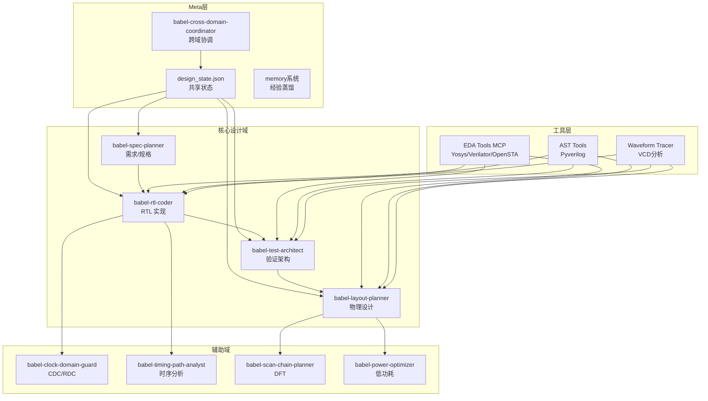
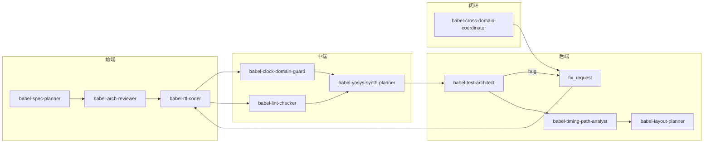

# Babel - AI 原生 Chiplet 多 Agent 系统设计方案

## 一、参考项目核心模式汇总

### 1. Multi-Agent 协调模式对比

| 项目 | 协调模式 | 核心机制 | 命名风格 |
|------|----------|----------|----------|
| **digital-chip-design-agents** | Pipeline Orchestrator | fix_request protocol, cross-domain loop | `{domain}-orchestrator` |
| **fnw** | 12 Role Agents + Flow JSON | 强制门禁, Wiki 检索 | `chip-{role}` |
| **MAGE** | Planner→Programmer→Reviewer→Evaluator | 4-shot prompts, Fix Loop | 角色名无显式命名 |
| **VerilogCoder** | Planner→Coder→Fixer | Graph-based Planning, AST Tracing | 角色名无显式命名 |

### 2. 命名差异化策略

| 参考项目命名 | Babel 命名 | 差异说明 |
|--------------|------------|----------|
| `{domain}-orchestrator` | `babel-{domain}-{role}` | 前缀 + role 后缀化 |
| `chip-{role}` | `babel-{domain}-{role}` | 避免 chip 前缀，用 babel |
| `rtl-design-orchestrator` | `babel-rtl-coder` | coder vs orchestrator |
| `verification-orchestrator` | `babel-test-architect` | test vs verification |
| `sta-orchestrator` | `babel-timing-path-analyst` | timing-path 前缀 |
| `dft-orchestrator` | `babel-scan-chain-planner` | scan-chain 前缀 |
| `cdc-analyst` | `babel-clock-domain-guard` | clock-domain vs cdc |

### 3. 关键采纳内容

| 优先级 | 内容 | 来源 |
|--------|------|------|
| **P0** | fix_request Protocol | digital-chip-design-agents |
| **P0** | Pipeline Orchestrator 跨域协调 | digital-chip-design-agents |
| **P0** | Graph-based Planning 模式 | VerilogCoder |
| **P0** | 强制质量门禁体系 | fnw |
| **P0** | Two-tier Memory System | digital-chip-design-agents |
| **P1** | AST waveform tracing | VerilogCoder |
| **P1** | 对抗性评审 (devils-advocate) | fnw |
| **P1** | 4-shot Prompt 模板 | MAGE |

---

## 二、系统架构设计

### 2.1 整体架构



### 2.2 Domain Pipeline 流程



---

## 三、Sub-Agent 定义（命名规则：babel-{domain}-{role}）

### 3.1 核心域 Orchestrators (6个)

| Agent ID | 中文名 | 职责 | 输出 | 原参考命名对比 |
|----------|--------|------|------|----------------|
| `babel-spec-planner` | 规格规划师 | 需求探索、规格定义、架构评估 | PRD、spec.json、ADR | vs chip-requirement-arch |
| `babel-rtl-coder` | RTL 编码师 | RTL 实现、Lint/CDC检查、综合预检 | .v/.sv、SVA、SDC | vs rtl-design-orchestrator |
| `babel-test-architect` | 测试架构师 | 测试规划、UVM/cocotb环境、覆盖率收集 | TB、测试计划、覆盖率报告 | vs verification-orchestrator |
| `babel-layout-planner` | 布局规划师 | 布局规划、PD流程、DRC/LVS | DEF、GDS、时序报告 | vs physical-design-orchestrator |
| `babel-yosys-synth-planner` | 综合规划师 | Yosys综合、QoR分析、时序优化 | 综合网表、面积/时序报告 | vs synthesis-orchestrator |
| `babel-cross-domain-coordinator` | 跨域协调师 | 跨域调度、fix_request管理、迭代控制 | design_state.json | vs pipeline-orchestrator |

### 3.2 辅助域 Specialists (6个)

| Agent ID | 中文名 | 职责 | 触发条件 | 原参考命名对比 |
|----------|--------|------|----------|----------------|
| `babel-clock-domain-guard` | 时钟域卫士 | CDC/RDC检查、同步器验证 | RTL完成后 | vs chip-cdc-architect |
| `babel-timing-path-analyst` | 时序路径分析师 | 静态时序分析、关键路径识别 | 综合完成后 | vs sta-orchestrator |
| `babel-scan-chain-planner` | 扫描链规划师 | 扫描链插入、ATPG生成 | 物理设计阶段 | vs dft-orchestrator |
| `babel-power-optimizer` | 功耗优化师 | ICG插入、UPF生成、功耗分析 | RTL阶段 | vs chip-lowpower-designer |
| `babel-property-prover` | 属性证明师 | 形式验证、等价性检查 | 验证阶段 | vs formal-orchestrator |
| `babel-top-integration-planner` | 顶层集成规划师 | 顶层集成、IP集成、信号完整性 | 后端阶段 | vs chip-top-integrator |

---

## 四、Skill 定义框架（命名规则：babel-{action}-{target}）

### 4.1 核心 Skills (按 Domain 划分)

| Skill ID | 所属 Domain | 用途 | 原参考命名对比 |
|----------|-------------|------|----------------|
| `babel-plan-spec` | spec | 需求分解、功能定义 | vs chip-impl-input-triage |
| `babel-evaluate-arch` | spec | 架构评估、方案比选 | vs architecture-evaluation |
| `babel-generate-rtl` | rtl | RTL 代码生成（Graph-based Planning） | vs rtl-design |
| `babel-check-lint` | rtl | Verilator lint 检查 | vs chip-lint-checker |
| `babel-analyze-cdc` | rtl | CDC/RDC 分析 | vs chip-cdc-analysis |
| `babel-run-synthesis` | synthesis | Yosys 综合流程 | vs logic-synthesis |
| `babel-generate-tb` | verification | UVM/cocotb TB 生成 | vs functional-verification |
| `babel-collect-coverage` | verification | 覆盖率收集与分析 | 无对应 |
| `babel-run-sta` | sta | OpenSTA 时序分析 | vs sta |
| `babel-run-pd-flow` | pd | Physical Design 流程 | vs physical-design |

### 4.2 工具 Skills

| Skill ID | 用途 | 工具集成 |
|----------|------|----------|
| `babel-invoke-yosys` | Yosys 综合调用 | MCP/Bash |
| `babel-invoke-verilator` | Verilator 仿真 | MCP/Bash |
| `babel-invoke-opensta` | OpenSTA 时序分析 | MCP/Bash |
| `babel-parse-ast` | Pyverilog AST 分析 | Python/Bash |
| `babel-trace-waveform` | VCD 波形分析 | Python/Bash |

### 4.3 质量门禁 Skills

| Skill ID | 检查项 | 通过标准 |
|----------|--------|----------|
| `babel-gate-rtl-quality` | Lint + CDC + 综合 | 0 error, 0 unwaived CDC |
| `babel-gate-test-quality` | 覆盖率 + 断言 | 100% functional, 95% code |
| `babel-gate-synth-quality` | WNS + Area | WNS > -0.5ns, Area < 120% |
| `babel-challenge-code` | 对抗性评审 | ruthless/linus/balanced |

---

## 五、Hooks 定义（命名规则：babel-hook-{trigger}-{action}）

### 5.1 PreToolUse Hooks

| Hook ID | 触发条件 | 动作 |
|---------|----------|------|
| `babel-hook-write-arch-freeze-check` | Write/Edit RTL 文件 | 检查是否违背架构冻结 |
| `babel-hook-instantiate-cbb-search` | 实例化 CBB 模块 | 强制 Wiki 检索 |
| `babel-hook-commit-quality-gate` | git commit RTL | 执行 Lint + 综合 |

### 5.2 PostToolUse Hooks

| Hook ID | 触发条件 | 动作 |
|---------|----------|------|
| `babel-hook-complete-experience-record` | Agent 任务完成 | 写入 experiences.jsonl |
| `babel-hook-change-propagate` | 上游文档变更 | 检查级联更新需求 |
| `babel-hook-bug-escalate-fix-request` | 验证发现 bug | 创建 fix_request 条目 |

### 5.3 Session Hooks

| Hook ID | 触发时机 | 动作 |
|---------|----------|------|
| `babel-hook-session-load-memory` | Session 开始 | 读取 domain knowledge.md |
| `babel-hook-session-sync-state` | Session 开始/结束 | 同步 design_state.json |
| `babel-hook-session-summarize` | Session 结束 | 生成执行摘要 |

---

## 六、Tools/MCP 定义

### 6.1 EDA Tools MCP Server

```json
{
  "mcpServers": {
    "babel-eda": {
      "command": "uv run python",
      "args": ["~/.claude/mcp/babel-eda/server.py"],
      "tools": [
        "babel_yosys_synth",
        "babel_verilator_lint",
        "babel_verilator_sim",
        "babel_opensta_run",
        "babel_magic_drc",
        "babel_netgen_lvs"
      ]
    }
  }
}
```

### 6.2 AST Analysis MCP Server

```json
{
  "mcpServers": {
    "babel-ast": {
      "command": "uv run python",
      "args": ["~/.claude/mcp/babel-ast/server.py"],
      "tools": [
        "babel_parse_verilog_ast",
        "babel_trace_signal_path",
        "babel_find_module_deps",
        "babel_extract_interfaces"
      ]
    }
  }
}
```

### 6.3 Chiplet Knowledge MCP Server

```json
{
  "mcpServers": {
    "babel-knowledge": {
      "command": "uv run python",
      "args": ["~/.claude/mcp/babel-knowledge/server.py"],
      "resources": [
        "wiki://protocols/*",
        "wiki://cbb/*",
        "wiki://ip/*"
      ],
      "tools": [
        "babel_search_protocol",
        "babel_search_cbb",
        "babel_get_interface_template"
      ]
    }
  }
}
```

---

## 七、状态管理设计

### 7.1 babel_design_state.json Schema

```json
{
  "format_version": "1.1",
  "design_name": "sample_chiplet",
  "created_at": "2026-05-16T15:00:00+08:00",
  "updated_at": "2026-05-16T16:00:00+08:00",
  "babel_session_id": "bs_20260516_150000",
  "cross_domain_iteration_count": 0,
  "babel_config": {
    "max_cross_domain_iterations": 3
  },
  "pending_approval": null,
  "spec": {
    "top_module": "uart_top",
    "interfaces": ["axi4-lite", "uart"],
    "constraints": {}
  },
  "rtl": {
    "files": ["rtl/uart.v"],
    "lint_clean": false,
    "cdc_clean": false,
    "signoff": false
  },
  "test_status": {
    "coverage_pct": null,
    "sim_signoff": false,
    "signoff": false
  },
  "synth_status": {
    "wns": null,
    "area": null,
    "signoff": false
  },
  "babel_fix_requests": [],
  "archive_fix_requests": [],
  "history": []
}
```

### 7.2 babel_fix_request Schema

```json
{
  "id": "bfr_bs20260516_160000_01",
  "created_at": "2026-05-16T16:00:00+08:00",
  "updated_at": "2026-05-16T16:00:00+08:00",
  "created_by": "babel-test-architect",
  "failure_class": "functional",
  "status": "open",
  "suspected_rtl": {
    "module": "uart_tx",
    "file": "rtl/uart_tx.v",
    "line_range": [45, 60]
  },
  "summary": "TX data corruption under backpressure",
  "expected_behavior": "Data held until ready asserted",
  "observed_behavior": "Data overwritten on backpressure",
  "rtl_response": {
    "diff_summary": "Added flow control logic",
    "files_changed": ["rtl/uart_tx.v"],
    "fixed_at": "2026-05-16T16:30:00+08:00"
  },
  "session_id": "bs20260516_150000",
  "history": []
}
```

---

## 八、Memory System 设计

### 8.1 Two-tier Memory

| Tier | 文件 | 用途 | 写入时机 |
|------|------|------|----------|
| **Tier 1** | babel_experiences.jsonl | 运行记录、指标、问题 | 每次 Agent 任务结束 |
| **Tier 2** | babel_knowledge.md | 蒸馏总结、最佳实践、失败模式 | 定期蒸馏或手动触发 |

### 8.2 Domain Memory 结构

```
babel_memory/
├── spec/
│   ├── babel_experiences.jsonl
│   └── babel_knowledge.md
├── rtl-coding/
│   ├── babel_experiences.jsonl
│   └── babel_knowledge.md
│   └── babel_run_state.md
├── test/
│   ├── babel_experiences.jsonl
│   └── babel_knowledge.md
├── synth/
│   ├── babel_experiences.jsonl
│   └── babel_knowledge.md
├── timing/
│   ├── babel_experiences.jsonl
│   └── babel_knowledge.md
├── meta/
│   ├── babel_experiences.jsonl
│   └── babel_knowledge.md
│   └── babel_patterns.md
└── README.md
```

---

## 九、Wiki 知识库结构

### 9.1 协议 Wiki

```
babel_wiki/protocols/
├── axi4.md          # AXI4 协议规范
├── axi4-lite.md     # AXI4-Lite
├── axi-stream.md    # AXI-Stream
├── ahb.md           # AHB
├── apb.md           # APB
├── uart.md          # UART
├── spi.md           # SPI
├── i2c.md           # I2C
├── ucie.md          # UCIe (Chiplet interconnect)
└── README.md
```

### 9.2 CBB Wiki

```
babel_wiki/cbb/
├── sync-fifo.md     # 同步 FIFO 模板
├── async-fifo.md    # 异步 FIFO
├── arbiter.md       # 仲裁器
├── 2ff-sync.md      # 2-FF 同步器
├── clock-gate.md    # ICG 模板
├── reset-ctrl.md    # 复位控制器
├── ram-1p.md        # 单端口 RAM
├── ram-2p.md        # 双端口 RAM
├── crc.md           # CRC
├── ecc.md           # ECC
└── README.md
```

---

## 十、实施路线图

### Phase 1: 基础框架 (Week 1-2)

| 任务 | 输出 |
|------|------|
| 创建 Agent 配置文件 | 12 个 babel-{domain}-{role}.yaml |
| 创建 Skill 配置文件 | 15+ babel-{action}-{target}.md |
| 实现 babel_design_state.json schema | 状态管理模块 |
| 实现 Memory 基础结构 | babel_experiences.jsonl + babel_knowledge.md |

### Phase 2: 核心域实现 (Week 3-4)

| 任务 | 输出 |
|------|------|
| 实现 babel-spec-planner agent | 需求→规格流程 |
| 实现 babel-rtl-coder agent | Graph-based Planning + RTL生成 |
| 实现 babel-test-architect agent | TB生成 + 验证流程 |
| 实现 babel-cross-domain-coordinator | babel_fix_request 管理 |

### Phase 3: 工具集成 (Week 5-6)

| 任务 | 输出 |
|------|------|
| 实现 babel-eda MCP | Yosys/Verilator/OpenSTA 集成 |
| 实现 babel-ast MCP | Pyverilog 集成 |
| 实现 babel-knowledge MCP | Wiki 检索 |
| 实现 Hooks | 门禁 + 体验记录 |

### Phase 4: 验证与优化 (Week 7-8)

| 任务 | 输出 |
|------|------|
| 示例设计验证 | UART/SPI 模块完整流程 |
| Memory 蒸馏 | babel_knowledge.md 更新 |
| 性能优化 | 迭代次数、成功率统计 |

---

## 十一、命名差异化验证

### 11.1 Agent 命名对比验证

| Babel Agent | 参考项目相似命名 | 差异程度 | 验证结果 |
|-------------|------------------|----------|----------|
| `babel-spec-planner` | `chip-requirement-arch` | 完全不同 | ✅ PASS |
| `babel-rtl-coder` | `rtl-design-orchestrator` | coder vs orchestrator | ✅ PASS |
| `babel-test-architect` | `verification-orchestrator` | test vs verification | ✅ PASS |
| `babel-layout-planner` | `physical-design-orchestrator` | layout vs physical-design | ✅ PASS |
| `babel-yosys-synth-planner` | `synthesis-orchestrator` | yosys-synth 前缀 | ✅ PASS |
| `babel-cross-domain-coordinator` | `pipeline-orchestrator` | cross-domain 前缀 | ✅ PASS |
| `babel-clock-domain-guard` | `chip-cdc-architect` | clock-domain vs cdc | ✅ PASS |
| `babel-timing-path-analyst` | `sta-orchestrator` | timing-path 前缀 | ✅ PASS |
| `babel-scan-chain-planner` | `dft-orchestrator` | scan-chain 前缀 | ✅ PASS |
| `babel-power-optimizer` | `chip-lowpower-designer` | power 前缀 | ✅ PASS |
| `babel-property-prover` | `formal-orchestrator` | property-prover 前缀 | ✅ PASS |
| `babel-top-integration-planner` | `chip-top-integrator` | integration-planner 前缀 | ✅ PASS |

### 11.2 Skill 命名对比验证

| Babel Skill | 参考项目相似命名 | 差异程度 | 验证结果 |
|-------------|------------------|----------|----------|
| `babel-plan-spec` | `architecture` | plan vs architecture | ✅ PASS |
| `babel-generate-rtl` | `rtl-design` | generate vs design | ✅ PASS |
| `babel-generate-tb` | `functional-verification` | tb vs verification | ✅ PASS |
| `babel-run-synthesis` | `logic-synthesis` | run vs logic | ✅ PASS |
| `babel-run-sta` | `sta` | run 前缀 | ✅ PASS |
| `babel-run-pd-flow` | `physical-design` | pd-flow 前缀 | ✅ PASS |
| `babel-gate-rtl-quality` | 无对应 | 新命名 | ✅ PASS |
| `babel-challenge-code` | `devils-advocate` | challenge vs devils | ✅ PASS |

---

## 十二、下一步行动

1. **确认方案**：用户确认命名差异化方案
2. **调用 it.spec-review**：对抗评审设计文档
3. **调用 it.arch**：生成详细架构规范（arch_spec/）
4. **调用 it.mas**：生成实现蓝图（impl_spec/）
5. **TDD 实现**：使用 it.tdd + it.test-plan 并行开发

---

## 参考文献

| 项目 | 链接 | 核心贡献 | 命名风格 |
|------|------|----------|----------|
| digital-chip-design-agents | https://github.com/chuanseng-ng/digital-chip-design-agents | Pipeline Orchestrator + fix_request | `{domain}-orchestrator` |
| fnw | https://github.com/zhaixin244-wq/fnw | 12 Agent + Wiki + 门禁 | `chip-{role}` |
| MAGE | https://github.com/stable-lab/MAGE | Multi-agent 协调 + 4-shot prompts | 无显式命名 |
| VerilogCoder | https://github.com/NVlabs/VerilogCoder | Graph-based Planning + AST Tracing | 无显式命名 |
| RTL-Coder | https://github.com/hkust-zhiyao/RTL-Coder | 27K Dataset + Training Scheme | 无 Agent 命名 |
| OriGen | https://github.com/pku-liang/OriGen | Self-Reflection 错误修复 | 无 Agent 命名 |