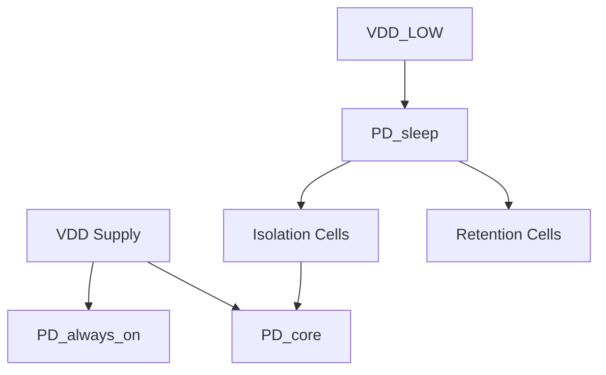

# IP 功耗管理规范模板

## 0. Document Control

| Version | Date | Author | Change |
|---|---|---|---|
| 0.1 | YYYY-MM-DD | {{ Owner }} | Initial |

---

## 1. 功耗概述

- **IP名称**: {{ IP_NAME }}
- **典型功耗**: {{ POWER }} mW
- **峰值功耗**: {{ POWER_MAX }} mW
- **功耗预算**: {{ BUDGET }} mW

---

## 2. 电源域划分

### 2.1 电源域定义

| 电源域 | 覆盖模块 | 工作电压 | 状态 |
|--------|----------|----------|------|
| PD_always_on | {{ 模块 }} | {{ V }} V | Always-on |
| PD_core | {{ 模块 }} | {{ V }} V | Clock-gated |
| PD_sleep | {{ 模块 }} | {{ V }} V | Power-gated |
| PD_retention | {{ 模块 }} | {{ V }} V | Retention支持 |
| {{ DOMAIN }} | {{ MODULES }} | {{ V }} | {{ STATE }} |

### 2.2 电源域架构图



---

## 3. UPF 定义

### 3.1 电源域创建

```tcl
create_power_domain PD_always_on -elements {u_fsm u_config}
create_power_domain PD_core -elements {u_datapath u_execute}
create_power_domain PD_sleep -elements {u_debug u_test}

# 电压定义
set_supply_net VDD -voltage {{ V }}
set_supply_net VDD_LOW -voltage {{ V }}
```

### 3.2 隔离单元

```tcl
# 隔离策略
set_isolation ISO_PD_SLEEP -domain PD_sleep \
    -isolation_power_net VDD \
    -isolation_ground_net VSS \
    -clamp_value 0

# 隔离控制信号
create_logic_port iso_ctrl -direction in
set_isolation_control ISO_PD_SLEEP -isolation_signal iso_ctrl \
    -isolation_sense high
```

### 3.3 状态保持

```tcl
# Retention策略
set_retention RET_PD_SLEEP -domain PD_sleep \
    -retention_power_net VDD_RET \
    -retention_ground_net VSS

# Retention控制
create_logic_port ret_ctrl -direction in
set_retention_control RET_PD_SLEEP -retention_signal ret_ctrl
```

---

## 4. Clock Gating

### 4.1 Clock Gating 单元

| CG单元 | 覆盖模块 | 条件 |
|--------|----------|------|
| CG_{{ NAME }} | {{ MODULE }} | {{ CONDITION }} |
| {{ CG }} | {{ MODULE }} | {{ CONDITION }} |

### 4.2 Clock Gating 控制逻辑

```
Clock Gating Enable:
  if (idle_counter > {{ N }} && no_pending_request)
    cg_enable = 1
  else
    cg_enable = 0
```

### 4.3 Idle检测

| 模块 | Idle条件 | 检测延迟 |
|------|----------|----------|
| {{ MODULE }} | {{ CONDITION }} | {{ N }} cycles |

---

## 5. Power Gating

### 5.1 Power Gating 流程

```
Power Gating Sequence:
  1. 检测idle状态
  2. 激活Isolation (iso_ctrl = 1)
  3. 保存状态（如需retention）
  4. 关闭电源 (power_switch = 0)
  
Power-up Sequence:
  1. 开启电源 (power_switch = 1)
  2. 等待电压稳定 ({{ N }} us)
  3. 恢复状态（如需retention）
  4. 释放Isolation (iso_ctrl = 0)
```

### 5.2 Power Gating 参数

| 参数 | 值 |
|------|---|
| Power-down延迟 | {{ N }} us |
| Power-up延迟 | {{ N }} us |
| 状态恢复延迟 | {{ N }} us |

---

## 6. 低功耗状态

### 6.1 状态定义

| 状态 | 描述 | 功耗 |
|------|------|------|
| Active | 全速运行 | {{ N }} mW |
| Idle | Clock gated | {{ N }} mW |
| Sleep | Power gated | {{ N }} uW |
| Deep Sleep | 全Power gated | {{ N }} uW |
| {{ STATE }} | {{ DESC }} | {{ POWER }} |

### 6.2 状态转换

```mermaid
stateDiagram-v2
    Active --> Idle: idle_timeout
    Idle --> Active: request
    Idle --> Sleep: sleep_timeout
    Sleep --> Active: power_up
    Active --> {{ STATE }}: {{ EVENT }}
```

### 6.3 状态转换延迟

| 转换 | 延迟 |
|------|------|
| Active → Idle | {{ N }} cycles |
| Idle → Active | 0 cycles |
| Idle → Sleep | {{ N }} us |
| Sleep → Active | {{ N }} us |

---

## 7. 功耗分解

### 7.1 各模块功耗

| 模块 | 典型功耗 | 峰值功耗 |
|------|----------|----------|
| {{ MODULE }} | {{ N }} mW | {{ N }} mW |

### 7.2 功耗组成

| 类型 | 占比 |
|------|------|
| 动态功耗 | {{ N }} % |
| 静态功耗 | {{ N }} % |

---

## 8. 功耗管理寄存器

### 8.1 POWER_CTRL (Offset: 0x{{ N }})

| Bit | Field | Access | Reset | 描述 |
|-----|-------|--------|-------|------|
| [0] | FORCE_IDLE | RW | 0 | 强制进入Idle |
| [1] | FORCE_SLEEP | RW | 0 | 强制进入Sleep |
| [2] | CG_ENABLE | RW | 1 | Clock gating使能 |
| [3] | PG_ENABLE | RW | 0 | Power gating使能 |

### 8.2 POWER_STATUS (Offset: 0x{{ N }})

| Bit | Field | Access | Reset | 描述 |
|-----|-------|--------|-------|------|
| [2:0] | STATE | RO | 0x0 | 当前功耗状态 |
| [3] | CG_ACTIVE | RO | 0 | Clock gating激活 |
| [4] | PG_ACTIVE | RO | 0 | Power gating激活 |

---

## 9. Quality Checklist

- [ ] 电源域划分明确
- [ ] UPF定义完整
- [ ] 隔离单元定义
- [ ] Retention定义（如适用）
- [ ] Clock gating策略明确
- [ ] Power gating流程完整
- [ ] 低功耗状态定义
- [ ] 状态转换延迟明确
- [ ] 功耗分解完成
- [ ] 功耗管理寄存器定义