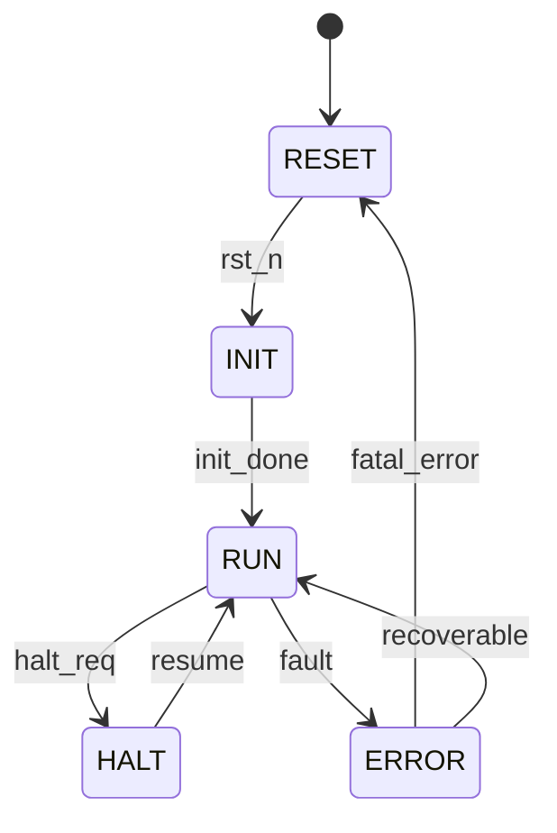

# 计算模块 IP 微架构规范模板

> 本模板定义计算类 IP 的详细微架构设计，是 RTL 实现的直接依据。

## 0. Document Control

| Version | Date | Author | Change |
|---|---|---|---|
| 0.1 | YYYY-MM-DD | {{ Owner }} | Initial |

**Freeze Point**: RTL v1.0. Post-freeze changes require MAS CR.

---

## 1. Block Overview

- **Block Name**: {{ BLOCK_NAME }}
- **Purpose**: {{ 1-2句功能描述 }}
- **IP类型**: cpu_core / gpu_core / ai_accel / dsp / vector / crypto
- **Target frequency**: {{ FREQ }} GHz @ TT/1.0V/25°C
- **Estimated area**: {{ AREA }} mm² @ {{ PROCESS_NODE }}
- **Estimated power**: {{ POWER }} mW typical, {{ POWER_MAX }} mW peak

---

## 2. Top-Level Interface Table

| Port | Direction | Width | Clock Domain | Type | Description |
|------|-----------|-------|--------------|------|-------------|
| clk | IN | 1 | — | Clock | Primary clock |
| rst_n | IN | 1 | clk (async assert, sync deassert) | Reset | Active-low reset |
| instr_req_valid | OUT | 1 | clk | Sync | 指令请求有效 |
| instr_req_addr | OUT | {{ WIDTH }} | clk | Sync | 指令地址 |
| instr_rsp_valid | IN | 1 | clk | Sync | 指令响应有效 |
| instr_rsp_data | IN | {{ WIDTH }} | clk | Sync | 指令数据 |
| data_req_valid | OUT | 1 | clk | Sync | 数据请求有效 |
| data_req_addr | OUT | {{ WIDTH }} | clk | Sync | 数据地址 |
| data_req_wdata | OUT | {{ WIDTH }} | clk | Sync | 写数据 |
| data_req_write | OUT | 1 | clk | Sync | 写使能 |
| data_rsp_valid | IN | 1 | clk | Sync | 数据响应有效 |
| data_rsp_rdata | IN | {{ WIDTH }} | clk | Sync | 读数据 |
| irq | OUT | 1 | clk | Sync | 中断请求 |
| {{ SIGNAL }} | {{ DIR }} | {{ WIDTH }} | {{ DOMAIN }} | {{ TYPE }} | {{ DESC }} |

---

## 3. Clock Domains

| Domain | Frequency | Source | Usage |
|--------|-----------|--------|-------|
| clk_core | {{ FREQ }} GHz | Local PLL | 核心逻辑 |
| clk_mem | {{ FREQ }} MHz | {{ SOURCE }} | 存储接口 |
| {{ DOMAIN }} | {{ FREQ }} | {{ SOURCE }} | {{ USAGE }} |

### 3.1 CDC Paths

| From | To | Synchronizer | Depth | Signals |
|------|-----|--------------|-------|---------|
| {{ SRC }} | {{ DST }} | {{ 2-FF/FIFO/Handshake }} | {{ N }} | {{ SIGNALS }} |

---

## 4. Power & Reset Domains (UPF)

```tcl
create_power_domain PD_core -elements {u_frontend u_execute u_mem}
create_power_domain PD_sleep -elements {u_debug}
# Isolation cells
set_isolation ISO_PD_SLEEP -domain PD_sleep -clamp_value 0
# Clock gating
create_clock_gate CG_EXEC -elements {u_execute}
```

- **Reset Strategy**: {{ Async assert, sync deassert }}
- **Reset Sequence**: {{ 复位顺序描述 }}

---

## 5. Functional Block Diagram

```mermaid
graph TB
    subgraph {{ BLOCK_NAME }}
        subgraph Frontend["前端"]
            PC[PC生成]
            FETCH[取指]
            DECODE[译码]
            RENAME[重命名]
        end
        subgraph Issue["发射"]
            ISSUEQ[发射队列]
            DISPATCH[分发]
        end
        subgraph Execute["执行"]
            ALU[ALU]
            MUL[乘法器]
            DIV[除法器]
            FPU[FPU]
            SIMD[SIMD单元]
        end
        subgraph Memory["访存"]
            LSU[LSU]
            RF[寄存器堆]
        end
        subgraph Writeback["写回"]
            WBUF[写回缓冲]
            COMMIT[提交]
        end
        subgraph Control["控制"]
            FSM[控制FSM]
            BP[分支预测]
            CSR[CSR]
        end
        
        PC --> FETCH --> DECODE --> RENAME
        RENAME --> IssueQ --> DISPATCH
        DISPATCH --> Execute --> RF --> WBUF --> COMMIT
        LSU --> Memory
        BP --> Control --> FSM --> CSR
    end
    
    IMEM[指令存储器] --> FETCH
    DMEM[数据存储器] --> LSU
    BUS[配置总线] --> CSR
```

---

## 6. Datapath

### 6.1 数据流描述

{{ 详细描述数据在各模块间的流动路径 }}

### 6.2 关键数据结构

| 结构 | 宽度 | 深度 | 用途 |
|------|------|------|------|
| {{ STRUCTURE }} | {{ WIDTH }} | {{ DEPTH }} | {{ PURPOSE }} |

### 6.3 Pipeline 结构

| Stage | 功能 | 延迟 | 关键寄存器 |
|-------|------|------|------------|
| S1 | {{ FUNC }} | {{ N }} cycles | {{ REGS }} |
| S2 | {{ FUNC }} | {{ N }} cycles | {{ REGS }} |
| S3 | {{ FUNC }} | {{ N }} cycles | {{ REGS }} |

详见 [IP-COMP-03-PIPELINE.md](./IP-COMP-03-PIPELINE.md)

---

## 7. Control FSM

### 7.1 主控制状态机



### 7.2 State Encoding

| State | Encoding | Description |
|-------|----------|-------------|
| RESET | 0x00 | 复位状态 |
| INIT | 0x01 | 初始化 |
| RUN | 0x02 | 正常运行 |
| HALT | 0x03 | 暂停 |
| ERROR | 0x04 | 错误状态 |

### 7.3 Transitions Table

| From | To | Condition | Output |
|------|-----|-----------|--------|
| RESET | INIT | rst_n == 1 | init_start = 1 |
| INIT | RUN | init_done | enable = 1 |
| RUN | HALT | halt_req | busy = 0 |
| {{ FROM }} | {{ TO }} | {{ COND }} | {{ OUTPUT }} |

---

## 8. Register Map

| Name | Offset | Width | Access | Reset | Description |
|------|--------|-------|--------|-------|-------------|
| CTRL | 0x000 | 32 | RW | 0x00000000 | 主控制寄存器 |
| STATUS | 0x004 | 32 | RO | 0x00000000 | 状态寄存器 |
| PC | 0x008 | {{ WIDTH }} | RW | 0x00000000 | 程序计数器 |
| PERF_CNT0 | 0x010 | 64 | RC | 0x00000000 | 性能计数器0 |
| PERF_CNT1 | 0x014 | 64 | RC | 0x00000000 | 性能计数器1 |
| INT_EN | 0x020 | 32 | RW | 0x00000000 | 中断使能 |
| INT_STATUS | 0x024 | 32 | W1C | 0x00000000 | 中断状态 |
| ERR_STATUS | 0x030 | 32 | W1C | 0x00000000 | 错误状态 |
| {{ REG }} | {{ OFFSET }} | {{ WIDTH }} | {{ ACCESS }} | {{ RESET }} | {{ DESC }} |

### 8.1 CTRL Register Bit Definition

| Bit | Field | Access | Reset | Description |
|-----|-------|--------|-------|-------------|
| 0 | ENABLE | RW | 0 | IP使能 |
| 1 | HALT | RW | 0 | 暂停请求 |
| 2 | RESET | RW | 0 | 软复位 |
| [7:4] | MODE | RW | 0 | 工作模式 |
| [31:8] | Reserved | RO | 0 | - |

### 8.2 STATUS Register Bit Definition

| Bit | Field | Access | Reset | Description |
|-----|-------|--------|-------|-------------|
| 0 | BUSY | RO | 0 | 运行状态 |
| 1 | HALTED | RO | 0 | 暂停状态 |
| 2 | ERROR | RO | 0 | 错误标志 |
| [31:3] | Reserved | RO | 0 | - |

---

## 9. Timing Diagrams

### 9.1 指令取指时序

```wavejson
{
  signal: [
    {name: 'clk', wave: 'p........'},
    {name: 'instr_req_valid', wave: '01.0.....'},
    {name: 'instr_req_addr', wave: 'x.3.x....', data: ['PC']},
    {name: 'instr_rsp_valid', wave: '0..10....'},
    {name: 'instr_rsp_data', wave: 'x...3.x..', data: ['INST']},
  ]
}
```

### 9.2 数据访问时序

```wavejson
{
  signal: [
    {name: 'clk', wave: 'p........'},
    {name: 'data_req_valid', wave: '01.0.....'},
    {name: 'data_req_addr', wave: 'x.3.x....', data: ['ADDR']},
    {name: 'data_req_write', wave: '0.1.0....'},
    {name: 'data_req_wdata', wave: 'x.=.x....', data: ['WDATA']},
    {name: 'data_rsp_valid', wave: '0..10....'},
    {name: 'data_rsp_rdata', wave: 'x...3.x..', data: ['RDATA']},
  ]
}
```

- Setup time: {{ N }} ps typ
- Hold time: {{ N }} ps typ

---

## 10. 执行单元设计要点

### 10.1 ALU 设计

详见 [IP-COMP-04-EXECUNIT.md](./IP-COMP-04-EXECUNIT.md)

| 操作 | 延迟 | 吞吐量 | 关键路径 |
|------|------|--------|----------|
| ADD/SUB | 1 cycle | 1/cycle | Carry chain |
| AND/OR/XOR | 1 cycle | 1/cycle | Logic |
| SHIFT | 1 cycle | 1/cycle | Barrel shifter |
| CMP | 1 cycle | 1/cycle | Comparator |

### 10.2 乘法器设计

| 类型 | 位宽 | 延迟 | 吞吐量 | 实现方式 |
|------|------|------|--------|----------|
| Integer Mul | 32-bit | 3 cycles | 1/3 cycles | Booth/Wallace |
| Integer Mul | 64-bit | {{ N }} cycles | {{ RATE }} | {{ METHOD }} |

### 10.3 SIMD/Vector单元

| 特性 | 参数 |
|------|------|
| 向量宽度 | {{ WIDTH }} |
| 支持操作 | {{ OPERATIONS }} |
| 吞吐量 | {{ RATE }} |

---

## 11. 寄存器堆设计要点

详见 [IP-COMP-05-REGFILE.md](./IP-COMP-05-REGFILE.md)

### 11.1 通用寄存器堆

| 属性 | 值 |
|------|---|
| 寄存器数 | {{ NUM }} |
| 位宽 | {{ WIDTH }} |
| 读端口 | {{ N }} |
| 写端口 | {{ M }} |
| 实现方式 | {{ SRAM/Register File }} |

---

## 12. Chiplet-Specific Sections（如适用）

### 12.1 D2D 接口

| 接口 | 协议 | 带宽 | 用途 |
|------|------|------|------|
| {{ IF }} | UCIe/CXL | {{ BW }} | {{ PURPOSE }} |

### 12.2 多 Die 调试

- IJTAG instruments: {{ 描述 }}
- Cross-die trace: {{ 描述 }}
- Breakpoint signaling: {{ 描述 }}

### 12.3 RAS Integration

- ECC coverage: {{ 覆盖范围 }}
- Error injection: {{ 错误注入方式 }}
- Error reporting: {{ 上报路径 }}

### 12.4 Thermal Management

- 热点监测: {{ 描述 }}
- DVFS支持: {{ 描述 }}

---

## 13. Operating Modes

| Mode | Trigger | Behavior |
|------|---------|----------|
| Normal | Default | 全速运行 |
| Low-power | Idle timeout | Clock gating |
| Debug | Debug request | 单步/断点 |
| Loopback | Self-test | 内部测试模式 |

---

## 14. Error Handling

| Error | Detection | Logged in | Action |
|-------|-----------|-----------|--------|
| Invalid opcode | Decode stage | ERR_STATUS[0] | IRQ |
| ALU overflow | Execute stage | ERR_STATUS[1] | IRQ |
| Memory fault | LSU | ERR_STATUS[2] | IRQ |
| Watchdog timeout | FSM | ERR_STATUS[3] | IRQ, Reset |
| {{ ERROR }} | {{ DET }} | {{ LOG }} | {{ ACTION }} |

---

## 15. Initialization Sequence

```
1. Apply power, assert rst_n (async)
2. Wait clk stable
3. Deassert rst_n (sync)
4. SW writes CTRL.RESET = 1 (pulse)
5. SW writes CTRL.ENABLE = 1
6. FSM enters RUN state
7. SW loads initial PC
8. Begin execution
```

---

## 16. Quality Checklist

- [ ] 所有 port 与 RTL 头文件匹配（脚本验证）
- [ ] 所有寄存器有 IEEE 1685 IP-XACT 描述
- [ ] FSM 所有状态可达（formal proof）
- [ ] 所有 CDC 路径有同步器规范
- [ ] 时序图标注具体 setup/hold (ps)
- [ ] 执行单元延迟/吞吐量明确
- [ ] 寄存器堆端口配置明确
- [ ] Chiplet 特有章节齐全（如适用）
- [ ] 与 Arch Spec RTM 覆盖 100%
- [ ] 所有寄存器位有复位值
- [ ] Reserved bit = RO, Reset = 0
- [ ] 无歧义语言（无 "should" / "might"）

---

## 17. Traceability

| ARCH Section | MAS Section |
|--------------|-------------|
| DOC-D2-01-ARCH §{{ N }} | §{{ N }} |
| REQ-{{ ID }} | §{{ N }} |

---

## 18. References

- IEEE 1685 IP-XACT
- IEEE 1800 SystemVerilog
- IEEE 1801 UPF
- IEEE 1149.1 JTAG
- {{ 相关ISA手册 }}