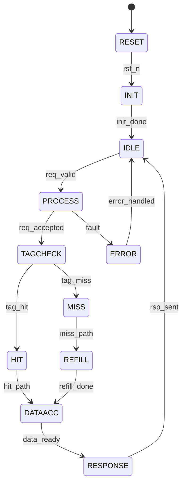

# 访存模块 IP 微架构规范模板

> 本模板定义访存类 IP 的详细微架构设计，是 RTL 实现的直接依据。

## 0. Document Control

| Version | Date | Author | Change |
|---|---|---|---|
| 0.1 | YYYY-MM-DD | {{ Owner }} | Initial |

**Freeze Point**: RTL v1.0. Post-freeze changes require MAS CR.

---

## 1. Block Overview

- **Block Name**: {{ BLOCK_NAME }}
- **Purpose**: {{ 1-2句功能描述 }}
- **IP类型**: sram_ctrl / cache_ctrl / hbm_ctrl / ddr_ctrl / coherence / noc_router
- **Target frequency**: {{ FREQ }} MHz @ TT/1.0V/25°C
- **Estimated area**: {{ AREA }} mm² @ {{ PROCESS_NODE }}
- **Estimated power**: {{ POWER }} mW typical, {{ POWER_MAX }} mW peak
- **Storage capacity**: {{ CAPACITY }} KB/MB

---

## 2. Top-Level Interface Table

| Port | Direction | Width | Clock Domain | Type | Description |
|------|-----------|-------|--------------|------|-------------|
| clk | IN | 1 | — | Clock | Primary clock |
| rst_n | IN | 1 | clk (async assert, sync deassert) | Reset | Active-low reset |
| req_valid | IN | {{ N }} | clk | Sync | 请求有效（每client） |
| req_addr | IN | {{ WIDTH }} | clk | Sync | 请求地址 |
| req_cmd | IN | {{ N }} | clk | Sync | 命令类型（Read/Write/...） |
| req_wdata | IN | {{ WIDTH }} | clk | Sync | 写数据 |
| req_wstrb | IN | {{ N }} | clk | Sync | 写字节使能 |
| rsp_valid | OUT | {{ N }} | clk | Sync | 响应有效（每client） |
| rsp_rdata | OUT | {{ WIDTH }} | clk | Sync | 读数据 |
| rsp_error | OUT | 1 | clk | Sync | 错误标志 |
| mem_req_valid | OUT | 1 | clk_mem | CDC | 存储器请求 |
| mem_req_addr | OUT | {{ WIDTH }} | clk_mem | CDC | 存储器地址 |
| mem_rsp_valid | IN | 1 | clk_mem | CDC | 存储器响应 |
| mem_rsp_data | IN | {{ WIDTH }} | clk_mem | CDC | 存存器数据 |
| irq | OUT | 1 | clk | Sync | 中断请求 |
| {{ SIGNAL }} | {{ DIR }} | {{ WIDTH }} | {{ DOMAIN }} | {{ TYPE }} | {{ DESC }} |

---

## 3. Clock Domains

| Domain | Frequency | Source | Usage |
|--------|-----------|--------|-------|
| clk_ctrl | {{ FREQ }} MHz | PLL | 控制逻辑 |
| clk_mem | {{ FREQ }} MHz | {{ SOURCE }} | 存储接口 |
| clk_d2d | {{ FREQ }} MHz | Source-sync | D2D接口（如适用） |

### 3.1 CDC Paths

| From | To | Synchronizer | Depth | Signals |
|------|-----|--------------|-------|---------|
| clk_ctrl | clk_mem | Async FIFO | {{ N }} | req/rsp data |
| clk_mem | clk_ctrl | Async FIFO | {{ N }} | mem rsp |
| {{ SRC }} | {{ DST }} | {{ METHOD }} | {{ N }} | {{ SIGNALS }} |

---

## 4. Power & Reset Domains (UPF)

```tcl
create_power_domain PD_ctrl -elements {u_arbiter u_fsm}
create_power_domain PD_storage -elements {u_tag u_data}
create_power_domain PD_data -elements {u_buffer u_ecc}
# Retention for storage
set_retention RET_STORAGE -domain PD_storage -technology_cells
# Clock gating
create_clock_gate CG_DATA -elements {u_buffer}
```

- **Reset Strategy**: {{ Async assert, sync deassert }}
- **Reset Sequence**: {{ 复位顺序描述 }}

---

## 5. Functional Block Diagram

```mermaid
graph TB
    subgraph {{ BLOCK_NAME }}
        subgraph Input["输入处理"]
            ARBITER[仲裁器]
            QUEUE[请求队列]
        end
        subgraph Scheduler["调度器"]
            SCHED[调度逻辑]
            PRIOR[优先级管理]
        end
        subgraph TagCheck["Tag检查"]
            TAGRAM[Tag RAM]
            COMPARATOR[比较器]
            HITMISS[命中判定]
        end
        subgraph DataAccess["数据访问"]
            DATARAM[Data RAM]
            MUX[数据选择器]
            ECC[ECC编解码]
        end
        subgraph Control["控制逻辑"]
            FSM[主控制FSM]
            CONFIG[配置寄存器]
            COUNTER[性能计数器]
        end
        subgraph Coherence["一致性（如适用）"]
            DIR[目录]
            PROTO[协议处理]
            MSGGEN[消息生成]
        end
        subgraph Output["输出处理"]
            RSPBUF[响应缓冲]
            RSPGEN[响应生成]
        end
        
        Input --> Scheduler --> TagCheck --> DataAccess --> Output
        Control --> Scheduler --> FSM --> CONFIG
        DataAccess --> Coherence --> MSGGEN
    end
    
    CLIENT[客户端请求] --> Input
    MEM[存储器] --> DataAccess
    OTHER[其他Die] --> Coherence
```

---

## 6. Datapath

### 6.1 请求处理流程

```
Request → Arbiter → Queue → Scheduler → Tag Check → Data Access → Response
             │         │        │           │            │
             │         │        │           │            │
             └─────────┴────────┴───────────┴────────────┘
                      背压与流量控制
```

### 6.2 关键数据结构

| 结构 | 宽度 | 深度 | 用途 |
|------|------|------|------|
| Request Queue | {{ WIDTH }} | {{ N }} | 请求缓冲 |
| Response Buffer | {{ WIDTH }} | {{ N }} | 响应缓冲 |
| {{ STRUCTURE }} | {{ WIDTH }} | {{ DEPTH }} | {{ PURPOSE }} |

### 6.3 Pipeline 结构

| Stage | 功能 | 延迟 | 关键寄存器 |
|-------|------|------|------------|
| S1: Arbitration | 请求仲裁 | 1 cycle | req_sel |
| S2: Tag Lookup | Tag查找 | {{ N }} cycles | tag_rd_data |
| S3: Hit/Miss | 命中判定 | 1 cycle | hit_flag |
| S4: Data Access | 数据访问 | {{ N }} cycles | data_rd_data |
| S5: ECC | ECC处理 | 1 cycle | ecc_result |
| S6: Response | 响应生成 | 1 cycle | rsp_data |

---

## 7. Control FSM

### 7.1 主控制状态机



### 7.2 State Encoding

| State | Encoding | Description |
|-------|----------|-------------|
| RESET | 0x00 | 复位状态 |
| INIT | 0x01 | 初始化 |
| IDLE | 0x02 | 空闲等待 |
| PROCESS | 0x03 | 处理请求 |
| TAGCHECK | 0x04 | Tag检查 |
| HIT | 0x05 | 命中处理 |
| MISS | 0x06 | 缺失处理 |
| REFILL | 0x07 | 填充 |
| DATAACC | 0x08 | 数据访问 |
| RESPONSE | 0x09 | 响应生成 |
| ERROR | 0x0A | 错误状态 |

### 7.3 Transitions Table

| From | To | Condition | Output |
|------|-----|-----------|--------|
| IDLE | PROCESS | req_valid & !full | req_accept = 1 |
| PROCESS | TAGCHECK | req_accepted | tag_rd = 1 |
| TAGCHECK | HIT | tag_match | hit = 1 |
| TAGCHECK | MISS | !tag_match | miss = 1 |
| {{ FROM }} | {{ TO }} | {{ COND }} | {{ OUTPUT }} |

---

## 8. Register Map

| Name | Offset | Width | Access | Reset | Description |
|------|--------|-------|--------|-------|-------------|
| CTRL | 0x000 | 32 | RW | 0x00000000 | 主控制寄存器 |
| STATUS | 0x004 | 32 | RO | 0x00000000 | 状态寄存器 |
| CONFIG | 0x008 | 32 | RW | {{ DEFAULT }} | 配置寄存器 |
| WAY_ENABLE | 0x010 | 32 | RW | {{ DEFAULT }} | Way使能（可选） |
| PERF_HIT_CNT | 0x020 | 64 | RC | 0x00000000 | 命中计数 |
| PERF_MISS_CNT | 0x024 | 64 | RC | 0x00000000 | 缺失计数 |
| PERF_ACCESS_CNT | 0x028 | 64 | RC | 0x00000000 | 访问计数 |
| ECC_ERR_CNT | 0x030 | 32 | RC | 0x00000000 | ECC错误计数 |
| ECC_SYNDROME | 0x034 | 16 | RO | 0x0000 | ECC Syndrome |
| INT_EN | 0x040 | 32 | RW | 0x00000000 | 中断使能 |
| INT_STATUS | 0x044 | 32 | W1C | 0x00000000 | 中断状态 |
| ERR_INJ | 0x050 | 32 | RW | 0x00000000 | 错误注入（调试）|
| {{ REG }} | {{ OFFSET }} | {{ WIDTH }} | {{ ACCESS }} | {{ RESET }} | {{ DESC }} |

### 8.1 CTRL Register Bit Definition

| Bit | Field | Access | Reset | Description |
|-----|-------|--------|-------|-------------|
| 0 | ENABLE | RW | 0 | IP使能 |
| 1 | RESET | RW | 0 | 软复位（脉冲）|
| [7:2] | MODE | RW | 0 | 工作模式 |
| [31:8] | Reserved | RO | 0 | - |

### 8.2 STATUS Register Bit Definition

| Bit | Field | Access | Reset | Description |
|-----|-------|--------|-------|-------------|
| 0 | READY | RO | 0 | 就绪状态 |
| 1 | BUSY | RO | 0 | 处理中 |
| 2 | ERROR | RO | 0 | 错误标志 |
| [7:3] | QUEUE_DEPTH | RO | 0 | 队列深度 |
| [31:8] | Reserved | RO | 0 | - |

---

## 9. Timing Diagrams

### 9.1 请求仲裁时序

```wavejson
{
  signal: [
    {name: 'clk', wave: 'p........'},
    {name: 'req0_valid', wave: '01.0.....'},
    {name: 'req1_valid', wave: '0.1.0....'},
    {name: 'req_sel', wave: 'x.=.x....', data: ['SEL0', 'SEL1']},
    {name: 'queue_full', wave: '0........'},
  ]
}
```

### 9.2 Cache命中时序

```wavejson
{
  signal: [
    {name: 'clk', wave: 'p........'},
    {name: 'tag_rd', wave: '01.0.....'},
    {name: 'tag_match', wave: '0..10....'},
    {name: 'data_rd', wave: '0..10....'},
    {name: 'rsp_valid', wave: '0....10..'},
  ]
}
```

### 9.3 Cache缺失填充时序

```wavejson
{
  signal: [
    {name: 'clk', wave: 'p........'},
    {name: 'miss_detect', wave: '01.0.....'},
    {name: 'refill_req', wave: '0.1.0....'},
    {name: 'refill_rsp', wave: '0....10..'},
    {name: 'data_update', wave: '0.....1.0'},
    {name: 'rsp_valid', wave: '0......10'},
  ]
}
```

- Setup time: {{ N }} ps typ
- Hold time: {{ N }} ps typ

---

## 10. 存储阵列设计要点

详见 [IP-MEM-04-CACHE.md](./IP-MEM-04-CACHE.md)

### 10.1 Tag RAM

| 参数 | 值 |
|------|---|
| 容量 | {{ N }} entries |
| 位宽 | {{ WIDTH }} bits/entry |
| 端口 | {{ N }}R {{ M }}W |
| 类型 | {{ SRAM/Register File }} |

### 10.2 Data RAM

| 参数 | 值 |
|------|---|
| 容量 | {{ CAPACITY }} KB |
| Line Size | {{ SIZE }} Bytes |
| Bank数 | {{ N }} |
| 端口 | {{ N }}R {{ M }}W |

---

## 11. 仲裁器设计要点

详见 [IP-MEM-05-ARBITER.md](./IP-MEM-05-ARBITER.md)

### 11.1 仲裁策略

| Client | 优先级 | 权重 |
|--------|--------|------|
| {{ CLIENT0 }} | {{ PRI }} | {{ WEIGHT }} |
| {{ CLIENT1 }} | {{ PRI }} | {{ WEIGHT }} |

### 11.2 QoS配置

| 参数 | 值 |
|------|---|
| Max latency | {{ N }} cycles |
| Min bandwidth | {{ BW }} GB/s |

---

## 12. Chiplet-Specific Sections（如适用）

### 12.1 D2D 接口

| 接口 | 协议 | 带宽 | 用途 |
|------|------|------|------|
| {{ IF }} | UCIe/CHI/CXL | {{ BW }} | 跨die一致性 |

### 12.2 多 Die 调试

- IJTAG instruments: {{ 描述 }}
- Cross-die trace: {{ 描述 }}
- State dump: {{ 描述 }}

### 12.3 RAS Integration

- ECC coverage: {{ 覆盖范围 }}
- Error injection: {{ 错误注入方式 }}
- Error reporting: {{ 上报路径 }}
- IEEE 1838 die wrapper: {{ 是否适用 }}

### 12.4 Thermal Management

- 热点监测: {{ 描述 }}
- Bandwidth throttling: {{ 描述 }}
- DVFS支持: {{ 描述 }}

---

## 13. 一致性协议设计（如适用）

### 13.1 协议状态

| 状态 | 编码 | 描述 |
|------|------|------|
| Invalid (I) | 0x0 | 无效 |
| Shared (S) | 0x1 | 共享 |
| Exclusive (E) | 0x2 | 独占 |
| Modified (M) | 0x3 | 已修改 |
| {{ STATE }} | {{ CODE }} | {{ DESC }} |

### 13.2 状态转移

| 当前状态 | 事件 | 目标状态 | 动作 |
|----------|------|----------|------|
| I | Read | S | 发送Read请求 |
| S | Write | M | 发送Upgrade请求 |
| M | Evict | I | 写回数据 |
| {{ FROM }} | {{ EVENT }} | {{ TO }} | {{ ACTION }} |

### 13.3 目录结构

| 类型 | 组织 | 条目数 |
|------|------|--------|
| {{ DIR_TYPE }} | {{ ORG }} | {{ NUM }} |

---

## 14. ECC 设计

### 14.1 编码配置

| 保护对象 | 编码类型 | 数据宽度 | 校验位 |
|----------|----------|----------|--------|
| Data RAM | SEC-DED | {{ N }} bits | {{ N }} bits |
| Tag RAM | Parity | {{ N }} bits | 1 bit |
| {{ OBJECT }} | {{ CODE }} | {{ WIDTH }} | {{ CHECK }} |

### 14.2 错误处理流程

```
Single-bit Error: Correct → Log → Continue
Multi-bit Error: Detect → Log → Interrupt → SW recovery
Parity Error: Detect → Log → Retry or Interrupt
```

---

## 15. Operating Modes

| Mode | Trigger | Behavior |
|------|---------|----------|
| Normal | Default | 正常访问 |
| Bypass | CTRL.MODE | 直通模式（调试）|
| Lockdown | CTRL.MODE | 锁定特定way |
| Low-power | Idle timeout | Clock gating |
| Self-test | Test request | BIST运行 |

---

## 16. Error Handling

| Error | Detection | Logged in | Action |
|-------|-----------|-----------|--------|
| Single-bit ECC | ECC decoder | ECC_ERR_CNT[0] | 硬件纠正 |
| Multi-bit ECC | ECC decoder | INT_STATUS[0] | IRQ |
| Parity error | Parity check | INT_STATUS[1] | IRQ |
| Timeout | Watchdog | INT_STATUS[2] | IRQ |
| Queue overflow | Depth check | INT_STATUS[3] | IRQ |
| {{ ERROR }} | {{ DET }} | {{ LOG }} | {{ ACTION }} |

---

## 17. Initialization Sequence

```
1. Apply power, assert rst_n (async)
2. Wait clk stable
3. Deassert rst_n (sync)
4. Hardware init: Tag/Data RAM clear (if needed)
5. SW writes CTRL.RESET = 1 (pulse)
6. SW writes WAY_ENABLE (if configurable)
7. SW writes CTRL.ENABLE = 1
8. STATUS.READY = 1
9. Begin normal operation
```

---

## 18. Quality Checklist

- [ ] 所有 port 与 RTL 头文件匹配（脚本验证）
- [ ] 所有寄存器有 IEEE 1685 IP-XACT 描述
- [ ] FSM 所有状态可达（formal proof）
- [ ] 所有 CDC 路径有同步器规范
- [ ] 时序图标注具体 setup/hold (ps)
- [ ] 存储参数明确（容量、延迟、带宽）
- [ ] 仲裁策略明确
- [ ] ECC 配置明确
- [ ] 一致性协议完整（如适用）
- [ ] Chiplet 特有章节齐全（如适用）
- [ ] 与 Arch Spec RTM 覆盖 100%
- [ ] 所有寄存器位有复位值
- [ ] Reserved bit = RO, Reset = 0
- [ ] 无歧义语言（无 "should" / "might"）

---

## 19. Traceability

| ARCH Section | MAS Section |
|--------------|-------------|
| DOC-D2-01-ARCH §{{ N }} | §{{ N }} |
| REQ-{{ ID }} | §{{ N }} |

---

## 20. References

- IEEE 1685 IP-XACT
- IEEE 1800 SystemVerilog
- IEEE 1801 UPF
- IEEE 1838 Die Wrapper（如适用）
- JEDEC JESD235 HBM3（如适用）
- AMBA CHI / AXI
- UCIe 2.0（如适用）