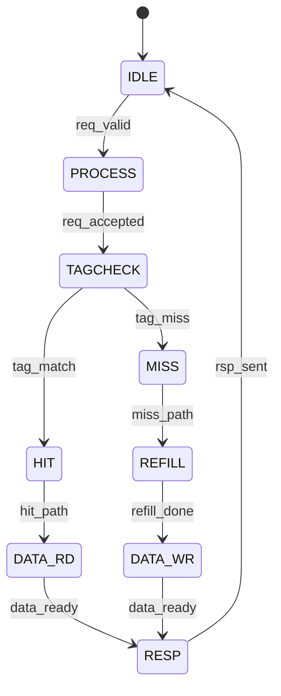

# 访存模块 IP 控制逻辑设计模板

## 0. Document Control

| Version | Date | Author | Change |
|---|---|---|---|
| 0.1 | YYYY-MM-DD | {{ Owner }} | Initial |

---

## 1. 控制逻辑概述

- **模块名称**: {{ MODULE_NAME }}
- **功能**: {{ 控制逻辑功能描述 }}
- **时钟域**: {{ DOMAIN }}
- **关键延迟**: {{ N }} cycles

---

## 2. FSM 设计

### 2.1 主控制 FSM



### 2.2 状态编码

| 状态 | 编码 | 描述 |
|------|------|------|
| IDLE | 0x00 | 空闲等待 |
| PROCESS | 0x01 | 处理请求 |
| TAGCHECK | 0x02 | Tag检查 |
| HIT | 0x03 | 命中处理 |
| MISS | 0x04 | 缺失处理 |
| REFILL | 0x05 | 数据填充 |
| DATA_RD | 0x06 | 数据读取 |
| DATA_WR | 0x07 | 数据写入 |
| RESP | 0x08 | 响应生成 |

### 2.3 状态转移表

| 当前状态 | 条件 | 目标状态 | 输出变化 |
|----------|------|----------|----------|
| IDLE | req_valid && !full | PROCESS | req_accept = 1 |
| PROCESS | req_accepted | TAGCHECK | tag_rd_en = 1 |
| TAGCHECK | tag_match | HIT | hit_flag = 1 |
| TAGCHECK | !tag_match | MISS | miss_flag = 1 |
| HIT | hit_path_ready | DATA_RD | data_rd_en = 1 |
| MISS | eviction_needed | REFILL | refill_req = 1 |
| {{ FROM }} | {{ COND }} | {{ TO }} | {{ OUTPUT }} |

### 2.4 Timeout 处理

| 状态 | Timeout值 | Timeout动作 |
|------|-----------|-------------|
| REFILL | {{ N }} cycles | IRQ + Abort |
| {{ STATE }} | {{ N }} cycles | {{ ACTION }} |

---

## 3. 命令解码

### 3.1 命令类型

| Cmd编码 | 命令类型 | 处理方式 |
|---------|----------|----------|
| 0x00 | Read | {{ 处理描述 }} |
| 0x01 | Write | {{ 处理描述 }} |
| 0x02 | Read-with-Lock | {{ 处理描述 }} |
| 0x03 | Write-with-Lock | {{ 处理描述 }} |
| {{ CODE }} | {{ CMD }} | {{ DESC }} |

### 3.2 命令处理流程

```
Command Decode Process:
1. 接收 cmd 字段
2. 解码命令类型
3. 设置内部状态标志
4. 驱动后续处理逻辑
```

---

## 4. 计数器与监控

### 4.1 计数器列表

| 计数器 | 位宽 | 功能 | 触发条件 |
|--------|------|------|----------|
| hit_cnt | 64 | 命中计数 | hit_event |
| miss_cnt | 64 | 缺失计数 | miss_event |
| access_cnt | 64 | 访问计数 | access_event |
| ecc_err_cnt | 32 | ECC错误计数 | ecc_err |
| {{ COUNTER }} | {{ WIDTH }} | {{ FUNC }} | {{ TRIGGER }} |

### 4.2 监控逻辑

| 监控项 | 阈值 | 响应 |
|--------|------|------|
| Queue depth | {{ N }} | backpressure |
| Latency | {{ N }} cycles | IRQ |
| Error rate | {{ N }} | IRQ |
| {{ ITEM }} | {{ THRESH }} | {{ RESP }} |

---

## 5. 背压控制

### 5.1 Backpressure 源

| 源 | 条件 | 响应 |
|-----|------|------|
| Queue Full | depth == max | reject new req |
| 下级忙 | !ready | stall pipeline |
| Refill pending | {{ COND }} | block new miss |
| {{ SOURCE }} | {{ COND }} | {{ RESP }} |

### 5.2 Stall传播

```
Stall Propagation:
  if (stall_condition)
    stall upstream stages
    preserve pipeline state
    wait for condition clear
```

---

## 6. 错误处理逻辑

### 6.1 错误检测

| 错误类型 | 检测点 | 检测方法 |
|----------|--------|----------|
| ECC单比特 | Data RAM | ECC decode |
| ECC多比特 | Data RAM | ECC decode |
| Parity错误 | Tag RAM | Parity check |
| Timeout | FSM | Watchdog |
| {{ ERROR }} | {{ POINT }} | {{ METHOD }} |

### 6.2 错误响应流程

```
Error Response:
  Single-bit ECC:
    1. 硬件纠正
    2. 计数器+1
    3. 继续操作
  
  Multi-bit ECC:
    1. 标记错误
    2. 中断上报
    3. 等待软件处理
  
  Timeout:
    1. 中止当前操作
    2. 中断上报
    3. FSM复位
```

---

## 7. 配置管理

### 7.1 配置寄存器

| 寄存器 | 功能 | 默认值 |
|--------|------|--------|
| CTRL.ENABLE | 模块使能 | 0 |
| CTRL.MODE | 工作模式 | 0 |
| CONFIG.WAY_EN | Way使能掩码 | {{ DEFAULT }} |
| CONFIG.THRESH | 性能阈值 | {{ DEFAULT }} |
| {{ REG }} | {{ FUNC }} | {{ DEFAULT }} |

### 7.2 配置生效逻辑

```
Configuration Apply:
  1. 接收配置写入
  2. 验证配置合法性
  3. 更新内部状态
  4. 驱动相关模块
```

---

## 8. 中断生成

### 8.1 中断源

| 中断源 | 条件 | 优先级 |
|--------|------|--------|
| INT_ERR | error_detected | High |
| INT_DONE | operation_done | Medium |
| INT_THRESH | threshold_reached | Low |
| {{ SOURCE }} | {{ COND }} | {{ PRI }} |

### 8.2 中断聚合逻辑

```
Interrupt Generation:
  if (INT_EN[source] && condition[source])
    INT_STATUS[source] = 1
    irq = 1
```

---

## 9. 时序分析

### 9.1 关键路径

| 路径 | 起点 | 终点 | 延迟约束 |
|------|------|------|----------|
| FSM更新 | state_reg | next_state_logic | {{ N }} ns |
| Tag比较 | tag_rd | match_result | {{ N }} ns |
| {{ PATH }} | {{ START }} | {{ END }} | {{ N }} ns |

---

## 10. Quality Checklist

- [ ] FSM状态编码完整
- [ ] 状态转移表完整
- [ ] Timeout处理明确
- [ ] 命令解码完整
- [ ] 计数器定义完整
- [ ] 监控逻辑明确
- [ ] 背压控制明确
- [ ] 错误处理流程完整
- [ ] 配置管理明确
- [ ] 中断生成逻辑明确
- [ ] 关键路径分析完成