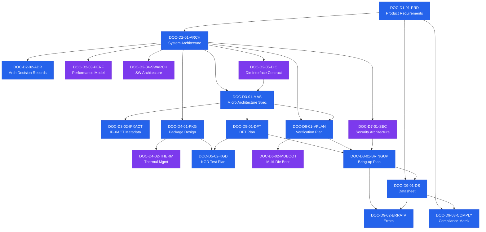

# IC Doc Templates — 高端 Chiplet 芯片文档体系模板库

**Version**: 1.0  
**Generated**: 2026-04-23 (GMT+8)  
**Scope**: Tier-0（必备 13 类）+ Tier-1（强烈推荐 6 类）= 19 类文档模板  
**Source**: `research_reports/chiplet-spec-docs/chiplet-spec-docs_2026-04-23_2205_report.md`

## 1. 文档体系总览

本模板库覆盖一款高端 chiplet 芯片**从 idea 到量产**完整生命周期所需的 19 类 Tier-0/1 文档。编号采用 `DOC-<Domain>-<Serial>-<ShortCode>` 三段式：

| Domain | 含义 | 文档数 | 目录 |
|---|---|---|---|
| D1 | Product（产品需求） | 1 | `D1-product/` |
| D2 | Architecture（系统架构） | 5 | `D2-architecture/` |
| D3 | Implementation（微架构与 IP） | 2 | `D3-implementation/` |
| D4 | Physical（物理与封装） | 2 | `D4-physical/` |
| D5 | Test（DFT 与测试） | 2 | `D5-test/` |
| D6 | Verification（验证） | 2 | `D6-verification/` |
| D7 | Security（安全） | 1 | `D7-security/` |
| D8 | Silicon（硅后） | 1 | `D8-silicon/` |
| D9 | Release（发布） | 3 | `D9-release/` |

## 2. 19 类文档清单

### Tier-0 必备（13 类）

| 编号 | 文档 | 域 | Tier |
|---|---|---|---|
| DOC-D1-01-PRD | Product Requirements Document | D1 | 0 |
| DOC-D2-01-ARCH | System Architecture Specification | D2 | 0 |
| DOC-D2-02-ADR | Architecture Decision Records | D2 | 0 |
| DOC-D3-01-MAS | Micro Architecture Specification (per block) | D3 | 0 |
| DOC-D3-02-IPXACT | IP-XACT Metadata Bundle (IEEE 1685) | D3 | 0 |
| DOC-D4-01-PKG | Package Design Specification | D4 | 0 |
| DOC-D5-01-DFT | DFT Plan | D5 | 0 |
| DOC-D5-02-KGD | KGD Test Plan | D5 | 0 |
| DOC-D6-01-VPLAN | Verification Plan | D6 | 0 |
| DOC-D8-01-BRINGUP | Bring-up / Post-Silicon Validation Plan | D8 | 0 |
| DOC-D9-01-DS | Datasheet | D9 | 0 |
| DOC-D9-02-ERRATA | Errata Document | D9 | 0 |
| DOC-D9-03-COMPLY | Compliance Matrix | D9 | 0 |

### Tier-1 强烈推荐（6 类）

| 编号 | 文档 | 域 | Tier |
|---|---|---|---|
| DOC-D2-03-PERF | Performance Modeling Spec | D2 | 1 |
| DOC-D2-04-SWARCH | Software Architecture Specification | D2 | 1 |
| DOC-D2-05-DIC | Die Interface Contract | D2 | 1 |
| DOC-D4-02-THERM | Thermal Management Specification | D4 | 1 |
| DOC-D6-02-MDBOOT | Multi-Die Boot & Reset Sequence Spec | D6 | 1 |
| DOC-D7-01-SEC | Security Architecture & Threat Model | D7 | 1 |

## 3. 文档逻辑依赖关系图

下图展示 19 类文档之间的**逻辑生产依赖**关系（箭头 A → B 表示 B 的内容以 A 为输入或前提）。
颜色编码：**蓝色** = Tier-0 必备，**紫色** = Tier-1 强烈推荐。



### 3.1 关键依赖路径说明

| 依赖链 | 说明 |
|---|---|
| PRD → ARCH → MAS | 产品需求驱动架构，架构驱动各模块微架构 |
| ARCH → DIC → MAS | Die 接口合约约束每个 Die 的微架构设计 |
| MAS → DFT → KGD | MAS 定义可测性需求，DFT 规划落地，KGD 执行 Die 级测试 |
| MAS + ARCH → VPLAN | 验证计划综合架构和实现视角，制定覆盖目标 |
| DFT + VPLAN + SEC → BRINGUP | 硅后验证计划综合 DFT、仿真验证和安全验证结果 |
| BRINGUP → DS + ERRATA | 硅后数据支撑 Datasheet 规格确认和勘误发布 |
| DS + PRD → COMPLY | 合规矩阵验证 Datasheet 声明符合 PRD 中的合规目标 |

### 3.2 各文档依赖关系速查表

> **说明**：「上游依赖」= 本文档的前置输入；「下游消费」= 以本文档为输入的后续文档。`—` 表示无依赖或无下游（根节点 / 叶节点）。

| 文档编号 | 文档名称 | Tier | 上游依赖（前置输入） | 下游消费（后续产物） |
|---|---|:---:|---|---|
| DOC-D1-01-PRD | Product Requirements Document | 0 | — | ARCH · DS · COMPLY |
| DOC-D2-01-ARCH | System Architecture Specification | 0 | PRD | ADR · PERF · SWARCH · DIC · MAS · PKG · VPLAN · SEC |
| DOC-D2-02-ADR | Architecture Decision Records | 0 | ARCH | — |
| DOC-D2-03-PERF | Performance Modeling Spec | 1 | ARCH | — |
| DOC-D2-04-SWARCH | Software Architecture Specification | 1 | ARCH | — |
| DOC-D2-05-DIC | Die Interface Contract | 1 | ARCH | MAS |
| DOC-D3-01-MAS | Micro Architecture Specification | 0 | ARCH · DIC | IPXACT · DFT · VPLAN |
| DOC-D3-02-IPXACT | IP-XACT Metadata Bundle | 0 | MAS | — |
| DOC-D4-01-PKG | Package Design Specification | 0 | ARCH | THERM · KGD |
| DOC-D4-02-THERM | Thermal Management Specification | 1 | PKG | — |
| DOC-D5-01-DFT | DFT Plan | 0 | MAS | KGD · BRINGUP |
| DOC-D5-02-KGD | KGD Test Plan | 0 | PKG · DFT | — |
| DOC-D6-01-VPLAN | Verification Plan | 0 | ARCH · MAS | MDBOOT · BRINGUP |
| DOC-D6-02-MDBOOT | Multi-Die Boot & Reset Sequence Spec | 1 | VPLAN | — |
| DOC-D7-01-SEC | Security Architecture & Threat Model | 1 | ARCH | BRINGUP |
| DOC-D8-01-BRINGUP | Bring-up / Post-Silicon Validation Plan | 0 | DFT · VPLAN · SEC | DS · ERRATA |
| DOC-D9-01-DS | Datasheet | 0 | PRD · BRINGUP | ERRATA · COMPLY |
| DOC-D9-02-ERRATA | Errata Document | 0 | BRINGUP · DS | — |
| DOC-D9-03-COMPLY | Compliance Matrix | 0 | PRD · DS | — |

## 4. 目录结构

```
ic_doc_templates/
├── README.md                     ← 本文件
├── _meta/
│   ├── numbering-scheme.md       ← 编号规则
│   ├── traceability-model.md     ← 跨文档追溯模型
│   └── document-index.md         ← 完整文档索引（含依赖图）
├── D1-product/
│   └── DOC-D1-01-PRD.md
├── D2-architecture/
│   ├── DOC-D2-01-ARCH.md
│   ├── DOC-D2-02-ADR.md
│   ├── DOC-D2-03-PERF.md
│   ├── DOC-D2-04-SWARCH.md
│   └── DOC-D2-05-DIC.md
├── D3-implementation/
│   ├── DOC-D3-01-MAS.md
│   └── DOC-D3-02-IPXACT.md
├── D4-physical/
│   ├── DOC-D4-01-PKG.md
│   └── DOC-D4-02-THERM.md
├── D5-test/
│   ├── DOC-D5-01-DFT.md
│   └── DOC-D5-02-KGD.md
├── D6-verification/
│   ├── DOC-D6-01-VPLAN.md
│   └── DOC-D6-02-MDBOOT.md
├── D7-security/
│   └── DOC-D7-01-SEC.md
├── D8-silicon/
│   └── DOC-D8-01-BRINGUP.md
└── D9-release/
    ├── DOC-D9-01-DS.md
    ├── DOC-D9-02-ERRATA.md
    └── DOC-D9-03-COMPLY.md
```

## 5. 统一 Frontmatter 规范

所有模板均采用以下 frontmatter：

```yaml
---
doc_id: DOC-D?-??-???           # 唯一 ID
doc_type: <缩写>                 # PRD / ARCH / MAS / ...
title: <完整标题>
version: 0.1-template            # SemVer；模板 = 0.1-template
status: template                 # template | draft | review | approved | frozen
tier: 0 | 1
domain: Product | Architecture | ...
owner: TBD
approvers: [TBD]
parent: <上游 doc_id>            # 或 null
children: [下游 doc_id, ...]
references: [UCIe 2.0, JEDEC JEP30, ...]
generated: 2026-04-23T22:45:00+08:00
---
```

## 6. 使用方式

### 5.1 文档实例化

```bash
# 复制模板，重命名为项目专属实例
cp ic_doc_templates/D1-product/DOC-D1-01-PRD.md \
   my_project/docs/DOC-D1-01-PRD-myproduct-v0.1.md

# 填写 frontmatter（owner、version → 0.1、status → draft）
# 逐节填写占位符 {{ ... }}
```

### 5.2 追溯链维护

每份文档的 frontmatter 中 `parent` 和 `children` 字段形成 DAG，可用 `_meta/traceability-model.md` 中描述的脚本生成 RTM（需求追溯矩阵）。推荐工具：DOORS / Jama Connect / Polarion / ReqView。

### 5.3 审批流程

| 阶段 | 关键文档冻结点 |
|---|---|
| PRR (Product Readiness Review) | DOC-D1-01-PRD 冻结 |
| ADR v1.0 | DOC-D2-02-ADR 冻结主要决策 |
| Arch Sign-off | DOC-D2-01-ARCH 冻结 |
| RTL Freeze | DOC-D3-01-MAS 冻结 |
| Tape-out Readiness Review | DOC-D6-01-VPLAN sign-off + DOC-D5-01-DFT + DOC-D4-01-PKG 冻结 |
| Post-Si Validation Complete | DOC-D8-01-BRINGUP 完成 |
| Production Release | DOC-D9-01-DS + DOC-D9-02-ERRATA + DOC-D9-03-COMPLY 发布 |

## 7. 标准合规性

所有模板在"References"章节预置以下关键标准引用占位，实例化时按项目取舍：

- **互连**：UCIe 1.1/2.0/3.0, OCP BoW 2.0, OCP OpenHBI, CXL, PCIe
- **包装**：JEDEC JEP30, JEDEC JESD235 (HBM3/3e), JEDEC JESD238, OCP CDXML
- **设计/验证语言**：IEEE 1685 (IP-XACT), IEEE 1800 (SystemVerilog), IEEE 1801 (UPF)
- **测试**：IEEE 1149.1 (JTAG), IEEE 1687 (IJTAG), IEEE 1838 (3D-SIC Die Wrapper)
- **功能安全**：ISO 26262, IEC 61508, AEC-Q100 (汽车)
- **系统架构**：Arm CSA, OCP FCSA
- **方法论**：Accellera UVM, Accellera Portable Stimulus

## 8. 修改与扩展

- 增加新文档类型：按 `DOC-D?-NN-XX` 规则编号，更新 `_meta/document-index.md`
- 增加新域（D10+）：更新 `_meta/numbering-scheme.md`
- 修改 frontmatter 字段：所有模板同步变更；必须向后兼容

## 9. 许可

模板本身采用 CC-BY-4.0 释出，使用者可自由修改用于商用 chiplet 项目。
