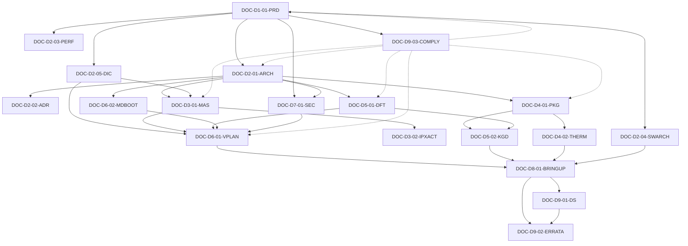

# 文档索引 (Document Index)

完整 19 类 Tier-0/1 文档清单 + 关系图。

## 1. 文档一览表

| 编号 | 标题 | Tier | 域 | Parent | Children | 关键标准 |
|---|---|---|---|---|---|---|
| DOC-D1-01-PRD | Product Requirements Document | 0 | D1 | (null) | D2-01, D2-03, D2-04, D2-05, D9-03 | ISO 26262, UCIe, JEDEC JEP30 |
| DOC-D2-01-ARCH | System Architecture Specification | 0 | D2 | D1-01 | D2-02, D3-01, D3-02, D4-01, D4-02, D7-01, D5-01, D6-02 | UCIe, Arm CSA, OCP FCSA, IEEE 1685 |
| DOC-D2-02-ADR | Architecture Decision Records | 0 | D2 | D2-01 | (referenced by many) | - |
| DOC-D2-03-PERF | Performance Modeling Spec | 1 | D2 | D1-01 | D2-01, D6-01 | - |
| DOC-D2-04-SWARCH | Software Architecture Specification | 1 | D2 | D1-01 | D2-01, D8-01 | - |
| DOC-D2-05-DIC | Die Interface Contract | 1 | D2 | D1-01, D2-01 | D3-01, D6-01 | UCIe, OCP FCSA |
| DOC-D3-01-MAS | Micro Architecture Specification (per block) | 0 | D3 | D2-01 | D3-02, D6-01 | IEEE 1685, IEEE 1800, IEEE 1801 |
| DOC-D3-02-IPXACT | IP-XACT Metadata Bundle | 0 | D3 | D2-01, D3-01 | D6-01, D5-01 | IEEE 1685 |
| DOC-D4-01-PKG | Package Design Specification | 0 | D4 | D2-01 | D4-02, D5-02, D8-01 | JEDEC JEP30, OCP CDXML |
| DOC-D4-02-THERM | Thermal Management Specification | 1 | D4 | D4-01, D2-01 | D8-01 | JEDEC JESD51 |
| DOC-D5-01-DFT | DFT Plan | 0 | D5 | D2-01, D3-01 | D5-02, D6-01, D8-01 | IEEE 1149.1, IEEE 1687, IEEE 1838 |
| DOC-D5-02-KGD | KGD Test Plan | 0 | D5 | D5-01, D4-01 | D8-01 | IEEE 1838, AEC-Q100 |
| DOC-D6-01-VPLAN | Verification Plan | 0 | D6 | D2-01, D3-01, D2-05 | D8-01 | Accellera UVM, IEEE 1800 |
| DOC-D6-02-MDBOOT | Multi-Die Boot & Reset Sequence Spec | 1 | D6 | D2-01, D2-04 | D6-01, D8-01 | - |
| DOC-D7-01-SEC | Security Architecture & Threat Model | 1 | D7 | D1-01, D2-01 | D6-01, D8-01 | ISO/SAE 21434, NIST SP 800-193 |
| DOC-D8-01-BRINGUP | Bring-up / Post-Silicon Validation Plan | 0 | D8 | D6-01, D4-01, D5-01, D2-04 | D9-01, D9-02 | - |
| DOC-D9-01-DS | Datasheet | 0 | D9 | D1-01, D2-01, D4-01, D8-01 | D9-02 | (行业惯例) |
| DOC-D9-02-ERRATA | Errata Document | 0 | D9 | D8-01, D9-01 | (null) | - |
| DOC-D9-03-COMPLY | Compliance Matrix | 0 | D9 | D1-01 | (all) | All referenced standards |

## 2. 依赖关系图（Mermaid）



## 3. 生命周期时间线

```
产品立项 ┬─► PRR ──────┬─► Arch Sign-off ──┬─► RTL Freeze ──┬─► Tape-out ──┬─► Post-Si ──┬─► 量产
         │              │                    │                 │               │             │
  PRD ──►│              │                    │                 │               │             │
         │   ADR ──────►│                    │                 │               │             │
         │   PERF ─────►│                    │                 │               │             │
         │   SWARCH ──►│                     │                 │               │             │
         │              │   ARCH ────────────►                 │               │             │
         │              │   DIC ─────────────►                 │               │             │
         │              │              SEC ─►                 │               │             │
         │              │                    │   MAS ────────►│               │             │
         │              │                    │   IPX ────────►│               │             │
         │              │                    │   PKG ────────►│               │             │
         │              │                    │   THERM ──────►│               │             │
         │              │                    │   DFT ────────►│               │             │
         │              │                    │   VPLAN ──────►│               │             │
         │              │                    │   MDBOOT ─────►│               │             │
         │              │                    │                 │   KGD ──────►│             │
         │              │                    │                 │   BRINGUP ──►│             │
         │              │                    │                 │               │   DS ──────►│
         │              │                    │                 │               │   ERRATA ──►│
         │              │                    │                 │               │             │
         └──► COMPLY (贯穿全生命周期，持续更新) ──────────────────────────────────────────────►
```

## 4. 按角色视图（谁产出/审阅哪份文档）

| 角色 | 产出 | 审阅 |
|---|---|---|
| Product Manager | D1-01 | D9-01 |
| System Architect | D2-01, D2-02, D2-03, D2-05 | D1-01, D3-01, D6-01 |
| SW Architect | D2-04 | D1-01, D8-01 |
| IP Designer | D3-01, D3-02 | D2-01, D6-01 |
| Package Engineer | D4-01 | D2-01 |
| Thermal / Reliability | D4-02 | D4-01, D8-01 |
| DFT Lead | D5-01 | D3-01, D4-01 |
| Test Engineer | D5-02, D8-01 | D5-01, D4-01 |
| Verification Lead | D6-01 | D2-01, D3-01, D2-05 |
| System Integration | D6-02 | D2-01, D2-04 |
| Security Architect | D7-01 | D1-01, D2-01 |
| Silicon Engineer | D8-01 | D6-01, D5-01 |
| Documentation / Compliance | D9-01, D9-02, D9-03 | (all) |

## 5. 文档规模参考（页数）

| 文档 | 典型页数 | 最大页数 |
|---|---|---|
| PRD | 30–60 | 100 |
| Arch Spec | 60–120 | 200 |
| ADR | 1–2 页 / ADR × N | (per entry) |
| Performance Model | 20–40 | 80 |
| Software Arch | 30–80 | 150 |
| Die Interface Contract | 15–30 | 50 |
| MAS (per block) | 20–40 | 80 |
| IP-XACT Bundle | (机器可读，非页数) | - |
| Package Design Spec | 30–60 | 120 |
| Thermal Spec | 20–40 | 60 |
| DFT Plan | 30–80 | 120 |
| KGD Test Plan | 20–40 | 60 |
| VPlan | 80–200 | 400+ |
| Multi-Die Boot | 15–30 | 50 |
| Security & Threat Model | 30–60 | 100 |
| Bring-up Plan | 40–80 | 120 |
| Datasheet | 20–60 | 120 |
| Errata | 5–20 | (持续累积) |
| Compliance Matrix | 5–15 | 30 |
