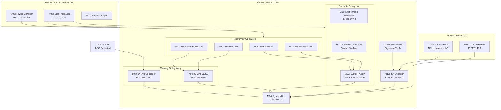

# TinyStories NPU Block Diagram

## System Overview

## Module Index

| Module ID | Name | Clock Domain | Power Domain | Function |
|-----------|------|--------------|--------------|----------|
| M00 | Systolic Array | CLK_SYS | PD_MAIN | FP8/FP16/INT8 矩阵加速，WS/OS 双模式 REQ-COMPUTE-004 |
| M01 | Dataflow Controller | CLK_SYS | PD_MAIN | Spatial Dataflow 调度，Pipeline 利用率 >= 80% REQ-COMPUTE-005 |
| M02 | SRAM Scratchpad | CLK_SYS | PD_MAIN | 512 KB，ECC SECDED 保护 REQ-MEM-004, REQ-MEM-005 |
| M03 | DRAM Controller | CLK_SYS | PD_MAIN | 3D Stacked 接口，>= 10 GB/s，ECC SECDED REQ-MEM-001, REQ-MEM-002, REQ-MEM-005 |
| M04 | System Bus | CLK_SYS | PD_MAIN | TileLink/AXI 总线互联 |
| M05 | Power Manager | CLK_AON | PD_AON | DVFS 控制，功耗模式管理 REQ-PWR-003 |
| M06 | Clock Manager | CLK_AON | PD_AON | PLL + DVFS 时钟生成 |
| M07 | Reset Manager | CLK_AON | PD_AON | 复位序列控制 |
| M08 | Multi-thread Scheduler | CLK_SYS | PD_MAIN | 多线程执行调度，线程数 >= 2 REQ-COMPUTE-006 |
| M09 | Attention Unit | CLK_SYS | PD_MAIN | Transformer Attention 算子 REQ-COMPUTE-008 |
| M10 | FFN/MatMul Unit | CLK_SYS | PD_MAIN | Feed-Forward Network, MatMul REQ-COMPUTE-008 |
| M11 | RMSNorm/RoPE Unit | CLK_SYS | PD_MAIN | 归一化 + 位置编码 REQ-COMPUTE-008 |
| M12 | SoftMax Unit | CLK_SYS | PD_MAIN | SoftMax 算子 REQ-SW-003 |
| M13 | ISA Decoder | CLK_SYS | PD_MAIN | 自定义 NPU 指令解码 REQ-SW-001 |
| M14 | Secure Boot | CLK_SYS | PD_MAIN | 签名固件验证 REQ-SEC-001 |
| M15 | JTAG Interface | CLK_IO | PD_IO | IEEE 1149.1 调试接口 REQ-IO-001 |
| M16 | ISA Interface | CLK_IO | PD_IO | NPU 指令集 I/O 接口 REQ-IO-002 |

## Systolic Array Detail

| Mode | Description | Use Case |
|------|-------------|----------|
| Weight Stationary (WS) | 权重固定，数据流动 | 大批量矩阵乘法 |
| Output Stationary (OS) | 输出固定，权重/数据流动 | 小批量推理，减少 SRAM 访问 |

## Precision Support

| Precision | TOPS | Use Case |
|-----------|------|----------|
| FP8 (E4M3/E5M2) | >= 2 | 低精度推理，KV cache REQ-COMPUTE-001 |
| FP16 | >= 1 | 标准推理 REQ-COMPUTE-002 |
| INT8 | >= 2 | 量化推理 REQ-COMPUTE-003 |
| FP32 | 0.5 (参考) | Baseline 比较 REQ-COMPUTE-007 |

## Clock Domain Summary

| Domain | Frequency Range | Modules | DVFS |
|--------|-----------------|---------|------|
| CLK_SYS | 250-500 MHz | M00-M04, M08-M14 | Yes (REQ-PWR-003) |
| CLK_AON | 1 MHz | M05-M07 | No |
| CLK_IO | 50 MHz | M15-M16 | No |
