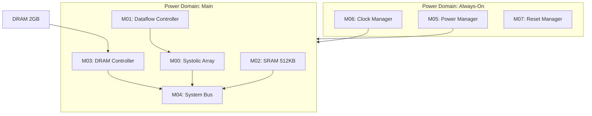

# TinyStories NPU Block Diagram

## System Overview

## Module Index

| Module ID | Name | Clock Domain | Power Domain |
|-----------|------|--------------|--------------|
| M00 | Systolic Array | CLK_SYS | PD_MAIN |
| M01 | Dataflow Controller | CLK_SYS | PD_MAIN |
| M02 | SRAM Scratchpad | CLK_SYS | PD_MAIN |
| M03 | DRAM Controller | CLK_SYS | PD_MAIN |
| M04 | System Bus | CLK_SYS | PD_MAIN |
| M05 | Power Manager | CLK_AON | PD_AON |
| M06 | Clock Manager | CLK_AON | PD_AON |
| M07 | Reset Manager | CLK_AON | PD_AON |
