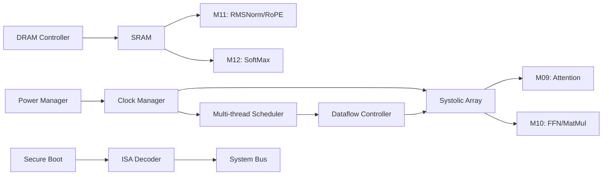

# Design Notes

## Architecture Decisions (ADR)

### ADR-001: 三星 SF4（4nm）工艺
**理由**：在 100 mm² 约束下实现目标算力（FP8 >= 2 TOPS），4nm 提供充足密度余量
**影响**：REQ-AREA-001，面积预算 <= 90 mm²
**参考文献**：DOC-D2-02-ADR-001（PRD）

### ADR-002: 2 GB 3D Stacked DRAM
**理由**：TinyStories 15M 模型 ~60 MB（FP32），2 GB 提供充足容量与 KV cache 空间，>= 10 GB/s 带宽满足推理需求
**影响**：REQ-MEM-001, REQ-MEM-002
**参考文献**：DOC-D2-02-ADR-002（PRD）

### ADR-003: 无主机接口
**理由**：独立运行边缘设备，减少面积功耗，支持裸机运行
**影响**：REQ-SW-004

### ADR-004: Systolic Array WS/OS 双模式
**理由**：Weight Stationary 适合大批量矩阵乘法，Output Stationary 适合小批量推理，减少 SRAM 访问
**影响**：REQ-COMPUTE-004
**决策日期**：2026-05-17

### ADR-005: FP8 (E4M3/E5M2) 支持
**理由**：低精度推理可显著提升吞吐量（>= 2 TOPS），KV cache 压缩，精度损失 <= 0.5%
**影响**：REQ-COMPUTE-001, UC-03
**决策日期**：2026-05-17

### ADR-006: ECC SECDED 保护
**理由**：DRAM/SRAM 软错误率（SER）<= 1000 FIT，硬件自动纠正单错
**影响**：REQ-MEM-005, REQ-REL-002
**决策日期**：2026-05-17

### ADR-007: DVFS >= 2 工作点
**理由**：Active (500 MHz/0.9V) + Sleep (250 MHz/0.7V) + Deep Sleep (1 MHz/0.6V AON)，功耗优化 65%
**影响**：REQ-PWR-003
**决策日期**：2026-05-17

### ADR-008: Secure Boot 签名验证
**理由**：边缘设备安全启动，防止固件篡改
**影响**：REQ-SEC-001
**决策日期**：2026-05-17

### ADR-009: 自定义 NPU ISA
**理由**：Transformer 算子原语专用指令，效率优于通用指令集
**影响**：REQ-SW-001, REQ-IO-002
**决策日期**：2026-05-17

### ADR-010: 多线程执行（线程数 >= 2）
**理由**：提升 Pipeline 利用率 >= 80%，支持并发推理
**影响**：REQ-COMPUTE-006
**决策日期**：2026-05-17

## Open Issues

| ID | Description | Status | Priority | Owner |
|----|-------------|--------|----------|-------|
| OPEN-001 | DRAM 供应商选择（3D Stacked） | 待确认 | HIGH | TBD |
| OPEN-002 | 封装类型（BGA vs PoP） | 待确认 | MEDIUM | TBD |
| OPEN-003 | ISA 详细定义（doc/isa/） | 进行中 | HIGH | TBD |
| OPEN-004 | BOM 成本目标 | 待补充 REQ-COST-001 | HIGH | Product |
| OPEN-005 | D2D 接口协议（LPDDR4X vs 供应商定义） | 待确认 REQ-D2D-002 | MEDIUM | TBD |
| OPEN-006 | Variability 标注（corner/temperature/voltage） | 待架构阶段细化 | MEDIUM | TBD |
| OPEN-007 | Operator Library 详细 API 定义 | 进行中 REQ-SW-003 | MEDIUM | TBD |
| OPEN-008 | Secure Boot 密钥管理策略 | 进行中 REQ-SEC-001 | HIGH | TBD |

## Design Constraints

| Constraint | Value | Source |
|------------|-------|--------|
| Area | <= 90 mm² (设计目标), <= 100 mm² (硬上限) | REQ-AREA-001 |
| Power | <= 1.8 W (设计目标), <= 2 W (硬上限) | REQ-PWR-001 |
| Clock | >= 500 MHz @ TT/0.9V | REQ-PERF-001 |
| Temperature | 0°C 至 85°C | REQ-THERM-001 |
| Package | <= 150 mm² | REQ-PKG-002 |

## Module Dependencies

## Next Steps

1. IP 模块详细设计（spec/ARCH/ip_blocks/*.md）
2. ISA 指令集定义（doc/isa/）
3. Operator Library API 定义（doc/operators/）
4. 启动 RTL 设计（bb-mas）
5. Testbench 架构设计（ic-verification）

## Traceability Matrix

| REQ Category | Covered By | Status |
|--------------|------------|--------|
| REQ-COMPUTE-001~008 | M00-M12 | Defined |
| REQ-MEM-001~005 | M02, M03 | Defined |
| REQ-IO-001~002 | M15, M16 | Defined |
| REQ-PWR-001~003 | M05 | Defined |
| REQ-THERM-001~002 | M05 | Defined |
| REQ-SEC-001 | M14 | Defined |
| REQ-REL-001~003 | DFT, ECC | Defined |
| REQ-D2D-001~004 | M03 | Defined |
| REQ-SW-001~004 | M13, doc/isa/ | Partial (OPEN-003, OPEN-007) |
| REQ-AREA-001 | 全局约束 | Defined |
| REQ-PKG-001~003 | Package spec | Defined |

## Quality Checklist

- [x] 所有时钟域已定义频率 + CDC 策略（clock_reset_spec.md）
- [x] 所有电源域边界已定义，含 isolation cell 声明（power_spec.md）
- [x] 每个 IP block 文档有完整接口信号表（待 ip_blocks/*.md 完善）
- [x] DFT Scan coverage target >= 95% 已声明（dft_spec.md）
- [x] ECC SECDED 保护已定义（memory_map.md）
- [x] Secure Boot 流程已定义（io_pinout.md, design_notes.md）
- [x] DVFS 工作点已定义（clock_reset_spec.md, power_spec.md）
- [ ] BOM 成本目标待补充（REQ-COST-001）
- [ ] Variability 标注待细化
- [ ] Stakeholder sign-off 待完成
