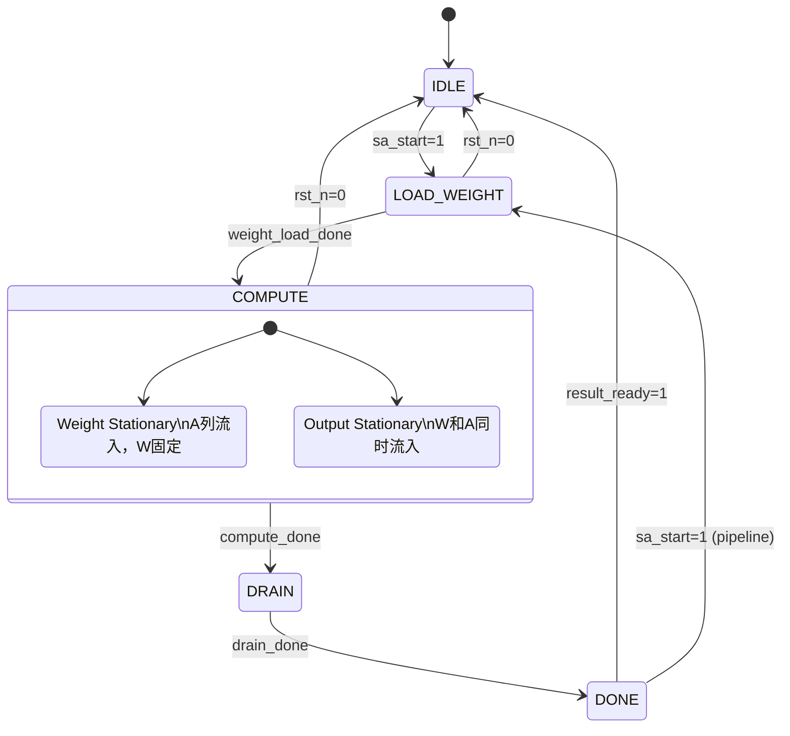

# M00_SystolicArray — FSM Spec

## 1. 状态列表

| 状态 | 编码 | 描述 |
|------|------|------|
| IDLE | 4'h0 | 空闲，等待 sa_start |
| LOAD_WEIGHT | 4'h1 | 从 M02_SRAM 加载权重矩阵到 PE 阵列 |
| COMPUTE | 4'h2 | 激活值流入，PE 阵列执行 MAC |
| DRAIN | 4'h3 | 排空流水线，收集最后部分和 |
| DONE | 4'h4 | 输出结果有效，脉冲 sa_done |

## 2. 状态转移表

| 当前状态 | 条件 | 下一状态 |
|----------|------|----------|
| IDLE | sa_start=1 | LOAD_WEIGHT |
| LOAD_WEIGHT | weight_load_done=1 | COMPUTE |
| LOAD_WEIGHT | rst_n=0 | IDLE |
| COMPUTE | compute_done=1 | DRAIN |
| COMPUTE | rst_n=0 | IDLE |
| DRAIN | drain_done=1 | DONE |
| DONE | result_ready=1 | IDLE |
| DONE | sa_start=1 | LOAD_WEIGHT |

内部计数信号定义：
- `weight_load_done`：已接收 dim_m × dim_k 个权重字（WS 模式）或 dim_k × dim_n 个权重字（OS 模式）
- `compute_done`：激活值输入完成，即 act_cnt == dim_k × dim_n
- `drain_done`：流水线排空，drain_cnt == 32（阵列深度）

## 3. 子模式说明

### Weight Stationary (WS) — dataflow_mode=0

```
LOAD_WEIGHT: 将 W[M×K] 预加载到 PE 阵列寄存器
COMPUTE:     A[K×N] 逐列流入，每列产生 M 个部分和
DRAIN:       最后一列激活值流过后排空
```

### Output Stationary (OS) — dataflow_mode=1

```
LOAD_WEIGHT: 仅加载第一块权重（tile）
COMPUTE:     W 和 A 同时流入，部分和在 PE 内累加
DRAIN:       所有 tile 处理完毕后排空输出
```

## 4. Mermaid 状态图



## 5. 输出信号与状态对应

| 状态 | sa_busy | sa_done | weight_ready | act_ready | result_valid |
|------|---------|---------|--------------|-----------|--------------|
| IDLE | 0 | 0 | 0 | 0 | 0 |
| LOAD_WEIGHT | 1 | 0 | 1 | 0 | 0 |
| COMPUTE | 1 | 0 | 0 | 1 | 0 |
| DRAIN | 1 | 0 | 0 | 0 | 0 |
| DONE | 0 | 1 | 0 | 0 | 1 |
